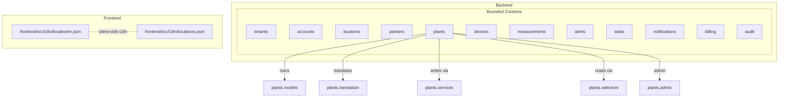
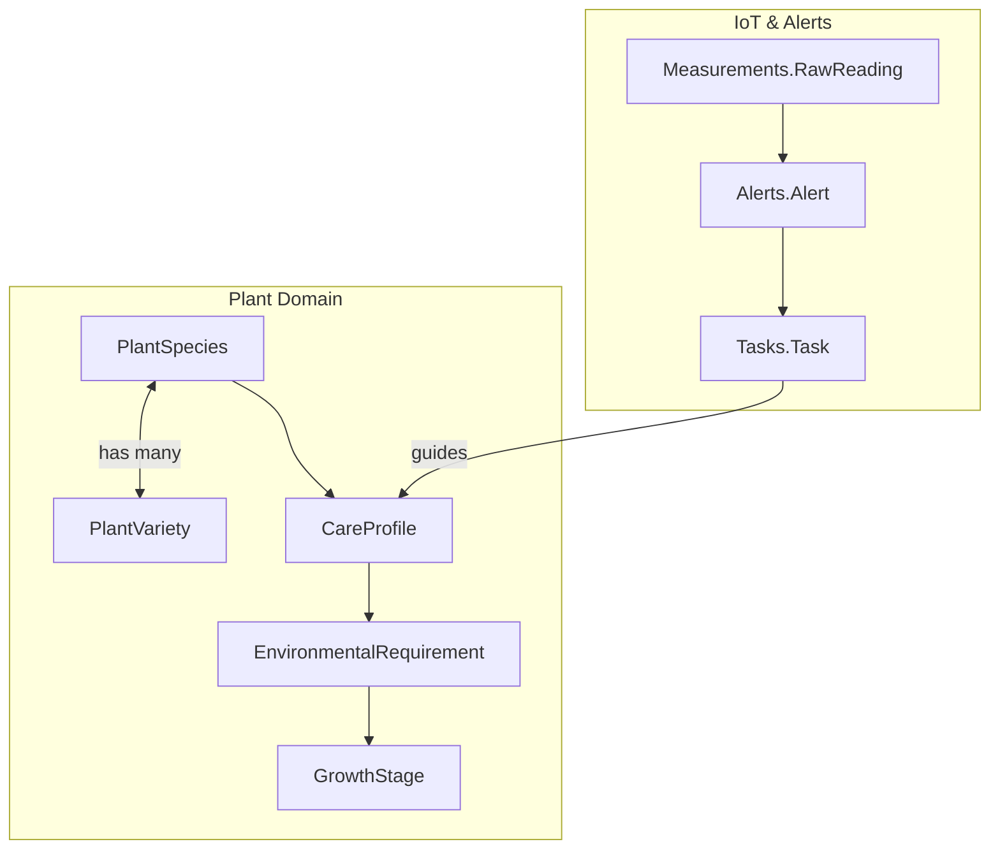
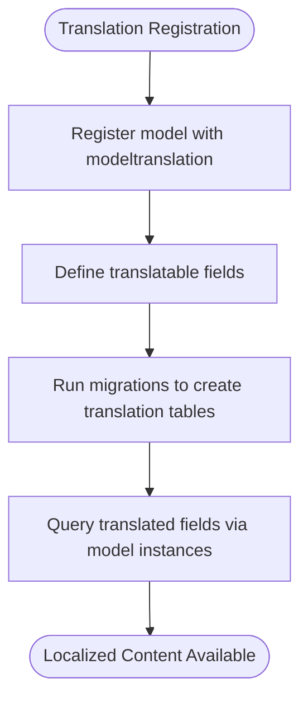
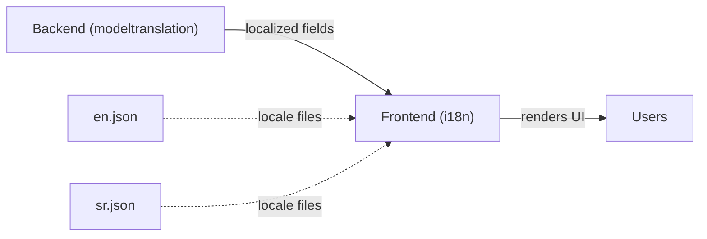
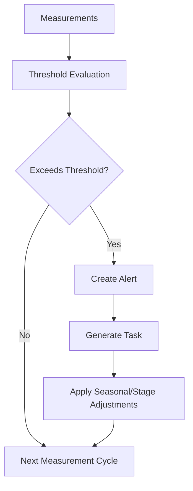
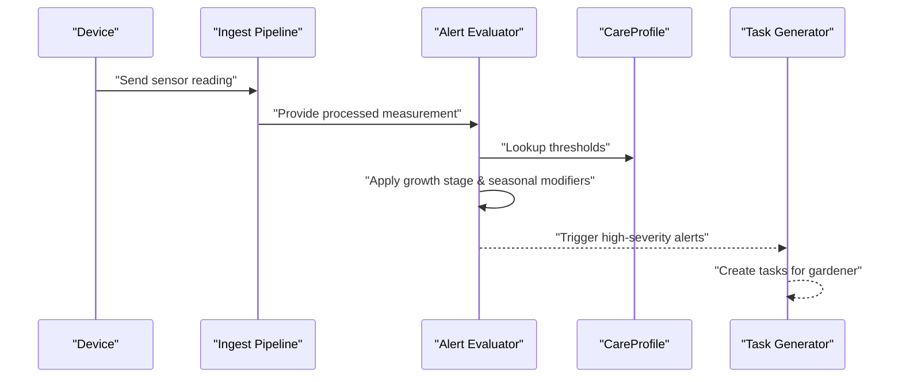
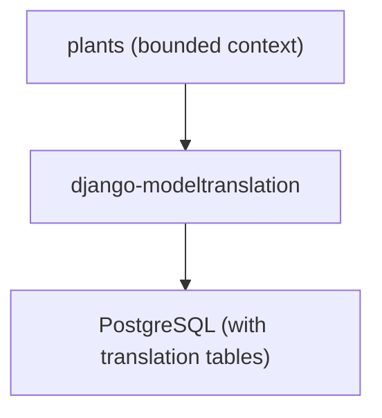

# Plant Species Models

<cite>
**Referenced Files in This Document**
- [README.md](file://README.md)
- [DDD_OVERVIEW.md](file://backend/docs/architecture/DDD_OVERVIEW.md)
- [IOT_INGEST.md](file://backend/docs/architecture/IOT_INGEST.md)
- [models.py](file://backend/apps/plants/models.py)
- [translation.py](file://backend/apps/plants/translation.py)
- [apps.py](file://backend/apps/plants/apps.py)
- [services.py](file://backend/apps/plants/services.py)
- [selectors.py](file://backend/apps/plants/selectors.py)
- [admin.py](file://backend/apps/plants/admin.py)
- [en.json](file://frontend/src/i18n/locales/en.json)
- [sr.json](file://frontend/src/i18n/locales/sr.json)
</cite>

## Table of Contents
1. [Introduction](#introduction)
2. [Project Structure](#project-structure)
3. [Core Components](#core-components)
4. [Architecture Overview](#architecture-overview)
5. [Detailed Component Analysis](#detailed-component-analysis)
6. [Dependency Analysis](#dependency-analysis)
7. [Performance Considerations](#performance-considerations)
8. [Troubleshooting Guide](#troubleshooting-guide)
9. [Conclusion](#conclusion)

## Introduction
This document provides entity relationship documentation for plant species and care management models within the PlantOps platform. It focuses on the conceptual design of PlantSpecies and PlantVariety, their relationships to growth stages and environmental requirements, and the translation models supporting multi-language plant information. It also explains how care profiles connect to environmental thresholds, how growth tracking and seasonal care requirements can be modeled, and how multilingual content is managed across the system.

The current codebase defines a placeholder PlantSpecies model and a translation configuration module. This document synthesizes the intended domain model based on the existing documentation and project structure, and outlines how PlantVariety and care-related entities would fit into the system.

## Project Structure
The PlantOps platform is organized into bounded contexts (Django apps), each owning its data and rules. The plants bounded context is responsible for plant species, varieties, and care profiles. The DDD structure separates concerns into models, services (write operations), selectors (read operations), events, admin configuration, and tests.



**Diagram sources**
- [README.md:131-168](file://README.md#L131-L168)
- [DDD_OVERVIEW.md:27-30](file://backend/docs/architecture/DDD_OVERVIEW.md#L27-L30)
- [models.py:12-25](file://backend/apps/plants/models.py#L12-L25)
- [translation.py:1-14](file://backend/apps/plants/translation.py#L1-L14)
- [services.py:1-7](file://backend/apps/plants/services.py#L1-L7)
- [selectors.py:1-7](file://backend/apps/plants/selectors.py#L1-L7)
- [admin.py:1-3](file://backend/apps/plants/admin.py#L1-L3)
- [en.json:1-6](file://frontend/src/i18n/locales/en.json#L1-L6)
- [sr.json:1-6](file://frontend/src/i18n/locales/sr.json#L1-L6)

**Section sources**
- [README.md:131-168](file://README.md#L131-L168)
- [DDD_OVERVIEW.md:27-30](file://backend/docs/architecture/DDD_OVERVIEW.md#L27-L30)

## Core Components
- PlantSpecies: Placeholder entity representing a plant species. The model indicates future fields for name (translatable), scientific_name, care_profile (watering, light, temperature ranges), and photos. See [models.py:12-25](file://backend/apps/plants/models.py#L12-L25).
- Translation configuration: The translation module registers translatable fields with django-modeltranslation for the plants context. See [translation.py:1-14](file://backend/apps/plants/translation.py#L1-L14).
- DDD boundaries: The plants context follows DDD with services (write), selectors (read), events, admin, and tests. See [DDD_OVERVIEW.md:67-78](file://backend/docs/architecture/DDD_OVERVIEW.md#L67-L78).

**Section sources**
- [models.py:12-25](file://backend/apps/plants/models.py#L12-L25)
- [translation.py:1-14](file://backend/apps/plants/translation.py#L1-L14)
- [DDD_OVERVIEW.md:67-78](file://backend/docs/architecture/DDD_OVERVIEW.md#L67-L78)

## Architecture Overview
The plant care domain integrates with IoT measurements and alerting to drive care recommendations. The pipeline ingests sensor data, evaluates thresholds defined in care profiles, and generates alerts and tasks. This section maps the conceptual relationships among PlantSpecies, PlantVariety, care profiles, growth stages, and environmental requirements.



**Diagram sources**
- [IOT_INGEST.md:32-70](file://backend/docs/architecture/IOT_INGEST.md#L32-L70)
- [DDD_OVERVIEW.md:27-30](file://backend/docs/architecture/DDD_OVERVIEW.md#L27-L30)

## Detailed Component Analysis

### PlantSpecies Entity
- Purpose: Represents a plant species within the care domain.
- Intended attributes (future): name (translatable), scientific_name, care_profile (watering, light, temperature ranges), photos.
- Relationship: PlantSpecies is the parent entity for PlantVariety and is associated with a CareProfile that defines environmental thresholds.

```mermaid
classDiagram
class PlantSpecies {
"+name (translatable)"
"+scientific_name"
"+care_profile"
"+photos"
}
```

**Diagram sources**
- [models.py:12-25](file://backend/apps/plants/models.py#L12-L25)

**Section sources**
- [models.py:12-25](file://backend/apps/plants/models.py#L12-L25)

### PlantVariety Entity
- Purpose: Represents cultivars or varieties of a given PlantSpecies.
- Relationship: PlantVariety belongs to a PlantSpecies; it may refine care recommendations or growth-stage specifics.
- Modeling note: While not present in the current codebase, PlantVariety is central to the taxonomy relationship described below.

```mermaid
classDiagram
class PlantVariety {
"+name (translatable)"
"+description"
"+plant_species"
}
PlantSpecies "1" --> "many" PlantVariety : "has"
```

**Diagram sources**
- [models.py:12-25](file://backend/apps/plants/models.py#L12-L25)

**Section sources**
- [models.py:12-25](file://backend/apps/plants/models.py#L12-L25)

### Care Profile and Environmental Requirements
- Purpose: Encapsulates care recommendations and environmental thresholds for a species or variety.
- Components:
  - Watering schedule/ranges
  - Light requirements (lux thresholds)
  - Temperature ranges (min/max)
  - Growth-stage-specific adjustments
- Integration: CareProfile thresholds feed the alert evaluation pipeline, which compares against measurements to trigger alerts and tasks.

```mermaid
classDiagram
class CareProfile {
"+watering_schedule"
"+light_min"
"+light_max"
"+temp_min"
"+temp_max"
"+seasonal_adjustments"
}
class EnvironmentalRequirement {
"+parameter"
"+min_value"
"+max_value"
"+unit"
}
class GrowthStage {
"+stage_name"
"+description"
"+timing"
}
PlantSpecies --> CareProfile : "defines"
CareProfile --> EnvironmentalRequirement : "contains"
EnvironmentalRequirement --> GrowthStage : "applies to"
```

**Diagram sources**
- [IOT_INGEST.md:59-66](file://backend/docs/architecture/IOT_INGEST.md#L59-L66)

**Section sources**
- [IOT_INGEST.md:59-66](file://backend/docs/architecture/IOT_INGEST.md#L59-L66)

### Translation Model for Multi-Language Support
- Purpose: Enable translatable fields for user-facing text in the plants context.
- Mechanism: django-modeltranslation registration in the translation module.
- Scope: Fields such as name and description are registered for translation.



**Diagram sources**
- [translation.py:1-14](file://backend/apps/plants/translation.py#L1-L14)

**Section sources**
- [translation.py:1-14](file://backend/apps/plants/translation.py#L1-L14)

### Multilingual Content Management
- Backend: django-modeltranslation manages translation tables for registered fields.
- Frontend: i18n resources for client-side rendering and localization.
- Integration: Backend translations serve localized strings consumed by the frontend.



**Diagram sources**
- [en.json:1-6](file://frontend/src/i18n/locales/en.json#L1-L6)
- [sr.json:1-6](file://frontend/src/i18n/locales/sr.json#L1-L6)
- [translation.py:1-14](file://backend/apps/plants/translation.py#L1-L14)

**Section sources**
- [en.json:1-6](file://frontend/src/i18n/locales/en.json#L1-L6)
- [sr.json:1-6](file://frontend/src/i18n/locales/sr.json#L1-L6)
- [translation.py:1-14](file://backend/apps/plants/translation.py#L1-L14)

### Plant Growth Tracking and Seasonal Care
- Growth tracking: Link growth stages to care profiles and adjust thresholds seasonally.
- Seasonal care: Use seasonal_adjustments in CareProfile to modify watering, light, and temperature targets based on time of year.
- Data flow: Measurements inform growth stage transitions and care adjustments.



**Diagram sources**
- [IOT_INGEST.md:59-66](file://backend/docs/architecture/IOT_INGEST.md#L59-L66)

**Section sources**
- [IOT_INGEST.md:59-66](file://backend/docs/architecture/IOT_INGEST.md#L59-L66)

### Care Recommendation Algorithms
- Input: Current measurements, growth stage, season.
- Process: Compare measurements against CareProfile thresholds; apply stage-specific and seasonal modifiers.
- Output: Alerts, tasks, and recommendations for care actions.



**Diagram sources**
- [IOT_INGEST.md:32-70](file://backend/docs/architecture/IOT_INGEST.md#L32-L70)

**Section sources**
- [IOT_INGEST.md:32-70](file://backend/docs/architecture/IOT_INGEST.md#L32-L70)

## Dependency Analysis
- Bounded context ownership: The plants context encapsulates PlantSpecies and related care logic.
- Cross-context boundaries: No direct foreign keys across contexts; communication occurs via domain events or explicit service calls.
- Translation dependency: The translation module depends on django-modeltranslation; migrations create translation tables for registered fields.



**Diagram sources**
- [translation.py:1-14](file://backend/apps/plants/translation.py#L1-L14)

**Section sources**
- [DDD_OVERVIEW.md:80-85](file://backend/docs/architecture/DDD_OVERVIEW.md#L80-L85)
- [translation.py:1-14](file://backend/apps/plants/translation.py#L1-L14)

## Performance Considerations
- Keep care profile lookups efficient with indexed thresholds and minimal joins.
- Use batch processing for measurement evaluation to reduce alert churn.
- Cache frequently accessed care recommendations for high-traffic scenarios.
- Ensure translation queries leverage database-backed translations without excessive overhead.

## Troubleshooting Guide
- Translation fields not appearing: Verify the translation module registers the correct fields and migrations are applied.
- DDD boundary violations: Confirm all writes use services and reads use selectors; avoid direct model writes outside services.
- Cross-context foreign keys: Do not introduce direct foreign keys across contexts; use IDs and domain events instead.

**Section sources**
- [translation.py:1-14](file://backend/apps/plants/translation.py#L1-L14)
- [services.py:1-7](file://backend/apps/plants/services.py#L1-L7)
- [selectors.py:1-7](file://backend/apps/plants/selectors.py#L1-L7)
- [DDD_OVERVIEW.md:80-85](file://backend/docs/architecture/DDD_OVERVIEW.md#L80-L85)

## Conclusion
The PlantOps platform’s plants bounded context establishes the foundation for plant species and care management. The current PlantSpecies placeholder and translation configuration set the stage for richer domain modeling, including PlantVariety, care profiles, growth stages, and environmental requirements. By integrating with the IoT ingest pipeline and alerting system, the platform can evaluate real-time measurements against care thresholds to generate actionable tasks and recommendations. The DDD structure and translation framework support scalable, maintainable, and multilingual plant care operations.