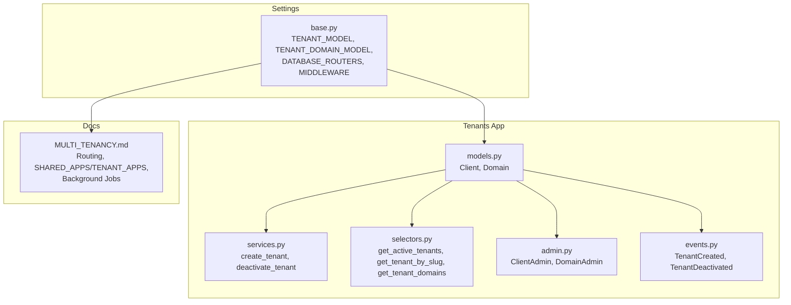
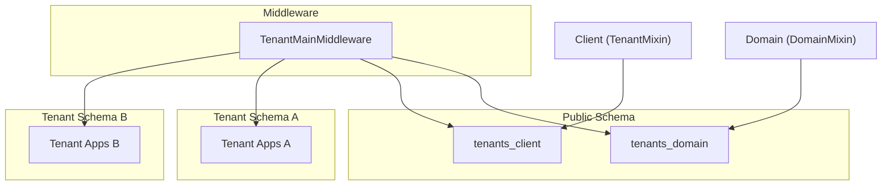
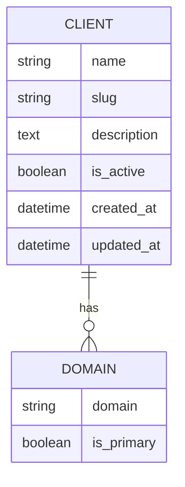
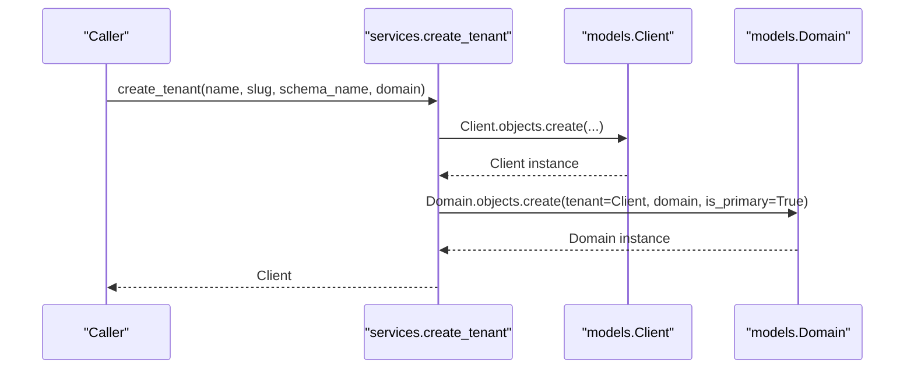
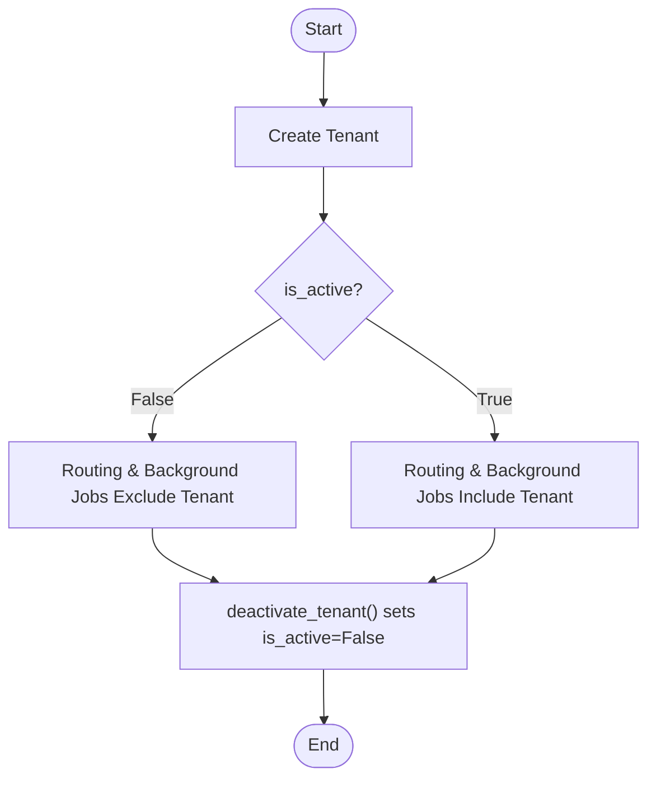
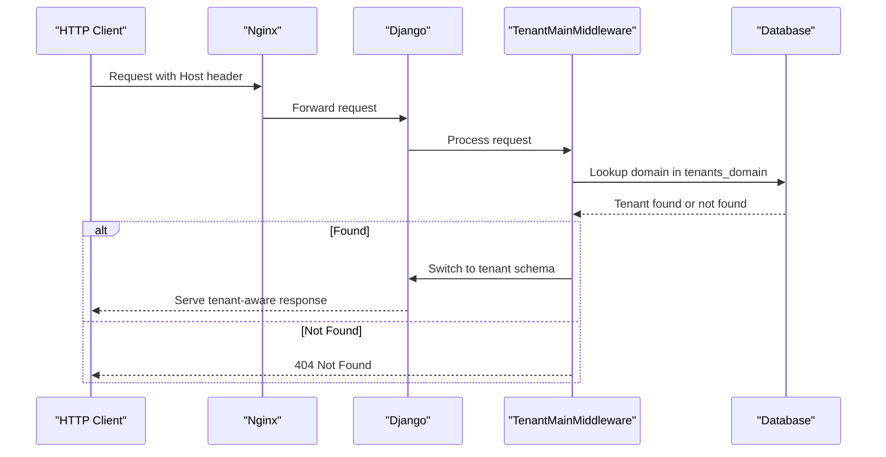
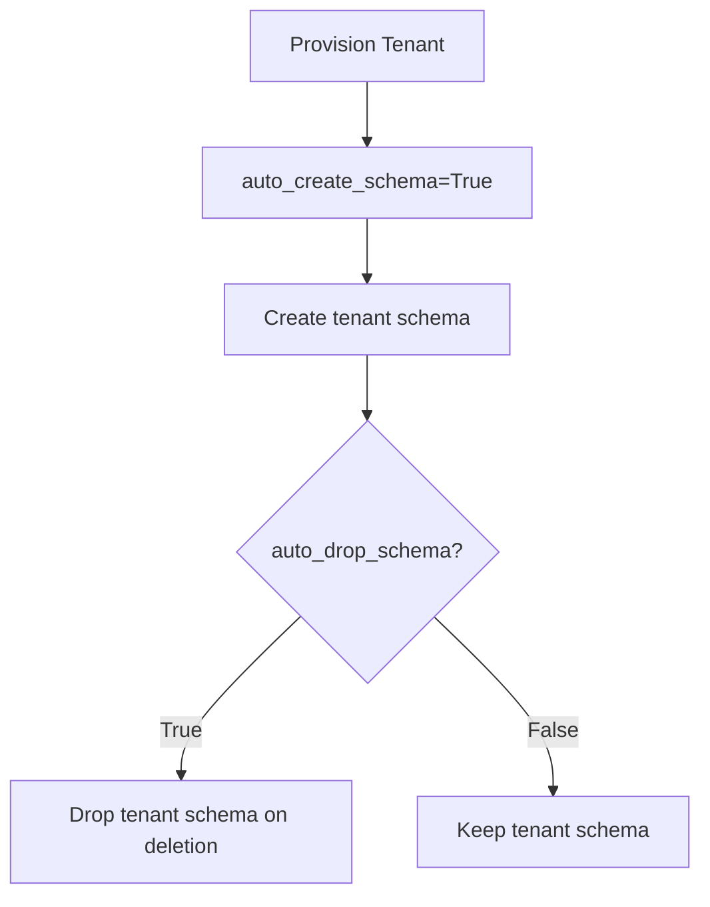
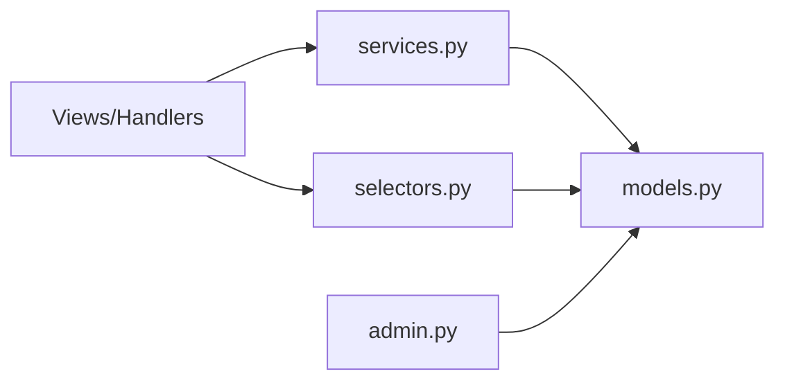
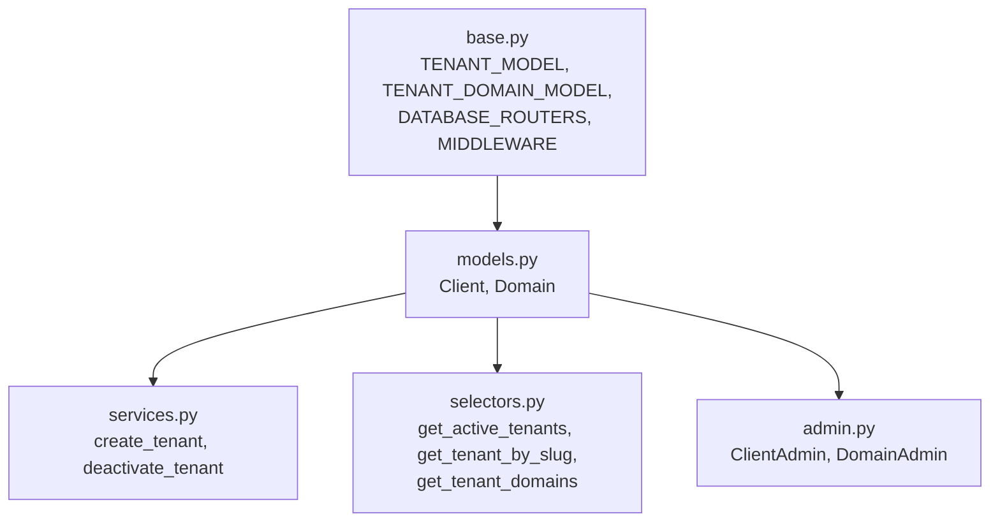

# Tenant Management Models

<cite>
**Referenced Files in This Document**
- [models.py](file://backend/apps/tenants/models.py)
- [services.py](file://backend/apps/tenants/services.py)
- [selectors.py](file://backend/apps/tenants/selectors.py)
- [admin.py](file://backend/apps/tenants/admin.py)
- [events.py](file://backend/apps/tenants/events.py)
- [base.py](file://backend/config/settings/base.py)
- [MULTI_TENANCY.md](file://backend/docs/architecture/MULTI_TENANCY.md)
- [test_tenants.py](file://backend/tests/test_tenants.py)
</cite>

## Table of Contents
1. [Introduction](#introduction)
2. [Project Structure](#project-structure)
3. [Core Components](#core-components)
4. [Architecture Overview](#architecture-overview)
5. [Detailed Component Analysis](#detailed-component-analysis)
6. [Dependency Analysis](#dependency-analysis)
7. [Performance Considerations](#performance-considerations)
8. [Troubleshooting Guide](#troubleshooting-guide)
9. [Conclusion](#conclusion)

## Introduction
This document provides comprehensive entity relationship documentation for the tenant management models in the PlantOps multi-tenant SaaS platform. It focuses on the Client and Domain entities, explaining how django-tenants enables schema-based isolation, how tenant provisioning works, and how routing and lifecycle management are implemented. It also documents the Client and Domain model fields, their business significance, and the relationship between them, including the is_primary flag’s role in hostname-to-tenant mapping.

## Project Structure
The tenant management functionality is encapsulated within the tenants bounded context. The key components are:
- Models: define the Client and Domain entities and their relationships
- Services: enforce tenant provisioning and lifecycle changes
- Selectors: centralize tenant-related read operations
- Admin: present models in Django Admin with filters and search
- Events: define domain events for outbox/event bus integration
- Settings: configure django-tenants, middleware, and database routing
- Architecture docs: explain schema layout, routing, and fail-closed isolation
- Tests: validate tenant creation and deactivation behavior

**Diagram sources**
- [models.py:1-77](file://backend/apps/tenants/models.py#L1-L77)
- [services.py:1-42](file://backend/apps/tenants/services.py#L1-L42)
- [selectors.py:1-26](file://backend/apps/tenants/selectors.py#L1-L26)
- [admin.py:1-25](file://backend/apps/tenants/admin.py#L1-L25)
- [events.py:1-36](file://backend/apps/tenants/events.py#L1-L36)
- [base.py:99-119](file://backend/config/settings/base.py#L99-L119)
- [MULTI_TENANCY.md:1-76](file://backend/docs/architecture/MULTI_TENANCY.md#L1-L76)

**Section sources**
- [models.py:1-77](file://backend/apps/tenants/models.py#L1-L77)
- [services.py:1-42](file://backend/apps/tenants/services.py#L1-L42)
- [selectors.py:1-26](file://backend/apps/tenants/selectors.py#L1-L26)
- [admin.py:1-25](file://backend/apps/tenants/admin.py#L1-L25)
- [events.py:1-36](file://backend/apps/tenants/events.py#L1-L36)
- [base.py:99-119](file://backend/config/settings/base.py#L99-L119)
- [MULTI_TENANCY.md:1-76](file://backend/docs/architecture/MULTI_TENANCY.md#L1-L76)

## Core Components
- Client (TenantMixin): Represents a tenant organization with schema isolation. Fields include name, slug, description, is_active, created_at, updated_at. Schema creation and drop policies are enabled via auto_create_schema and auto_drop_schema.
- Domain (DomainMixin): Maps hostnames to tenants. Includes is_primary flag to designate the primary domain for URL generation and routing.

Business significance:
- name: Human-readable tenant identity
- slug: URL-friendly identifier used for routing and lookup
- description: Optional descriptive information
- is_active: Controls inclusion in routing and background job processing; inactive tenants are excluded
- is_primary: Indicates the primary hostname used for absolute URL generation and tenant resolution

**Section sources**
- [models.py:14-41](file://backend/apps/tenants/models.py#L14-L41)
- [models.py:64-68](file://backend/apps/tenants/models.py#L64-L68)

## Architecture Overview
The system uses django-tenants with PostgreSQL schemas for physical tenant isolation. The public schema hosts shared tables (including tenants_client and tenants_domain), while each tenant has its own isolated schema containing replicated tenant applications. Requests are routed based on the Host header to the appropriate tenant schema via middleware.

**Diagram sources**
- [MULTI_TENANCY.md:7-10](file://backend/docs/architecture/MULTI_TENANCY.md#L7-L10)
- [base.py:99-102](file://backend/config/settings/base.py#L99-L102)
- [models.py:6-45](file://backend/apps/tenants/models.py#L6-L45)

**Section sources**
- [MULTI_TENANCY.md:12-26](file://backend/docs/architecture/MULTI_TENANCY.md#L12-L26)
- [base.py:99-102](file://backend/config/settings/base.py#L99-L102)

## Detailed Component Analysis

### Entity Relationship Model
The Client and Domain entities form a one-to-many relationship: one Client can have multiple Domains, with exactly one primary Domain indicated by is_primary.

**Diagram sources**
- [models.py:6-41](file://backend/apps/tenants/models.py#L6-L41)
- [models.py:56-76](file://backend/apps/tenants/models.py#L56-L76)

**Section sources**
- [models.py:6-41](file://backend/apps/tenants/models.py#L6-L41)
- [models.py:56-76](file://backend/apps/tenants/models.py#L56-L76)

### Tenant Provisioning Workflow
The create_tenant service is the single authorized pathway to provision a new tenant. It creates a Client record and a primary Domain record linked to that Client.

**Diagram sources**
- [services.py:11-35](file://backend/apps/tenants/services.py#L11-L35)
- [models.py:6-41](file://backend/apps/tenants/models.py#L6-L41)
- [models.py:56-76](file://backend/apps/tenants/models.py#L56-L76)

**Section sources**
- [services.py:11-35](file://backend/apps/tenants/services.py#L11-L35)
- [test_tenants.py:19-36](file://backend/tests/test_tenants.py#L19-L36)

### Tenant Activation/Deactivation Lifecycle
Tenant activation is controlled by the is_active flag. Deactivation is performed via the deactivate_tenant service, which sets is_active to False and updates timestamps.

**Diagram sources**
- [services.py:38-41](file://backend/apps/tenants/services.py#L38-L41)
- [selectors.py:13-20](file://backend/apps/tenants/selectors.py#L13-L20)
- [models.py:29-33](file://backend/apps/tenants/models.py#L29-L33)

**Section sources**
- [services.py:38-41](file://backend/apps/tenants/services.py#L38-L41)
- [selectors.py:13-20](file://backend/apps/tenants/selectors.py#L13-L20)
- [test_tenants.py:39-50](file://backend/tests/test_tenants.py#L39-L50)

### Routing Mechanism
Tenant resolution is handled by middleware that inspects the Host header and maps it to a tenant via the Domain model. If no match is found, the request is rejected (fail-closed).

**Diagram sources**
- [MULTI_TENANCY.md:12-19](file://backend/docs/architecture/MULTI_TENANCY.md#L12-L19)
- [base.py:107-119](file://backend/config/settings/base.py#L107-L119)
- [models.py:56-76](file://backend/apps/tenants/models.py#L56-L76)

**Section sources**
- [MULTI_TENANCY.md:12-19](file://backend/docs/architecture/MULTI_TENANCY.md#L12-L19)
- [base.py:99-102](file://backend/config/settings/base.py#L99-L102)

### Schema Creation/Drop Policies
The Client model enables automatic schema creation and drop behavior via django-tenants flags. This ensures that tenant schemas are provisioned and cleaned up according to configuration.

**Diagram sources**
- [models.py:43-45](file://backend/apps/tenants/models.py#L43-L45)

**Section sources**
- [models.py:43-45](file://backend/apps/tenants/models.py#L43-L45)

### Data Access Patterns
Read and write operations are centralized:
- Write operations: services.py
- Read operations: selectors.py
- Admin interface: admin.py

**Diagram sources**
- [selectors.py:13-25](file://backend/apps/tenants/selectors.py#L13-L25)
- [services.py:11-41](file://backend/apps/tenants/services.py#L11-L41)
- [admin.py:7-24](file://backend/apps/tenants/admin.py#L7-L24)
- [models.py:6-76](file://backend/apps/tenants/models.py#L6-L76)

**Section sources**
- [selectors.py:13-25](file://backend/apps/tenants/selectors.py#L13-L25)
- [services.py:11-41](file://backend/apps/tenants/services.py#L11-L41)
- [admin.py:7-24](file://backend/apps/tenants/admin.py#L7-L24)

## Dependency Analysis
The tenant models depend on django-tenants mixins and are configured in settings. The middleware and routers ensure tenant-aware routing and schema switching.

**Diagram sources**
- [base.py:99-119](file://backend/config/settings/base.py#L99-L119)
- [models.py:6-76](file://backend/apps/tenants/models.py#L6-L76)
- [services.py:8-41](file://backend/apps/tenants/services.py#L8-L41)
- [selectors.py:8-25](file://backend/apps/tenants/selectors.py#L8-L25)
- [admin.py:4-24](file://backend/apps/tenants/admin.py#L4-L24)

**Section sources**
- [base.py:99-119](file://backend/config/settings/base.py#L99-L119)
- [models.py:6-76](file://backend/apps/tenants/models.py#L6-L76)

## Performance Considerations
- Use selectors for centralized, testable reads to avoid ad-hoc queries
- Prefer filtering by is_active to exclude inactive tenants from routing and background jobs
- Keep domain lookups efficient by indexing the domain field in the Domain model
- Batch tenant operations in services to minimize database round-trips

## Troubleshooting Guide
Common issues and resolutions:
- Tenant not found by hostname: Verify the Domain record exists and is_primary is set appropriately; confirm middleware order and DATABASE_ROUTERS configuration
- Cross-tenant data leakage: Ensure tenant_context is used in background jobs and no cross-schema queries occur in views
- Migration errors: Run migrate_schemas for both shared and tenant schemas as documented
- Admin visibility: Confirm ClientAdmin and DomainAdmin configurations for list_display and filters

**Section sources**
- [MULTI_TENANCY.md:54-75](file://backend/docs/architecture/MULTI_TENANCY.md#L54-L75)
- [admin.py:7-24](file://backend/apps/tenants/admin.py#L7-L24)
- [base.py:99-102](file://backend/config/settings/base.py#L99-L102)

## Conclusion
The tenant management models implement a robust, fail-closed multi-tenant architecture using django-tenants with PostgreSQL schemas. The Client and Domain entities provide clear separation of concerns, with strict provisioning and lifecycle controls enforced through services and selectors. Routing is deterministic and secure, and background job processing respects tenant boundaries via tenant_context. This design ensures strong data isolation and predictable tenant behavior across the system.