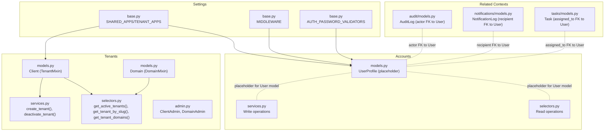
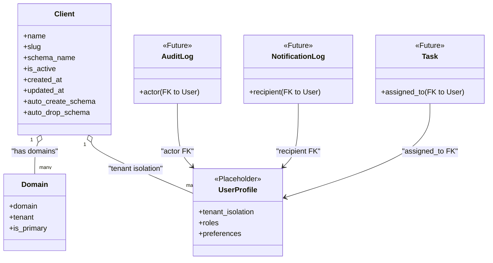
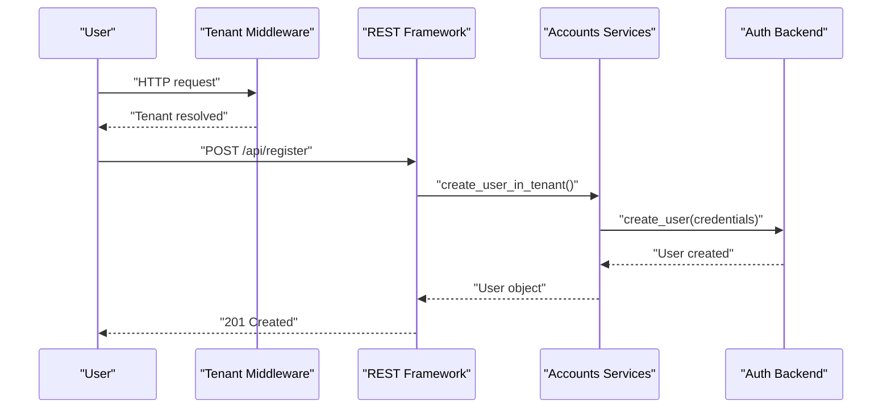
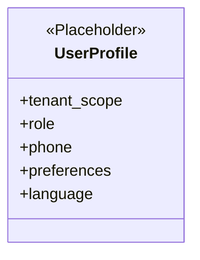
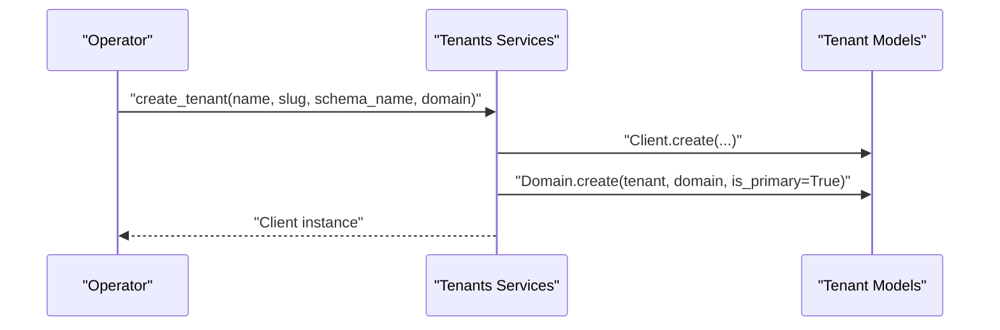
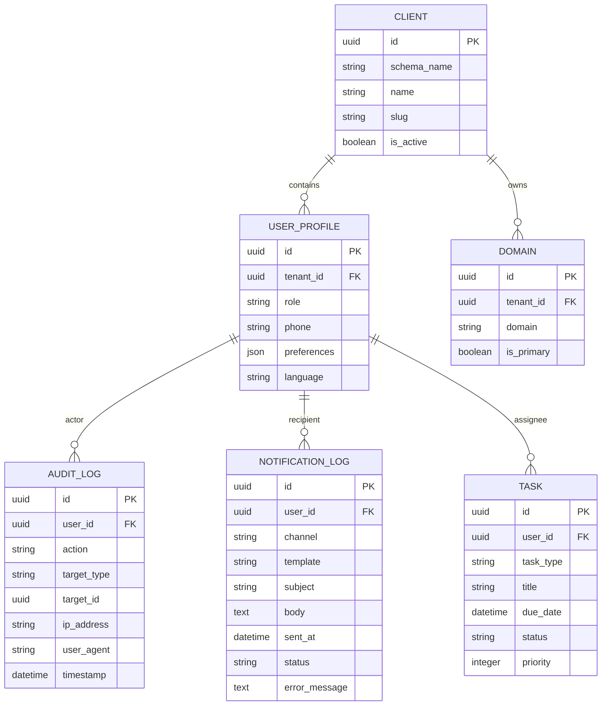
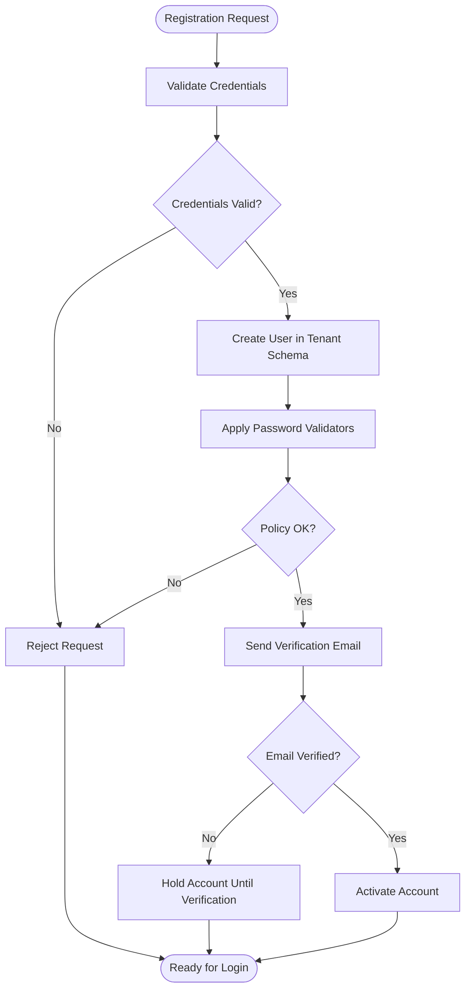
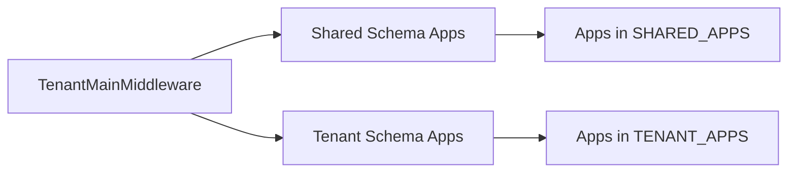
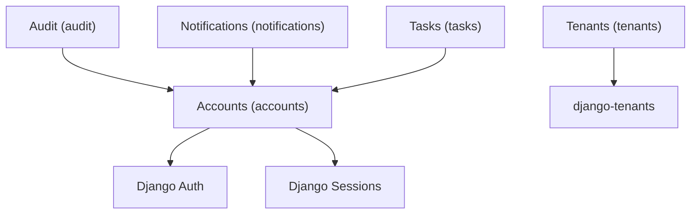

# User Account Models

<cite>
**Referenced Files in This Document**
- [models.py](file://backend/apps/accounts/models.py)
- [services.py](file://backend/apps/accounts/services.py)
- [selectors.py](file://backend/apps/accounts/selectors.py)
- [models.py](file://backend/apps/tenants/models.py)
- [services.py](file://backend/apps/tenants/services.py)
- [selectors.py](file://backend/apps/tenants/selectors.py)
- [admin.py](file://backend/apps/tenants/admin.py)
- [base.py](file://backend/config/settings/base.py)
- [models.py](file://backend/apps/audit/models.py)
- [models.py](file://backend/apps/notifications/models.py)
- [models.py](file://backend/apps/tasks/models.py)
</cite>

## Table of Contents
1. [Introduction](#introduction)
2. [Project Structure](#project-structure)
3. [Core Components](#core-components)
4. [Architecture Overview](#architecture-overview)
5. [Detailed Component Analysis](#detailed-component-analysis)
6. [Dependency Analysis](#dependency-analysis)
7. [Performance Considerations](#performance-considerations)
8. [Troubleshooting Guide](#troubleshooting-guide)
9. [Conclusion](#conclusion)

## Introduction
This document describes the user account models and related authentication and authorization constructs within the Accounts bounded context. It focuses on:
- User registration and authentication mechanisms
- User profile extension model
- Role and permission management pathways
- Tenant membership associations and multi-tenant isolation
- Password policies and email verification workflows
- User activity tracking and notification integrations
- Session management and security-related model relationships

The Accounts context is designed to operate within a tenant’s schema, ensuring user and profile data are isolated per tenant. Authentication relies on Django’s built-in authentication stack integrated with session-based and REST authentication.

## Project Structure
The Accounts bounded context currently defines a placeholder profile model and enforces a strict separation of read/write operations through dedicated services and selectors layers. Tenant models define multi-tenant isolation via django-tenants, including a tenant and domain model. Settings configure shared and tenant applications, middleware, and authentication defaults.

**Diagram sources**
- [base.py:44-94](file://backend/config/settings/base.py#L44-L94)
- [base.py:107-119](file://backend/config/settings/base.py#L107-L119)
- [base.py:169-182](file://backend/config/settings/base.py#L169-L182)
- [models.py:1-30](file://backend/apps/accounts/models.py#L1-L30)
- [services.py:1-7](file://backend/apps/accounts/services.py#L1-L7)
- [selectors.py:1-7](file://backend/apps/accounts/selectors.py#L1-L7)
- [models.py:1-77](file://backend/apps/tenants/models.py#L1-L77)
- [services.py:1-42](file://backend/apps/tenants/services.py#L1-L42)
- [selectors.py:1-26](file://backend/apps/tenants/selectors.py#L1-L26)
- [admin.py:1-25](file://backend/apps/tenants/admin.py#L1-L25)
- [models.py:1-31](file://backend/apps/audit/models.py#L1-L31)
- [models.py:1-28](file://backend/apps/notifications/models.py#L1-L28)
- [models.py:1-29](file://backend/apps/tasks/models.py#L1-L29)

**Section sources**
- [base.py:44-94](file://backend/config/settings/base.py#L44-L94)
- [base.py:107-119](file://backend/config/settings/base.py#L107-L119)
- [base.py:169-182](file://backend/config/settings/base.py#L169-L182)
- [models.py:1-30](file://backend/apps/accounts/models.py#L1-L30)
- [services.py:1-7](file://backend/apps/accounts/services.py#L1-L7)
- [selectors.py:1-7](file://backend/apps/accounts/selectors.py#L1-L7)
- [models.py:1-77](file://backend/apps/tenants/models.py#L1-L77)
- [services.py:1-42](file://backend/apps/tenants/services.py#L1-L42)
- [selectors.py:1-26](file://backend/apps/tenants/selectors.py#L1-L26)
- [admin.py:1-25](file://backend/apps/tenants/admin.py#L1-L25)
- [models.py:1-31](file://backend/apps/audit/models.py#L1-L31)
- [models.py:1-28](file://backend/apps/notifications/models.py#L1-L28)
- [models.py:1-29](file://backend/apps/tasks/models.py#L1-L29)

## Core Components
- UserProfile (Accounts): Placeholder tenant-scoped profile model indicating planned fields such as role, phone number, notification preferences, and language preference. It is marked as a potential abstract model for future iteration.
- Client (Tenants): Tenant model representing a single customer with schema isolation via django-tenants. Includes activation flag, timestamps, and automatic schema creation/drop toggles.
- Domain (Tenants): Domain model mapping hostnames to tenants, with a primary domain flag for URL generation.
- Services and Selectors (Accounts): Enforce centralized mutation and query logic for user/profile data.
- Services and Selectors (Tenants): Provide tenant provisioning and retrieval utilities.

Key operational characteristics:
- Multi-tenant isolation is enforced by django-tenants with explicit SHARED_APPS and TENANT_APPS lists.
- Authentication middleware and session management are configured in settings.
- Password validators are enabled via AUTH_PASSWORD_VALIDATORS.

**Section sources**
- [models.py:15-30](file://backend/apps/accounts/models.py#L15-L30)
- [models.py:6-53](file://backend/apps/tenants/models.py#L6-L53)
- [models.py:56-76](file://backend/apps/tenants/models.py#L56-L76)
- [services.py:1-7](file://backend/apps/accounts/services.py#L1-L7)
- [selectors.py:1-7](file://backend/apps/accounts/selectors.py#L1-L7)
- [services.py:11-42](file://backend/apps/tenants/services.py#L11-L42)
- [selectors.py:13-25](file://backend/apps/tenants/selectors.py#L13-L25)
- [base.py:44-94](file://backend/config/settings/base.py#L44-L94)
- [base.py:107-119](file://backend/config/settings/base.py#L107-L119)
- [base.py:169-182](file://backend/config/settings/base.py#L169-L182)

## Architecture Overview
The Accounts bounded context operates within tenant schemas. Authentication is handled by Django’s contrib.auth and session middleware. The tenant models and services define tenant lifecycle and domain mapping. Related contexts (Audit, Notifications, Tasks) reference a future User model via foreign keys.

**Diagram sources**
- [models.py:15-30](file://backend/apps/accounts/models.py#L15-L30)
- [models.py:6-53](file://backend/apps/tenants/models.py#L6-L53)
- [models.py:56-76](file://backend/apps/tenants/models.py#L56-L76)
- [models.py:14-30](file://backend/apps/audit/models.py#L14-L30)
- [models.py:12-27](file://backend/apps/notifications/models.py#L12-L27)
- [models.py:12-28](file://backend/apps/tasks/models.py#L12-L28)

## Detailed Component Analysis

### User Registration and Authentication
- Authentication stack: SessionAuthentication and IsAuthenticated permission are configured for REST. AuthenticationMiddleware is present in middleware chain.
- Password policy: Validators include similarity, minimum length, common password, and numeric-only checks.
- Email backend: Configurable via environment variable; default console backend for development.
- Session management: Session middleware is enabled; cookie security flags are intentionally environment-specific.

Registration workflow (conceptual):
- Tenant selection via domain routing (handled by django-tenants).
- User creation within the tenant schema through Accounts services.
- Optional email verification step (to be implemented) prior to enabling account access.

**Diagram sources**
- [base.py:107-119](file://backend/config/settings/base.py#L107-L119)
- [base.py:234-250](file://backend/config/settings/base.py#L234-L250)
- [base.py:169-182](file://backend/config/settings/base.py#L169-L182)
- [base.py:282-285](file://backend/config/settings/base.py#L282-L285)
- [services.py:1-7](file://backend/apps/accounts/services.py#L1-L7)

**Section sources**
- [base.py:107-119](file://backend/config/settings/base.py#L107-L119)
- [base.py:234-250](file://backend/config/settings/base.py#L234-L250)
- [base.py:169-182](file://backend/config/settings/base.py#L169-L182)
- [base.py:282-285](file://backend/config/settings/base.py#L282-L285)
- [services.py:1-7](file://backend/apps/accounts/services.py#L1-L7)

### User Profile Extensions
- UserProfile is a placeholder intended to hold:
  - Role assignments (e.g., gardener, expert, admin)
  - Phone number
  - Notification preferences
  - Language preference
- It is designed to be tenant-scoped and may be implemented as an abstract model in future iterations.

**Diagram sources**
- [models.py:15-30](file://backend/apps/accounts/models.py#L15-L30)

**Section sources**
- [models.py:15-30](file://backend/apps/accounts/models.py#L15-L30)

### Role Assignments and Permission Management
- Roles and permissions are planned for the future User model and associated UserProfile.
- Access control will be enforced within tenant boundaries, leveraging Django’s permission framework and REST permissions.

[No sources needed since this section outlines planned features]

### Tenant Membership Associations
- Tenant creation service provisions a Client and its primary Domain.
- Selectors provide lookup by slug and list active tenants and their domains.
- Admin views support managing Clients and Domains.

**Diagram sources**
- [services.py:11-35](file://backend/apps/tenants/services.py#L11-L35)
- [models.py:6-53](file://backend/apps/tenants/models.py#L6-L53)
- [models.py:56-76](file://backend/apps/tenants/models.py#L56-L76)

**Section sources**
- [services.py:11-35](file://backend/apps/tenants/services.py#L11-L35)
- [selectors.py:13-25](file://backend/apps/tenants/selectors.py#L13-L25)
- [models.py:6-53](file://backend/apps/tenants/models.py#L6-L53)
- [models.py:56-76](file://backend/apps/tenants/models.py#L56-L76)
- [admin.py:7-24](file://backend/apps/tenants/admin.py#L7-L24)

### User Activity Tracking and Notifications
- AuditLog, NotificationLog, and Task models indicate foreign key references to a future User model for actor, recipient, and assignee respectively.
- These contexts will rely on the Accounts User model for identity and access control.

**Diagram sources**
- [models.py:15-30](file://backend/apps/accounts/models.py#L15-L30)
- [models.py:6-53](file://backend/apps/tenants/models.py#L6-L53)
- [models.py:56-76](file://backend/apps/tenants/models.py#L56-L76)
- [models.py:14-30](file://backend/apps/audit/models.py#L14-L30)
- [models.py:12-27](file://backend/apps/notifications/models.py#L12-L27)
- [models.py:12-28](file://backend/apps/tasks/models.py#L12-L28)

**Section sources**
- [models.py:14-30](file://backend/apps/audit/models.py#L14-L30)
- [models.py:12-27](file://backend/apps/notifications/models.py#L12-L27)
- [models.py:12-28](file://backend/apps/tasks/models.py#L12-L28)

### Password Policies and Email Verification Workflows
- Password validators: Similarity, minimum length, common password, numeric-only checks are enabled.
- Email backend: Configurable via environment variable; default console backend for development.
- Email verification: Not implemented yet; recommended to introduce a verification token mechanism and link it to the User model when it is defined.

**Diagram sources**
- [base.py:169-182](file://backend/config/settings/base.py#L169-L182)
- [base.py:282-285](file://backend/config/settings/base.py#L282-L285)
- [services.py:1-7](file://backend/apps/accounts/services.py#L1-L7)

**Section sources**
- [base.py:169-182](file://backend/config/settings/base.py#L169-L182)
- [base.py:282-285](file://backend/config/settings/base.py#L282-L285)
- [services.py:1-7](file://backend/apps/accounts/services.py#L1-L7)

### Multi-Tenant User Isolation
- SHARED_APPS and TENANT_APPS define which apps are available in public vs tenant schemas.
- TENANT_MODEL and TENANT_DOMAIN_MODEL are set to the Client and Domain models respectively.
- TenantMainMiddleware ensures requests route to the correct tenant schema.

**Diagram sources**
- [base.py:44-94](file://backend/config/settings/base.py#L44-L94)
- [base.py:99-102](file://backend/config/settings/base.py#L99-L102)
- [base.py:107-119](file://backend/config/settings/base.py#L107-L119)

**Section sources**
- [base.py:44-94](file://backend/config/settings/base.py#L44-L94)
- [base.py:99-102](file://backend/config/settings/base.py#L99-L102)
- [base.py:107-119](file://backend/config/settings/base.py#L107-L119)

## Dependency Analysis
- Accounts depends on Django auth and sessions; it does not yet define a concrete User model but references a future User via comments in related models.
- Tenants depend on django-tenants mixins and services; they are central to multi-tenant isolation.
- Audit, Notifications, and Tasks contexts plan to reference the User model for actor/recipients/assignees.

**Diagram sources**
- [base.py:44-94](file://backend/config/settings/base.py#L44-L94)
- [models.py:1-3](file://backend/apps/tenants/models.py#L1-L3)
- [models.py:14-30](file://backend/apps/audit/models.py#L14-L30)
- [models.py:12-27](file://backend/apps/notifications/models.py#L12-L27)
- [models.py:12-28](file://backend/apps/tasks/models.py#L12-L28)

**Section sources**
- [base.py:44-94](file://backend/config/settings/base.py#L44-L94)
- [models.py:1-3](file://backend/apps/tenants/models.py#L1-L3)
- [models.py:14-30](file://backend/apps/audit/models.py#L14-L30)
- [models.py:12-27](file://backend/apps/notifications/models.py#L12-L27)
- [models.py:12-28](file://backend/apps/tasks/models.py#L12-L28)

## Performance Considerations
- Centralized services and selectors for Accounts reduce duplication and improve testability.
- django-tenants schema routing adds overhead; ensure efficient tenant resolution and caching where appropriate.
- Keep password validators minimal in hot paths; pre-validate inputs to avoid unnecessary validator calls.
- Use database indexes on frequently queried fields (e.g., tenant identifiers, slugs).

[No sources needed since this section provides general guidance]

## Troubleshooting Guide
- Authentication failures: Verify session middleware order and REST authentication classes.
- Tenant resolution errors: Confirm TENANT_MODEL and TENANT_DOMAIN_MODEL settings and that TenantMainMiddleware is present.
- Password validation errors: Review AUTH_PASSWORD_VALIDATORS configuration.
- Email verification: Ensure EMAIL_BACKEND is configured and that verification flows are wired to the User model when implemented.

**Section sources**
- [base.py:107-119](file://backend/config/settings/base.py#L107-L119)
- [base.py:234-250](file://backend/config/settings/base.py#L234-L250)
- [base.py:169-182](file://backend/config/settings/base.py#L169-L182)
- [base.py:282-285](file://backend/config/settings/base.py#L282-L285)

## Conclusion
The Accounts bounded context establishes a foundation for user profiles and tenant-scoped user data, while the Tenants context provides robust multi-tenant isolation. Authentication and session management are configured via Django settings, and related contexts (Audit, Notifications, Tasks) anticipate integrating with a future User model. Implementing the User model, email verification, and role/permission systems will complete the user account ecosystem within the current architecture.