# Multi-Tenant Schema Design

<cite>
**Referenced Files in This Document**
- [base.py](file://backend/config/settings/base.py)
- [local.py](file://backend/config/settings/local.py)
- [production.py](file://backend/config/settings/production.py)
- [MULTI_TENANCY.md](file://backend/docs/architecture/MULTI_TENANCY.md)
- [models.py](file://backend/apps/tenants/models.py)
- [services.py](file://backend/apps/tenants/services.py)
- [selectors.py](file://backend/apps/tenants/selectors.py)
- [events.py](file://backend/apps/tenants/events.py)
- [admin.py](file://backend/apps/tenants/admin.py)
- [apps.py](file://backend/apps/tenants/apps.py)
- [urls.py](file://backend/config/urls.py)
- [test_tenants.py](file://backend/tests/test_tenants.py)
- [pyproject.toml](file://backend/pyproject.toml)
- [test.py](file://backend/config/settings/test.py)
</cite>

## Table of Contents
1. [Introduction](#introduction)
2. [Project Structure](#project-structure)
3. [Core Components](#core-components)
4. [Architecture Overview](#architecture-overview)
5. [Detailed Component Analysis](#detailed-component-analysis)
6. [Dependency Analysis](#dependency-analysis)
7. [Performance Considerations](#performance-considerations)
8. [Troubleshooting Guide](#troubleshooting-guide)
9. [Conclusion](#conclusion)
10. [Appendices](#appendices)

## Introduction
This document explains the multi-tenant PostgreSQL schema design powered by django-tenants. It covers the shared schema approach for common data (django-tenants, auth, contenttypes) versus tenant-specific schemas for business data, configuration of SHARED_APPS and TENANT_APPS, tenant model and domain routing, fail-closed tenant isolation, schema creation/deletion, and tenant data separation. It also provides practical examples for provisioning, migration patterns, cross-tenant access limitations, security implications, performance considerations, and best practices for tenant data lifecycle management.

## Project Structure
The multi-tenancy implementation centers around:
- Settings configuration defining SHARED_APPS, TENANT_APPS, tenant model, domain model, middleware, and database router.
- A dedicated tenants app containing the Client and Domain models, services, selectors, events, and admin.
- Architecture documentation outlining schema layout, routing, and isolation policies.
- Tests validating tenant provisioning and deactivation flows.

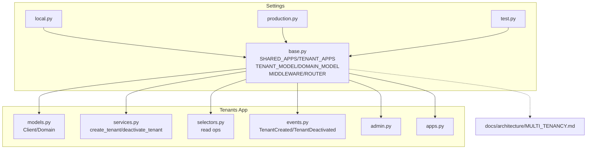

**Diagram sources**
- [base.py:44-102](file://backend/config/settings/base.py#L44-L102)
- [local.py:1-42](file://backend/config/settings/local.py#L1-L42)
- [production.py:1-42](file://backend/config/settings/production.py#L1-L42)
- [MULTI_TENANCY.md:1-76](file://backend/docs/architecture/MULTI_TENANCY.md#L1-L76)
- [models.py:1-77](file://backend/apps/tenants/models.py#L1-L77)
- [services.py:1-42](file://backend/apps/tenants/services.py#L1-L42)
- [selectors.py:1-26](file://backend/apps/tenants/selectors.py#L1-L26)
- [events.py:1-36](file://backend/apps/tenants/events.py#L1-L36)
- [admin.py:1-25](file://backend/apps/tenants/admin.py#L1-L25)
- [apps.py:1-12](file://backend/apps/tenants/apps.py#L1-L12)
- [test.py:1-59](file://backend/config/settings/test.py#L1-L59)

**Section sources**
- [base.py:44-102](file://backend/config/settings/base.py#L44-L102)
- [MULTI_TENANCY.md:1-76](file://backend/docs/architecture/MULTI_TENANCY.md#L1-L76)

## Core Components
- Shared schema (public): Contains shared tables for tenants, Django core, and third-party packages configured in SHARED_APPS.
- Tenant schemas: Each tenant has its own schema containing replicated TENANT_APPS plus Django core in tenant schemas.
- Tenant model and domain: Client represents a tenant; Domain maps hostnames to tenants.
- Middleware and router: TenantMainMiddleware routes requests by Host header; TenantSyncRouter ensures database operations target the correct schema.
- Services and selectors: Centralized write/read operations for tenant data to enforce isolation and testability.

**Section sources**
- [base.py:44-102](file://backend/config/settings/base.py#L44-L102)
- [models.py:6-77](file://backend/apps/tenants/models.py#L6-L77)
- [services.py:11-42](file://backend/apps/tenants/services.py#L11-L42)
- [selectors.py:13-26](file://backend/apps/tenants/selectors.py#L13-L26)

## Architecture Overview
The system uses PostgreSQL schemas for physical tenant isolation. Requests are routed to the appropriate tenant schema based on the Host header. Access to the shared schema is restricted to specific apps and admin. Cross-tenant queries are disallowed except via explicit tenant context in background jobs.

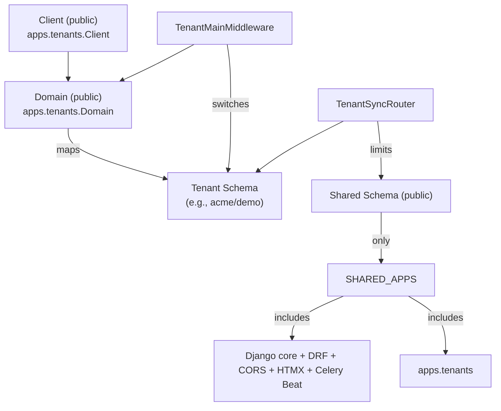

**Diagram sources**
- [base.py:44-102](file://backend/config/settings/base.py#L44-L102)
- [models.py:6-77](file://backend/apps/tenants/models.py#L6-L77)
- [MULTI_TENANCY.md:12-27](file://backend/docs/architecture/MULTI_TENANCY.md#L12-L27)

**Section sources**
- [base.py:99-102](file://backend/config/settings/base.py#L99-L102)
- [MULTI_TENANCY.md:12-27](file://backend/docs/architecture/MULTI_TENANCY.md#L12-L27)

## Detailed Component Analysis

### Tenant Model Setup
The Client model defines tenant metadata and enables automatic schema creation and deletion. The Domain model maps hostnames to tenants and supports a primary domain flag.

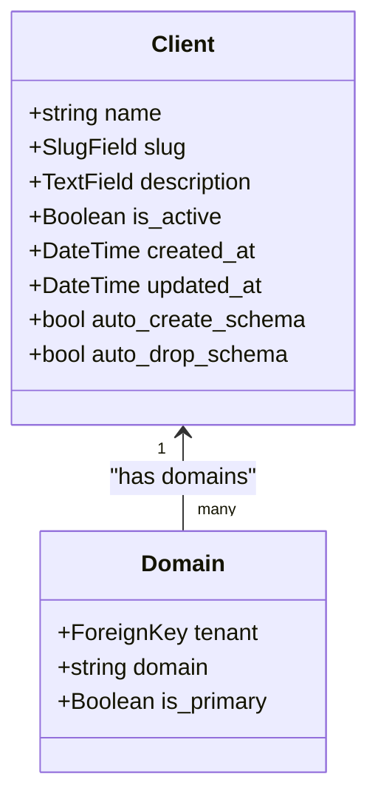

**Diagram sources**
- [models.py:6-77](file://backend/apps/tenants/models.py#L6-L77)

**Section sources**
- [models.py:6-77](file://backend/apps/tenants/models.py#L6-L77)

### Tenant Provisioning Service
Provisioning is centralized in the services layer to ensure schema creation and primary domain assignment occur atomically.

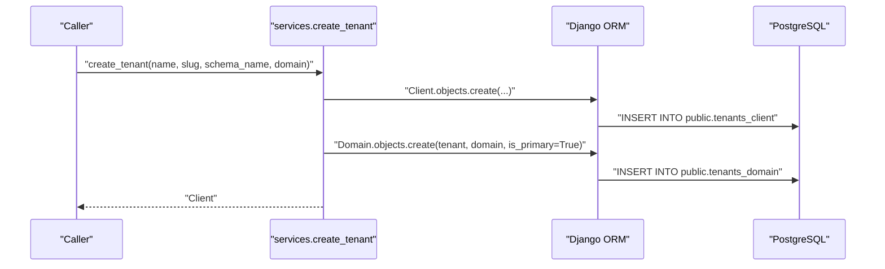

**Diagram sources**
- [services.py:11-35](file://backend/apps/tenants/services.py#L11-L35)

**Section sources**
- [services.py:11-35](file://backend/apps/tenants/services.py#L11-L35)

### Tenant Deactivation Selector
Soft-deactivating a tenant updates a single field while preserving schema isolation.

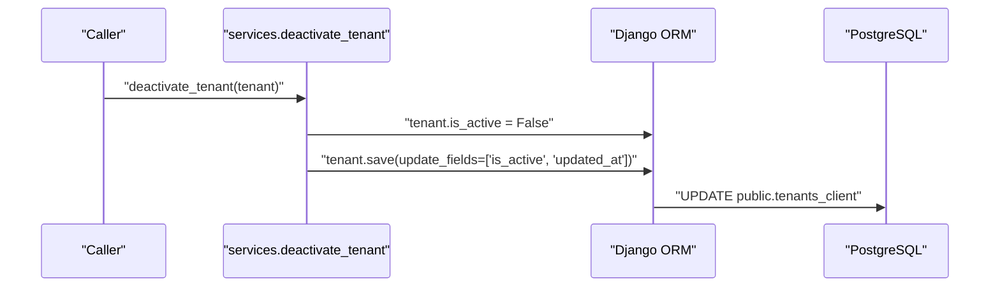

**Diagram sources**
- [services.py:38-42](file://backend/apps/tenants/services.py#L38-L42)

**Section sources**
- [services.py:38-42](file://backend/apps/tenants/services.py#L38-L42)

### Tenant Read Selectors
Read operations are centralized to keep queries predictable and testable.

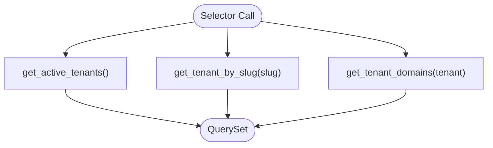

**Diagram sources**
- [selectors.py:13-26](file://backend/apps/tenants/selectors.py#L13-L26)

**Section sources**
- [selectors.py:13-26](file://backend/apps/tenants/selectors.py#L13-L26)

### Tenant Events
Domain events represent domain actions for eventual consistency and outbox/event bus integration.

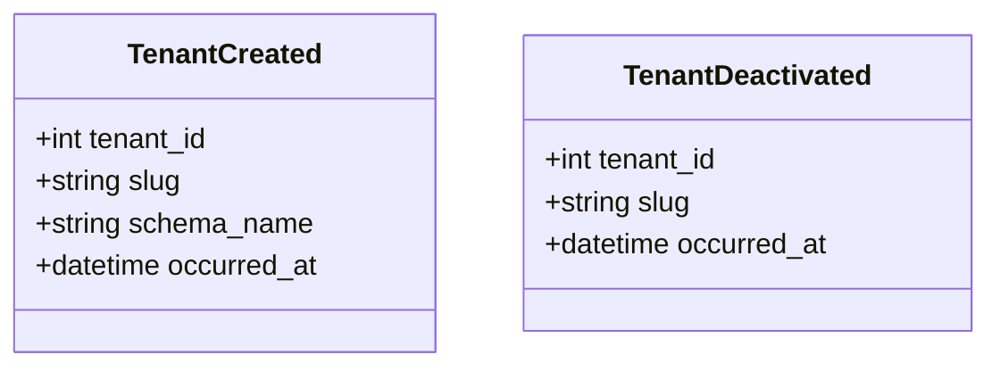

**Diagram sources**
- [events.py:19-36](file://backend/apps/tenants/events.py#L19-L36)

**Section sources**
- [events.py:19-36](file://backend/apps/tenants/events.py#L19-L36)

### Tenant Admin
Admin provides searchable and filterable views for tenant and domain records.

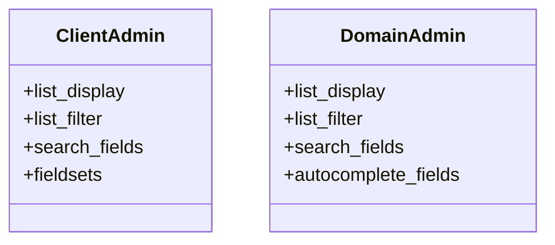

**Diagram sources**
- [admin.py:7-25](file://backend/apps/tenants/admin.py#L7-L25)

**Section sources**
- [admin.py:7-25](file://backend/apps/tenants/admin.py#L7-L25)

### Settings and Configuration
Key configuration points:
- SHARED_APPS and TENANT_APPS define which apps live in the shared/public schema and tenant schemas respectively.
- TENANT_MODEL and TENANT_DOMAIN_MODEL bind the tenant and domain models.
- DATABASE_ROUTERS uses TenantSyncRouter to route queries to the current tenant schema.
- Middleware chain includes TenantMainMiddleware for hostname-based routing.
- Database backend uses django-tenants PostgreSQL backend.

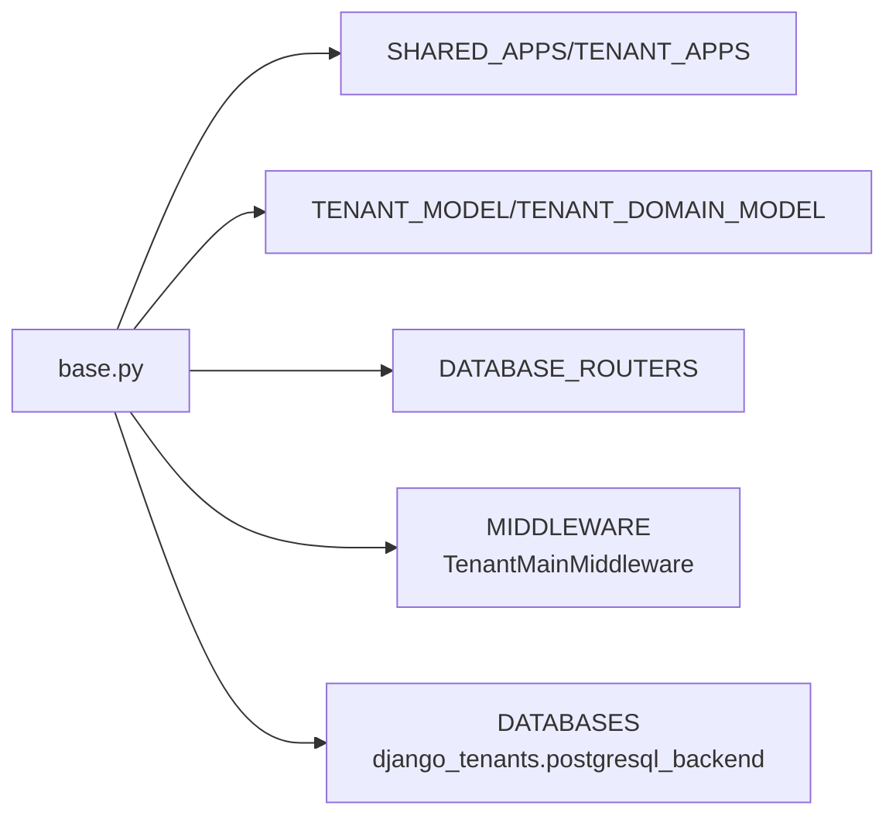

**Diagram sources**
- [base.py:44-102](file://backend/config/settings/base.py#L44-L102)
- [pyproject.toml:18-67](file://backend/pyproject.toml#L18-L67)

**Section sources**
- [base.py:44-102](file://backend/config/settings/base.py#L44-L102)
- [pyproject.toml:18-67](file://backend/pyproject.toml#L18-L67)

### Migration Patterns
- Run migrations for shared schema first, then for tenant schemas.
- Only apps in SHARED_APPS and TENANT_APPS are migrated.

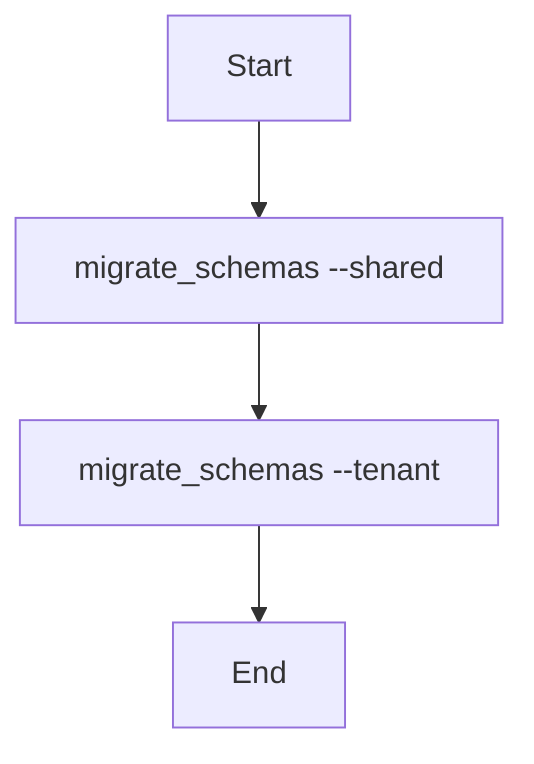

**Diagram sources**
- [MULTI_TENANCY.md:54-61](file://backend/docs/architecture/MULTI_TENANCY.md#L54-L61)

**Section sources**
- [MULTI_TENANCY.md:54-61](file://backend/docs/architecture/MULTI_TENANCY.md#L54-L61)

### Tenant Domain Routing
Requests are routed by Host header to the tenant’s schema. If no domain matches, the request is rejected (fail-closed).

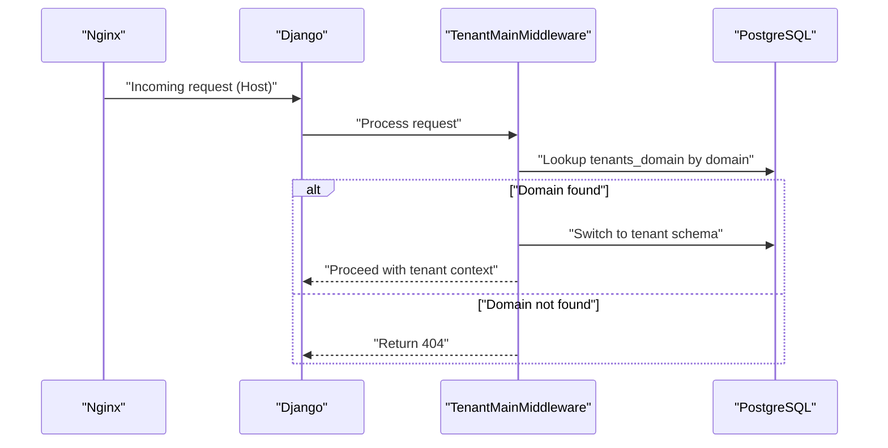

**Diagram sources**
- [base.py:107-119](file://backend/config/settings/base.py#L107-L119)
- [MULTI_TENANCY.md:12-27](file://backend/docs/architecture/MULTI_TENANCY.md#L12-L27)

**Section sources**
- [base.py:107-119](file://backend/config/settings/base.py#L107-L119)
- [MULTI_TENANCY.md:12-27](file://backend/docs/architecture/MULTI_TENANCY.md#L12-L27)

### Cross-Tenant Data Access Limitations
- Cross-tenant queries are explicitly prohibited in views.
- Background jobs must use tenant_context to operate within a tenant schema.

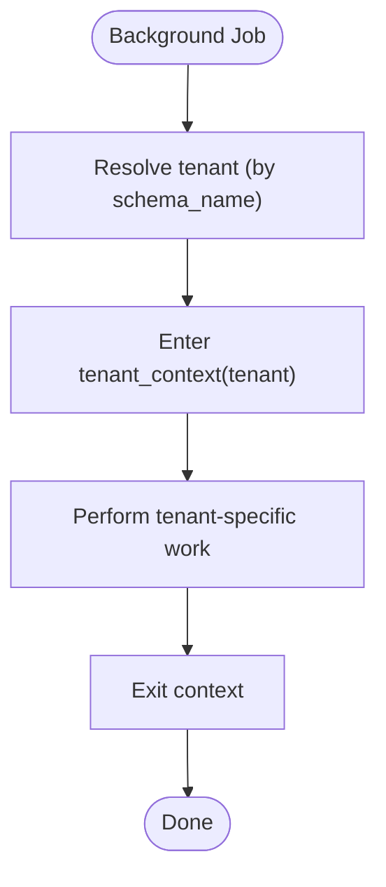

**Diagram sources**
- [MULTI_TENANCY.md:63-75](file://backend/docs/architecture/MULTI_TENANCY.md#L63-L75)

**Section sources**
- [MULTI_TENANCY.md:25-27](file://backend/docs/architecture/MULTI_TENANCY.md#L25-L27)
- [MULTI_TENANCY.md:63-75](file://backend/docs/architecture/MULTI_TENANCY.md#L63-L75)

### Practical Examples
- Provisioning a tenant with a primary domain and schema name.
- Running shared and tenant migrations.
- Executing background tasks within a tenant context.

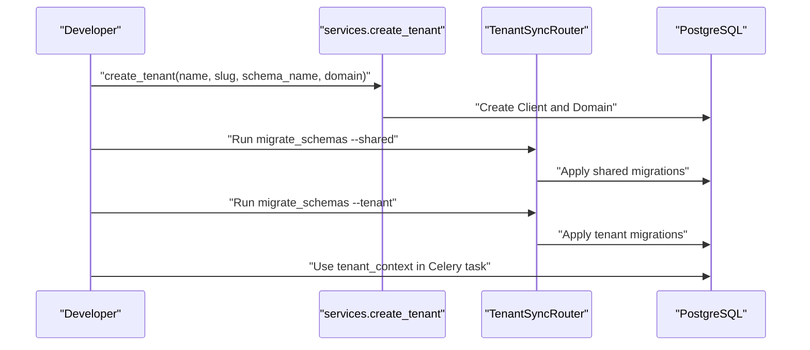

**Diagram sources**
- [services.py:11-35](file://backend/apps/tenants/services.py#L11-L35)
- [MULTI_TENANCY.md:41-61](file://backend/docs/architecture/MULTI_TENANCY.md#L41-L61)
- [MULTI_TENANCY.md:63-75](file://backend/docs/architecture/MULTI_TENANCY.md#L63-L75)

**Section sources**
- [services.py:11-35](file://backend/apps/tenants/services.py#L11-L35)
- [MULTI_TENANCY.md:41-61](file://backend/docs/architecture/MULTI_TENANCY.md#L41-L61)
- [MULTI_TENANCY.md:63-75](file://backend/docs/architecture/MULTI_TENANCY.md#L63-L75)

## Dependency Analysis
The tenants app depends on django-tenants for schema management and integrates with Django core and third-party packages. Settings define which apps are shared versus tenant-specific, and the database router ensures correct schema targeting.

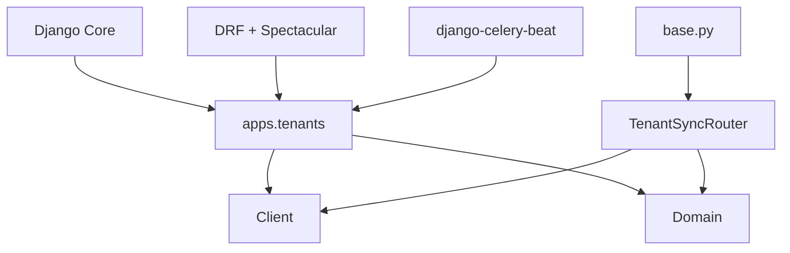

**Diagram sources**
- [base.py:44-102](file://backend/config/settings/base.py#L44-L102)
- [models.py:1-77](file://backend/apps/tenants/models.py#L1-L77)
- [apps.py:1-12](file://backend/apps/tenants/apps.py#L1-L12)
- [pyproject.toml:18-67](file://backend/pyproject.toml#L18-L67)

**Section sources**
- [base.py:44-102](file://backend/config/settings/base.py#L44-L102)
- [pyproject.toml:18-67](file://backend/pyproject.toml#L18-L67)

## Performance Considerations
- Connection pooling and reuse: Production settings enable connection reuse via CONN_MAX_AGE.
- Database engine: django-tenants PostgreSQL backend is used for schema-aware operations.
- Middleware order: TenantMainMiddleware runs early to resolve schema before other middleware.
- Background jobs: Use tenant_context to avoid repeated schema switching overhead.

**Section sources**
- [production.py](file://backend/config/settings/production.py#L21)
- [base.py:155-164](file://backend/config/settings/base.py#L155-L164)
- [base.py:107-119](file://backend/config/settings/base.py#L107-L119)

## Troubleshooting Guide
- Tenant not found: Verify domain exists in the public schema and is set as primary if needed.
- Permission denied: Ensure the request is made against a valid tenant domain; fail-closed policy returns 404 for unknown domains.
- Migration issues: Always run shared migrations before tenant migrations.
- Test environment: Tests use the django-tenants PostgreSQL backend and a separate test database suffix.

**Section sources**
- [MULTI_TENANCY.md:12-27](file://backend/docs/architecture/MULTI_TENANCY.md#L12-L27)
- [MULTI_TENANCY.md:54-61](file://backend/docs/architecture/MULTI_TENANCY.md#L54-L61)
- [test.py:14-23](file://backend/config/settings/test.py#L14-L23)

## Conclusion
The multi-tenant design leverages django-tenants with PostgreSQL schemas to achieve strong tenant isolation. The shared schema holds common infrastructure, while tenant schemas isolate business data. Strict routing, fail-closed isolation, and centralized services/selectors ensure secure and maintainable tenant operations. Migration patterns and background job practices further reinforce data separation and operational safety.

## Appendices

### Configuration Reference
- SHARED_APPS: Defines shared schema apps.
- TENANT_APPS: Defines tenant schema apps.
- TENANT_MODEL and TENANT_DOMAIN_MODEL: Bind tenant and domain models.
- DATABASE_ROUTERS: TenantSyncRouter for schema routing.
- MIDDLEWARE: TenantMainMiddleware for hostname-based routing.
- Database backend: django_tenants.postgresql_backend.

**Section sources**
- [base.py:44-102](file://backend/config/settings/base.py#L44-L102)
- [pyproject.toml:18-67](file://backend/pyproject.toml#L18-L67)

### Tenant Lifecycle Best Practices
- Provisioning: Use the services layer to create tenants and primary domains.
- Deactivation: Soft-deactivate tenants to preserve data while blocking access.
- Migrations: Always apply shared migrations before tenant migrations.
- Background jobs: Enter tenant_context explicitly for tenant-specific work.
- Testing: Use test settings with a separate database suffix and disable Celery tasks eagerly.

**Section sources**
- [services.py:11-42](file://backend/apps/tenants/services.py#L11-L42)
- [MULTI_TENANCY.md:41-75](file://backend/docs/architecture/MULTI_TENANCY.md#L41-L75)
- [test.py:35-36](file://backend/config/settings/test.py#L35-L36)