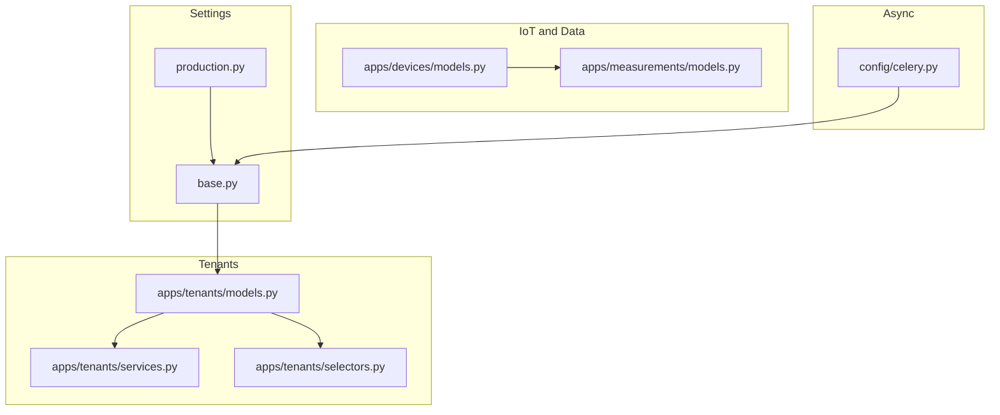
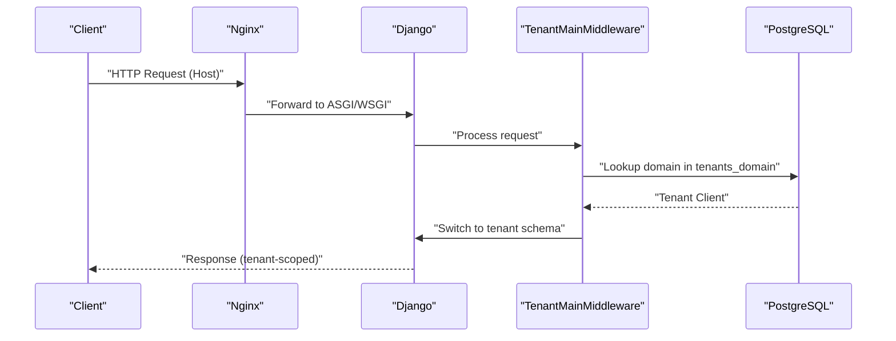
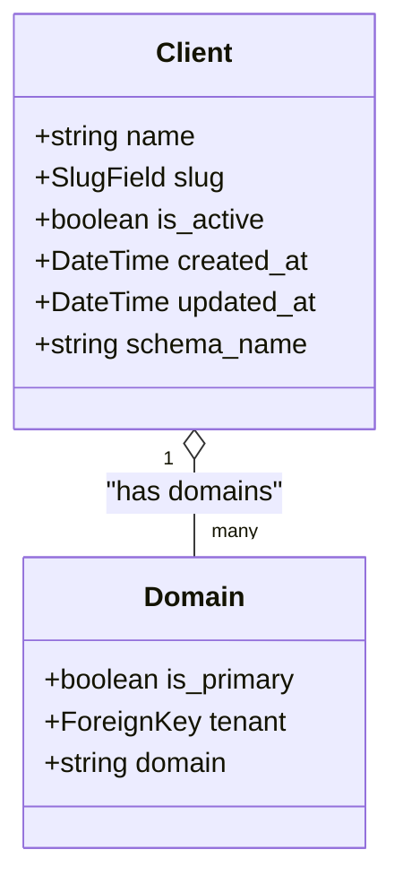
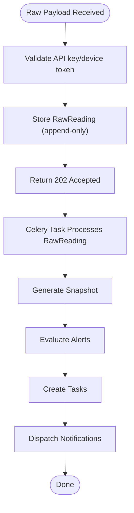
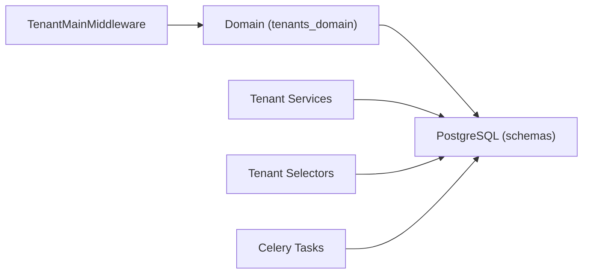

# Performance Optimization

<cite>
**Referenced Files in This Document**
- [base.py](file://backend/config/settings/base.py)
- [production.py](file://backend/config/settings/production.py)
- [MULTI_TENANCY.md](file://backend/docs/architecture/MULTI_TENANCY.md)
- [IOT_INGEST.md](file://backend/docs/architecture/IOT_INGEST.md)
- [models.py](file://backend/apps/tenants/models.py)
- [services.py](file://backend/apps/tenants/services.py)
- [selectors.py](file://backend/apps/tenants/selectors.py)
- [celery.py](file://backend/config/celery.py)
- [models.py](file://backend/apps/devices/models.py)
- [models.py](file://backend/apps/measurements/models.py)
</cite>

## Table of Contents
1. [Introduction](#introduction)
2. [Project Structure](#project-structure)
3. [Core Components](#core-components)
4. [Architecture Overview](#architecture-overview)
5. [Detailed Component Analysis](#detailed-component-analysis)
6. [Dependency Analysis](#dependency-analysis)
7. [Performance Considerations](#performance-considerations)
8. [Troubleshooting Guide](#troubleshooting-guide)
9. [Conclusion](#conclusion)

## Introduction
This document focuses on database performance optimization strategies tailored to the multi-tenant architecture used in the project. The system employs django-tenants with PostgreSQL schemas for tenant isolation, and the backend leverages Django ORM with Celery for asynchronous processing. The guidance covers indexing strategies for tenant isolation, query optimization patterns for cross-tenant operations, caching mechanisms for frequently accessed data, connection pooling, query batching, async database operations, performance monitoring, slow query identification, and optimization techniques for large datasets. Practical examples are provided via code snippet paths to relevant modules.

## Project Structure
The project follows a Django-based multi-tenant design with bounded contexts for each functional area. Tenant metadata and routing are handled in the tenants app, while IoT ingestion and alerting are implemented in dedicated apps. Settings define database backends, middleware for tenant routing, and Celery configuration for background tasks.

**Diagram sources**
- [base.py:155-164](file://backend/config/settings/base.py#L155-L164)
- [production.py](file://backend/config/settings/production.py#L21)
- [models.py:6-53](file://backend/apps/tenants/models.py#L6-L53)
- [services.py:11-35](file://backend/apps/tenants/services.py#L11-L35)
- [selectors.py:13-25](file://backend/apps/tenants/selectors.py#L13-L25)
- [models.py:12-29](file://backend/apps/devices/models.py#L12-L29)
- [models.py:14-30](file://backend/apps/measurements/models.py#L14-L30)
- [celery.py:12-21](file://backend/config/celery.py#L12-L21)

**Section sources**
- [base.py:1-336](file://backend/config/settings/base.py#L1-L336)
- [production.py:1-42](file://backend/config/settings/production.py#L1-L42)
- [MULTI_TENANCY.md:1-76](file://backend/docs/architecture/MULTI_TENANCY.md#L1-L76)

## Core Components
- Tenant isolation via django-tenants with PostgreSQL schemas and TenantMainMiddleware routing.
- Centralized read/write abstractions for tenant data through selectors and services.
- Asynchronous processing via Celery with RabbitMQ broker and Redis result backend.
- Append-only ingestion pipeline for IoT raw readings with idempotent processing.

Key implementation references:
- Tenant model and domain mapping: [models.py:6-77](file://backend/apps/tenants/models.py#L6-L77)
- Tenant creation and deactivation services: [services.py:11-42](file://backend/apps/tenants/services.py#L11-L42)
- Tenant read selectors: [selectors.py:13-25](file://backend/apps/tenants/selectors.py#L13-L25)
- Database backend and router configuration: [base.py:99-102](file://backend/config/settings/base.py#L99-L102), [base.py:155-164](file://backend/config/settings/base.py#L155-L164)
- Production connection pooling: [production.py](file://backend/config/settings/production.py#L21)
- Celery configuration: [celery.py:12-21](file://backend/config/celery.py#L12-L21)
- IoT ingestion pipeline: [IOT_INGEST.md:1-88](file://backend/docs/architecture/IOT_INGEST.md#L1-L88)

**Section sources**
- [models.py:6-77](file://backend/apps/tenants/models.py#L6-L77)
- [services.py:11-42](file://backend/apps/tenants/services.py#L11-L42)
- [selectors.py:13-25](file://backend/apps/tenants/selectors.py#L13-L25)
- [base.py:99-102](file://backend/config/settings/base.py#L99-L102)
- [base.py:155-164](file://backend/config/settings/base.py#L155-L164)
- [production.py](file://backend/config/settings/production.py#L21)
- [celery.py:12-21](file://backend/config/celery.py#L12-L21)
- [IOT_INGEST.md:1-88](file://backend/docs/architecture/IOT_INGEST.md#L1-L88)

## Architecture Overview
The multi-tenant architecture uses a fail-closed isolation model with strict separation between public and tenant schemas. Tenant routing occurs via middleware that resolves the Host header to a tenant domain, switching the database schema for the request lifecycle. Cross-tenant queries are explicitly prohibited in views; background jobs must explicitly enter tenant context.

**Diagram sources**
- [MULTI_TENANCY.md:12-27](file://backend/docs/architecture/MULTI_TENANCY.md#L12-L27)
- [base.py:107-119](file://backend/config/settings/base.py#L107-L119)
- [base.py:155-164](file://backend/config/settings/base.py#L155-L164)

**Section sources**
- [MULTI_TENANCY.md:1-76](file://backend/docs/architecture/MULTI_TENANCY.md#L1-L76)
- [base.py:107-119](file://backend/config/settings/base.py#L107-L119)
- [base.py:155-164](file://backend/config/settings/base.py#L155-L164)

## Detailed Component Analysis

### Tenant Data Access Patterns and Indexing Strategies
Centralized read/write access ensures consistent query patterns and enables targeted indexing. For tenant isolation:
- Index tenant foreign keys on tenant-scoped tables to accelerate joins within schemas.
- Add composite indexes on commonly filtered fields (e.g., slug, is_active) for tenant lookup.
- Ensure uniqueness constraints on identifiers (e.g., slug) to support fast lookups.

Recommended indexes for tenant model fields:
- Unique index on slug for O(1) tenant resolution by slug.
- Index on is_active to filter active tenants efficiently.
- Composite index on (slug, is_active) to optimize tenant-by-slug queries.

Read selectors centralize queries:
- Active tenant enumeration: [selectors.py:13-15](file://backend/apps/tenants/selectors.py#L13-L15)
- Tenant by slug: [selectors.py:18-20](file://backend/apps/tenants/selectors.py#L18-L20)
- Tenant domains: [selectors.py:23-25](file://backend/apps/tenants/selectors.py#L23-L25)

Write services encapsulate tenant provisioning:
- Tenant creation with primary domain: [services.py:11-35](file://backend/apps/tenants/services.py#L11-L35)
- Soft deactivation: [services.py:38-42](file://backend/apps/tenants/services.py#L38-L42)

**Diagram sources**
- [models.py:6-77](file://backend/apps/tenants/models.py#L6-L77)

**Section sources**
- [selectors.py:13-25](file://backend/apps/tenants/selectors.py#L13-L25)
- [services.py:11-42](file://backend/apps/tenants/services.py#L11-L42)
- [models.py:6-77](file://backend/apps/tenants/models.py#L6-L77)

### Query Optimization Patterns for Cross-Tenant Operations
Cross-tenant queries are explicitly prohibited in views. For background jobs, use tenant_context to operate within a tenant’s schema. This prevents accidental cross-tenant joins and maintains isolation.

- Use tenant_context in Celery tasks that iterate across tenants.
- Avoid global filters that span schemas; keep queries scoped to the current tenant.
- Prefer read selectors for consistent filtering and potential reuse of optimized query paths.

Reference:
- Background job tenant context usage: [MULTI_TENANCY.md:63-75](file://backend/docs/architecture/MULTI_TENANCY.md#L63-L75)

**Section sources**
- [MULTI_TENANCY.md:25-27](file://backend/docs/architecture/MULTI_TENANCY.md#L25-L27)
- [MULTI_TENANCY.md:63-75](file://backend/docs/architecture/MULTI_TENANCY.md#L63-L75)

### Caching Mechanisms for Frequently Accessed Data
- Use Django’s cache framework for tenant metadata and configuration caches.
- Cache tenant slugs and primary domains to minimize repeated lookups.
- For read-heavy dashboards, cache aggregated metrics derived from tenant data.

Implementation anchors:
- Centralized tenant selectors for consistent caching: [selectors.py:13-25](file://backend/apps/tenants/selectors.py#L13-L25)
- Production connection pooling reduces DB load: [production.py](file://backend/config/settings/production.py#L21)

**Section sources**
- [selectors.py:13-25](file://backend/apps/tenants/selectors.py#L13-L25)
- [production.py](file://backend/config/settings/production.py#L21)

### Database Connection Pooling, Query Batching, and Async Operations
- Connection pooling: Set CONN_MAX_AGE in production to reuse connections across requests.
- Query batching: Batch reads/writes in tenant services and Celery tasks to reduce round-trips.
- Async operations: Offload heavy processing to Celery workers; keep web requests responsive.

References:
- Connection pooling setting: [production.py](file://backend/config/settings/production.py#L21)
- Celery configuration: [celery.py:12-21](file://backend/config/celery.py#L12-L21)

**Section sources**
- [production.py](file://backend/config/settings/production.py#L21)
- [celery.py:12-21](file://backend/config/celery.py#L12-L21)

### IoT Data Ingestion and Real-Time Alert Processing
The ingestion pipeline is append-only and idempotent, minimizing write contention and enabling reliable scaling:
- Raw readings are appended immediately; processing runs asynchronously.
- Idempotency ensures reprocessing does not duplicate outcomes.
- Alert evaluation and task generation occur after validated snapshots.

**Diagram sources**
- [IOT_INGEST.md:39-88](file://backend/docs/architecture/IOT_INGEST.md#L39-L88)
- [models.py:14-30](file://backend/apps/measurements/models.py#L14-L30)

**Section sources**
- [IOT_INGEST.md:1-88](file://backend/docs/architecture/IOT_INGEST.md#L1-L88)
- [models.py:14-30](file://backend/apps/measurements/models.py#L14-L30)

### Data Aggregation Patterns for Large Datasets
- Use database-side aggregation (sum, count, avg) with appropriate grouping to avoid transferring large result sets.
- Partition or bucket time-series data (e.g., hourly snapshots) to limit scan windows.
- Denormalize frequently accessed aggregates into summary tables for dashboards.

[No sources needed since this section provides general guidance]

### Concurrency and Scalability Planning for High-Tenant Environments
- Limit concurrent tenant operations by batching and rate-limiting ingestion endpoints.
- Scale horizontally by adding Celery workers and database replicas.
- Monitor per-tenant resource usage and apply quotas where necessary.

[No sources needed since this section provides general guidance]

## Dependency Analysis
The tenant routing middleware depends on the tenants domain model to resolve schemas. Database configuration uses django-tenants backend with a router. Celery tasks depend on Django settings and tenant context for cross-tenant operations.

**Diagram sources**
- [base.py:107-119](file://backend/config/settings/base.py#L107-L119)
- [models.py:56-77](file://backend/apps/tenants/models.py#L56-L77)
- [services.py:11-35](file://backend/apps/tenants/services.py#L11-L35)
- [selectors.py:13-25](file://backend/apps/tenants/selectors.py#L13-L25)
- [celery.py:12-21](file://backend/config/celery.py#L12-L21)

**Section sources**
- [base.py:107-119](file://backend/config/settings/base.py#L107-L119)
- [models.py:56-77](file://backend/apps/tenants/models.py#L56-L77)
- [services.py:11-35](file://backend/apps/tenants/services.py#L11-L35)
- [selectors.py:13-25](file://backend/apps/tenants/selectors.py#L13-L25)
- [celery.py:12-21](file://backend/config/celery.py#L12-L21)

## Performance Considerations
- Tenant isolation: Keep queries within the tenant schema; avoid cross-schema joins in views.
- Indexing: Add indexes on tenant identifiers and frequently filtered fields; use composite indexes for common filters.
- Caching: Cache tenant metadata and aggregates; invalidate on tenant updates.
- Connection pooling: Enable persistent connections in production to reduce overhead.
- Batching: Batch reads/writes in services and Celery tasks.
- Async processing: Offload heavy work to Celery; keep web requests short.
- Monitoring: Use logging and optional APM (e.g., Sentry) to track slow queries and errors.

[No sources needed since this section provides general guidance]

## Troubleshooting Guide
- Slow tenant resolution: Verify domain-to-tenant mapping and ensure unique indexes on slug and domain fields.
- Cross-tenant data leaks: Confirm middleware is active and tenant_context is used only in background jobs.
- High DB load: Enable connection pooling and review query patterns; add missing indexes.
- Ingestion bottlenecks: Increase Celery worker concurrency and optimize idempotent processing.

[No sources needed since this section provides general guidance]

## Conclusion
By leveraging django-tenants with PostgreSQL schemas, centralizing tenant access through selectors and services, and adopting asynchronous processing with Celery, the system achieves strong tenant isolation and scalable performance. Applying targeted indexing, connection pooling, caching, and batched operations further optimizes throughput for high-tenant workloads. The append-only ingestion pipeline and idempotent processing provide robust foundations for IoT data handling and real-time alerting.