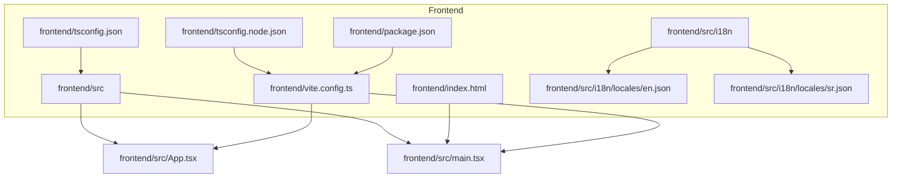
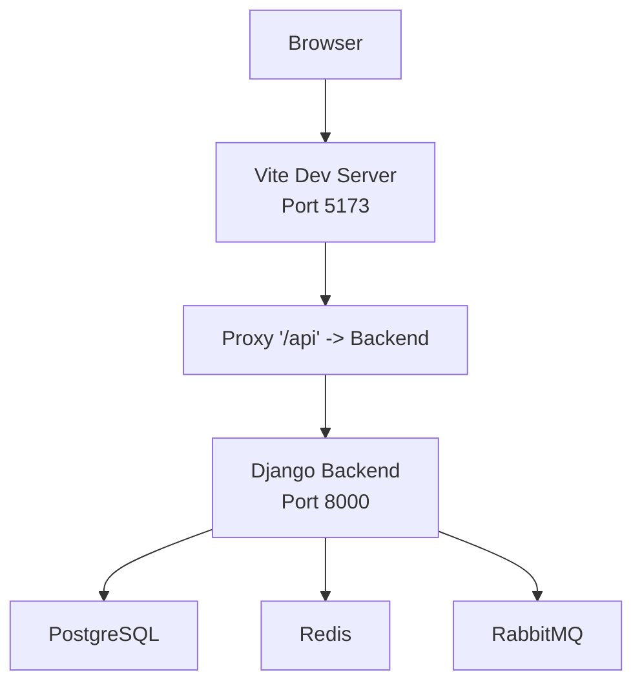
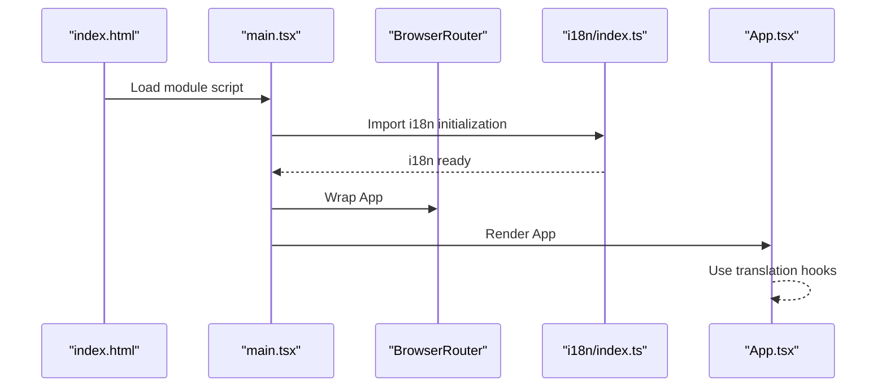
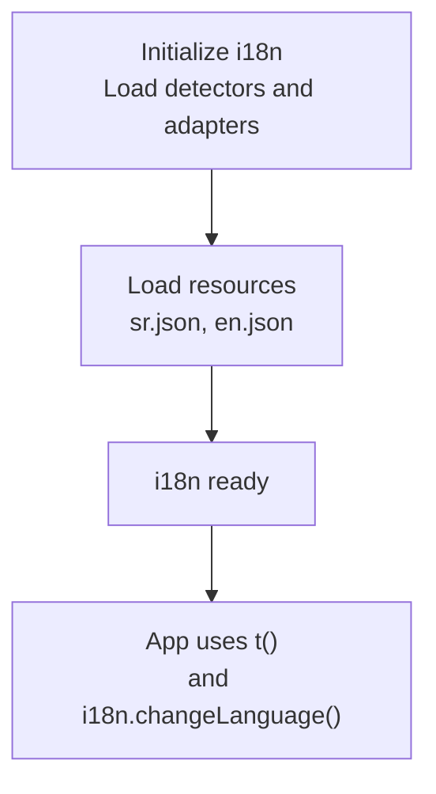
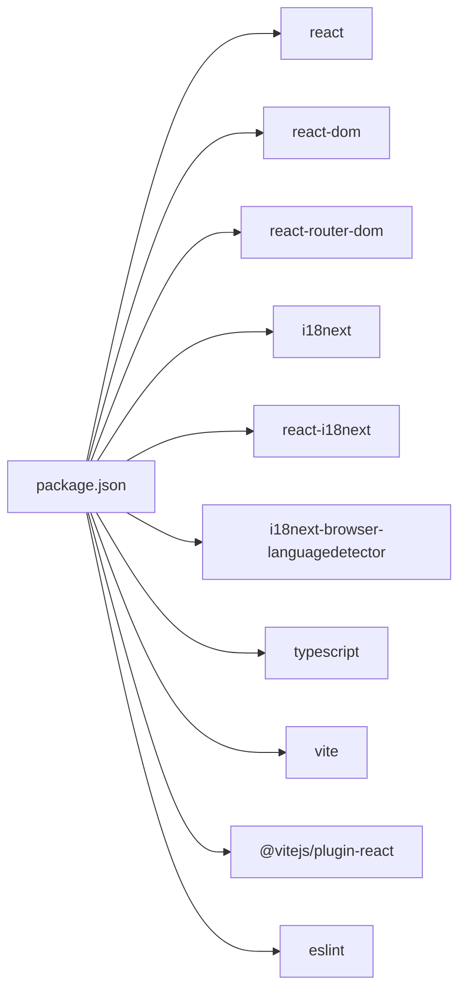

# Application Architecture

<cite>
**Referenced Files in This Document**
- [main.tsx](file://frontend/src/main.tsx)
- [App.tsx](file://frontend/src/App.tsx)
- [vite.config.ts](file://frontend/vite.config.ts)
- [tsconfig.json](file://frontend/tsconfig.json)
- [tsconfig.node.json](file://frontend/tsconfig.node.json)
- [package.json](file://frontend/package.json)
- [index.html](file://frontend/index.html)
- [i18n/index.ts](file://frontend/src/i18n/index.ts)
- [i18n/locales/en.json](file://frontend/src/i18n/locales/en.json)
- [i18n/locales/sr.json](file://frontend/src/i18n/locales/sr.json)
- [vite-env.d.ts](file://frontend/src/vite-env.d.ts)
- [docker-compose.yml](file://docker-compose.yml)
- [backend config/base.py](file://backend/config/settings/base.py)
</cite>

## Table of Contents
1. [Introduction](#introduction)
2. [Project Structure](#project-structure)
3. [Core Components](#core-components)
4. [Architecture Overview](#architecture-overview)
5. [Detailed Component Analysis](#detailed-component-analysis)
6. [Dependency Analysis](#dependency-analysis)
7. [Performance Considerations](#performance-considerations)
8. [Troubleshooting Guide](#troubleshooting-guide)
9. [Conclusion](#conclusion)
10. [Appendices](#appendices)

## Introduction
This document describes the React application architecture for the PlantOps frontend. It explains the TypeScript configuration, Vite build system setup, and the application entry point structure. It documents the component hierarchy starting from the root entry, the bootstrapping process, provider setup, development server configuration, build optimization settings, asset handling, internationalization integration, and environment variable handling. It also outlines how the architecture supports a modular structure and provides guidance for component composition patterns.

## Project Structure
The frontend is organized under the frontend directory with the following key areas:
- Source code: frontend/src
- Build and tooling: frontend/vite.config.ts, frontend/tsconfig.json, frontend/tsconfig.node.json, frontend/package.json
- Public assets and entry HTML: frontend/index.html, frontend/src/vite-env.d.ts
- Internationalization: frontend/src/i18n and locale JSON files
- Docker orchestration: docker-compose.yml coordinates frontend, backend, databases, and proxies

**Diagram sources**
- [main.tsx:1-15](file://frontend/src/main.tsx#L1-L15)
- [App.tsx:1-20](file://frontend/src/App.tsx#L1-L20)
- [vite.config.ts:1-27](file://frontend/vite.config.ts#L1-L27)
- [tsconfig.json:1-26](file://frontend/tsconfig.json#L1-L26)
- [tsconfig.node.json:1-11](file://frontend/tsconfig.node.json#L1-L11)
- [package.json:1-33](file://frontend/package.json#L1-L33)
- [index.html:1-14](file://frontend/index.html#L1-L14)
- [i18n/index.ts:1-23](file://frontend/src/i18n/index.ts#L1-L23)
- [i18n/locales/en.json:1-7](file://frontend/src/i18n/locales/en.json#L1-L7)
- [i18n/locales/sr.json:1-7](file://frontend/src/i18n/locales/sr.json#L1-L7)

**Section sources**
- [main.tsx:1-15](file://frontend/src/main.tsx#L1-L15)
- [App.tsx:1-20](file://frontend/src/App.tsx#L1-L20)
- [vite.config.ts:1-27](file://frontend/vite.config.ts#L1-L27)
- [tsconfig.json:1-26](file://frontend/tsconfig.json#L1-L26)
- [tsconfig.node.json:1-11](file://frontend/tsconfig.node.json#L1-L11)
- [package.json:1-33](file://frontend/package.json#L1-L33)
- [index.html:1-14](file://frontend/index.html#L1-L14)
- [i18n/index.ts:1-23](file://frontend/src/i18n/index.ts#L1-L23)
- [i18n/locales/en.json:1-7](file://frontend/src/i18n/locales/en.json#L1-L7)
- [i18n/locales/sr.json:1-7](file://frontend/src/i18n/locales/sr.json#L1-L7)

## Core Components
- Application entry point: Initializes React, routing, and providers, then renders the root component.
- Root component: Provides localized content and language switching controls.
- Internationalization: Configured via i18next with language detection and JSON resources.
- Build system: Vite with React plugin, path aliases, dev server, proxy, and build outputs.
- TypeScript configuration: Dual tsconfig files for app and node/Vite, strict compiler options, and path mapping.

Key responsibilities:
- main.tsx: Creates the DOM root, wraps the app in StrictMode and Router, imports i18n initialization, and mounts App.
- App.tsx: Uses react-i18next hooks to render translated content and switch languages.
- vite.config.ts: Defines plugins, path aliases, dev server port and host, proxy for API, and build output directory with optional sourcemaps.
- tsconfig.json: Sets modern ECMAScript targets, JSX transform, strictness, unused checks, and path aliases.
- tsconfig.node.json: Enables bundler module resolution for Vite config.
- package.json: Declares scripts for dev/build/lint/preview and lists runtime and dev dependencies.

**Section sources**
- [main.tsx:1-15](file://frontend/src/main.tsx#L1-L15)
- [App.tsx:1-20](file://frontend/src/App.tsx#L1-L20)
- [i18n/index.ts:1-23](file://frontend/src/i18n/index.ts#L1-L23)
- [vite.config.ts:1-27](file://frontend/vite.config.ts#L1-L27)
- [tsconfig.json:1-26](file://frontend/tsconfig.json#L1-L26)
- [tsconfig.node.json:1-11](file://frontend/tsconfig.node.json#L1-L11)
- [package.json:1-33](file://frontend/package.json#L1-L33)

## Architecture Overview
The application follows a thin client architecture:
- The frontend runs as a standalone SPA served by Vite’s dev server during development.
- Production builds emit static assets to dist.
- API requests are proxied to the backend service configured in the dev server.
- Internationalization is initialized early and integrated with React components.
- Routing is provided by react-router-dom.

**Diagram sources**
- [vite.config.ts:12-21](file://frontend/vite.config.ts#L12-L21)
- [docker-compose.yml:74-103](file://docker-compose.yml#L74-L103)
- [backend config/base.py:155-164](file://backend/config/settings/base.py#L155-L164)

**Section sources**
- [vite.config.ts:12-21](file://frontend/vite.config.ts#L12-L21)
- [docker-compose.yml:74-103](file://docker-compose.yml#L74-L103)
- [backend config/base.py:155-164](file://backend/config/settings/base.py#L155-L164)

## Detailed Component Analysis

### Entry Point and Bootstrapping
The bootstrapping process:
- index.html defines the root element and loads the module script.
- main.tsx creates the React root, enables StrictMode, wraps the app in BrowserRouter, imports i18n initialization, and renders App.
- App.tsx uses react-i18next to render localized strings and exposes language toggle buttons.

**Diagram sources**
- [index.html:9-12](file://frontend/index.html#L9-L12)
- [main.tsx:1-15](file://frontend/src/main.tsx#L1-L15)
- [i18n/index.ts:1-23](file://frontend/src/i18n/index.ts#L1-L23)
- [App.tsx:1-20](file://frontend/src/App.tsx#L1-L20)

**Section sources**
- [index.html:9-12](file://frontend/index.html#L9-L12)
- [main.tsx:1-15](file://frontend/src/main.tsx#L1-L15)
- [i18n/index.ts:1-23](file://frontend/src/i18n/index.ts#L1-L23)
- [App.tsx:1-20](file://frontend/src/App.tsx#L1-L20)

### Internationalization Setup
The i18n pipeline:
- i18n/index.ts initializes i18next with language detector and react-i18next.
- Resources are loaded from JSON files for Serbian and English.
- App.tsx consumes the translation hook to render localized strings and toggles languages.

**Diagram sources**
- [i18n/index.ts:1-23](file://frontend/src/i18n/index.ts#L1-L23)
- [i18n/locales/en.json:1-7](file://frontend/src/i18n/locales/en.json#L1-L7)
- [i18n/locales/sr.json:1-7](file://frontend/src/i18n/locales/sr.json#L1-L7)
- [App.tsx:1-20](file://frontend/src/App.tsx#L1-L20)

**Section sources**
- [i18n/index.ts:1-23](file://frontend/src/i18n/index.ts#L1-L23)
- [i18n/locales/en.json:1-7](file://frontend/src/i18n/locales/en.json#L1-L7)
- [i18n/locales/sr.json:1-7](file://frontend/src/i18n/locales/sr.json#L1-L7)
- [App.tsx:1-20](file://frontend/src/App.tsx#L1-L20)

### TypeScript Configuration
Compiler and module resolution:
- tsconfig.json sets ECMAScript target and library, JSX transform, strict mode, unused checks, and path aliases mapped to @/*.
- tsconfig.node.json enables bundler module resolution for Vite config and includes vite.config.ts.
- vite-env.d.ts declares Vite client types for environment variables and asset imports.

Path aliases and compiler options:
- baseUrl and paths enable @/* mapping to src/.
- moduleResolution set to bundler for compatibility with Vite and modern tooling.
- skipLibCheck and isolatedModules improve build performance and reliability.

**Section sources**
- [tsconfig.json:1-26](file://frontend/tsconfig.json#L1-L26)
- [tsconfig.node.json:1-11](file://frontend/tsconfig.node.json#L1-L11)
- [vite-env.d.ts:1-2](file://frontend/src/vite-env.d.ts#L1-L2)

### Vite Build System and Development Server
Build and dev server configuration:
- Plugins: React plugin enabled.
- Aliases: @ resolves to src/.
- Dev server: Port 5173, host enabled, proxy for /api to backend base URL with environment override.
- Build: Output directory dist, optional sourcemaps enabled.

Scripts and dependencies:
- package.json scripts: dev, build, lint, preview.
- Dependencies include React, React DOM, react-router-dom, and i18n libraries.

Environment variable handling:
- VITE_API_BASE_URL controls the API proxy target.
- The backend base URL defaults to localhost:8000 if the environment variable is not set.

**Section sources**
- [vite.config.ts:1-27](file://frontend/vite.config.ts#L1-L27)
- [package.json:1-33](file://frontend/package.json#L1-L33)

### Asset Handling and Global Styles
- index.html defines the root div and the module script entry.
- Assets referenced in index.html (e.g., favicon) are served by Vite in dev and included in dist in production.
- Global font and spacing are applied inline in App.tsx; no separate global stylesheet is present in the current structure.

**Section sources**
- [index.html:1-14](file://frontend/index.html#L1-L14)
- [App.tsx:6-16](file://frontend/src/App.tsx#L6-L16)

### Component Composition Patterns
- Provider pattern: i18n is initialized at the root before rendering App.
- Routing pattern: BrowserRouter wraps the root component to enable navigation.
- Composition pattern: App composes translated content and language controls using react-i18next hooks.

**Section sources**
- [main.tsx:5-14](file://frontend/src/main.tsx#L5-L14)
- [App.tsx:1-20](file://frontend/src/App.tsx#L1-L20)
- [i18n/index.ts:1-23](file://frontend/src/i18n/index.ts#L1-L23)

## Dependency Analysis
Runtime and build-time dependencies:
- Runtime dependencies include React, React DOM, react-router-dom, i18next, react-i18next, and i18next-browser-languagedetector.
- Build-time dependencies include TypeScript, Vite, @vitejs/plugin-react, ESLint, and related plugins.

**Diagram sources**
- [package.json:12-31](file://frontend/package.json#L12-L31)

**Section sources**
- [package.json:12-31](file://frontend/package.json#L12-L31)

## Performance Considerations
- Sourcemaps: Enabled in build configuration for easier debugging; disable in production for smaller bundles.
- Module resolution: Bundler module resolution reduces overhead and improves compatibility.
- Strict mode: Enabled in development to surface potential issues early.
- Proxy configuration: Keeps development traffic centralized and avoids CORS complications during local development.

[No sources needed since this section provides general guidance]

## Troubleshooting Guide
Common issues and resolutions:
- API proxy failures: Verify VITE_API_BASE_URL and backend availability on the expected port.
- Language switching not working: Confirm i18n resource loading and keys match the expected structure.
- Build errors: Ensure TypeScript and Vite versions align with project dependencies; check path aliases and module resolution.
- Dev server not accessible: Confirm host and port settings and firewall rules.

**Section sources**
- [vite.config.ts:12-21](file://frontend/vite.config.ts#L12-L21)
- [i18n/index.ts:11-20](file://frontend/src/i18n/index.ts#L11-L20)
- [package.json:12-31](file://frontend/package.json#L12-L31)

## Conclusion
The frontend architecture is a modern React application built with TypeScript and Vite. It emphasizes early provider initialization (i18n), clean routing setup, and a straightforward build pipeline with sensible defaults. The modular structure is supported by path aliases and a clear separation of concerns between the entry point, root component, and internationalization. The development server and proxy simplify local iteration against the backend, while the TypeScript configuration ensures strong typing and maintainability.

[No sources needed since this section summarizes without analyzing specific files]

## Appendices

### Appendix A: Environment Variables
- VITE_API_BASE_URL: Controls the API proxy target in development.

**Section sources**
- [vite.config.ts:15-19](file://frontend/vite.config.ts#L15-L19)

### Appendix B: Backend Integration Notes
- Backend database and services are orchestrated via docker-compose; the frontend proxies API calls to the backend service.
- Backend settings define multi-tenancy, CORS, and internationalization defaults that complement the frontend’s i18n setup.

**Section sources**
- [docker-compose.yml:74-103](file://docker-compose.yml#L74-L103)
- [backend config/base.py:187-201](file://backend/config/settings/base.py#L187-L201)