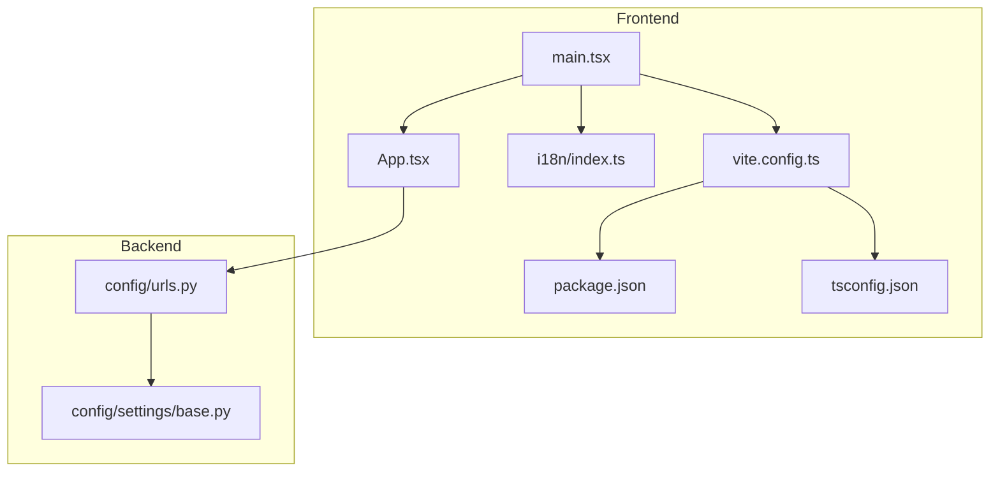
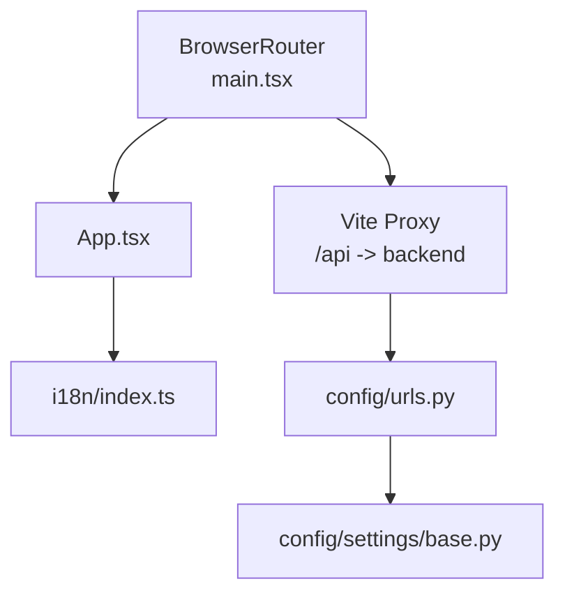
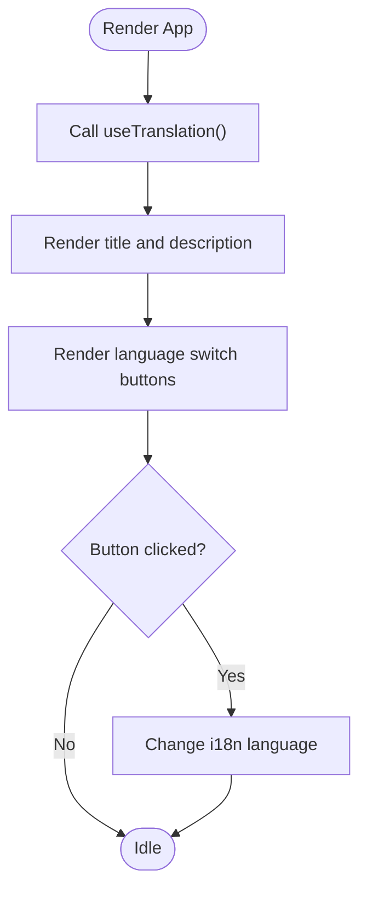
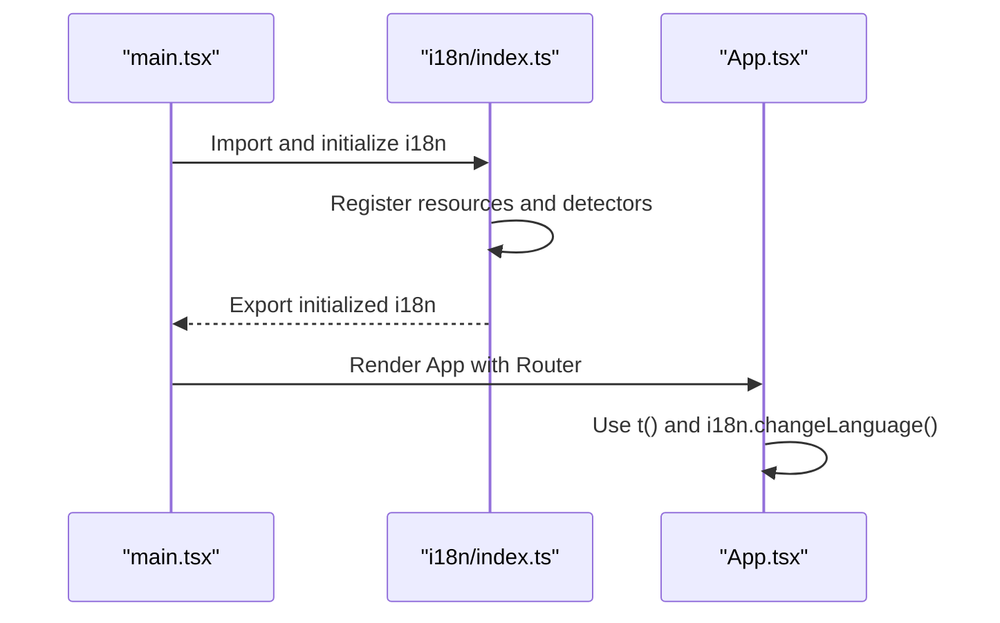
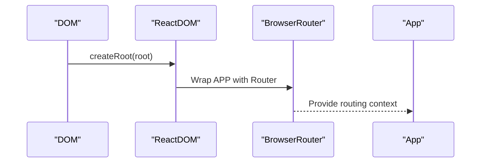
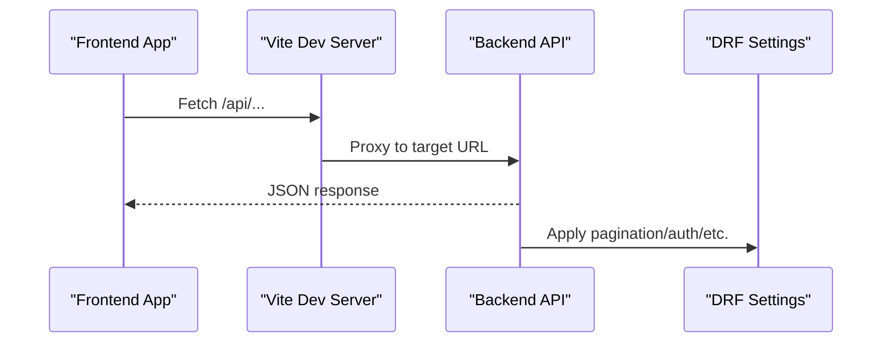
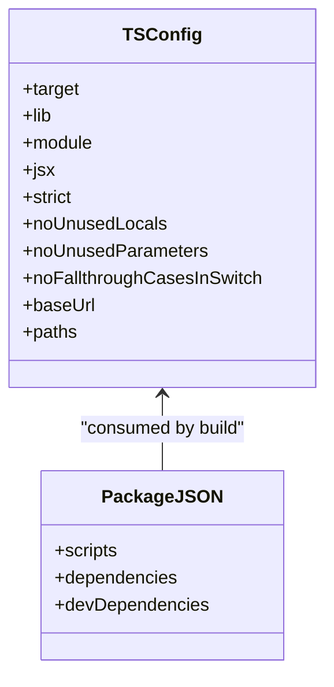
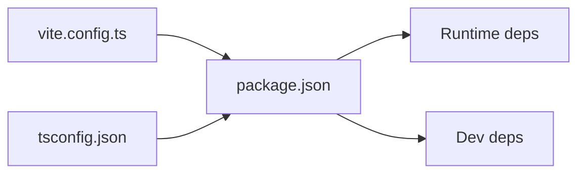

# Component Development

<cite>
**Referenced Files in This Document**
- [App.tsx](file://frontend/src/App.tsx)
- [main.tsx](file://frontend/src/main.tsx)
- [index.ts](file://frontend/src/i18n/index.ts)
- [package.json](file://frontend/package.json)
- [tsconfig.json](file://frontend/tsconfig.json)
- [vite.config.ts](file://frontend/vite.config.ts)
- [urls.py](file://backend/config/urls.py)
- [base.py](file://backend/config/settings/base.py)
- [README.md](file://README.md)
</cite>

## Table of Contents
1. [Introduction](#introduction)
2. [Project Structure](#project-structure)
3. [Core Components](#core-components)
4. [Architecture Overview](#architecture-overview)
5. [Detailed Component Analysis](#detailed-component-analysis)
6. [Dependency Analysis](#dependency-analysis)
7. [Performance Considerations](#performance-considerations)
8. [Troubleshooting Guide](#troubleshooting-guide)
9. [Conclusion](#conclusion)
10. [Appendices](#appendices)

## Introduction
This document consolidates React component development patterns and best practices for the project’s frontend. It focuses on component composition strategies, prop interfaces, and TypeScript integration; state management approaches, event handling patterns, and lifecycle management; styling approaches, CSS-in-JS patterns, and responsive design; reusable components, form handling, data visualization, and real-time data display; testing strategies, accessibility, and performance optimization; development workflow, debugging, and backend API integration. The frontend currently includes a minimal bootstrapped application with routing and internationalization, and the backend exposes a REST API documented via OpenAPI.

## Project Structure
The frontend is organized around a small set of entry and configuration files:
- Application entry renders a single page with routing and internationalization.
- Internationalization is configured with i18next and language detection.
- Build and dev tooling are provided by Vite with React plugin and TypeScript support.
- The backend exposes API endpoints under /api/ and Swagger/OpenAPI documentation.

**Diagram sources**
- [main.tsx:1-15](file://frontend/src/main.tsx#L1-L15)
- [App.tsx:1-20](file://frontend/src/App.tsx#L1-L20)
- [index.ts:1-23](file://frontend/src/i18n/index.ts#L1-L23)
- [vite.config.ts:1-27](file://frontend/vite.config.ts#L1-L27)
- [package.json:1-33](file://frontend/package.json#L1-L33)
- [tsconfig.json:1-26](file://frontend/tsconfig.json#L1-L26)
- [urls.py:1-49](file://backend/config/urls.py#L1-L49)
- [base.py:1-336](file://backend/config/settings/base.py#L1-L336)

**Section sources**
- [README.md:131-176](file://README.md#L131-L176)
- [main.tsx:1-15](file://frontend/src/main.tsx#L1-L15)
- [App.tsx:1-20](file://frontend/src/App.tsx#L1-L20)
- [index.ts:1-23](file://frontend/src/i18n/index.ts#L1-L23)
- [vite.config.ts:1-27](file://frontend/vite.config.ts#L1-L27)
- [package.json:1-33](file://frontend/package.json#L1-L33)
- [tsconfig.json:1-26](file://frontend/tsconfig.json#L1-L26)
- [urls.py:1-49](file://backend/config/urls.py#L1-L49)
- [base.py:1-336](file://backend/config/settings/base.py#L1-L336)

## Core Components
- Application shell and routing: The application initializes routing and renders the root component.
- Root component: Demonstrates translation usage and language switching.
- Internationalization: Configured with i18next, language detection, and resource bundles.
- Build and toolchain: Vite with React plugin, TypeScript strict mode, path aliases, and proxy configuration for API traffic.

Key implementation references:
- Routing and root render: [main.tsx:8-14](file://frontend/src/main.tsx#L8-L14)
- Root component rendering and translation usage: [App.tsx:3-16](file://frontend/src/App.tsx#L3-L16)
- i18n initialization and resources: [index.ts:8-20](file://frontend/src/i18n/index.ts#L8-L20)
- Vite server proxy for API: [vite.config.ts:15-20](file://frontend/vite.config.ts#L15-L20)
- TypeScript strictness and JSX: [tsconfig.json:14-18](file://frontend/tsconfig.json#L14-L18)
- Package scripts and dependencies: [package.json:6-19](file://frontend/package.json#L6-L19)

**Section sources**
- [main.tsx:1-15](file://frontend/src/main.tsx#L1-L15)
- [App.tsx:1-20](file://frontend/src/App.tsx#L1-L20)
- [index.ts:1-23](file://frontend/src/i18n/index.ts#L1-L23)
- [vite.config.ts:1-27](file://frontend/vite.config.ts#L1-L27)
- [package.json:1-33](file://frontend/package.json#L1-L33)
- [tsconfig.json:1-26](file://frontend/tsconfig.json#L1-L26)

## Architecture Overview
The frontend integrates routing, i18n, and a proxy to the backend API. The backend exposes OpenAPI documentation and a set of API endpoints under /api/.

**Diagram sources**
- [App.tsx:1-20](file://frontend/src/App.tsx#L1-L20)
- [main.tsx:3-14](file://frontend/src/main.tsx#L3-L14)
- [index.ts:1-23](file://frontend/src/i18n/index.ts#L1-L23)
- [vite.config.ts:15-20](file://frontend/vite.config.ts#L15-L20)
- [urls.py:12-38](file://backend/config/urls.py#L12-L38)
- [base.py:234-250](file://backend/config/settings/base.py#L234-L250)

**Section sources**
- [urls.py:1-49](file://backend/config/urls.py#L1-L49)
- [base.py:234-250](file://backend/config/settings/base.py#L234-L250)
- [vite.config.ts:15-20](file://frontend/vite.config.ts#L15-L20)
- [main.tsx:3-14](file://frontend/src/main.tsx#L3-L14)
- [App.tsx:1-20](file://frontend/src/App.tsx#L1-L20)

## Detailed Component Analysis

### Root Component and Composition Patterns
- Composition: The root component composes translation usage and language switching actions. It demonstrates functional component composition with hooks and inline styles.
- Props and interfaces: The component does not accept props; state is internal to the component.
- Event handling: Uses inline event handlers for language switching.
- Lifecycle: No explicit lifecycle hooks; relies on React re-render on state changes from hooks.

**Diagram sources**
- [App.tsx:3-16](file://frontend/src/App.tsx#L3-L16)
- [index.ts:8-20](file://frontend/src/i18n/index.ts#L8-L20)

**Section sources**
- [App.tsx:1-20](file://frontend/src/App.tsx#L1-L20)
- [index.ts:1-23](file://frontend/src/i18n/index.ts#L1-L23)

### Internationalization Integration
- Library usage: i18next with react-i18next and language detection.
- Resources: Two language bundles are registered.
- Fallback and interpolation: Fallback language and interpolation configuration are set.

**Diagram sources**
- [main.tsx:5-6](file://frontend/src/main.tsx#L5-L6)
- [index.ts:8-20](file://frontend/src/i18n/index.ts#L8-L20)
- [App.tsx:3-16](file://frontend/src/App.tsx#L3-L16)

**Section sources**
- [index.ts:1-23](file://frontend/src/i18n/index.ts#L1-L23)
- [main.tsx:1-15](file://frontend/src/main.tsx#L1-L15)
- [App.tsx:1-20](file://frontend/src/App.tsx#L1-L20)

### Routing and Navigation
- Router: The application wraps the root component with a router provider.
- Navigation: The current component does not render navigation links; routing is available for future pages.

**Diagram sources**
- [main.tsx:8-14](file://frontend/src/main.tsx#L8-L14)

**Section sources**
- [main.tsx:1-15](file://frontend/src/main.tsx#L1-L15)

### API Integration and Proxy Configuration
- Proxy: Vite proxies /api requests to the backend API base URL.
- Backend endpoints: The backend defines API schema and documentation endpoints under /api/.
- REST framework defaults: Pagination, authentication, permissions, and renderer configuration are set.

**Diagram sources**
- [vite.config.ts:15-20](file://frontend/vite.config.ts#L15-L20)
- [urls.py:21-23](file://backend/config/urls.py#L21-L23)
- [base.py:234-250](file://backend/config/settings/base.py#L234-L250)

**Section sources**
- [vite.config.ts:1-27](file://frontend/vite.config.ts#L1-L27)
- [urls.py:1-49](file://backend/config/urls.py#L1-L49)
- [base.py:234-250](file://backend/config/settings/base.py#L234-L250)

### TypeScript Integration and Strict Mode
- Strict compiler options: Enabled unused checks, fallthrough switches, and JSX configuration.
- Path aliases: Resolved via tsconfig path mapping.
- Type safety: Recommended to define props interfaces for components and type API responses.

**Diagram sources**
- [tsconfig.json:2-21](file://frontend/tsconfig.json#L2-L21)
- [package.json:6-31](file://frontend/package.json#L6-L31)

**Section sources**
- [tsconfig.json:1-26](file://frontend/tsconfig.json#L1-L26)
- [package.json:1-33](file://frontend/package.json#L1-L33)

## Dependency Analysis
- Runtime dependencies: React, React DOM, react-router-dom, i18next, react-i18next, i18next-browser-languagedetector.
- Dev dependencies: TypeScript, ESLint with React hooks and refresh plugins, Vite, and React plugin.
- Toolchain coupling: Vite resolves aliases and proxies API requests; TypeScript enforces strictness.

**Diagram sources**
- [package.json:12-31](file://frontend/package.json#L12-L31)
- [vite.config.ts:1-27](file://frontend/vite.config.ts#L1-L27)
- [tsconfig.json:1-26](file://frontend/tsconfig.json#L1-L26)

**Section sources**
- [package.json:1-33](file://frontend/package.json#L1-L33)
- [vite.config.ts:1-27](file://frontend/vite.config.ts#L1-L27)
- [tsconfig.json:1-26](file://frontend/tsconfig.json#L1-L26)

## Performance Considerations
- Bundle and build: Source maps enabled in build; consider disabling for production.
- Strict mode: React.StrictMode helps surface side effects but can double-invoked effects in development.
- i18n: Keep resource sizes small; lazy-load translations if needed.
- Routing: Keep route components lightweight; code-split routes for larger pages.
- API calls: Debounce or throttle frequent requests; cache appropriately.

[No sources needed since this section provides general guidance]

## Troubleshooting Guide
- Language switching not working:
  - Verify i18n initialization and resources registration.
  - Confirm language keys match translation files.
  - References: [index.ts:8-20](file://frontend/src/i18n/index.ts#L8-L20), [App.tsx:11-14](file://frontend/src/App.tsx#L11-L14)
- API proxy errors:
  - Check Vite proxy target and origin settings.
  - Ensure backend is reachable at the configured URL.
  - References: [vite.config.ts:15-20](file://frontend/vite.config.ts#L15-L20), [urls.py:12-38](file://backend/config/urls.py#L12-L38)
- TypeScript errors:
  - Enable strict mode checks and fix unused locals/parameters.
  - References: [tsconfig.json:14-18](file://frontend/tsconfig.json#L14-L18)
- Build failures:
  - Validate Vite and TypeScript configurations; confirm plugin availability.
  - References: [vite.config.ts:5-6](file://frontend/vite.config.ts#L5-L6), [package.json:25-30](file://frontend/package.json#L25-L30)

**Section sources**
- [index.ts:1-23](file://frontend/src/i18n/index.ts#L1-L23)
- [App.tsx:1-20](file://frontend/src/App.tsx#L1-L20)
- [vite.config.ts:1-27](file://frontend/vite.config.ts#L1-L27)
- [urls.py:1-49](file://backend/config/urls.py#L1-L49)
- [tsconfig.json:1-26](file://frontend/tsconfig.json#L1-L26)
- [package.json:1-33](file://frontend/package.json#L1-L33)

## Conclusion
The frontend provides a minimal yet robust foundation for React component development with routing, internationalization, and a development proxy to the backend API. By adopting strict TypeScript configuration, modular component composition, and disciplined state/event patterns, teams can scale toward reusable components, form handling, data visualization, and real-time displays. Backend integration leverages OpenAPI documentation and DRF defaults, enabling clear API contracts and predictable behavior.

[No sources needed since this section summarizes without analyzing specific files]

## Appendices

### API Contract Overview
- Schema and documentation endpoints are exposed under /api/ with OpenAPI/Swagger and ReDoc.
- DRF defaults include session authentication, pagination, and JSON renderer.

**Section sources**
- [urls.py:21-23](file://backend/config/urls.py#L21-L23)
- [base.py:234-250](file://backend/config/settings/base.py#L234-L250)

### Development Workflow Checklist
- Start dev server and verify proxy to backend.
- Add new components with TypeScript interfaces and minimal styles.
- Integrate routing and lazy-load heavy routes.
- Add unit tests and snapshot tests for UI stability.
- Lint with ESLint and TypeScript strictness enabled.

**Section sources**
- [vite.config.ts:12-20](file://frontend/vite.config.ts#L12-L20)
- [package.json:9-10](file://frontend/package.json#L9-L10)
- [tsconfig.json:14-18](file://frontend/tsconfig.json#L14-L18)