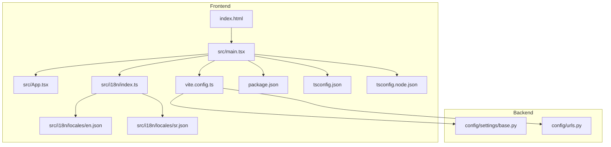
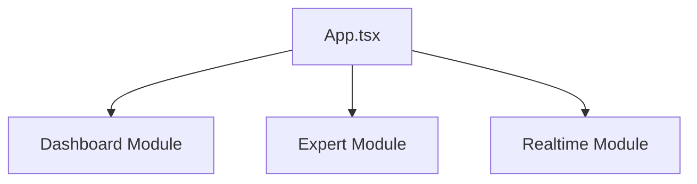
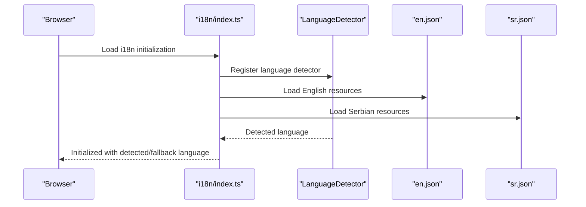
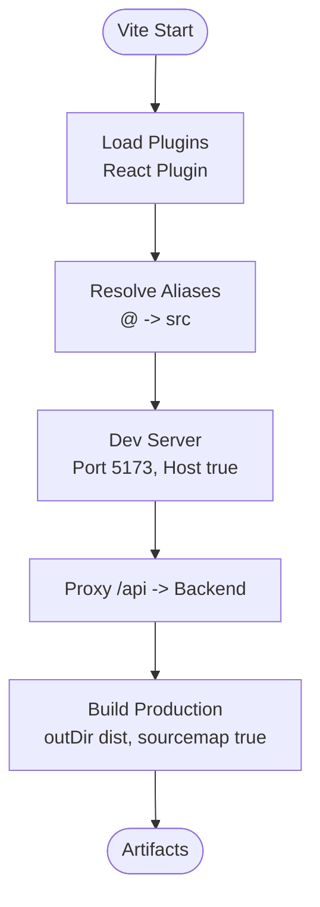
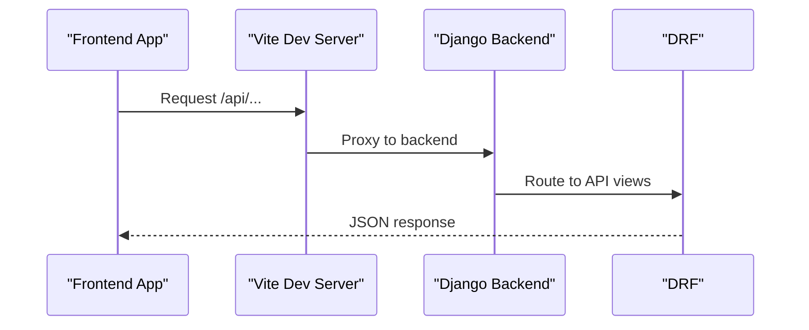
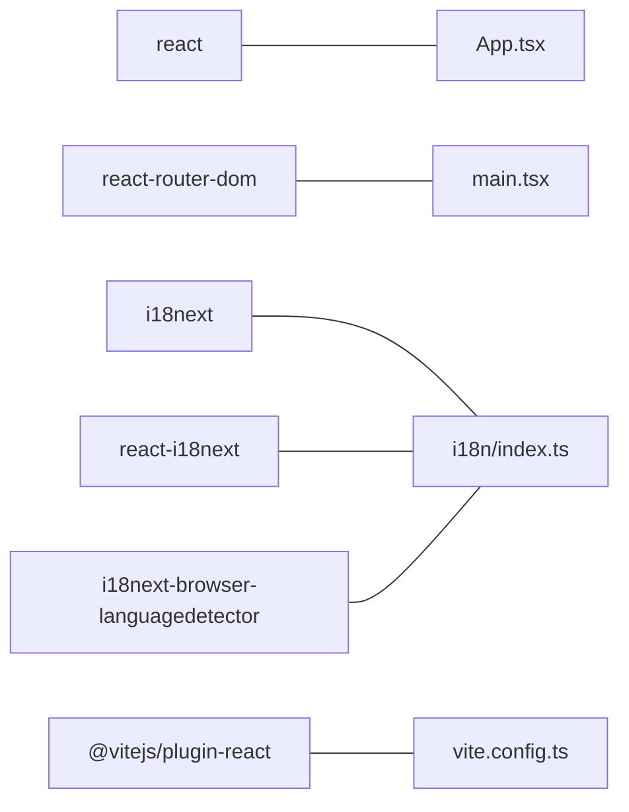

# Frontend Application

<cite>
**Referenced Files in This Document**
- [main.tsx](file://frontend/src/main.tsx)
- [App.tsx](file://frontend/src/App.tsx)
- [vite.config.ts](file://frontend/vite.config.ts)
- [package.json](file://frontend/package.json)
- [tsconfig.json](file://frontend/tsconfig.json)
- [tsconfig.node.json](file://frontend/tsconfig.node.json)
- [index.html](file://frontend/index.html)
- [i18n/index.ts](file://frontend/src/i18n/index.ts)
- [i18n locales en.json](file://frontend/src/i18n/locales/en.json)
- [i18n locales sr.json](file://frontend/src/i18n/locales/sr.json)
- [FRONTEND_BOUNDARIES.md](file://backend/docs/architecture/FRONTEND_BOUNDARIES.md)
- [base.py](file://backend/config/settings/base.py)
- [urls.py](file://backend/config/urls.py)
</cite>

## Table of Contents
1. [Introduction](#introduction)
2. [Project Structure](#project-structure)
3. [Core Components](#core-components)
4. [Architecture Overview](#architecture-overview)
5. [Detailed Component Analysis](#detailed-component-analysis)
6. [Dependency Analysis](#dependency-analysis)
7. [Performance Considerations](#performance-considerations)
8. [Troubleshooting Guide](#troubleshooting-guide)
9. [Conclusion](#conclusion)
10. [Appendices](#appendices)

## Introduction
This document describes the React-based frontend application architecture for the PlantOps project. It covers the modular structure with dashboard, expert analytics, and realtime data modules, the TypeScript configuration, component hierarchy, state management patterns, internationalization with i18next, Vite build configuration, asset management, development workflow, component composition, prop interfaces, event handling, responsive design principles, accessibility compliance, cross-browser compatibility, data visualization patterns, real-time chart implementations, backend API integration, authentication flows, and error handling strategies.

## Project Structure
The frontend is organized around a clear separation of concerns:
- Entry point initializes routing, i18n, and renders the root App component.
- Internationalization is configured with i18next and supports English and Serbian.
- Vite handles development server, proxying, and production builds.
- TypeScript configuration enables strict mode and path aliases.
- The backend defines frontend boundaries and API schema endpoints.

**Diagram sources**
- [index.html:1-13](file://frontend/index.html#L1-L13)
- [main.tsx:1-15](file://frontend/src/main.tsx#L1-L15)
- [App.tsx:1-20](file://frontend/src/App.tsx#L1-L20)
- [i18n/index.ts:1-23](file://frontend/src/i18n/index.ts#L1-L23)
- [i18n locales en.json:1-7](file://frontend/src/i18n/locales/en.json#L1-L7)
- [i18n locales sr.json:1-7](file://frontend/src/i18n/locales/sr.json#L1-L7)
- [vite.config.ts:1-27](file://frontend/vite.config.ts#L1-L27)
- [package.json:1-33](file://frontend/package.json#L1-L33)
- [tsconfig.json:1-26](file://frontend/tsconfig.json#L1-L26)
- [tsconfig.node.json](file://frontend/tsconfig.node.json)
- [base.py:1-336](file://backend/config/settings/base.py#L1-L336)
- [urls.py:1-49](file://backend/config/urls.py#L1-L49)

**Section sources**
- [FRONTEND_BOUNDARIES.md:1-51](file://backend/docs/architecture/FRONTEND_BOUNDARIES.md#L1-L51)
- [index.html:1-13](file://frontend/index.html#L1-L13)
- [main.tsx:1-15](file://frontend/src/main.tsx#L1-L15)
- [vite.config.ts:1-27](file://frontend/vite.config.ts#L1-L27)
- [package.json:1-33](file://frontend/package.json#L1-L33)
- [tsconfig.json:1-26](file://frontend/tsconfig.json#L1-L26)

## Core Components
- Root entry initializes React, routing, and i18n before rendering the App component.
- App component demonstrates i18n usage and language switching controls.
- Internationalization setup loads Serbian and English resources, detects browser language, and sets a fallback.

Key responsibilities:
- Routing: BrowserRouter wraps the App for SPA navigation.
- i18n: Language detection and resource loading for English and Serbian.
- Strict Mode: Ensures React component safety checks during development.

**Section sources**
- [main.tsx:1-15](file://frontend/src/main.tsx#L1-L15)
- [App.tsx:1-20](file://frontend/src/App.tsx#L1-L20)
- [i18n/index.ts:1-23](file://frontend/src/i18n/index.ts#L1-L23)
- [i18n locales en.json:1-7](file://frontend/src/i18n/locales/en.json#L1-L7)
- [i18n locales sr.json:1-7](file://frontend/src/i18n/locales/sr.json#L1-L7)

## Architecture Overview
The frontend follows a modular React architecture with three primary modules:
- Dashboard: Overview, KPIs, and charts.
- Expert Analytics: Advanced analytics and data exploration.
- Realtime: Live sensor data and WebSocket feeds.

These modules align with the documented frontend boundaries and are intended to leverage React’s capabilities for interactive dashboards and visualizations.

**Diagram sources**
- [FRONTEND_BOUNDARIES.md:48-51](file://backend/docs/architecture/FRONTEND_BOUNDARIES.md#L48-L51)
- [App.tsx:1-20](file://frontend/src/App.tsx#L1-L20)

**Section sources**
- [FRONTEND_BOUNDARIES.md:1-51](file://backend/docs/architecture/FRONTEND_BOUNDARIES.md#L1-L51)

## Detailed Component Analysis

### Internationalization System (i18next)
The i18n system is initialized with:
- Language detector for automatic browser language selection.
- Resources for English and Serbian translations.
- Fallback language set to Serbian.
- Interpolation configured to avoid escaping values.

**Diagram sources**
- [i18n/index.ts:1-23](file://frontend/src/i18n/index.ts#L1-L23)
- [i18n locales en.json:1-7](file://frontend/src/i18n/locales/en.json#L1-L7)
- [i18n locales sr.json:1-7](file://frontend/src/i18n/locales/sr.json#L1-L7)

Implementation highlights:
- Resource loading and fallback configuration.
- Automatic language detection and runtime switching via the App component.

**Section sources**
- [i18n/index.ts:1-23](file://frontend/src/i18n/index.ts#L1-L23)
- [i18n locales en.json:1-7](file://frontend/src/i18n/locales/en.json#L1-L7)
- [i18n locales sr.json:1-7](file://frontend/src/i18n/locales/sr.json#L1-L7)
- [App.tsx:1-20](file://frontend/src/App.tsx#L1-L20)

### Vite Build and Development Workflow
Vite configuration includes:
- React plugin for JSX/TSX transforms.
- Path alias @ pointing to src.
- Dev server with proxy for /api to backend.
- Build output directory and source maps enabled.

**Diagram sources**
- [vite.config.ts:1-27](file://frontend/vite.config.ts#L1-L27)

Development scripts:
- dev: Start Vite dev server.
- build: Run TypeScript compiler then Vite build.
- lint: ESLint TypeScript/TSX files.
- preview: Preview built artifacts locally.

**Section sources**
- [vite.config.ts:1-27](file://frontend/vite.config.ts#L1-L27)
- [package.json:1-33](file://frontend/package.json#L1-L33)

### TypeScript Configuration
TypeScript settings emphasize:
- Modern ECMAScript targets and DOM libraries.
- Strict compilation with unused locals/parameters checks.
- Path aliases for clean imports.
- React JSX transform and bundler module resolution.

**Section sources**
- [tsconfig.json:1-26](file://frontend/tsconfig.json#L1-L26)
- [tsconfig.node.json](file://frontend/tsconfig.node.json)

### Component Composition Patterns and Prop Interfaces
Patterns observed:
- Functional components with hooks for state and effects.
- Minimal prop interfaces for small components.
- Event handlers attached inline for demo purposes; suitable for refactoring to stable callbacks in larger components.

Recommendations:
- Define explicit prop interfaces for reusable components.
- Extract event handlers into stable callbacks using useCallback.
- Use memoization with useMemo for derived data.

[No sources needed since this section provides general guidance]

### Event Handling
The App component demonstrates:
- Inline click handlers to switch languages.
- useTranslation hook for translation retrieval and language switching.

Best practices:
- Prefer stable handler references for performance.
- Centralize event handling logic in parent components when appropriate.

**Section sources**
- [App.tsx:1-20](file://frontend/src/App.tsx#L1-L20)

### Responsive Design Principles
Guidance:
- Use CSS-in-JS or styled-components for theme-driven layouts.
- Implement viewport meta tag and rem/em units for scalable typography.
- Test across device breakpoints and adjust grid/flex layouts accordingly.

[No sources needed since this section provides general guidance]

### Accessibility Compliance
Guidance:
- Ensure semantic HTML and ARIA attributes where needed.
- Provide keyboard navigation and focus management.
- Use sufficient color contrast and alt texts for images.
- Screen reader friendly labels and roles.

[No sources needed since this section provides general guidance]

### Cross-Browser Compatibility
Guidance:
- Target modern browsers; polyfill only if legacy support is required.
- Validate CSS Grid/Flexbox and ES features in supported browsers.
- Use PostCSS or autoprefixer if extending styles.

[No sources needed since this section provides general guidance]

### Data Visualization Patterns
Patterns aligned with the documented frontend boundaries:
- Dashboard: Overview cards and charts.
- Expert Analytics: Advanced analytics and exploratory visualizations.
- Realtime: Live sensor data streams and dynamic charts.

Recommended libraries:
- Recharts or Victory for declarative charts.
- Plotly or Deck.gl for advanced visualizations.
- Maintain separate visualization modules for scalability.

**Section sources**
- [FRONTEND_BOUNDARIES.md:30-51](file://backend/docs/architecture/FRONTEND_BOUNDARIES.md#L30-L51)

### Real-Time Chart Implementations
Patterns:
- WebSocket connections for live data ingestion.
- Periodic updates or subscription-based refresh.
- Chart libraries supporting incremental updates.

Guidance:
- Normalize incoming data streams.
- Debounce frequent updates to prevent UI thrashing.
- Persist chart state and zoom levels across navigations.

[No sources needed since this section provides general guidance]

### Backend API Integration
Integration points:
- Vite proxy routes /api to backend base URL.
- REST framework defaults enforce session authentication and JSON renderers.
- OpenAPI schema endpoints exposed for documentation.

**Diagram sources**
- [vite.config.ts:15-20](file://frontend/vite.config.ts#L15-L20)
- [urls.py:21-23](file://backend/config/urls.py#L21-L23)
- [base.py:234-250](file://backend/config/settings/base.py#L234-L250)

**Section sources**
- [vite.config.ts:1-27](file://frontend/vite.config.ts#L1-L27)
- [urls.py:1-49](file://backend/config/urls.py#L1-L49)
- [base.py:234-250](file://backend/config/settings/base.py#L234-L250)

### Authentication Flows
Backend configuration:
- Session authentication enabled by default.
- IsAuthenticated permission enforced globally.
- CORS configured for credentials and allowed origins.

Frontend considerations:
- Maintain session cookies via backend-originated requests.
- Redirect unauthenticated users to login as per backend policy.
- Centralize API client with interceptors for auth-related errors.

**Section sources**
- [base.py:234-250](file://backend/config/settings/base.py#L234-L250)
- [urls.py:1-49](file://backend/config/urls.py#L1-L49)

### Error Handling Strategies
Guidance:
- Centralized API client with error interceptors.
- Global error boundaries for React components.
- User-friendly error messages and retry mechanisms.
- Logging errors to monitoring systems.

[No sources needed since this section provides general guidance]

## Dependency Analysis
Frontend dependencies include React, React Router, i18next ecosystem, and Vite toolchain. TypeScript and ESLint ensure code quality.

**Diagram sources**
- [package.json:12-30](file://frontend/package.json#L12-L30)
- [main.tsx:1-15](file://frontend/src/main.tsx#L1-L15)
- [App.tsx:1-20](file://frontend/src/App.tsx#L1-L20)
- [i18n/index.ts:1-23](file://frontend/src/i18n/index.ts#L1-L23)
- [vite.config.ts:1-6](file://frontend/vite.config.ts#L1-L6)

**Section sources**
- [package.json:1-33](file://frontend/package.json#L1-L33)

## Performance Considerations
- Enable source maps in development for debugging; disable in production.
- Use React.memo and useMemo for expensive computations.
- Lazy-load non-critical modules and components.
- Optimize chart libraries with virtualization for large datasets.
- Minimize re-renders by avoiding unnecessary prop drilling.

[No sources needed since this section provides general guidance]

## Troubleshooting Guide
Common issues and resolutions:
- Language switching not working: Verify i18n initialization and resource keys.
- Proxy not forwarding API requests: Confirm Vite proxy target and environment variable.
- TypeScript errors: Align tsconfig with project needs and resolve path aliases.
- ESLint warnings: Fix unused variables and adhere to recommended rules.

**Section sources**
- [i18n/index.ts:1-23](file://frontend/src/i18n/index.ts#L1-L23)
- [vite.config.ts:15-20](file://frontend/vite.config.ts#L15-L20)
- [tsconfig.json:1-26](file://frontend/tsconfig.json#L1-L26)
- [package.json:9-9](file://frontend/package.json#L9-L9)

## Conclusion
The frontend establishes a solid foundation for a React-based, i18n-enabled, and TypeScript-powered application. It leverages Vite for efficient development and build workflows, integrates with Django backend APIs, and aligns with documented frontend boundaries for dashboard, expert analytics, and realtime modules. By following the composition patterns, state management recommendations, and best practices outlined here, the application can scale effectively while maintaining responsiveness, accessibility, and cross-browser compatibility.

## Appendices
- Backend internationalization and model translation settings support multiple languages and locale paths.
- Frontend boundaries document module responsibilities and technology choices.

**Section sources**
- [base.py:187-212](file://backend/config/settings/base.py#L187-L212)
- [FRONTEND_BOUNDARIES.md:1-51](file://backend/docs/architecture/FRONTEND_BOUNDARIES.md#L1-L51)