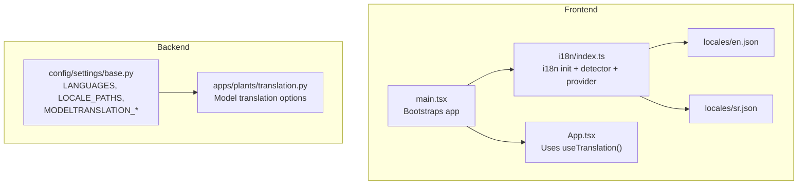
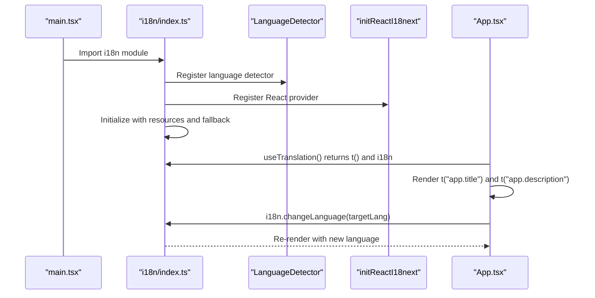
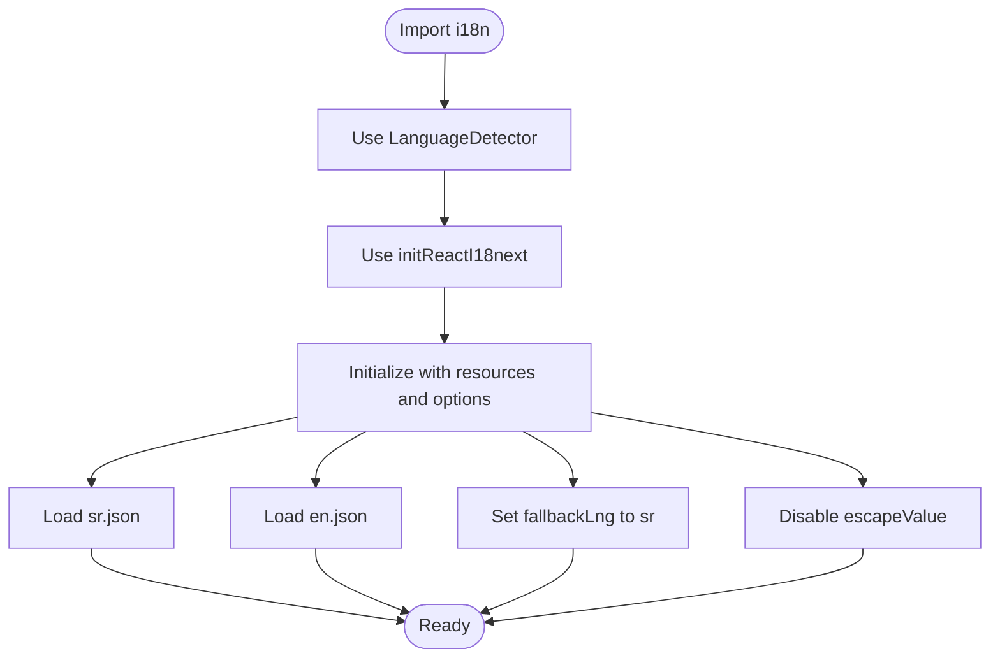
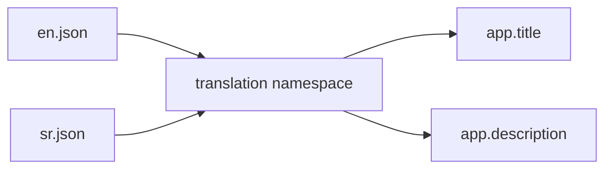
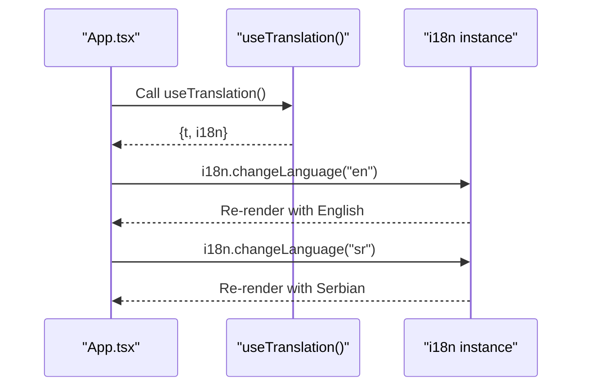
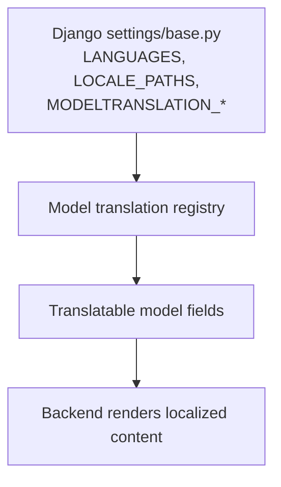
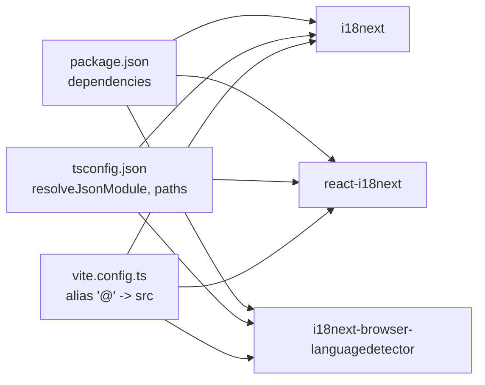

# Internationalization

<cite>
**Referenced Files in This Document**
- [index.ts](file://frontend/src/i18n/index.ts)
- [en.json](file://frontend/src/i18n/locales/en.json)
- [sr.json](file://frontend/src/i18n/locales/sr.json)
- [App.tsx](file://frontend/src/App.tsx)
- [main.tsx](file://frontend/src/main.tsx)
- [package.json](file://frontend/package.json)
- [tsconfig.json](file://frontend/tsconfig.json)
- [vite.config.ts](file://frontend/vite.config.ts)
- [translation.py](file://backend/apps/plants/translation.py)
- [base.py](file://backend/config/settings/base.py)
</cite>

## Table of Contents
1. [Introduction](#introduction)
2. [Project Structure](#project-structure)
3. [Core Components](#core-components)
4. [Architecture Overview](#architecture-overview)
5. [Detailed Component Analysis](#detailed-component-analysis)
6. [Dependency Analysis](#dependency-analysis)
7. [Performance Considerations](#performance-considerations)
8. [Troubleshooting Guide](#troubleshooting-guide)
9. [Conclusion](#conclusion)
10. [Appendices](#appendices)

## Introduction
This document explains the frontend internationalization setup powered by i18next and react-i18next. It covers configuration, language detection, dynamic language switching, translation key structure, locale file organization, adding new languages, and integration with the React component system. It also outlines backend internationalization via Django and modeltranslation for user-facing content stored in models.

## Project Structure
The internationalization system spans two layers:
- Frontend (React + i18next): Locale files and initialization live under frontend/src/i18n.
- Backend (Django + modeltranslation): Internationalization settings and model field translations are configured in backend.

Key frontend files:
- Initialization and providers: frontend/src/i18n/index.ts
- Locale JSON files: frontend/src/i18n/locales/en.json, frontend/src/i18n/locales/sr.json
- Root component usage: frontend/src/App.tsx
- Application bootstrap: frontend/src/main.tsx
- Package and tooling: frontend/package.json, frontend/tsconfig.json, frontend/vite.config.ts

Backend files:
- Django settings and modeltranslation configuration: backend/config/settings/base.py
- Example model translation registration: backend/apps/plants/translation.py

**Diagram sources**
- [main.tsx:1-15](file://frontend/src/main.tsx#L1-L15)
- [index.ts:1-23](file://frontend/src/i18n/index.ts#L1-L23)
- [en.json:1-7](file://frontend/src/i18n/locales/en.json#L1-L7)
- [sr.json:1-7](file://frontend/src/i18n/locales/sr.json#L1-L7)
- [App.tsx:1-20](file://frontend/src/App.tsx#L1-L20)
- [base.py:184-218](file://backend/config/settings/base.py#L184-L218)
- [translation.py:1-15](file://backend/apps/plants/translation.py#L1-L15)

**Section sources**
- [index.ts:1-23](file://frontend/src/i18n/index.ts#L1-L23)
- [en.json:1-7](file://frontend/src/i18n/locales/en.json#L1-L7)
- [sr.json:1-7](file://frontend/src/i18n/locales/sr.json#L1-L7)
- [App.tsx:1-20](file://frontend/src/App.tsx#L1-L20)
- [main.tsx:1-15](file://frontend/src/main.tsx#L1-L15)
- [package.json:1-33](file://frontend/package.json#L1-L33)
- [tsconfig.json:1-26](file://frontend/tsconfig.json#L1-L26)
- [vite.config.ts:1-27](file://frontend/vite.config.ts#L1-L27)
- [base.py:184-218](file://backend/config/settings/base.py#L184-L218)
- [translation.py:1-15](file://backend/apps/plants/translation.py#L1-L15)

## Core Components
- i18next initialization and provider:
  - Provider setup via react-i18next is initialized in the i18n index file.
  - Language detector is registered to detect browser language automatically.
  - Locale resources are loaded from JSON files and exposed as namespaces.
  - Fallback language is set to Serbian (sr).
  - Interpolation escapeValue is disabled to allow HTML inside translations.

- Locale files:
  - English and Serbian locale files are structured as nested JSON objects under a translation namespace.
  - Keys follow dot notation for hierarchical grouping (e.g., app.title).

- Dynamic language switching:
  - The root component demonstrates runtime language switching using the i18n instance from useTranslation().
  - Buttons switch between available languages.

- Backend internationalization:
  - Django settings define supported languages, locale paths, and modeltranslation behavior.
  - Model translation registration documents which model fields should be translated.

**Section sources**
- [index.ts:1-23](file://frontend/src/i18n/index.ts#L1-L23)
- [en.json:1-7](file://frontend/src/i18n/locales/en.json#L1-L7)
- [sr.json:1-7](file://frontend/src/i18n/locales/sr.json#L1-L7)
- [App.tsx:1-20](file://frontend/src/App.tsx#L1-L20)
- [base.py:184-218](file://backend/config/settings/base.py#L184-L218)
- [translation.py:1-15](file://backend/apps/plants/translation.py#L1-L15)

## Architecture Overview
The frontend initializes i18next, registers the language detector and React provider, and loads locale resources. The React app consumes translations via the useTranslation hook. Backend Django settings configure server-side localization and model field translations.

**Diagram sources**
- [main.tsx:1-15](file://frontend/src/main.tsx#L1-L15)
- [index.ts:1-23](file://frontend/src/i18n/index.ts#L1-L23)
- [App.tsx:1-20](file://frontend/src/App.tsx#L1-L20)

## Detailed Component Analysis

### i18next Initialization and Providers
- Modules used:
  - i18next for core i18n.
  - react-i18next to bind i18n to React.
  - i18next-browser-languagedetector for automatic language detection.
- Resources:
  - Serbian and English locale files are imported and attached under the translation namespace.
- Fallback and interpolation:
  - Fallback language is set to Serbian.
  - Interpolation escapeValue is disabled to allow HTML inside translations.

**Diagram sources**
- [index.ts:1-23](file://frontend/src/i18n/index.ts#L1-L23)

**Section sources**
- [index.ts:1-23](file://frontend/src/i18n/index.ts#L1-L23)

### Locale Files and Key Structure
- Organization:
  - Each language has its own JSON file under frontend/src/i18n/locales.
  - Keys are grouped hierarchically using dot notation (e.g., app.title).
- Example keys:
  - app.title
  - app.description

**Diagram sources**
- [en.json:1-7](file://frontend/src/i18n/locales/en.json#L1-L7)
- [sr.json:1-7](file://frontend/src/i18n/locales/sr.json#L1-L7)

**Section sources**
- [en.json:1-7](file://frontend/src/i18n/locales/en.json#L1-L7)
- [sr.json:1-7](file://frontend/src/i18n/locales/sr.json#L1-L7)

### Dynamic Language Switching
- Hook usage:
  - useTranslation() provides t() for translations and i18n for language control.
- Runtime switching:
  - Buttons trigger i18n.changeLanguage(targetLang) to switch languages dynamically.
- Rendering:
  - Translated content updates immediately after switching.

**Diagram sources**
- [App.tsx:1-20](file://frontend/src/App.tsx#L1-L20)
- [index.ts:1-23](file://frontend/src/i18n/index.ts#L1-L23)

**Section sources**
- [App.tsx:1-20](file://frontend/src/App.tsx#L1-L20)

### Backend Internationalization and Model Translation
- Django settings:
  - LANGUAGES lists supported frontend/backend languages.
  - LOCALE_PATHS defines where Django looks for locale files.
  - MODELTRANSLATION_* controls default language and fallbacks for model fields.
- Model translation registration:
  - Example shows how to register translatable fields for a model using modeltranslation.

**Diagram sources**
- [base.py:184-218](file://backend/config/settings/base.py#L184-L218)
- [translation.py:1-15](file://backend/apps/plants/translation.py#L1-L15)

**Section sources**
- [base.py:184-218](file://backend/config/settings/base.py#L184-L218)
- [translation.py:1-15](file://backend/apps/plants/translation.py#L1-L15)

## Dependency Analysis
- Frontend dependencies for i18n:
  - i18next, react-i18next, and i18next-browser-languagedetector are declared in package.json.
  - TypeScript configuration enables JSON modules and path aliases used by the app.
  - Vite resolves aliases and proxies API requests.

**Diagram sources**
- [package.json:1-33](file://frontend/package.json#L1-L33)
- [tsconfig.json:1-26](file://frontend/tsconfig.json#L1-L26)
- [vite.config.ts:1-27](file://frontend/vite.config.ts#L1-L27)

**Section sources**
- [package.json:1-33](file://frontend/package.json#L1-L33)
- [tsconfig.json:1-26](file://frontend/tsconfig.json#L1-L26)
- [vite.config.ts:1-27](file://frontend/vite.config.ts#L1-L27)

## Performance Considerations
- Keep locale files modular and split by domain to reduce bundle size and enable lazy loading when scaling.
- Avoid unnecessary re-renders by using translation keys efficiently and minimizing deep nesting.
- Consider enabling caching for frequently accessed translations and using a CDN for locale assets if serving globally.
- Monitor runtime language switching impact on hydration and consider preloading preferred language bundles.

## Troubleshooting Guide
- Missing keys:
  - If a key is missing, the key itself is rendered. To detect missing keys, temporarily enable i18next’s key generation or logging during development.
- Language detection:
  - If the detected language does not match expectations, verify browser language preferences and the order of languages in the detector configuration.
- Dynamic switching:
  - Ensure the target language is included in the initialized resources; otherwise, switching will fail silently.
- Backend localization:
  - Confirm LANGUAGES and LOCALE_PATHS are correct and that model translation registrations include all user-facing fields.

## Conclusion
The project integrates i18next with React for frontend translations and Django with modeltranslation for backend content. The setup supports automatic language detection, dynamic language switching, and scalable locale file organization. Extending support to new languages requires adding locale files and updating initialization and backend settings.

## Appendices

### How to Add a New Language
- Frontend:
  - Create a new locale JSON file under frontend/src/i18n/locales/<lang>.json.
  - Import the new file in frontend/src/i18n/index.ts and add it to the resources map.
  - Ensure the language is present in the LANGUAGES list in backend/config/settings/base.py.
- Backend:
  - Add the language code to LANGUAGES and update MODELTRANSLATION_LANGUAGES and MODELTRANSLATION_FALLBACK_LANGUAGES as needed.
  - Register translatable fields for models that expose user-facing text.

**Section sources**
- [index.ts:1-23](file://frontend/src/i18n/index.ts#L1-L23)
- [base.py:184-218](file://backend/config/settings/base.py#L184-L218)

### Using the useTranslation Hook
- Access translations:
  - Use t("key.path") to render localized strings.
- Change language:
  - Use i18n.changeLanguage("targetLang") to switch languages at runtime.
- Conditional rendering:
  - Use the current language to conditionally render components or apply styles.

**Section sources**
- [App.tsx:1-20](file://frontend/src/App.tsx#L1-L20)
- [index.ts:1-23](file://frontend/src/i18n/index.ts#L1-L23)

### Right-to-Left Languages
- RTL support is not configured in the current setup. To support RTL languages:
  - Add direction-aware CSS classes or inline styles.
  - Detect the language and apply direction properties (e.g., direction: rtl) when the selected language is RTL.
  - Ensure fonts and icons render correctly in RTL contexts.

[No sources needed since this section provides general guidance]