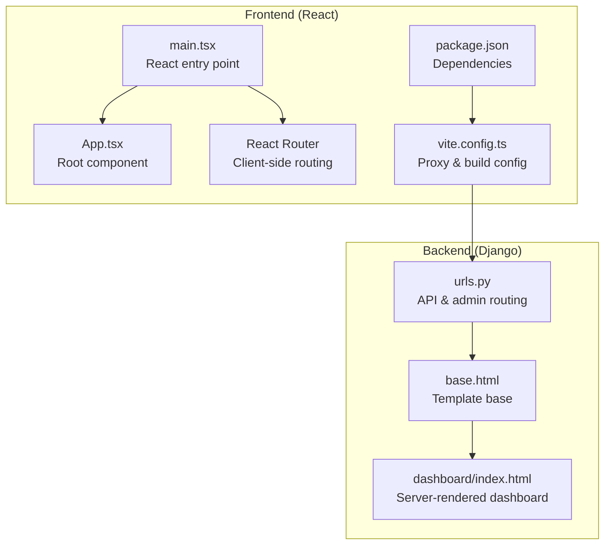
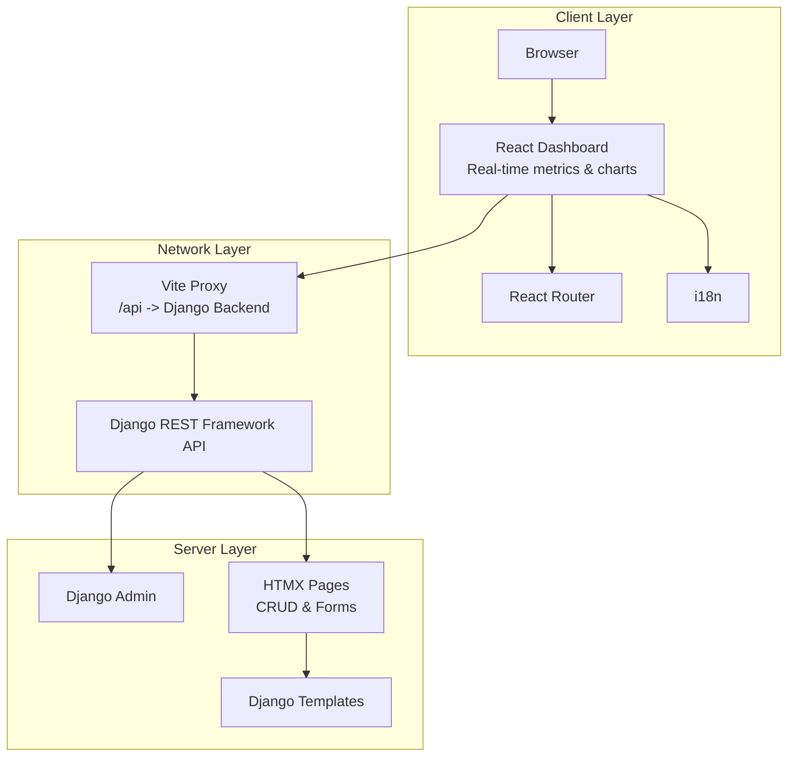
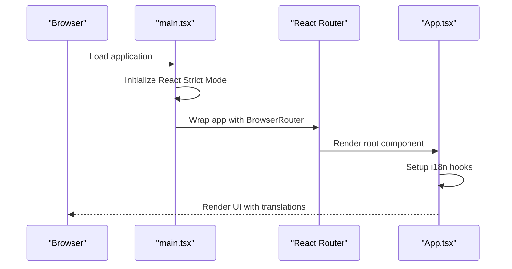
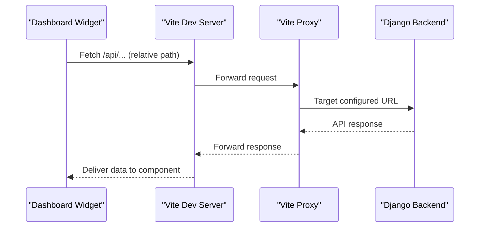
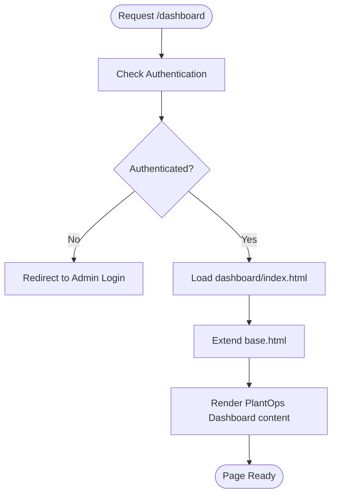
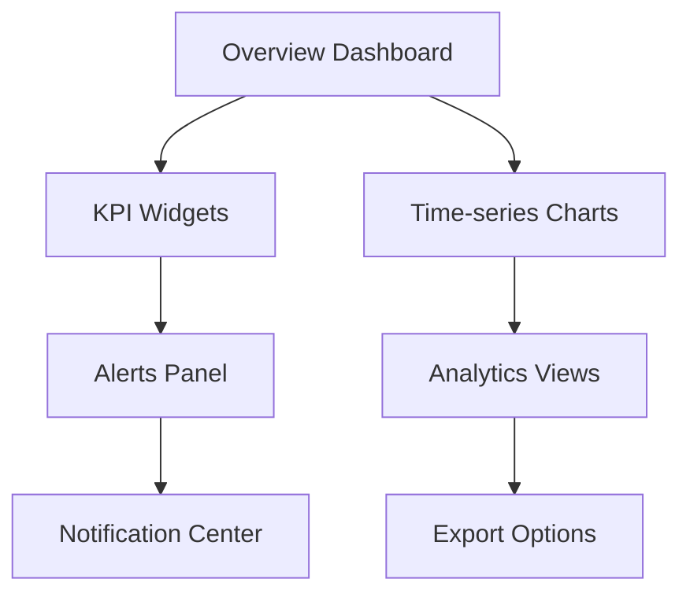
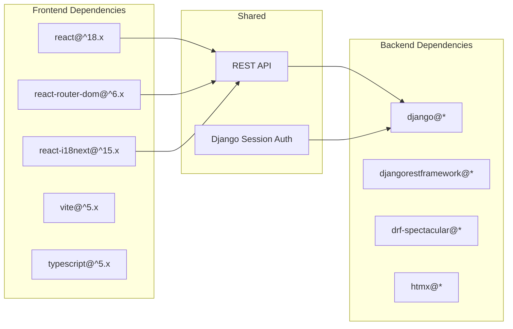

# Dashboard Module

<cite>
**Referenced Files in This Document**
- [FRONTEND_BOUNDARIES.md](file://backend/docs/architecture/FRONTEND_BOUNDARIES.md)
- [index.html](file://backend/templates/dashboard/index.html)
- [main.tsx](file://frontend/src/main.tsx)
- [App.tsx](file://frontend/src/App.tsx)
- [package.json](file://frontend/package.json)
- [vite.config.ts](file://frontend/vite.config.ts)
- [urls.py](file://backend/config/urls.py)
- [base.html](file://backend/templates/base.html)
</cite>

## Table of Contents
1. [Introduction](#introduction)
2. [Project Structure](#project-structure)
3. [Core Components](#core-components)
4. [Architecture Overview](#architecture-overview)
5. [Detailed Component Analysis](#detailed-component-analysis)
6. [Dependency Analysis](#dependency-analysis)
7. [Performance Considerations](#performance-considerations)
8. [Troubleshooting Guide](#troubleshooting-guide)
9. [Conclusion](#conclusion)

## Introduction
The Dashboard module serves as the primary operational interface for monitoring plant care activities, delivering real-time metrics and overview dashboards. According to the documented frontend boundaries, the React-based dashboard module is designated for:
- Real-time dashboard
- Expert analytics
- Charts and visualizations
- Interactive maps
- Any page requiring heavy client-side interactivity

This document explains the module's role, component hierarchy, data visualization capabilities, backend API integration, layout system, widget components, real-time updates, configuration examples, and performance optimization strategies.

## Project Structure
The Dashboard module is implemented as a React application integrated into the larger PlantOps platform. The frontend is structured with clear boundaries:
- React + Vite powers the dashboard, expert analytics, and realtime features
- Django + HTMX handles administrative and CRUD-heavy pages
- Shared API and authentication enable seamless integration across technologies

Key structural elements:
- React entry point initializes routing and internationalization
- Vite configuration proxies API requests to the Django backend
- Django templates provide server-rendered pages for administrative use
- Shared URL routing separates API/admin traffic from static assets

**Diagram sources**
- [main.tsx:1-15](file://frontend/src/main.tsx#L1-L15)
- [App.tsx:1-20](file://frontend/src/App.tsx#L1-L20)
- [vite.config.ts:1-26](file://frontend/vite.config.ts#L1-L26)
- [package.json:1-33](file://frontend/package.json#L1-L33)
- [urls.py:1-49](file://backend/config/urls.py#L1-L49)
- [base.html](file://backend/templates/base.html)
- [index.html:1-12](file://backend/templates/dashboard/index.html#L1-L12)

**Section sources**
- [FRONTEND_BOUNDARIES.md:1-74](file://backend/docs/architecture/FRONTEND_BOUNDARIES.md#L1-L74)
- [main.tsx:1-15](file://frontend/src/main.tsx#L1-L15)
- [vite.config.ts:1-26](file://frontend/vite.config.ts#L1-L26)
- [urls.py:1-49](file://backend/config/urls.py#L1-L49)
- [base.html](file://backend/templates/base.html)
- [index.html:1-12](file://backend/templates/dashboard/index.html#L1-L12)

## Core Components
The Dashboard module comprises several core components that work together to deliver an interactive, real-time monitoring experience:

- Application shell and routing
  - React entry point initializes the application with routing and internationalization
  - Client-side routing enables navigation between dashboard views without full page reloads

- Internationalization framework
  - Built-in i18n support allows language switching and localized content
  - Enables multi-language operation for diverse user bases

- Proxy configuration for API communication
  - Vite proxy forwards API requests to the Django backend during development
  - Ensures seamless integration between frontend and backend services

- Template system for server-rendered pages
  - Django templates provide server-side rendering for administrative dashboards
  - Base template defines common blocks for title, content, and scripts

These components collectively establish the foundation for real-time data visualization, user interaction, and backend integration.

**Section sources**
- [FRONTEND_BOUNDARIES.md:30-52](file://backend/docs/architecture/FRONTEND_BOUNDARIES.md#L30-L52)
- [main.tsx:1-15](file://frontend/src/main.tsx#L1-L15)
- [App.tsx:1-20](file://frontend/src/App.tsx#L1-L20)
- [vite.config.ts:15-20](file://frontend/vite.config.ts#L15-L20)
- [base.html](file://backend/templates/base.html)
- [index.html:1-12](file://backend/templates/dashboard/index.html#L1-L12)

## Architecture Overview
The Dashboard module follows a clear separation of concerns between frontend and backend technologies while maintaining shared API and authentication:

**Diagram sources**
- [FRONTEND_BOUNDARIES.md:53-73](file://backend/docs/architecture/FRONTEND_BOUNDARIES.md#L53-L73)
- [vite.config.ts:15-20](file://frontend/vite.config.ts#L15-L20)
- [urls.py:12-38](file://backend/config/urls.py#L12-L38)

The architecture ensures:
- Clear technology boundaries between React and HTMX/Django
- Shared API surface for both frontend technologies
- Consistent authentication via Django sessions
- Flexible routing with separate handling for API/admin vs. static content

## Detailed Component Analysis

### React Application Shell
The React application initializes with routing and internationalization support, establishing the foundation for dashboard functionality.

**Diagram sources**
- [main.tsx:8-14](file://frontend/src/main.tsx#L8-L14)
- [App.tsx:1-17](file://frontend/src/App.tsx#L1-L17)

### API Integration and Proxy Configuration
The Vite proxy configuration enables seamless communication between the React dashboard and Django backend during development.

**Diagram sources**
- [vite.config.ts:15-20](file://frontend/vite.config.ts#L15-L20)
- [FRONTEND_BOUNDARIES.md:60-67](file://backend/docs/architecture/FRONTEND_BOUNDARIES.md#L60-L67)

### Server-Side Dashboard Rendering
The Django template system provides server-rendered dashboard pages for administrative contexts, complementing the client-side React dashboard.

**Diagram sources**
- [index.html:1-12](file://backend/templates/dashboard/index.html#L1-L12)
- [base.html](file://backend/templates/base.html)

**Section sources**
- [main.tsx:1-15](file://frontend/src/main.tsx#L1-L15)
- [App.tsx:1-20](file://frontend/src/App.tsx#L1-L20)
- [vite.config.ts:15-20](file://frontend/vite.config.ts#L15-L20)
- [urls.py:12-38](file://backend/config/urls.py#L12-L38)
- [index.html:1-12](file://backend/templates/dashboard/index.html#L1-L12)

### Conceptual Overview
The Dashboard module supports multiple interaction patterns:
- Real-time monitoring through WebSocket connections (conceptual)
- KPI widgets with configurable refresh intervals
- Drill-down analytics from overview to detailed views
- Multi-language support for global deployment

[No sources needed since this diagram shows conceptual workflow, not actual code structure]

## Dependency Analysis
The Dashboard module maintains clear dependencies between frontend and backend components:

**Diagram sources**
- [package.json:12-31](file://frontend/package.json#L12-L31)
- [urls.py:6-23](file://backend/config/urls.py#L6-L23)

**Section sources**
- [package.json:1-33](file://frontend/package.json#L1-L33)
- [urls.py:1-49](file://backend/config/urls.py#L1-L49)

## Performance Considerations
To optimize the Dashboard module for large datasets and real-time updates:

- Lazy loading of visualization libraries and heavy components
- Virtualized rendering for large lists and tables
- Debounced search and filter operations
- Efficient chart libraries with incremental updates
- Background data fetching with caching strategies
- Optimized WebSocket connection management
- Image and asset optimization for charts and maps
- CDN delivery for static assets

[No sources needed since this section provides general guidance]

## Troubleshooting Guide
Common issues and resolutions for the Dashboard module:

- API connectivity problems
  - Verify Vite proxy configuration targets the correct backend URL
  - Check CORS settings and CSRF token handling
  - Confirm Django REST framework is properly configured

- Authentication failures
  - Ensure Django session authentication is active
  - Verify CSRF middleware configuration
  - Check browser cookie settings and SameSite policies

- Build and development issues
  - Validate Vite configuration and port availability
  - Confirm TypeScript compilation succeeds
  - Review dependency conflicts in package.json

- Internationalization problems
  - Verify i18n resource loading
  - Check language detection configuration
  - Ensure translation files are properly formatted

**Section sources**
- [vite.config.ts:15-20](file://frontend/vite.config.ts#L15-L20)
- [package.json:12-31](file://frontend/package.json#L12-L31)
- [FRONTEND_BOUNDARIES.md:60-67](file://backend/docs/architecture/FRONTEND_BOUNDARIES.md#L60-L67)

## Conclusion
The Dashboard module provides a robust foundation for real-time plant care monitoring through its React-based architecture, clear frontend-backend boundaries, and shared API infrastructure. The module's design supports scalable visualization, efficient data handling, and flexible deployment across diverse operational environments. By following the documented patterns for component organization, API integration, and performance optimization, the Dashboard module can effectively serve as the primary operational interface for monitoring plant care activities.