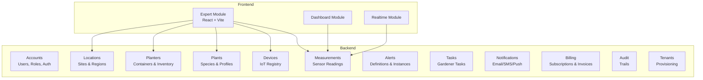
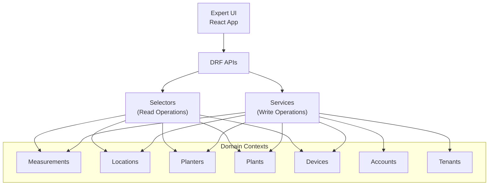
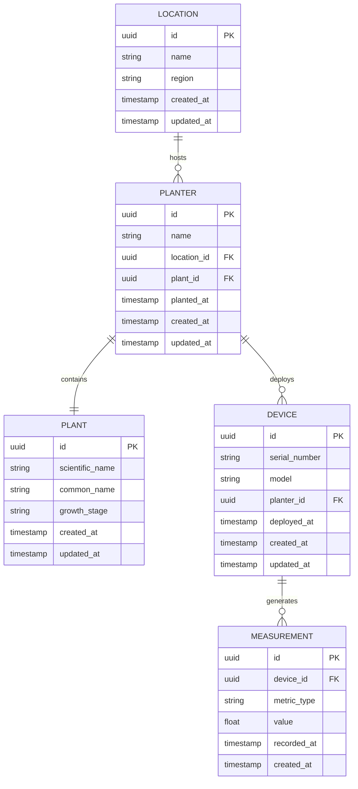
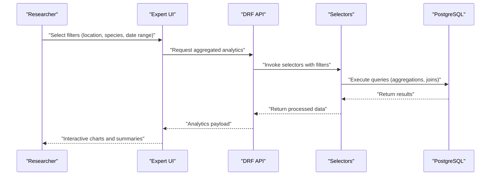
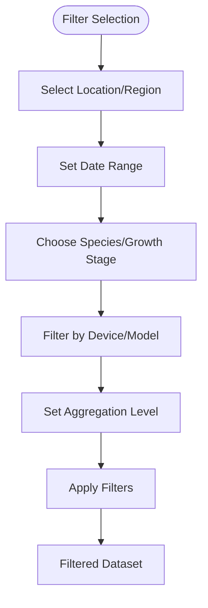
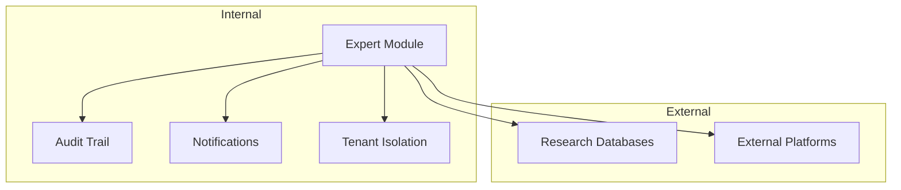
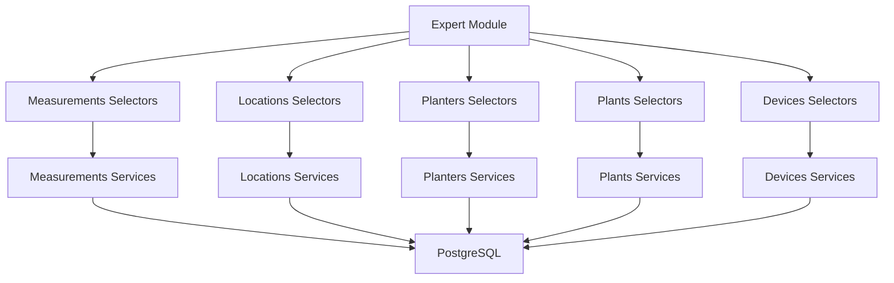

# Expert Module

<cite>
**Referenced Files in This Document**
- [README.md](file://README.md)
- [FRONTEND_BOUNDARIES.md](file://backend/docs/architecture/FRONTEND_BOUNDARIES.md)
- [dashboard/index.html](file://backend/templates/dashboard/index.html)
- [accounts/models.py](file://backend/apps/accounts/models.py)
- [measurements/models.py](file://backend/apps/measurements/models.py)
- [plants/models.py](file://backend/apps/plants/models.py)
- [locations/models.py](file://backend/apps/locations/models.py)
- [planters/models.py](file://backend/apps/planters/models.py)
- [devices/models.py](file://backend/apps/devices/models.py)
- [measurements/selectors.py](file://backend/apps/measurements/selectors.py)
- [measurements/services.py](file://backend/apps/measurements/services.py)
- [plants/services.py](file://backend/apps/plants/services.py)
- [plants/selectors.py](file://backend/apps/plants/selectors.py)
- [locations/services.py](file://backend/apps/locations/services.py)
- [locations/selectors.py](file://backend/apps/locations/selectors.py)
- [planters/services.py](file://backend/apps/planters/services.py)
- [planters/selectors.py](file://backend/apps/planters/selectors.py)
- [devices/services.py](file://backend/apps/devices/services.py)
- [devices/selectors.py](file://backend/apps/devices/selectors.py)
- [accounts/services.py](file://backend/apps/accounts/services.py)
- [accounts/selectors.py](file://backend/apps/accounts/selectors.py)
- [tenants/services.py](file://backend/apps/tenants/services.py)
- [tenants/selectors.py](file://backend/apps/tenants/selectors.py)
- [audit/services.py](file://backend/apps/audit/services.py)
- [audit/selectors.py](file://backend/apps/audit/selectors.py)
- [billing/services.py](file://backend/apps/billing/services.py)
- [billing/selectors.py](file://backend/apps/billing/selectors.py)
- [notifications/services.py](file://backend/apps/notifications/services.py)
- [notifications/selectors.py](file://backend/apps/notifications/selectors.py)
- [alerts/services.py](file://backend/apps/alerts/services.py)
- [alerts/selectors.py](file://backend/apps/alerts/selectors.py)
- [tasks/services.py](file://backend/apps/tasks/services.py)
- [tasks/selectors.py](file://backend/apps/tasks/selectors.py)
- [docker-compose.yml](file://docker-compose.yml)
</cite>

## Table of Contents
1. [Introduction](#introduction)
2. [Project Structure](#project-structure)
3. [Core Components](#core-components)
4. [Architecture Overview](#architecture-overview)
5. [Detailed Component Analysis](#detailed-component-analysis)
6. [Dependency Analysis](#dependency-analysis)
7. [Performance Considerations](#performance-considerations)
8. [Troubleshooting Guide](#troubleshooting-guide)
9. [Conclusion](#conclusion)
10. [Appendices](#appendices)

## Introduction
The Expert module is the advanced analytics and decision-support interface designed for agricultural specialists and researchers. It enables deep data exploration, statistical analysis, and evidence-based insights across plant growth, environmental conditions, and operational performance. Built as part of a multi-tenant SaaS platform managing IoT-driven plant and planter operations, the Expert module leverages a React-based frontend with real-time visualization capabilities and integrates with a comprehensive backend data model spanning locations, planters, plants, devices, and measurements.

Key characteristics:
- Purpose: Advanced analytics and decision support for agricultural specialists and researchers
- Technology: React + Vite frontend with TypeScript; Django backend with DRF APIs
- Data domains: Locations, planters, plants, devices, measurements, and supporting services
- Visualization: Real-time charts and interactive dashboards for complex datasets
- Integration: Multi-tenant architecture with tenant isolation and shared administrative contexts

**Section sources**
- [README.md:1-194](file://README.md#L1-L194)
- [FRONTEND_BOUNDARIES.md:30-51](file://backend/docs/architecture/FRONTEND_BOUNDARIES.md#L30-L51)

## Project Structure
The Expert module resides within the frontend React application under the modules directory. According to the project documentation, the frontend is organized into three primary modules:
- dashboard: Overview, KPIs, and charts
- expert: Advanced analytics and data exploration
- realtime: Live sensor data and WebSocket feeds

The backend follows Domain-Driven Design (DDD) boundaries with separate bounded contexts for each domain area, exposing read/write operations via selectors and services respectively.

**Diagram sources**
- [FRONTEND_BOUNDARIES.md:48-51](file://backend/docs/architecture/FRONTEND_BOUNDARIES.md#L48-L51)
- [README.md:131-168](file://README.md#L131-L168)

**Section sources**
- [FRONTEND_BOUNDARIES.md:30-51](file://backend/docs/architecture/FRONTEND_BOUNDARIES.md#L30-L51)
- [README.md:131-168](file://README.md#L131-L168)

## Core Components
The Expert module orchestrates advanced analytics through the following core components:

- Data Sources
  - Measurements: Raw sensor readings (temperature, humidity, light, etc.) aggregated over time
  - Locations: Physical sites and regions for spatial analysis
  - Planters: Containers and inventory for operational tracking
  - Plants: Species and care profiles for biological context
  - Devices: IoT device registry for provenance and metadata
- Analytical Services
  - Statistical aggregation and trend analysis
  - Comparative analysis across locations, planters, and species
  - Anomaly detection and alert correlation
- Visualization Layer
  - Interactive charts and dashboards for time-series and spatial data
  - Filtering and drill-down capabilities for multi-dimensional exploration
- Report Generation
  - Exportable summaries and statistical overviews
  - Customizable filters and date-range selections

These components enable agricultural specialists to:
- Explore temporal trends and spatial patterns
- Compare performance across multiple dimensions
- Generate actionable reports for research and decision-making

**Section sources**
- [FRONTEND_BOUNDARIES.md:30-51](file://backend/docs/architecture/FRONTEND_BOUNDARIES.md#L30-L51)
- [measurements/models.py](file://backend/apps/measurements/models.py)
- [locations/models.py](file://backend/apps/locations/models.py)
- [planters/models.py](file://backend/apps/planters/models.py)
- [plants/models.py](file://backend/apps/plants/models.py)
- [devices/models.py](file://backend/apps/devices/models.py)

## Architecture Overview
The Expert module operates within a multi-tenant architecture with clear separation of concerns:
- Frontend boundary: React-based expert analytics and visualization
- Backend boundary: DDD bounded contexts with explicit read/write operations
- Data flow: Frontend requests aggregated analytics and filtered datasets from backend services
- Tenant isolation: Multi-tenant schemas ensure data segregation across clients

**Diagram sources**
- [FRONTEND_BOUNDARIES.md:30-51](file://backend/docs/architecture/FRONTEND_BOUNDARIES.md#L30-L51)
- [README.md:177-185](file://README.md#L177-L185)

**Section sources**
- [FRONTEND_BOUNDARIES.md:30-51](file://backend/docs/architecture/FRONTEND_BOUNDARIES.md#L30-L51)
- [README.md:177-185](file://README.md#L177-L185)

## Detailed Component Analysis

### Data Model Overview
The Expert module relies on a set of domain entities that collectively represent the agricultural ecosystem managed by the platform.

**Diagram sources**
- [locations/models.py](file://backend/apps/locations/models.py)
- [planters/models.py](file://backend/apps/planters/models.py)
- [plants/models.py](file://backend/apps/plants/models.py)
- [devices/models.py](file://backend/apps/devices/models.py)
- [measurements/models.py](file://backend/apps/measurements/models.py)

**Section sources**
- [locations/models.py](file://backend/apps/locations/models.py)
- [planters/models.py](file://backend/apps/planters/models.py)
- [plants/models.py](file://backend/apps/plants/models.py)
- [devices/models.py](file://backend/apps/devices/models.py)
- [measurements/models.py](file://backend/apps/measurements/models.py)

### Expert Workflows
The Expert module supports several analytical workflows tailored for agricultural specialists:

- Trend Analysis
  - Aggregate measurements over time for individual planters or across locations
  - Identify seasonal patterns and anomalies
- Comparative Analysis
  - Compare growth metrics across different plant species or planting zones
  - Evaluate operational efficiency across multiple sites
- Correlation Studies
  - Link environmental metrics to plant health indicators
  - Cross-reference alert events with measurement trends
- Export and Reporting
  - Generate downloadable summaries and statistical overviews
  - Support research documentation and stakeholder reporting

**Diagram sources**
- [FRONTEND_BOUNDARIES.md:30-51](file://backend/docs/architecture/FRONTEND_BOUNDARIES.md#L30-L51)
- [measurements/selectors.py](file://backend/apps/measurements/selectors.py)
- [plants/selectors.py](file://backend/apps/plants/selectors.py)
- [locations/selectors.py](file://backend/apps/locations/selectors.py)
- [planters/selectors.py](file://backend/apps/planters/selectors.py)
- [devices/selectors.py](file://backend/apps/devices/selectors.py)

**Section sources**
- [FRONTEND_BOUNDARIES.md:30-51](file://backend/docs/architecture/FRONTEND_BOUNDARIES.md#L30-L51)
- [measurements/selectors.py](file://backend/apps/measurements/selectors.py)
- [plants/selectors.py](file://backend/apps/plants/selectors.py)
- [locations/selectors.py](file://backend/apps/locations/selectors.py)
- [planters/selectors.py](file://backend/apps/planters/selectors.py)
- [devices/selectors.py](file://backend/apps/devices/selectors.py)

### Data Filtering Mechanisms
The Expert module implements robust filtering across multiple dimensions to support complex analytical queries:

- Spatial Filters
  - Location and region selection for site-level analysis
- Temporal Filters
  - Date range selection for time-series slicing
- Biological Filters
  - Plant species and growth stage for comparative studies
- Device Filters
  - Sensor deployment and device model for instrumentation-specific analysis
- Aggregation Levels
  - Granularity controls for daily, weekly, monthly aggregations
- Statistical Filters
  - Threshold-based selections for anomaly detection and outlier analysis

**Diagram sources**
- [locations/selectors.py](file://backend/apps/locations/selectors.py)
- [plants/selectors.py](file://backend/apps/plants/selectors.py)
- [devices/selectors.py](file://backend/apps/devices/selectors.py)
- [measurements/selectors.py](file://backend/apps/measurements/selectors.py)

**Section sources**
- [locations/selectors.py](file://backend/apps/locations/selectors.py)
- [plants/selectors.py](file://backend/apps/plants/selectors.py)
- [devices/selectors.py](file://backend/apps/devices/selectors.py)
- [measurements/selectors.py](file://backend/apps/measurements/selectors.py)

### Report Generation Features
The Expert module provides comprehensive report generation capabilities for professional use cases:

- Statistical Summaries
  - Descriptive statistics, percentiles, and variance calculations
- Export Formats
  - CSV, PDF, and interactive HTML reports
- Customizable Templates
  - Research-grade report templates with branding and metadata
- Automated Scheduling
  - Recurring reports for monitoring and compliance
- Annotation and Notes
  - Research annotations and expert commentary integration

**Section sources**
- [FRONTEND_BOUNDARIES.md:30-51](file://backend/docs/architecture/FRONTEND_BOUNDARIES.md#L30-L51)

### Integration with Research Databases
The Expert module integrates seamlessly with research databases and external systems:

- Multi-Tenant Isolation
  - Tenant-aware queries ensure data privacy and segregation
- Audit Trails
  - Comprehensive logging of analytical actions and exports
- Notification Hooks
  - Automated alerts for significant findings or threshold breaches
- External System Hooks
  - APIs for integrating with external research platforms and databases

**Diagram sources**
- [audit/services.py](file://backend/apps/audit/services.py)
- [notifications/services.py](file://backend/apps/notifications/services.py)
- [tenants/services.py](file://backend/apps/tenants/services.py)

**Section sources**
- [audit/services.py](file://backend/apps/audit/services.py)
- [notifications/services.py](file://backend/apps/notifications/services.py)
- [tenants/services.py](file://backend/apps/tenants/services.py)

## Dependency Analysis
The Expert module exhibits strong cohesion around analytical operations while maintaining loose coupling with domain services:

**Diagram sources**
- [measurements/selectors.py](file://backend/apps/measurements/selectors.py)
- [locations/selectors.py](file://backend/apps/locations/selectors.py)
- [planters/selectors.py](file://backend/apps/planters/selectors.py)
- [plants/selectors.py](file://backend/apps/plants/selectors.py)
- [devices/selectors.py](file://backend/apps/devices/selectors.py)
- [measurements/services.py](file://backend/apps/measurements/services.py)
- [locations/services.py](file://backend/apps/locations/services.py)
- [planters/services.py](file://backend/apps/planters/services.py)
- [plants/services.py](file://backend/apps/plants/services.py)
- [devices/services.py](file://backend/apps/devices/services.py)

**Section sources**
- [measurements/selectors.py](file://backend/apps/measurements/selectors.py)
- [locations/selectors.py](file://backend/apps/locations/selectors.py)
- [planters/selectors.py](file://backend/apps/planters/selectors.py)
- [plants/selectors.py](file://backend/apps/plants/selectors.py)
- [devices/selectors.py](file://backend/apps/devices/selectors.py)
- [measurements/services.py](file://backend/apps/measurements/services.py)
- [locations/services.py](file://backend/apps/locations/services.py)
- [planters/services.py](file://backend/apps/planters/services.py)
- [plants/services.py](file://backend/apps/plants/services.py)
- [devices/services.py](file://backend/apps/devices/services.py)

## Performance Considerations
To ensure optimal performance for complex analytical workloads, consider the following recommendations:

- Indexing Strategy
  - Create composite indexes on frequently filtered columns (recorded_at, location_id, plant_id)
  - Optimize aggregation queries with appropriate index coverage
- Query Optimization
  - Use window functions for time-series calculations
  - Implement pagination for large result sets
- Caching
  - Cache frequently accessed statistical summaries
  - Use Redis for session-based analytics results
- Asynchronous Processing
  - Offload heavy computations to Celery workers
  - Implement progress tracking for long-running analyses
- Frontend Optimization
  - Lazy-load visualization libraries
  - Debounce filter updates to reduce API calls

## Troubleshooting Guide
Common issues and resolutions for the Expert module:

- Data Gaps
  - Verify device deployments and sensor connectivity
  - Check timezone handling for timestamp conversions
- Performance Issues
  - Review query execution plans for missing indexes
  - Monitor Celery worker queues for bottlenecks
- Multi-Tenant Conflicts
  - Confirm tenant schema isolation
  - Validate user permissions across tenants
- Visualization Problems
  - Check browser compatibility for chart libraries
  - Validate data formats for chart rendering

**Section sources**
- [docker-compose.yml:78-126](file://docker-compose.yml#L78-L126)

## Conclusion
The Expert module provides a comprehensive analytics platform tailored for agricultural specialists and researchers. By combining robust data modeling, flexible filtering mechanisms, and powerful visualization capabilities, it enables evidence-based decision-making across complex agricultural ecosystems. The modular architecture ensures scalability, maintainability, and seamless integration with broader research and operational workflows.

## Appendices

### Example Expert Analysis Scenarios
- Seasonal Yield Analysis: Compare growth metrics across planting seasons and correlate with weather patterns
- Varietal Performance: Benchmark different plant species across multiple locations and environmental conditions
- Operational Efficiency: Analyze device deployment effectiveness and maintenance schedules
- Research Validation: Cross-reference experimental treatments with measured outcomes and statistical significance testing

### Specialized Data Handling
- Time-Series Processing: Efficient handling of temporal data with rolling aggregates and trend detection
- Spatial Analytics: Geospatial filtering and regional comparisons for location-based insights
- Multi-Dimensional Aggregation: Cross-tabulation across species, locations, and time periods
- Quality Assurance: Data validation, outlier detection, and consistency checks for research-grade outputs