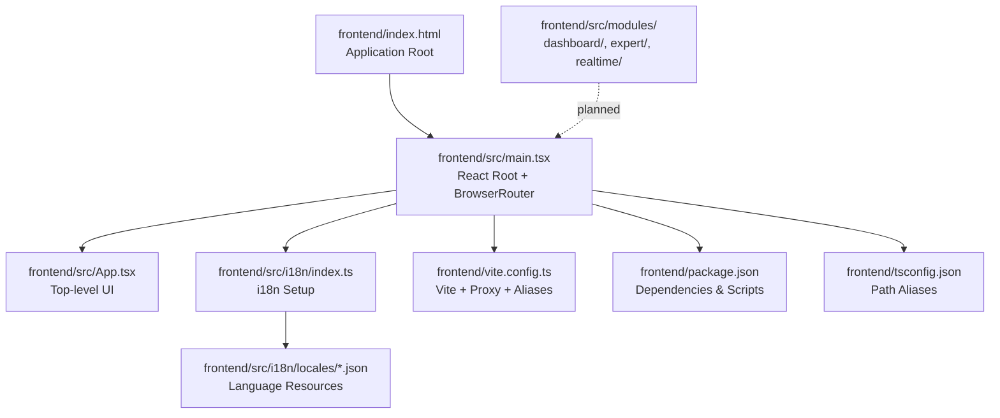
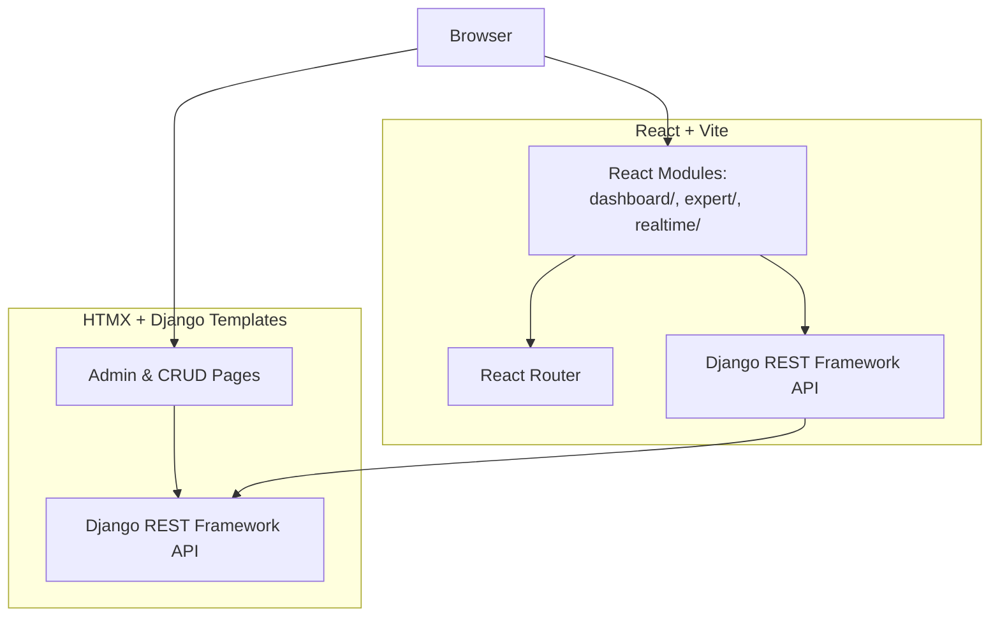
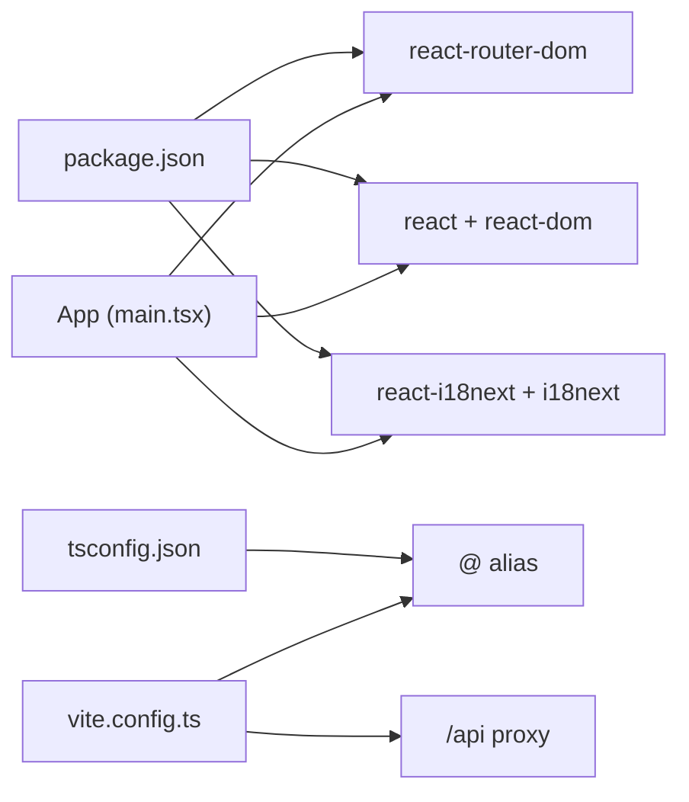

# Module Structure

<cite>
**Referenced Files in This Document**
- [FRONTEND_BOUNDARIES.md](file://backend/docs/architecture/FRONTEND_BOUNDARIES.md)
- [index.html](file://frontend/index.html)
- [main.tsx](file://frontend/src/main.tsx)
- [App.tsx](file://frontend/src/App.tsx)
- [vite.config.ts](file://frontend/vite.config.ts)
- [package.json](file://frontend/package.json)
- [tsconfig.json](file://frontend/tsconfig.json)
- [i18n/index.ts](file://frontend/src/i18n/index.ts)
- [i18n/en.json](file://frontend/src/i18n/locales/en.json)
- [i18n/sr.json](file://frontend/src/i18n/locales/sr.json)
</cite>

## Table of Contents
1. [Introduction](#introduction)
2. [Project Structure](#project-structure)
3. [Core Components](#core-components)
4. [Architecture Overview](#architecture-overview)
5. [Detailed Component Analysis](#detailed-component-analysis)
6. [Dependency Analysis](#dependency-analysis)
7. [Performance Considerations](#performance-considerations)
8. [Troubleshooting Guide](#troubleshooting-guide)
9. [Conclusion](#conclusion)

## Introduction
This document describes the modular frontend structure for the PlantOps project, focusing on three React-based modules: dashboard for operational monitoring, expert for advanced analytics, and realtime for live data visualization. The documentation explains module organization patterns, shared component usage, inter-module communication strategies, routing configuration, lazy loading implementation, and module-specific dependencies. It also covers initialization examples, state management per module, data fetching patterns, module boundaries, shared utilities, and how each module serves different user roles and workflows.

## Project Structure
The frontend is organized as a React + Vite application with a clear separation of concerns:
- Entry point initializes routing and internationalization.
- Internationalization is configured with language detection and resource bundles.
- The application is served via Vite with an API proxy to the backend.
- The modules directory exists and is intended to house the three primary modules.

**Diagram sources**
- [index.html:1-14](file://frontend/index.html#L1-L14)
- [main.tsx:1-15](file://frontend/src/main.tsx#L1-L15)
- [App.tsx:1-20](file://frontend/src/App.tsx#L1-L20)
- [i18n/index.ts:1-23](file://frontend/src/i18n/index.ts#L1-L23)
- [vite.config.ts:1-27](file://frontend/vite.config.ts#L1-L27)
- [package.json:1-33](file://frontend/package.json#L1-L33)
- [tsconfig.json:1-25](file://frontend/tsconfig.json#L1-L25)

**Section sources**
- [FRONTEND_BOUNDARIES.md:30-51](file://backend/docs/architecture/FRONTEND_BOUNDARIES.md#L30-L51)
- [index.html:1-14](file://frontend/index.html#L1-L14)
- [main.tsx:1-15](file://frontend/src/main.tsx#L1-L15)
- [vite.config.ts:1-27](file://frontend/vite.config.ts#L1-L27)
- [package.json:1-33](file://frontend/package.json#L1-L33)
- [tsconfig.json:1-25](file://frontend/tsconfig.json#L1-L25)

## Core Components
- Application bootstrap: Initializes React, routing, and i18n.
- Routing: Client-side routing via React Router for module navigation.
- Internationalization: i18n with automatic language detection and resource bundles.
- Build and proxy: Vite configuration with TypeScript path aliases and API proxy.
- Module scaffolding: Three intended modules under the modules directory.

Key implementation references:
- Application entry and router initialization: [main.tsx:1-15](file://frontend/src/main.tsx#L1-L15)
- Top-level UI component: [App.tsx:1-20](file://frontend/src/App.tsx#L1-L20)
- i18n setup and language resources: [i18n/index.ts:1-23](file://frontend/src/i18n/index.ts#L1-L23), [i18n/en.json:1-7](file://frontend/src/i18n/locales/en.json#L1-L7), [i18n/sr.json:1-7](file://frontend/src/i18n/locales/sr.json#L1-L7)
- Vite configuration and proxy: [vite.config.ts:1-27](file://frontend/vite.config.ts#L1-L27)
- Path aliases and TypeScript configuration: [tsconfig.json:1-25](file://frontend/tsconfig.json#L1-L25)
- Module boundaries and intended usage: [FRONTEND_BOUNDARIES.md:30-51](file://backend/docs/architecture/FRONTEND_BOUNDARIES.md#L30-L51)

**Section sources**
- [main.tsx:1-15](file://frontend/src/main.tsx#L1-L15)
- [App.tsx:1-20](file://frontend/src/App.tsx#L1-L20)
- [i18n/index.ts:1-23](file://frontend/src/i18n/index.ts#L1-L23)
- [i18n/en.json:1-7](file://frontend/src/i18n/locales/en.json#L1-L7)
- [i18n/sr.json:1-7](file://frontend/src/i18n/locales/sr.json#L1-L7)
- [vite.config.ts:1-27](file://frontend/vite.config.ts#L1-L27)
- [tsconfig.json:1-25](file://frontend/tsconfig.json#L1-L25)
- [FRONTEND_BOUNDARIES.md:30-51](file://backend/docs/architecture/FRONTEND_BOUNDARIES.md#L30-L51)

## Architecture Overview
The frontend architecture separates concerns between HTMX/Django templates and React/Vite. React modules are dedicated to interactive dashboards and analytics, while HTMX handles administrative CRUD and form-heavy pages. The shared API and authentication enable seamless integration across technologies.

**Diagram sources**
- [FRONTEND_BOUNDARIES.md:30-74](file://backend/docs/architecture/FRONTEND_BOUNDARIES.md#L30-L74)

**Section sources**
- [FRONTEND_BOUNDARIES.md:30-74](file://backend/docs/architecture/FRONTEND_BOUNDARIES.md#L30-L74)

## Detailed Component Analysis

### Module Organization Patterns
Each module follows a consistent pattern:
- Dedicated folder under frontend/src/modules/<module-name>.
- Self-contained routing, views, and state management.
- Shared utilities and components imported via path aliases.
- Lazy-loaded routes to optimize bundle size and initial load.

Module-specific responsibilities:
- dashboard: Operational monitoring, KPIs, and overview charts.
- expert: Advanced analytics and data exploration.
- realtime: Live sensor data and WebSocket feeds.

References:
- Intended modules and use cases: [FRONTEND_BOUNDARIES.md:48-51](file://backend/docs/architecture/FRONTEND_BOUNDARIES.md#L48-L51)

**Section sources**
- [FRONTEND_BOUNDARIES.md:48-51](file://backend/docs/architecture/FRONTEND_BOUNDARIES.md#L48-L51)

### Shared Component Usage
Shared components and utilities are accessed via path aliases configured in TypeScript and Vite. This ensures consistent imports across modules and reduces duplication.

- Path alias @ resolves to frontend/src.
- TypeScript path mapping mirrors Vite alias for compile-time checks.

References:
- Path alias configuration: [vite.config.ts:7-11](file://frontend/vite.config.ts#L7-L11), [tsconfig.json:19-21](file://frontend/tsconfig.json#L19-L21)

**Section sources**
- [vite.config.ts:7-11](file://frontend/vite.config.ts#L7-L11)
- [tsconfig.json:19-21](file://frontend/tsconfig.json#L19-L21)

### Inter-Module Communication Strategies
Inter-module communication should be minimized to maintain module boundaries. Recommended strategies:
- Centralized state management for cross-cutting concerns (authentication status, theme, selected tenant).
- Event-driven patterns for decoupled updates (e.g., WebSocket messages).
- Shared services for common data operations (e.g., API clients with interceptors).

References:
- Shared API and authentication: [FRONTEND_BOUNDARIES.md:60-67](file://backend/docs/architecture/FRONTEND_BOUNDARIES.md#L60-L67)

**Section sources**
- [FRONTEND_BOUNDARIES.md:60-67](file://backend/docs/architecture/FRONTEND_BOUNDARIES.md#L60-L67)

### Routing Configuration
Client-side routing is handled by React Router. The application bootstraps BrowserRouter at the root, enabling route-based navigation between modules.

- Entry point initializes routing: [main.tsx:3](file://frontend/src/main.tsx#L3)
- Root element renders the app inside BrowserRouter: [main.tsx:8-14](file://frontend/src/main.tsx#L8-L14)

Routing best practices:
- Define module-specific routes with lazy-loaded components.
- Use nested routes for complex module layouts.
- Implement guards for protected routes.

**Section sources**
- [main.tsx:3](file://frontend/src/main.tsx#L3)
- [main.tsx:8-14](file://frontend/src/main.tsx#L8-L14)

### Lazy Loading Implementation
Lazy loading optimizes initial load by deferring non-critical modules. Implement lazy loading for module routes using dynamic imports.

Recommended approach:
- Wrap module route components with React.lazy.
- Render Suspense boundaries around lazy routes.
- Keep fallback UI minimal and informative.

References:
- Module boundaries and intended usage: [FRONTEND_BOUNDARIES.md:32-37](file://backend/docs/architecture/FRONTEND_BOUNDARIES.md#L32-L37)

**Section sources**
- [FRONTEND_BOUNDARIES.md:32-37](file://backend/docs/architecture/FRONTEND_BOUNDARIES.md#L32-L37)

### Module-Specific Dependencies
Each module may introduce domain-specific dependencies. Keep dependencies scoped to minimize global footprint.

Common categories:
- Visualization libraries (e.g., charting libraries) for dashboard and expert modules.
- Real-time libraries (e.g., WebSocket clients) for the realtime module.
- Utility libraries for data formatting and localization.

References:
- Module-specific responsibilities: [FRONTEND_BOUNDARIES.md:48-51](file://backend/docs/architecture/FRONTEND_BOUNDARIES.md#L48-L51)

**Section sources**
- [FRONTEND_BOUNDARIES.md:48-51](file://backend/docs/architecture/FRONTEND_BOUNDARIES.md#L48-L51)

### Examples of Module Initialization
Module initialization should follow a consistent pattern:
- Create a module entry file exporting the route configuration and top-level component.
- Register module routes under a shared router configuration.
- Initialize module-specific stores or services during app startup.

References:
- Entry point and routing: [main.tsx:1-15](file://frontend/src/main.tsx#L1-L15)
- Module boundaries: [FRONTEND_BOUNDARIES.md:48-51](file://backend/docs/architecture/FRONTEND_BOUNDARIES.md#L48-L51)

**Section sources**
- [main.tsx:1-15](file://frontend/src/main.tsx#L1-L15)
- [FRONTEND_BOUNDARIES.md:48-51](file://backend/docs/architecture/FRONTEND_BOUNDARIES.md#L48-L51)

### State Management Per Module
State management should be scoped to each module while sharing global concerns:
- Local component state for UI state within a module.
- Module-level stores for shared UI state (e.g., filters, selected items).
- Global stores for cross-cutting concerns (e.g., authentication, theme).

References:
- Shared API and authentication: [FRONTEND_BOUNDARIES.md:60-67](file://backend/docs/architecture/FRONTEND_BOUNDARIES.md#L60-L67)

**Section sources**
- [FRONTEND_BOUNDARIES.md:60-67](file://backend/docs/architecture/FRONTEND_BOUNDARIES.md#L60-L67)

### Data Fetching Patterns
Data fetching should be centralized and consistent across modules:
- Use a shared API client with interceptors for authentication and error handling.
- Implement caching strategies (e.g., in-memory cache, React Query) to reduce redundant requests.
- Apply optimistic updates for real-time modules to improve perceived performance.

References:
- Shared API: [FRONTEND_BOUNDARIES.md:60](file://backend/docs/architecture/FRONTEND_BOUNDARIES.md#L60)

**Section sources**
- [FRONTEND_BOUNDARIES.md:60](file://backend/docs/architecture/FRONTEND_BOUNDARIES.md#L60)

### Module Boundaries and Responsibilities
- dashboard: Focus on operational monitoring and overview metrics.
- expert: Provide advanced analytics and exploratory data views.
- realtime: Deliver live sensor data and interactive visualizations.

References:
- Module responsibilities: [FRONTEND_BOUNDARIES.md:48-51](file://backend/docs/architecture/FRONTEND_BOUNDARIES.md#L48-L51)

**Section sources**
- [FRONTEND_BOUNDARIES.md:48-51](file://backend/docs/architecture/FRONTEND_BOUNDARIES.md#L48-L51)

### Shared Utilities
Shared utilities include:
- Internationalization resources and language detection.
- Path aliases for consistent imports.
- Vite proxy configuration for API development.

References:
- i18n setup: [i18n/index.ts:1-23](file://frontend/src/i18n/index.ts#L1-L23)
- Path aliases: [vite.config.ts:7-11](file://frontend/vite.config.ts#L7-L11), [tsconfig.json:19-21](file://frontend/tsconfig.json#L19-L21)
- API proxy: [vite.config.ts:15-20](file://frontend/vite.config.ts#L15-L20)

**Section sources**
- [i18n/index.ts:1-23](file://frontend/src/i18n/index.ts#L1-L23)
- [vite.config.ts:7-11](file://frontend/vite.config.ts#L7-L11)
- [tsconfig.json:19-21](file://frontend/tsconfig.json#L19-L21)
- [vite.config.ts:15-20](file://frontend/vite.config.ts#L15-L20)

### User Roles and Workflows
- Operations staff: Use dashboard for KPIs and quick checks.
- Analysts: Use expert for deeper insights and data exploration.
- Technicians: Use realtime for monitoring live sensor streams.

References:
- Module use cases: [FRONTEND_BOUNDARIES.md:32-37](file://backend/docs/architecture/FRONTEND_BOUNDARIES.md#L32-L37)

**Section sources**
- [FRONTEND_BOUNDARIES.md:32-37](file://backend/docs/architecture/FRONTEND_BOUNDARIES.md#L32-L37)

## Dependency Analysis
The frontend depends on React, React Router, and i18n ecosystem. Build-time and runtime dependencies are managed via Vite and TypeScript.

**Diagram sources**
- [main.tsx:1-15](file://frontend/src/main.tsx#L1-L15)
- [vite.config.ts:1-27](file://frontend/vite.config.ts#L1-L27)
- [tsconfig.json:1-25](file://frontend/tsconfig.json#L1-L25)
- [package.json:1-33](file://frontend/package.json#L1-L33)

**Section sources**
- [main.tsx:1-15](file://frontend/src/main.tsx#L1-L15)
- [vite.config.ts:1-27](file://frontend/vite.config.ts#L1-L27)
- [tsconfig.json:1-25](file://frontend/tsconfig.json#L1-L25)
- [package.json:1-33](file://frontend/package.json#L1-L33)

## Performance Considerations
- Enable lazy loading for module routes to reduce initial bundle size.
- Use code splitting for large visualization libraries.
- Implement efficient caching strategies for API data.
- Minimize unnecessary re-renders with memoization and stable callbacks.
- Monitor bundle size and remove unused dependencies regularly.

## Troubleshooting Guide
- Internationalization not working:
  - Verify i18n initialization and language resource files.
  - Confirm fallback language and browser language detection settings.
  - References: [i18n/index.ts:1-23](file://frontend/src/i18n/index.ts#L1-L23), [i18n/en.json:1-7](file://frontend/src/i18n/locales/en.json#L1-L7), [i18n/sr.json:1-7](file://frontend/src/i18n/locales/sr.json#L1-L7)
- API proxy issues:
  - Check Vite proxy configuration and target endpoint.
  - Ensure environment variable for API base URL is set correctly.
  - References: [vite.config.ts:15-20](file://frontend/vite.config.ts#L15-L20)
- Routing problems:
  - Confirm BrowserRouter is properly wrapped around the app.
  - Verify route definitions and lazy loading implementation.
  - References: [main.tsx:8-14](file://frontend/src/main.tsx#L8-L14)

**Section sources**
- [i18n/index.ts:1-23](file://frontend/src/i18n/index.ts#L1-L23)
- [i18n/en.json:1-7](file://frontend/src/i18n/locales/en.json#L1-L7)
- [i18n/sr.json:1-7](file://frontend/src/i18n/locales/sr.json#L1-L7)
- [vite.config.ts:15-20](file://frontend/vite.config.ts#L15-L20)
- [main.tsx:8-14](file://frontend/src/main.tsx#L8-L14)

## Conclusion
The modular frontend structure leverages React and Vite to deliver specialized experiences for operations, analytics, and real-time monitoring. By adhering to clear module boundaries, shared utilities, and consistent patterns for routing, lazy loading, and state management, the system remains maintainable and scalable. The documented architecture and implementation references provide a foundation for building robust, role-focused user interfaces aligned with the project’s goals.