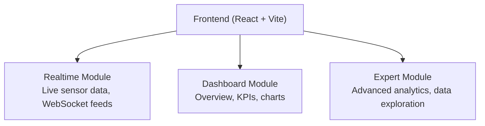
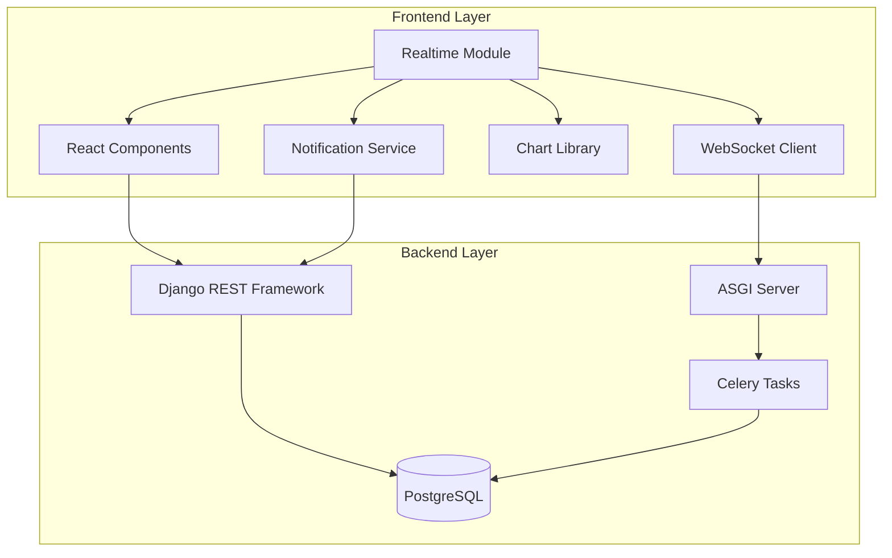
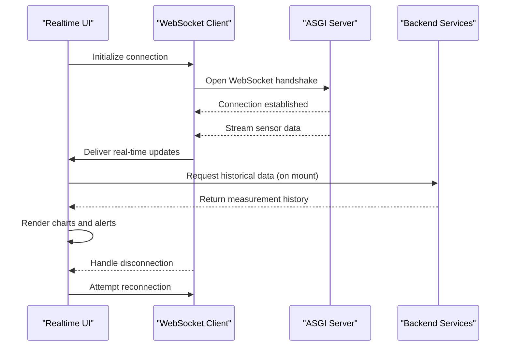
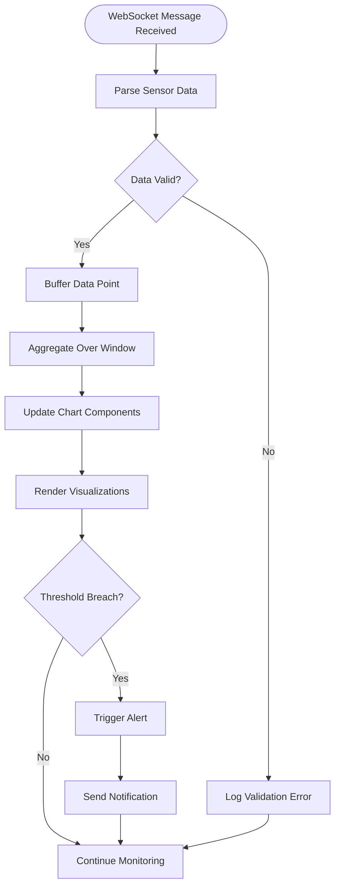
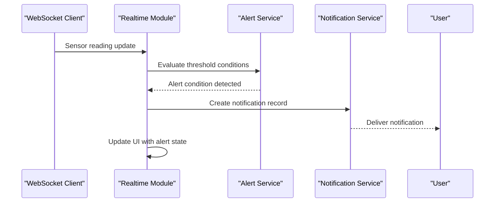
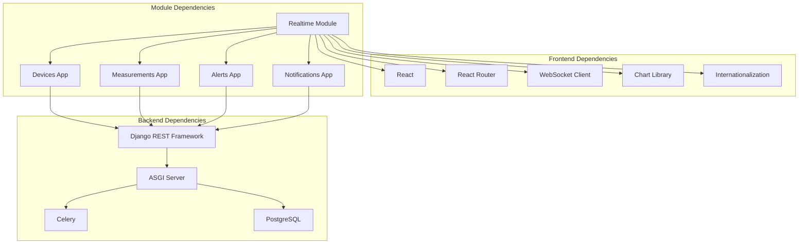

# Realtime Module

<cite>
**Referenced Files in This Document**
- [FRONTEND_BOUNDARIES.md](file://backend/docs/architecture/FRONTEND_BOUNDARIES.md)
- [index.html](file://frontend/index.html)
- [main.tsx](file://frontend/src/main.tsx)
- [App.tsx](file://frontend/src/App.tsx)
- [realtime module directory](file://frontend/src/modules/realtime)
- [dashboard module directory](file://frontend/src/modules/dashboard)
- [expert module directory](file://frontend/src/modules/expert)
- [package.json](file://frontend/package.json)
- [vite.config.ts](file://frontend/vite.config.ts)
- [asgi.py](file://backend/config/asgi.py)
- [wsgi.py](file://backend/config/wsgi.py)
- [urls.py](file://backend/config/urls.py)
- [base.py](file://backend/config/settings/base.py)
- [production.py](file://backend/config/settings/production.py)
- [local.py](file://backend/config/settings/local.py)
- [celery.py](file://backend/config/celery.py)
- [devices/models.py](file://backend/apps/devices/models.py)
- [measurements/models.py](file://backend/apps/measurements/models.py)
- [alerts/models.py](file://backend/apps/alerts/models.py)
- [notifications/models.py](file://backend/apps/notifications/models.py)
- [devices/services.py](file://backend/apps/devices/services.py)
- [measurements/services.py](file://backend/apps/measurements/services.py)
- [alerts/services.py](file://backend/apps/alerts/services.py)
- [notifications/services.py](file://backend/apps/notifications/services.py)
- [devices/events.py](file://backend/apps/devices/events.py)
- [measurements/events.py](file://backend/apps/measurements/events.py)
- [alerts/events.py](file://backend/apps/alerts/events.py)
- [notifications/events.py](file://backend/apps/notifications/events.py)
</cite>

## Table of Contents
1. [Introduction](#introduction)
2. [Project Structure](#project-structure)
3. [Core Components](#core-components)
4. [Architecture Overview](#architecture-overview)
5. [Detailed Component Analysis](#detailed-component-analysis)
6. [Dependency Analysis](#dependency-analysis)
7. [Performance Considerations](#performance-considerations)
8. [Troubleshooting Guide](#troubleshooting-guide)
9. [Conclusion](#conclusion)

## Introduction
The Realtime module is a React-based component within the PlantOps dashboard designed to deliver live monitoring and immediate response capabilities for IoT sensor data and plant condition alerts. It leverages WebSocket connections to stream continuous sensor readings, renders live charts for real-time visualization, and integrates instant notification systems to trigger alerts when thresholds are exceeded. The module is part of a broader frontend architecture that separates concerns between HTMX/Django templates for administrative tasks and React/Vite for interactive dashboards and analytics.

Key responsibilities of the Realtime module include:
- Establishing and managing WebSocket connections for live data ingestion
- Rendering dynamic charts and gauges for sensor metrics
- Handling alert triggers and displaying notifications
- Providing responsive user interfaces optimized for high-frequency updates
- Integrating with backend APIs for device management, measurement retrieval, and alert/notification services

## Project Structure
The Realtime module resides within the React frontend under the modules directory. According to the documented frontend boundaries, the Realtime module is designated for live sensor data and WebSocket feeds. The frontend entry point initializes React and routing, while the module structure supports scalable development of real-time features.

**Diagram sources**
- [FRONTEND_BOUNDARIES.md:30-51](file://backend/docs/architecture/FRONTEND_BOUNDARIES.md#L30-L51)
- [main.tsx:1-15](file://frontend/src/main.tsx#L1-L15)

**Section sources**
- [FRONTEND_BOUNDARIES.md:1-74](file://backend/docs/architecture/FRONTEND_BOUNDARIES.md#L1-L74)
- [index.html:1-13](file://frontend/index.html#L1-L13)
- [main.tsx:1-15](file://frontend/src/main.tsx#L1-L15)

## Core Components
The Realtime module orchestrates several core components to achieve live monitoring and immediate response:
- WebSocket client for bidirectional communication with the backend
- Real-time charting library for rendering continuous sensor data streams
- Alert management system for detecting threshold breaches and triggering notifications
- Notification service for delivering instant alerts to users
- Device and measurement services for retrieving device metadata and historical data

These components work together to provide a seamless real-time experience, ensuring low-latency updates and responsive user interactions.

**Section sources**
- [FRONTEND_BOUNDARIES.md:30-51](file://backend/docs/architecture/FRONTEND_BOUNDARIES.md#L30-L51)

## Architecture Overview
The Realtime module follows a layered architecture that separates concerns between presentation, data services, and backend integration. The frontend communicates with Django REST Framework endpoints for device and measurement data, while WebSocket connections handle live updates. Notifications are triggered based on alert conditions and delivered through the notification service.

**Diagram sources**
- [FRONTEND_BOUNDARIES.md:30-74](file://backend/docs/architecture/FRONTEND_BOUNDARIES.md#L30-L74)
- [asgi.py](file://backend/config/asgi.py)
- [celery.py](file://backend/config/celery.py)

## Detailed Component Analysis

### WebSocket Connection Management
The Realtime module establishes persistent WebSocket connections to receive live sensor data updates. The connection lifecycle includes initialization, reconnection on failure, and graceful closure on component unmount. The WebSocket client integrates with the backend ASGI server to maintain a reliable real-time channel.

**Diagram sources**
- [asgi.py](file://backend/config/asgi.py)
- [FRONTEND_BOUNDARIES.md:30-51](file://backend/docs/architecture/FRONTEND_BOUNDARIES.md#L30-L51)

### Real-Time Data Streaming and Chart Rendering
Real-time data streaming involves continuous ingestion of sensor measurements, aggregation for visualization, and rendering with chart libraries. The module manages data buffering, chart updates, and performance optimization to handle high-frequency updates without impacting user experience.

**Diagram sources**
- [measurements/models.py](file://backend/apps/measurements/models.py)
- [measurements/services.py](file://backend/apps/measurements/services.py)

### Alert Triggers and Instant Notifications
The alert system monitors incoming sensor data against configured thresholds and triggers notifications when conditions are met. The Realtime module coordinates with the backend alert services to ensure timely delivery of notifications and maintain accurate alert history.

**Diagram sources**
- [alerts/services.py](file://backend/apps/alerts/services.py)
- [notifications/services.py](file://backend/apps/notifications/services.py)

### Real-Time Dashboard Examples
The Realtime module enables several dashboard configurations:
- Live sensor charts with configurable refresh rates and data windows
- Multi-device monitoring panels showing aggregated metrics
- Threshold-based alert panels with real-time status indicators
- Historical comparison charts overlaying current readings with baseline data

These dashboards leverage the module's WebSocket integration and chart rendering capabilities to provide comprehensive monitoring views.

**Section sources**
- [FRONTEND_BOUNDARIES.md:30-51](file://backend/docs/architecture/FRONTEND_BOUNDARIES.md#L30-L51)

## Dependency Analysis
The Realtime module depends on several frontend and backend components to function effectively. Understanding these dependencies is crucial for maintaining system stability and optimizing performance.

**Diagram sources**
- [FRONTEND_BOUNDARIES.md:30-74](file://backend/docs/architecture/FRONTEND_BOUNDARIES.md#L30-L74)
- [package.json](file://frontend/package.json)

**Section sources**
- [FRONTEND_BOUNDARIES.md:30-74](file://backend/docs/architecture/FRONTEND_BOUNDARIES.md#L30-L74)
- [package.json](file://frontend/package.json)

## Performance Considerations
The Realtime module implements several optimization strategies to handle high-frequency data updates while maintaining smooth user experience:
- Efficient data buffering and aggregation to reduce rendering overhead
- Debounced chart updates to prevent excessive re-renders
- Memory management for large datasets with automatic cleanup
- Connection pooling and reconnection strategies for reliable WebSocket handling
- Lazy loading of chart components and data fetching optimizations

Performance tuning focuses on balancing real-time responsiveness with resource utilization, ensuring the system remains performant during peak data loads.

## Troubleshooting Guide
Common issues and resolutions for the Realtime module:
- WebSocket connection failures: Verify backend ASGI server availability and network connectivity
- Data rendering delays: Check chart library performance and optimize data aggregation windows
- Alert notification failures: Validate alert service configuration and notification delivery channels
- Memory leaks: Monitor component lifecycle and ensure proper cleanup of event listeners and timers

Diagnostic steps include checking browser developer tools for WebSocket errors, monitoring backend logs for connection issues, and validating data flow between frontend and backend services.

**Section sources**
- [asgi.py](file://backend/config/asgi.py)
- [base.py](file://backend/config/settings/base.py)
- [production.py](file://backend/config/settings/production.py)
- [local.py](file://backend/config/settings/local.py)

## Conclusion
The Realtime module serves as the cornerstone of PlantOps' live monitoring capabilities, seamlessly integrating WebSocket communications, real-time charting, and instant alerting systems. Its architecture ensures scalability, reliability, and responsiveness while maintaining clean separation of concerns between frontend and backend components. Through careful optimization and robust error handling, the module delivers a superior user experience for monitoring IoT sensor data and responding to plant condition alerts in real-time.