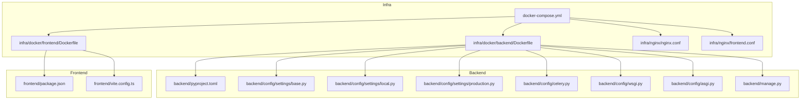
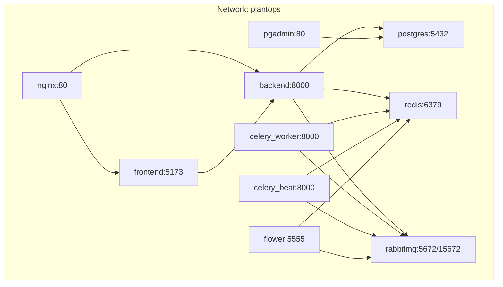
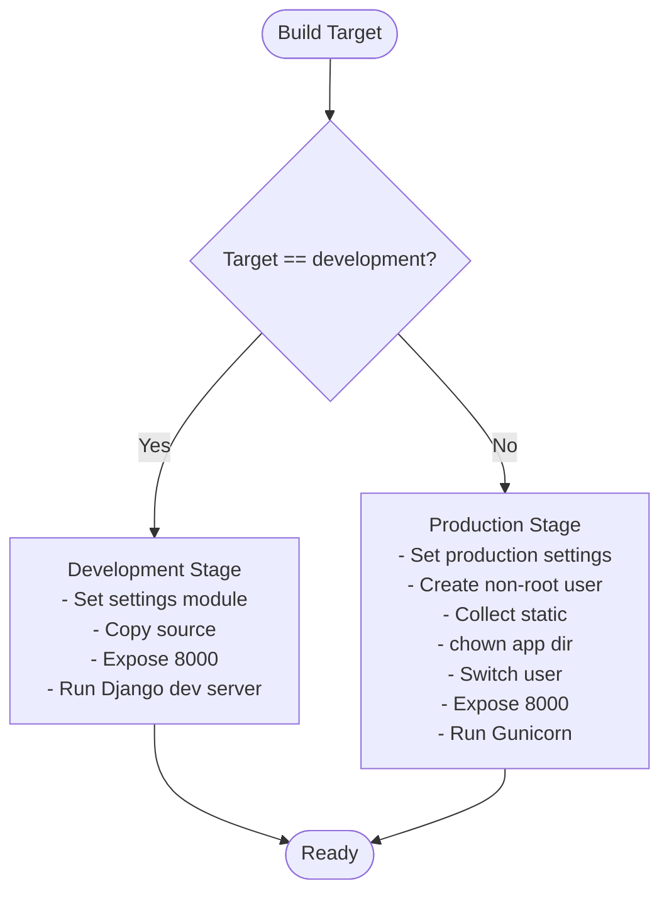
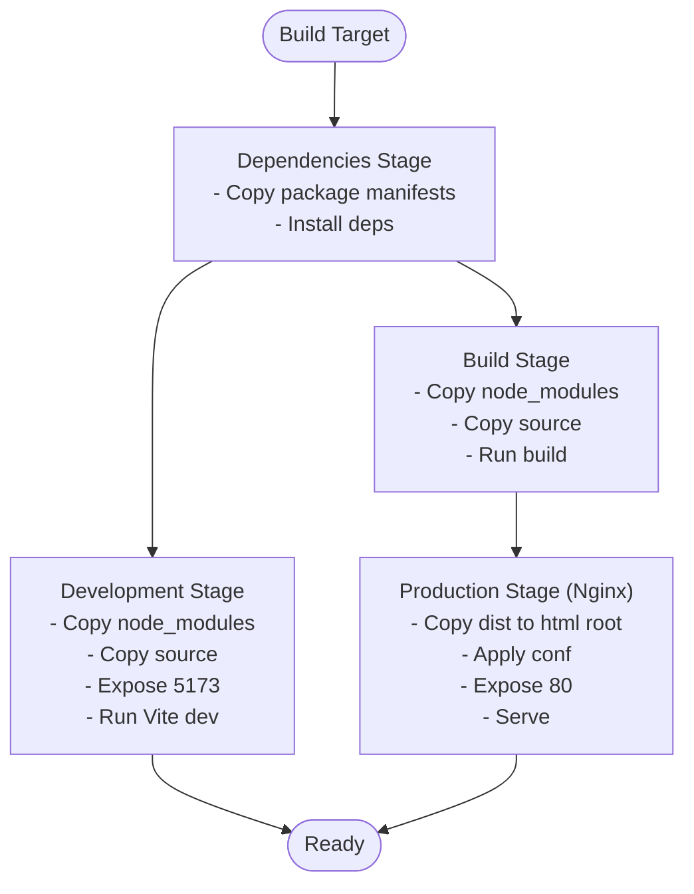
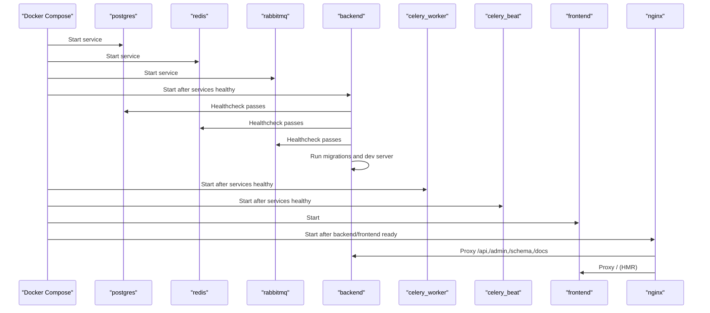
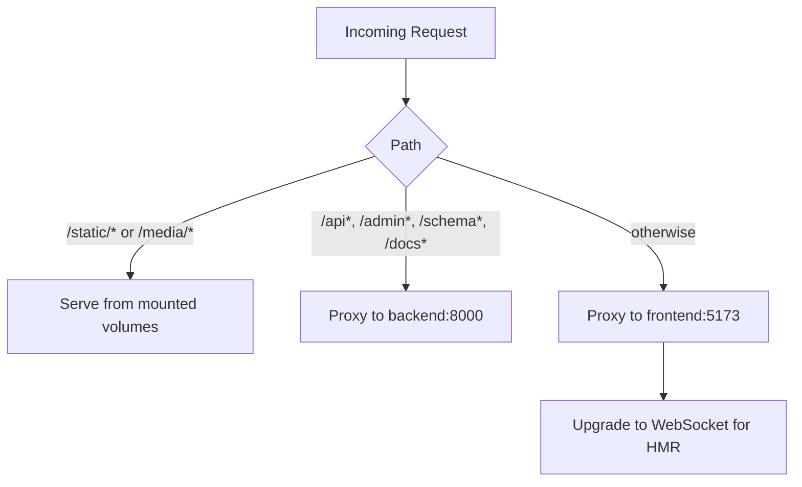
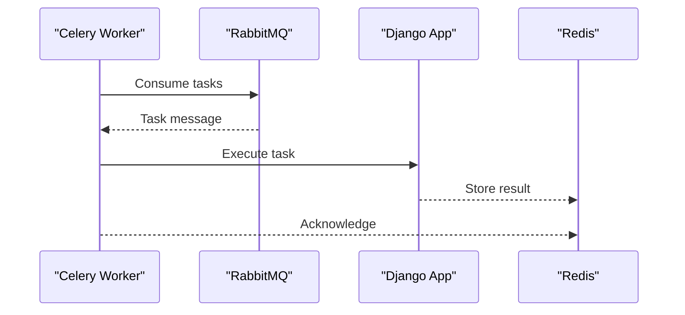
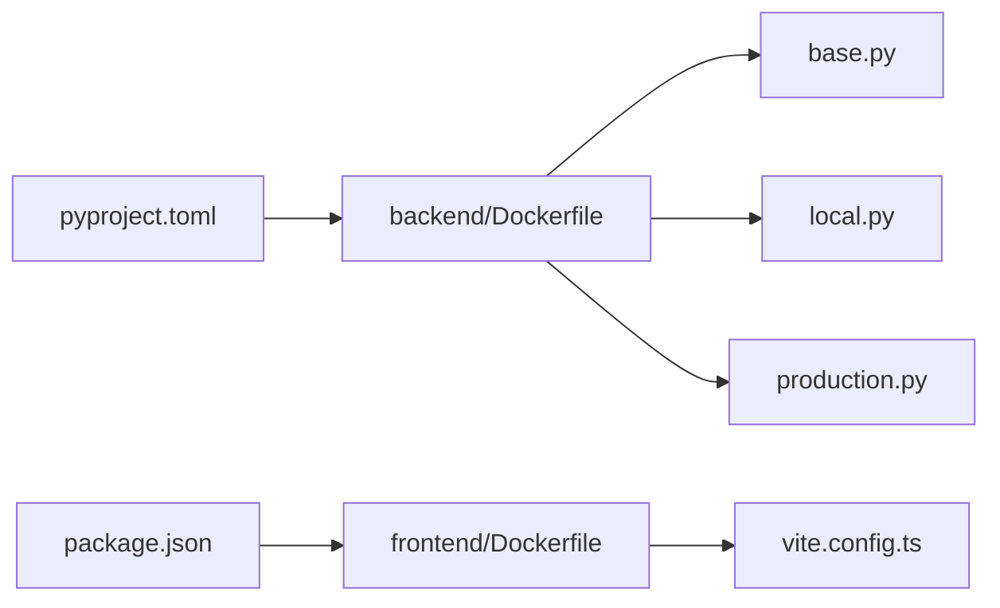

# Containerization & Orchestration

<cite>
**Referenced Files in This Document**
- [backend/Dockerfile](file://infra/docker/backend/Dockerfile)
- [frontend/Dockerfile](file://infra/docker/frontend/Dockerfile)
- [docker-compose.yml](file://docker-compose.yml)
- [pyproject.toml](file://backend/pyproject.toml)
- [package.json](file://frontend/package.json)
- [base.py](file://backend/config/settings/base.py)
- [local.py](file://backend/config/settings/local.py)
- [production.py](file://backend/config/settings/production.py)
- [celery.py](file://backend/config/celery.py)
- [vite.config.ts](file://frontend/vite.config.ts)
- [nginx.conf](file://infra/nginx/nginx.conf)
- [frontend.conf](file://infra/nginx/frontend.conf)
- [manage.py](file://backend/manage.py)
- [wsgi.py](file://backend/config/wsgi.py)
- [asgi.py](file://backend/config/asgi.py)
</cite>

## Table of Contents
1. [Introduction](#introduction)
2. [Project Structure](#project-structure)
3. [Core Components](#core-components)
4. [Architecture Overview](#architecture-overview)
5. [Detailed Component Analysis](#detailed-component-analysis)
6. [Dependency Analysis](#dependency-analysis)
7. [Performance Considerations](#performance-considerations)
8. [Troubleshooting Guide](#troubleshooting-guide)
9. [Conclusion](#conclusion)
10. [Appendices](#appendices)

## Introduction
This document explains the containerization and orchestration strategy for the PlantOps platform. It covers Docker containerization for both backend (Django) and frontend (React/Vite) services, including base image selection, dependency management, and multi-stage builds. It documents Docker Compose orchestration, including service definitions, network setup, volume mounting, environment variable management, service dependencies, startup ordering, and health checks. It also addresses container security practices, resource limits, logging configuration, development workflow with hot reloading and debugging, production-ready configurations, image optimization, deployment strategies, container networking, inter-service communication, and data persistence patterns.

## Project Structure
The repository organizes containerization artifacts under an infra directory with dedicated Dockerfiles for backend and frontend, a Docker Compose definition for orchestration, and Nginx configuration for reverse proxying and serving the frontend in production.

**Diagram sources**
- [docker-compose.yml](file://docker-compose.yml)
- [backend/Dockerfile](file://infra/docker/backend/Dockerfile)
- [frontend/Dockerfile](file://infra/docker/frontend/Dockerfile)
- [pyproject.toml](file://backend/pyproject.toml)
- [base.py](file://backend/config/settings/base.py)
- [local.py](file://backend/config/settings/local.py)
- [production.py](file://backend/config/settings/production.py)
- [celery.py](file://backend/config/celery.py)
- [wsgi.py](file://backend/config/wsgi.py)
- [asgi.py](file://backend/config/asgi.py)
- [manage.py](file://backend/manage.py)
- [package.json](file://frontend/package.json)
- [vite.config.ts](file://frontend/vite.config.ts)
- [nginx.conf](file://infra/nginx/nginx.conf)
- [frontend.conf](file://infra/nginx/frontend.conf)

**Section sources**
- [docker-compose.yml](file://docker-compose.yml)
- [backend/Dockerfile](file://infra/docker/backend/Dockerfile)
- [frontend/Dockerfile](file://infra/docker/frontend/Dockerfile)

## Core Components
- Backend service (Django): Multi-stage Dockerfile using uv for fast Python dependency installation, development and production targets, non-root user, static collection, and Gunicorn runtime.
- Frontend service (React/Vite): Multi-stage Dockerfile with dependency stage, development stage, build stage, and production stage served by Nginx.
- Orchestration (Docker Compose): Defines services for PostgreSQL, Redis, RabbitMQ, Django backend, Celery worker/beat, Nginx reverse proxy, frontend, and auxiliary tools (PgAdmin, Flower). Includes health checks, volumes, networks, environment propagation, and startup ordering.
- Nginx: Reverse proxy configuration routing API/admin to backend, static/media to mounted volumes, and frontend dev server for HMR.

Key containerization highlights:
- Python base image with uv for reproducible installs.
- Node base image with Alpine Linux for minimal footprint.
- Multi-stage builds to optimize production images.
- Non-root users for backend production.
- Health checks for stateful services.
- Shared network for internal service discovery.
- Volume mounts for persistent data and hot-reload during development.

**Section sources**
- [backend/Dockerfile](file://infra/docker/backend/Dockerfile)
- [frontend/Dockerfile](file://infra/docker/frontend/Dockerfile)
- [docker-compose.yml](file://docker-compose.yml)
- [nginx.conf](file://infra/nginx/nginx.conf)

## Architecture Overview
The system runs as a multi-container application orchestrated by Docker Compose. Services communicate over an internal bridge network. Nginx acts as a reverse proxy for API/admin traffic and frontend development HMR. PostgreSQL stores tenant-aware data, Redis supports caching/sessions and Celery results, and RabbitMQ provides the Celery broker. Celery components run as separate containers.

**Diagram sources**
- [docker-compose.yml](file://docker-compose.yml)
- [nginx.conf](file://infra/nginx/nginx.conf)

**Section sources**
- [docker-compose.yml](file://docker-compose.yml)
- [nginx.conf](file://infra/nginx/nginx.conf)

## Detailed Component Analysis

### Backend Service (Django)
- Base image and dependency management: Uses a uv-enabled Python base image and installs dependencies system-wide for faster startup.
- Development target: Sets development settings module, enables unbuffered Python output, copies source, exposes Django dev server port, and starts the development server.
- Production target: Switches to production settings, creates a non-root user, collects static files, sets ownership, switches user, exposes Gunicorn port, and runs Gunicorn with tuned workers.
- Settings integration: Environment-driven configuration via settings modules; development and production variants set security, logging, and middleware accordingly.

**Diagram sources**
- [backend/Dockerfile](file://infra/docker/backend/Dockerfile)
- [base.py](file://backend/config/settings/base.py)
- [local.py](file://backend/config/settings/local.py)
- [production.py](file://backend/config/settings/production.py)

**Section sources**
- [backend/Dockerfile](file://infra/docker/backend/Dockerfile)
- [base.py](file://backend/config/settings/base.py)
- [local.py](file://backend/config/settings/local.py)
- [production.py](file://backend/config/settings/production.py)
- [manage.py](file://backend/manage.py)
- [wsgi.py](file://backend/config/wsgi.py)
- [asgi.py](file://backend/config/asgi.py)

### Frontend Service (React/Vite)
- Base stage: Minimal Node base image with working directory.
- Dependencies stage: Copies lockfile and installs with deterministic installs.
- Development stage: Inherits node_modules, copies source, exposes Vite dev port, and runs Vite dev server with host binding.
- Build stage: Reuses node_modules, builds the app.
- Production stage: Serves built assets via Nginx with caching and single-page fallback.

**Diagram sources**
- [frontend/Dockerfile](file://infra/docker/frontend/Dockerfile)
- [package.json](file://frontend/package.json)
- [vite.config.ts](file://frontend/vite.config.ts)
- [frontend.conf](file://infra/nginx/frontend.conf)

**Section sources**
- [frontend/Dockerfile](file://infra/docker/frontend/Dockerfile)
- [package.json](file://frontend/package.json)
- [vite.config.ts](file://frontend/vite.config.ts)
- [frontend.conf](file://infra/nginx/frontend.conf)

### Orchestration with Docker Compose
- Services: postgres, redis, rabbitmq, backend, celery_worker, celery_beat, frontend, nginx, pgadmin, flower.
- Networks: Internal bridge network named plantops for service discovery.
- Volumes: Named volumes for persistent data and shared static/media directories.
- Environment propagation: Uses env_file and environment blocks; settings modules read environment variables.
- Health checks: PostgreSQL, Redis, RabbitMQ configured with health probes.
- Startup ordering: depends_on with service_healthy conditions ensures dependent services wait for readiness.
- Commands: Backend performs schema migrations and starts dev server; Celery components start workers and scheduler; Nginx proxies requests; Flower monitors Celery.

**Diagram sources**
- [docker-compose.yml](file://docker-compose.yml)

**Section sources**
- [docker-compose.yml](file://docker-compose.yml)

### Nginx Reverse Proxy
- Routes static/media to mounted volumes.
- Proxies API/admin/docs to backend service.
- Proxies root to frontend dev server for HMR.
- Enables WebSocket upgrade for Vite HMR.

**Diagram sources**
- [nginx.conf](file://infra/nginx/nginx.conf)

**Section sources**
- [nginx.conf](file://infra/nginx/nginx.conf)

### Celery Configuration
- Broker: RabbitMQ.
- Result backend: Redis.
- Task autodiscovery loads tasks from Django apps.
- Flower monitoring service connects to RabbitMQ API for inspection.

**Diagram sources**
- [celery.py](file://backend/config/celery.py)
- [docker-compose.yml](file://docker-compose.yml)

**Section sources**
- [celery.py](file://backend/config/celery.py)
- [docker-compose.yml](file://docker-compose.yml)

## Dependency Analysis
- Backend Python dependencies are declared in pyproject.toml and installed via uv in the Dockerfile. The Dockerfile also installs Gunicorn for production WSGI.
- Frontend dependencies are declared in package.json and installed deterministically in the dependencies stage.
- Django settings modules define environment-driven configuration, including database, cache, Celery, CORS, and logging.

**Diagram sources**
- [pyproject.toml](file://backend/pyproject.toml)
- [package.json](file://frontend/package.json)
- [backend/Dockerfile](file://infra/docker/backend/Dockerfile)
- [frontend/Dockerfile](file://infra/docker/frontend/Dockerfile)
- [base.py](file://backend/config/settings/base.py)
- [local.py](file://backend/config/settings/local.py)
- [production.py](file://backend/config/settings/production.py)
- [vite.config.ts](file://frontend/vite.config.ts)

**Section sources**
- [pyproject.toml](file://backend/pyproject.toml)
- [package.json](file://frontend/package.json)
- [backend/Dockerfile](file://infra/docker/backend/Dockerfile)
- [frontend/Dockerfile](file://infra/docker/frontend/Dockerfile)
- [base.py](file://backend/config/settings/base.py)
- [local.py](file://backend/config/settings/local.py)
- [production.py](file://backend/config/settings/production.py)
- [vite.config.ts](file://frontend/vite.config.ts)

## Performance Considerations
- Image size and startup: Multi-stage builds reduce production image size; uv accelerates dependency installation; bytecode compilation enabled for faster Python startup.
- Static asset delivery: Nginx serves static/media with caching headers; frontend production stage caches assets.
- Database connections: Production settings enable connection pooling via CONN_MAX_AGE.
- Celery concurrency: Celery worker command specifies concurrency; adjust based on CPU and memory resources.
- Resource limits: Add container resource constraints in Docker Compose for CPU/memory to prevent contention.

[No sources needed since this section provides general guidance]

## Troubleshooting Guide
- Health checks failing:
  - Verify credentials and service readiness commands for PostgreSQL, Redis, and RabbitMQ.
  - Confirm environment variables for service URLs and credentials.
- Django migrations not applied:
  - Ensure backend command runs migrations before starting the dev server.
  - Check database connectivity and schema initialization scripts.
- Celery tasks not processed:
  - Confirm RabbitMQ and Redis are healthy and reachable.
  - Verify BROKER_URL and RESULT_BACKEND in settings match service names.
- Frontend hot reload issues:
  - Ensure Vite proxy target matches backend URL.
  - Confirm Nginx forwards WebSocket upgrades for HMR.
- Logging visibility:
  - Development logs are printed to console; adjust log levels in settings modules.

**Section sources**
- [docker-compose.yml](file://docker-compose.yml)
- [base.py](file://backend/config/settings/base.py)
- [local.py](file://backend/config/settings/local.py)
- [production.py](file://backend/config/settings/production.py)
- [vite.config.ts](file://frontend/vite.config.ts)
- [nginx.conf](file://infra/nginx/nginx.conf)

## Conclusion
The containerization and orchestration strategy leverages multi-stage Docker builds, deterministic dependency management, and a robust Docker Compose setup with health checks and ordered startup. The backend and frontend are isolated yet integrated via Nginx, while stateful services (PostgreSQL, Redis, RabbitMQ) are persisted and monitored. The configuration supports secure production deployments, efficient development workflows, and scalable inter-service communication.

[No sources needed since this section summarizes without analyzing specific files]

## Appendices

### Development Workflow
- Hot reloading:
  - Frontend dev server runs on port 5173; Nginx proxies root to the frontend for HMR.
  - Vite proxy forwards /api to backend service.
- Debugging:
  - Backend development settings enable Django Debug Toolbar.
  - Console logging configured for development; increase verbosity as needed.
- Local best practices:
  - Use cached bind mounts for code to speed up iteration.
  - Keep environment variables in .env and propagate via env_file.
  - Run migrations automatically in backend command before starting the server.

**Section sources**
- [docker-compose.yml](file://docker-compose.yml)
- [local.py](file://backend/config/settings/local.py)
- [vite.config.ts](file://frontend/vite.config.ts)
- [nginx.conf](file://infra/nginx/nginx.conf)

### Production-Ready Configuration
- Image optimization:
  - Use production targets in Dockerfiles; collect static and switch to non-root user.
  - Minimize layers and avoid installing build tools in production.
- Security:
  - Enforce HTTPS and HSTS in production settings.
  - Restrict allowed hosts and trusted origins.
  - Use environment variables for secrets and disable DEBUG.
- Observability:
  - Configure logging formatters and handlers.
  - Optionally integrate monitoring (e.g., Sentry) via environment variables.
- Deployment:
  - Use Docker Compose for orchestration; scale services as needed.
  - Persist volumes for databases and caches; mount static/media via Nginx.

**Section sources**
- [backend/Dockerfile](file://infra/docker/backend/Dockerfile)
- [frontend/Dockerfile](file://infra/docker/frontend/Dockerfile)
- [production.py](file://backend/config/settings/production.py)
- [base.py](file://backend/config/settings/base.py)

### Container Networking and Data Persistence
- Networking:
  - Internal bridge network named plantops; services discover each other by service name.
- Data persistence:
  - Named volumes for PostgreSQL, Redis, RabbitMQ, Celery beat state, and static/media directories.
- Inter-service communication:
  - Backend connects to PostgreSQL, Redis, and RabbitMQ using service names.
  - Nginx routes API/admin to backend and static/media to mounted volumes.

**Section sources**
- [docker-compose.yml](file://docker-compose.yml)
- [nginx.conf](file://infra/nginx/nginx.conf)