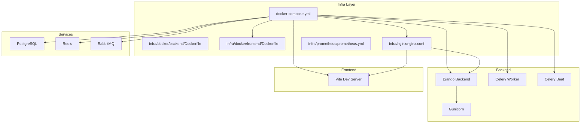
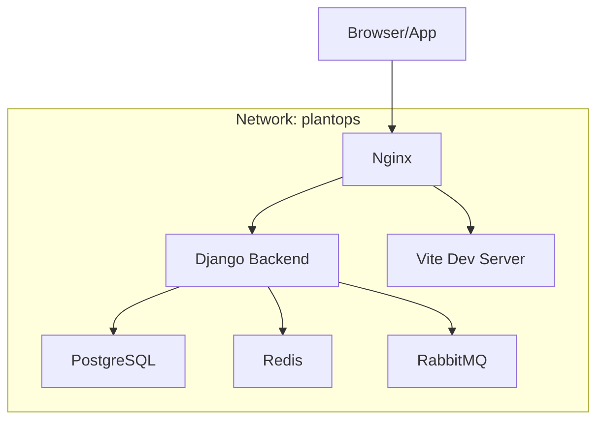
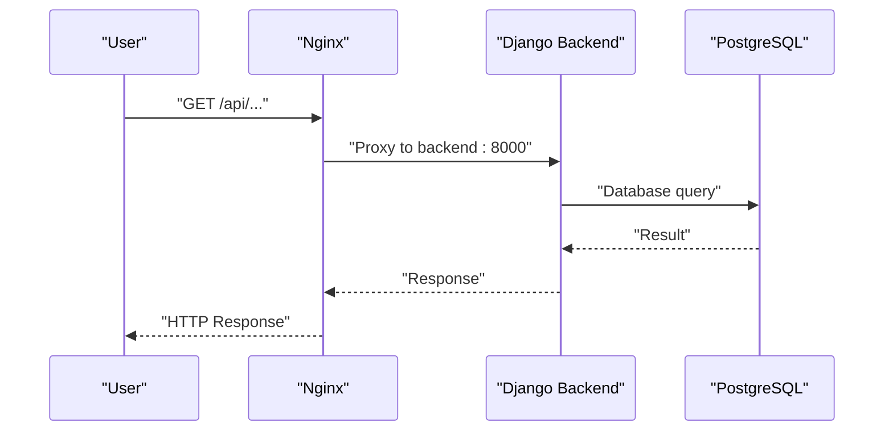
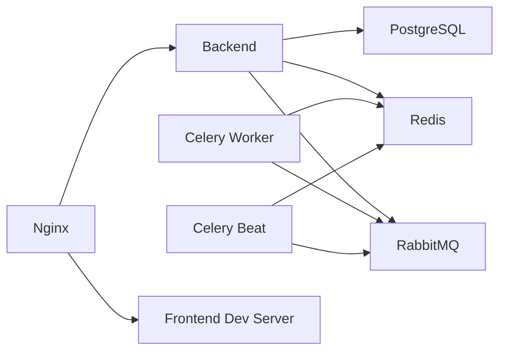

# Infrastructure & Deployment

<cite>
**Referenced Files in This Document**
- [docker-compose.yml](file://docker-compose.yml)
- [backend/Dockerfile](file://infra/docker/backend/Dockerfile)
- [frontend/Dockerfile](file://infra/docker/frontend/Dockerfile)
- [nginx.conf](file://infra/nginx/nginx.conf)
- [prometheus.yml](file://infra/prometheus/prometheus.yml)
- [base.py](file://backend/config/settings/base.py)
- [local.py](file://backend/config/settings/local.py)
- [production.py](file://backend/config/settings/production.py)
- [manage.py](file://backend/manage.py)
- [vite.config.ts](file://frontend/vite.config.ts)
- [asgi.py](file://backend/config/asgi.py)
- [wsgi.py](file://backend/config/wsgi.py)
- [celery.py](file://backend/config/celery.py)
</cite>

## Table of Contents
1. [Introduction](#introduction)
2. [Project Structure](#project-structure)
3. [Core Components](#core-components)
4. [Architecture Overview](#architecture-overview)
5. [Detailed Component Analysis](#detailed-component-analysis)
6. [Dependency Analysis](#dependency-analysis)
7. [Performance Considerations](#performance-considerations)
8. [Troubleshooting Guide](#troubleshooting-guide)
9. [Conclusion](#conclusion)
10. [Appendices](#appendices)

## Introduction
This document provides comprehensive infrastructure and deployment guidance for the containerized PlantOps platform. It covers Docker containerization strategies for backend and frontend services, Docker Compose orchestration (dependencies, networking, volumes), Nginx reverse proxy configuration, monitoring with Prometheus and Grafana, deployment topologies for development, staging, and production, scaling and high availability strategies, CI/CD integration points, and troubleshooting procedures for networking, service discovery, and resource allocation.

## Project Structure
The repository organizes infrastructure assets under an infra directory and defines a single docker-compose.yml that orchestrates all services. The backend is a Django application configured for multi-tenancy and orchestrated via Gunicorn in production. The frontend is a Vite/React application built for development and served statically via Nginx in production.

**Diagram sources**
- [docker-compose.yml](file://docker-compose.yml)
- [backend/Dockerfile](file://infra/docker/backend/Dockerfile)
- [frontend/Dockerfile](file://infra/docker/frontend/Dockerfile)
- [nginx.conf](file://infra/nginx/nginx.conf)

**Section sources**
- [docker-compose.yml](file://docker-compose.yml)
- [backend/Dockerfile](file://infra/docker/backend/Dockerfile)
- [frontend/Dockerfile](file://infra/docker/frontend/Dockerfile)
- [nginx.conf](file://infra/nginx/nginx.conf)

## Core Components
- PostgreSQL: Multi-tenant database using django-tenants with schema-per-tenant isolation.
- Redis: Caching, sessions, and Celery result backend.
- RabbitMQ: Celery broker with management UI.
- Django Backend: Multi-tenant Django app with Gunicorn in production and development server in compose.
- Celery Worker and Beat: Task processing and scheduling backed by Redis and RabbitMQ.
- Frontend: Vite/React dev server in compose; production build served via Nginx.
- Nginx: Reverse proxy for API/admin routes and static/media, plus frontend dev proxy with WebSocket support.
- Monitoring: Prometheus scraping Django metrics endpoint; Grafana dashboards can be added via Grafana provisioning.

**Section sources**
- [docker-compose.yml](file://docker-compose.yml)
- [base.py](file://backend/config/settings/base.py)
- [celery.py](file://backend/config/celery.py)
- [nginx.conf](file://infra/nginx/nginx.conf)
- [prometheus.yml](file://infra/prometheus/prometheus.yml)

## Architecture Overview
The platform runs on a single Docker network named plantops. Services communicate by DNS names: backend, frontend, postgres, redis, rabbitmq. Nginx fronts the stack, routing API/admin traffic to the backend and frontend dev server to Vite’s HMR. Static and media assets are mounted from dedicated volumes and exposed via Nginx.

**Diagram sources**
- [docker-compose.yml](file://docker-compose.yml)
- [nginx.conf](file://infra/nginx/nginx.conf)

## Detailed Component Analysis

### Docker Containerization Strategies

#### Backend Service
- Development stage uses Django’s development server with hot-reload and mounted code directory.
- Production stage uses Gunicorn with multiple workers, collects static files, and runs as non-root user.
- Environment variables are loaded from .env via compose; settings modules switch between local and production.

Key behaviors:
- Bytecode compilation enabled for faster startup.
- Health checks for database and cache systems ensure readiness gates.
- Static/media volumes are mounted for Nginx consumption.

**Section sources**
- [backend/Dockerfile](file://infra/docker/backend/Dockerfile)
- [docker-compose.yml](file://docker-compose.yml)
- [base.py](file://backend/config/settings/base.py)
- [local.py](file://backend/config/settings/local.py)
- [production.py](file://backend/config/settings/production.py)

#### Frontend Service
- Development stage runs Vite dev server with host binding and proxy to backend API.
- Production stage builds assets and serves them via Nginx using a dedicated configuration.

**Section sources**
- [frontend/Dockerfile](file://infra/docker/frontend/Dockerfile)
- [vite.config.ts](file://frontend/vite.config.ts)
- [docker-compose.yml](file://docker-compose.yml)

#### Nginx Reverse Proxy
- Serves static and media files from mounted volumes.
- Proxies API/admin routes to backend service.
- Proxies root path to frontend dev server with WebSocket support for HMR.
- Sets standard proxy headers and handles connection upgrades.

**Section sources**
- [nginx.conf](file://infra/nginx/nginx.conf)
- [docker-compose.yml](file://docker-compose.yml)

#### Monitoring Setup (Prometheus)
- Prometheus scrapes the Django backend metrics endpoint at /metrics.
- Configure Grafana dashboards via provisioning to visualize metrics.

**Section sources**
- [prometheus.yml](file://infra/prometheus/prometheus.yml)
- [base.py](file://backend/config/settings/base.py)

### Orchestration with Docker Compose
- Single-network design with explicit service dependencies and health checks.
- Persistent volumes for databases and caches.
- Shared static/media volumes for Nginx.
- Separate commands for backend (migrations + runserver) and Celery components.

**Diagram sources**
- [docker-compose.yml](file://docker-compose.yml)
- [nginx.conf](file://infra/nginx/nginx.conf)

**Section sources**
- [docker-compose.yml](file://docker-compose.yml)

### Django Settings and Runtime Integration
- Multi-tenancy via django-tenants with separate SHARED_APPS and TENANT_APPS lists.
- Celery configuration uses RabbitMQ broker and Redis result backend.
- Production settings enable HTTPS headers and performance tuning.
- WSGI/ASGI entry points are configured for Gunicorn.

**Section sources**
- [base.py](file://backend/config/settings/base.py)
- [local.py](file://backend/config/settings/local.py)
- [production.py](file://backend/config/settings/production.py)
- [celery.py](file://backend/config/celery.py)
- [wsgi.py](file://backend/config/wsgi.py)
- [asgi.py](file://backend/config/asgi.py)
- [manage.py](file://backend/manage.py)

## Dependency Analysis
- Backend depends on PostgreSQL, Redis, and RabbitMQ; health checks gate startup.
- Celery worker and beat depend on RabbitMQ and Redis.
- Nginx depends on backend and frontend services.
- Frontend dev server proxies API requests to backend.

**Diagram sources**
- [docker-compose.yml](file://docker-compose.yml)

**Section sources**
- [docker-compose.yml](file://docker-compose.yml)

## Performance Considerations
- Use production-grade WSGI server (Gunicorn) with tuned concurrency and timeouts.
- Enable connection pooling and keep-alive where applicable.
- Mount persistent volumes for databases and caches to avoid data loss and improve IO.
- Use CDN or external storage for static/media in production.
- Tune Celery concurrency and queues per workload.
- Enable compression and caching at Nginx level.

[No sources needed since this section provides general guidance]

## Troubleshooting Guide
Common issues and resolutions:
- Service fails to start due to unmet dependencies:
  - Verify health checks pass for Postgres, Redis, and RabbitMQ before dependent services start.
  - Confirm environment variables for database and broker are set consistently across services.
- Network connectivity problems:
  - Ensure all services are on the same network and use service DNS names for inter-service communication.
  - Validate allowed hosts and CSRF origins in Django settings for local development.
- Static/media not served:
  - Confirm static/media volumes are mounted and Nginx aliases point to correct paths.
- Celery tasks not processed:
  - Check RabbitMQ credentials and Redis availability; verify Celery worker logs.
- Metrics not scraped:
  - Ensure Django exposes /metrics and Prometheus target matches backend service and port.

**Section sources**
- [docker-compose.yml](file://docker-compose.yml)
- [nginx.conf](file://infra/nginx/nginx.conf)
- [base.py](file://backend/config/settings/base.py)
- [local.py](file://backend/config/settings/local.py)
- [prometheus.yml](file://infra/prometheus/prometheus.yml)

## Conclusion
The platform leverages a clean, container-first architecture with Docker and Docker Compose to orchestrate a multi-tenant Django backend, a Vite-powered frontend, supporting data and messaging services, and a reverse proxy for unified ingress. With health checks, persistent volumes, and modular configuration, it supports repeatable deployments across environments and can be extended for monitoring, CI/CD, and high availability.

[No sources needed since this section summarizes without analyzing specific files]

## Appendices

### Deployment Topologies

- Development
  - Use docker-compose with development targets for backend and frontend.
  - Enable Django debug toolbar and mount code directories for hot reload.
  - Expose ports for backend (8000), frontend (5173), and database (5432) as needed.

- Staging
  - Use production Dockerfile targets for backend and frontend production builds.
  - Run Nginx to serve static assets and proxy API/admin traffic.
  - Enable production settings and secure headers.

- Production
  - Replace Nginx with a hardened reverse proxy and TLS termination.
  - Scale backend and Celery workers horizontally behind a load balancer.
  - Use managed database and message broker services for HA.
  - Integrate monitoring with Prometheus and Grafana dashboards.

[No sources needed since this section provides general guidance]

### Scaling and High Availability
- Horizontal scaling:
  - Run multiple backend replicas behind a load balancer.
  - Scale Celery workers and beat based on queue depth and task throughput.
- Partitioning:
  - Use database sharding or separate tenants per database/schema as appropriate.
- High availability:
  - Use managed services for PostgreSQL, Redis, and RabbitMQ with replication.
  - Employ rolling updates and blue/green deployments via orchestration.

[No sources needed since this section provides general guidance]

### CI/CD Pipeline Integration
- Build stages:
  - Build backend and frontend images using multi-stage Dockerfiles.
- Test automation:
  - Add unit/integration tests in CI jobs prior to image push.
- Release management:
  - Tag releases and deploy via orchestration tooling.
- Secrets management:
  - Inject secrets via environment files or secret managers during deployment.

[No sources needed since this section provides general guidance]