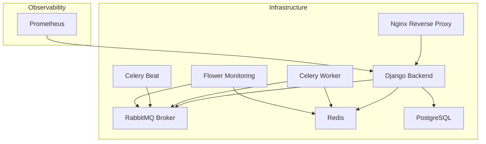
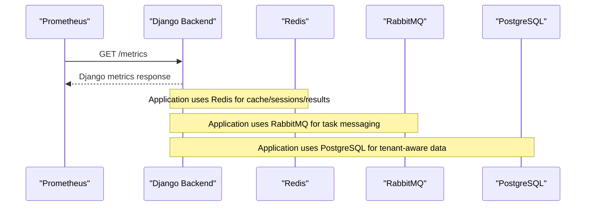
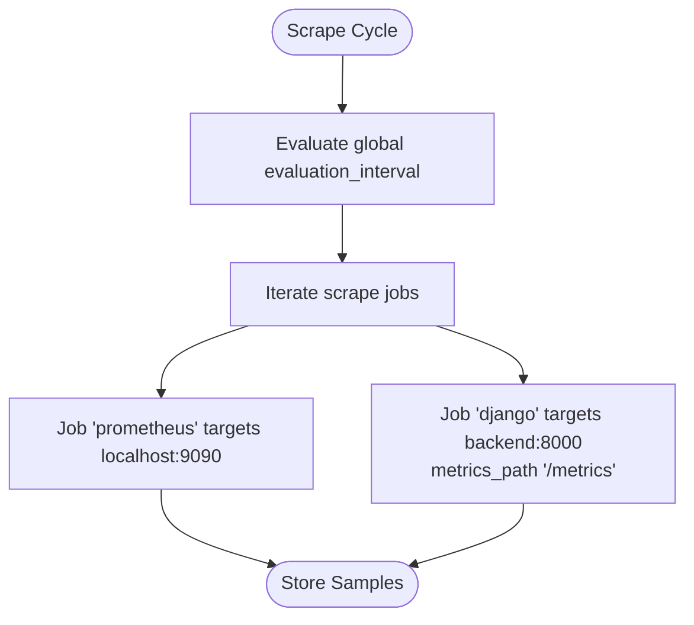
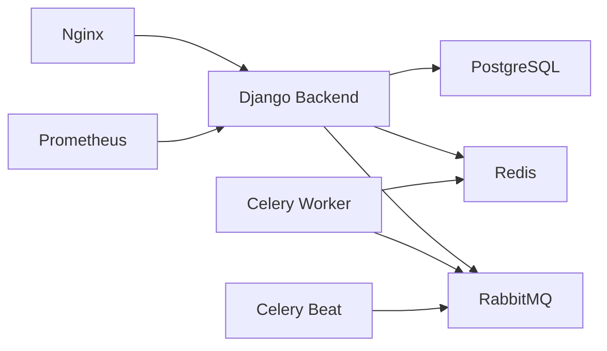

# Monitoring & Observability

<cite>
**Referenced Files in This Document**
- [docker-compose.yml](file://docker-compose.yml)
- [docker-compose.override.yml](file://docker-compose.override.yml)
- [prometheus.yml](file://infra/prometheus/prometheus.yml)
- [base.py](file://backend/config/settings/base.py)
- [production.py](file://backend/config/settings/production.py)
- [celery.py](file://backend/config/celery.py)
- [pyproject.toml](file://backend/pyproject.toml)
- [IOT_INGEST.md](file://backend/docs/architecture/IOT_INGEST.md)
</cite>

## Table of Contents
1. [Introduction](#introduction)
2. [Project Structure](#project-structure)
3. [Core Components](#core-components)
4. [Architecture Overview](#architecture-overview)
5. [Detailed Component Analysis](#detailed-component-analysis)
6. [Dependency Analysis](#dependency-analysis)
7. [Performance Considerations](#performance-considerations)
8. [Troubleshooting Guide](#troubleshooting-guide)
9. [Conclusion](#conclusion)
10. [Appendices](#appendices)

## Introduction
This document provides comprehensive monitoring and observability guidance for the platform infrastructure. It covers Prometheus metrics collection configuration, Grafana dashboards, application-level metrics, infrastructure monitoring, alerting, logging, distributed tracing, troubleshooting workflows, and capacity planning baselines. The repository currently includes a Prometheus configuration for scraping Django application metrics and a local Docker Compose setup with supporting services such as PostgreSQL, Redis, RabbitMQ, Celery, Nginx, and Flower. Additional components like Grafana dashboards, alerting policies, and centralized logging are not present in the repository and are therefore not covered in this document.

## Project Structure
The monitoring and observability stack spans container orchestration, metrics collection, and application configuration:
- Container orchestration defines services for backend, Celery workers, RabbitMQ, Redis, PostgreSQL, Nginx, and Flower.
- Prometheus is configured to scrape the Django application metrics endpoint.
- Django settings define logging and optional Sentry integration for error tracking and tracing sampling.
- Celery configuration integrates with RabbitMQ and Redis for task processing visibility via Flower.

**Diagram sources**
- [docker-compose.yml](file://docker-compose.yml)
- [prometheus.yml](file://infra/prometheus/prometheus.yml)

**Section sources**
- [docker-compose.yml](file://docker-compose.yml)
- [prometheus.yml](file://infra/prometheus/prometheus.yml)

## Core Components
- Prometheus metrics collection
  - Scraping interval: 15 seconds globally.
  - Targets: Prometheus self-scrape and Django backend metrics endpoint.
  - Metrics path for Django: /metrics.
- Django application metrics
  - Exposes Prometheus metrics via django-prometheus.
  - Logging configuration supports console output with verbose formatting.
  - Optional Sentry integration enabled in production settings for error tracking and tracing sampling.
- Celery monitoring
  - Flower service is provisioned for monitoring Celery tasks and queues.
  - Celery configuration uses RabbitMQ as the broker and Redis as the result backend.

**Section sources**
- [prometheus.yml](file://infra/prometheus/prometheus.yml)
- [base.py](file://backend/config/settings/base.py)
- [production.py](file://backend/config/settings/production.py)
- [celery.py](file://backend/config/celery.py)
- [docker-compose.yml](file://docker-compose.yml)

## Architecture Overview
The observability architecture centers on Prometheus scraping the Django application metrics endpoint, complemented by service-level health checks and Celery monitoring via Flower. The backend service depends on PostgreSQL, Redis, and RabbitMQ, while Nginx fronts the application.

**Diagram sources**
- [prometheus.yml](file://infra/prometheus/prometheus.yml)
- [docker-compose.yml](file://docker-compose.yml)

## Detailed Component Analysis

### Prometheus Metrics Collection
- Global scrape interval: 15 seconds.
- Jobs:
  - Prometheus self-monitoring scraping localhost:9090.
  - Django job scraping backend:8000 with metrics_path set to /metrics.
- Recommendations:
  - Add service discovery for dynamic environments (e.g., Kubernetes SD or file-based SD).
  - Configure relabeling and filtering for tenant-aware metrics if multi-tenancy introduces label cardinality concerns.
  - Set up recording rules for frequently queried expressions to reduce query load.

**Diagram sources**
- [prometheus.yml](file://infra/prometheus/prometheus.yml)

**Section sources**
- [prometheus.yml](file://infra/prometheus/prometheus.yml)

### Grafana Dashboards and Data Sources
- Current state: No Grafana dashboards or data source configuration found in the repository.
- Recommended approach:
  - Provision Grafana via Docker Compose or Helm with persistent storage.
  - Add Prometheus as a data source with URL http://prometheus:9090.
  - Import or create dashboards for:
    - Django application metrics (request duration, request rate, error rate).
    - Infrastructure metrics (CPU, memory, disk, network) using node_exporter.
    - Database metrics (PostgreSQL exporter) and Redis metrics.
    - Celery metrics via Flower and/or Celery Prometheus exporters.
  - Use templating for tenant selection and environment switching.

[No sources needed since this section provides general guidance]

### Application-Level Metrics
- Request latency and rate:
  - Exposed via Django Prometheus metrics; instrument API endpoints for histogram summaries.
- Error rates:
  - Track HTTP 5xx errors; integrate with Sentry for error capture and tracing sampling.
- Queue processing times:
  - Monitor Celery task durations and queue lengths; visualize via Flower and Prometheus metrics.
- Database performance:
  - Use PostgreSQL exporter for metrics such as connections, query durations, and replication lag.
  - Track tenant-specific schemas and connection pooling behavior.

**Section sources**
- [base.py](file://backend/config/settings/base.py)
- [production.py](file://backend/config/settings/production.py)
- [docker-compose.yml](file://docker-compose.yml)

### Infrastructure Monitoring
- Services health:
  - Health checks for PostgreSQL, Redis, and RabbitMQ are defined in Docker Compose.
- Container-level metrics:
  - Deploy node_exporter and cAdvisor for CPU, memory, disk, and network utilization.
  - Aggregate metrics in Prometheus and visualize in Grafana.
- Network and proxy:
  - Nginx access and error logs can be aggregated; monitor upstream backend latency and error rates.

**Section sources**
- [docker-compose.yml](file://docker-compose.yml)

### Alerting Policies, Notification Channels, and Escalation
- Current state: No alertmanager configuration or alerting rules found in the repository.
- Recommended approach:
  - Define Prometheus alerting rules for:
    - High error rates (>5% over 5m).
    - Increased latency (p95/p99 > thresholds).
    - Queue backlog growth (Celery task count).
    - Database connection exhaustion or slow queries.
    - Infrastructure saturation (CPU, memory, disk, network).
  - Configure Alertmanager with Slack, email, or PagerDuty receivers.
  - Establish escalation tiers: first response (on-call engineer), secondary review, manager escalation.

[No sources needed since this section provides general guidance]

### Log Aggregation, Centralized Logging, and Structured Logging
- Current state: Django logging is configured to console with verbose formatting; no centralized logging stack is present.
- Recommended approach:
  - Ship logs to a centralized collector (e.g., Vector, Fluent Bit, or Loki).
  - Use structured logging with JSON format for easier parsing and filtering.
  - Store logs in Loki or Elasticsearch and visualize in Grafana.
  - Ensure sensitive data is redacted and logs are rotated.

**Section sources**
- [base.py](file://backend/config/settings/base.py)

### Distributed Tracing, Correlation IDs, and Profiling
- Current state: Optional Sentry SDK initialization exists in production settings with tracing sampling enabled.
- Recommended approach:
  - Integrate OpenTelemetry SDK for distributed tracing across services.
  - Propagate correlation IDs via HTTP headers and include them in logs.
  - Use profiling tools (e.g., Py-Spy) for CPU flamegraphs and memory profiling.
  - Export traces to Jaeger or Tempo and visualize in Grafana.

**Section sources**
- [production.py](file://backend/config/settings/production.py)

### Troubleshooting Workflows
- Monitoring gaps:
  - Verify Prometheus targets are healthy and reachable.
  - Confirm metrics_path and port exposure for the backend service.
  - Check service dependencies (PostgreSQL, Redis, RabbitMQ) health.
- False positives:
  - Tune alert thresholds and window sizes; use multiple aggregations (rate, increase, histogram quantiles).
  - Apply alert deduplication and silences during maintenance windows.
- Alert fatigue:
  - Implement hierarchical alerting and on-call rotation.
  - Regularly review and refine alert rules; remove stale or low-signal alerts.

[No sources needed since this section provides general guidance]

## Dependency Analysis
The backend service depends on PostgreSQL, Redis, and RabbitMQ. Celery workers and beat depend on RabbitMQ and Redis. Nginx proxies traffic to the backend. Prometheus scrapes the backend metrics endpoint.

**Diagram sources**
- [docker-compose.yml](file://docker-compose.yml)
- [prometheus.yml](file://infra/prometheus/prometheus.yml)

**Section sources**
- [docker-compose.yml](file://docker-compose.yml)
- [prometheus.yml](file://infra/prometheus/prometheus.yml)

## Performance Considerations
- Scraping cadence:
  - 15s scrape interval balances freshness and overhead; adjust for high-cardinality metrics.
- Query performance:
  - Use recording rules for heavy aggregations; limit label cardinality for tenant-aware metrics.
- Database tuning:
  - Monitor connection pool usage; consider pooling parameters and connection timeouts.
- Task throughput:
  - Scale Celery workers based on queue depth and task durations; monitor broker and result backend performance.

[No sources needed since this section provides general guidance]

## Troubleshooting Guide
- Django metrics not appearing:
  - Ensure django-prometheus is installed and the /metrics endpoint is exposed.
  - Verify backend container is healthy and reachable from Prometheus.
- Celery monitoring:
  - Confirm Flower is reachable and connected to RabbitMQ and Redis.
  - Check Celery worker logs for startup and task execution issues.
- Logging:
  - Validate log formatters and handlers; ensure logs are shipped to the centralized collector.
- Tracing:
  - Confirm Sentry DSN and traces_sample_rate in production settings; verify trace propagation.

**Section sources**
- [pyproject.toml](file://backend/pyproject.toml)
- [docker-compose.yml](file://docker-compose.yml)
- [production.py](file://backend/config/settings/production.py)

## Conclusion
The repository establishes a solid foundation for observability with Prometheus scraping Django metrics and a local Docker Compose environment. To achieve comprehensive monitoring and observability, extend the setup by provisioning Grafana dashboards, adding infrastructure metrics, implementing alerting rules and notification channels, centralizing logs, enabling distributed tracing, and establishing capacity planning baselines. These enhancements will improve incident response, operational reliability, and long-term scalability.

## Appendices
- Background on data ingestion and processing principles that influence observability:
  - Devices append-only raw readings; processing is idempotent; alerts are append-only events.
  - These principles support reliable metrics computation and alert generation.

**Section sources**
- [IOT_INGEST.md](file://backend/docs/architecture/IOT_INGEST.md)