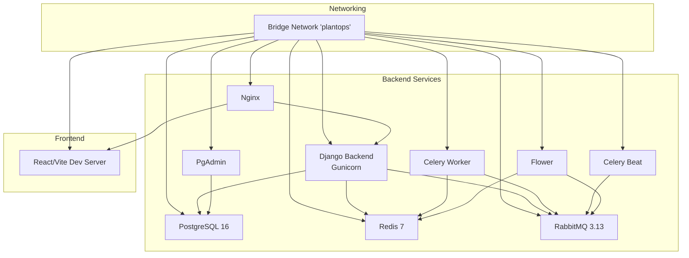
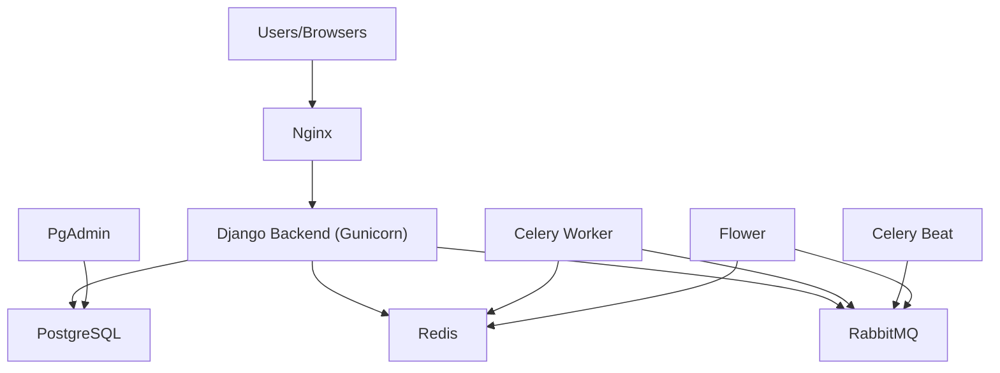
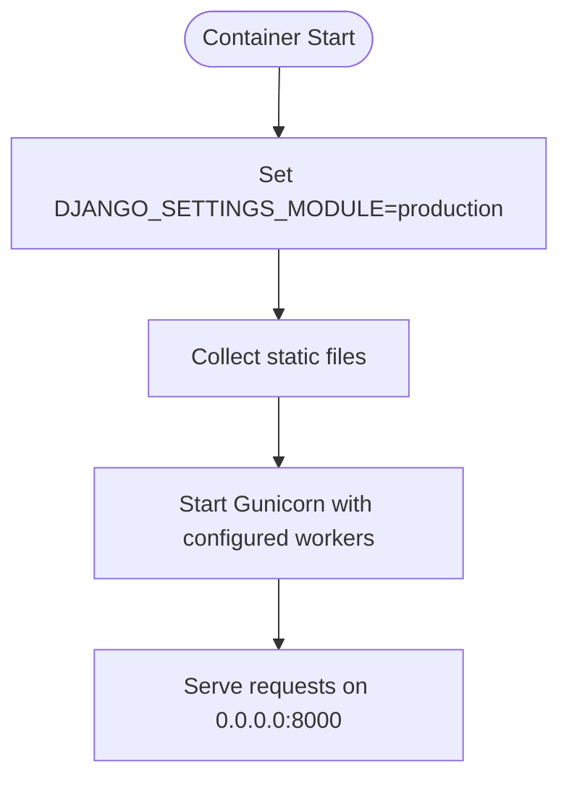
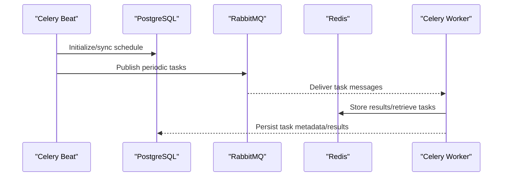
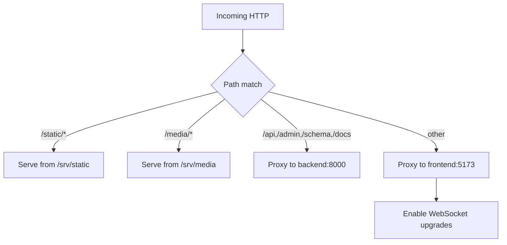
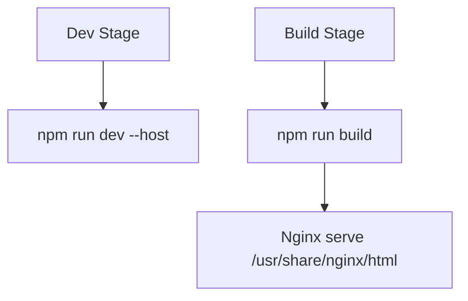
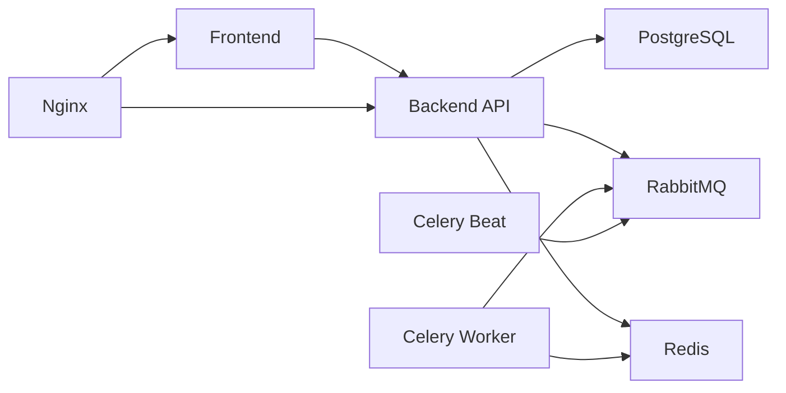
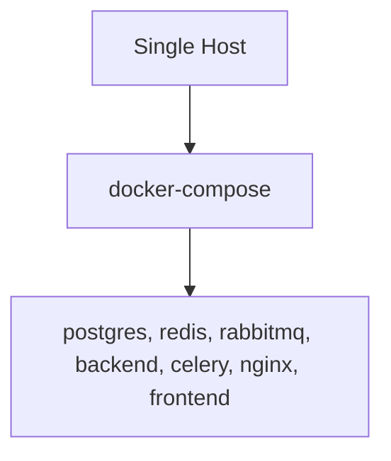

# Production Deployment

<cite>
**Referenced Files in This Document**
- [docker-compose.yml](file://docker-compose.yml)
- [Dockerfile (backend)](file://infra/docker/backend/Dockerfile)
- [Dockerfile (frontend)](file://infra/docker/frontend/Dockerfile)
- [nginx.conf](file://infra/nginx/nginx.conf)
- [pyproject.toml](file://backend/pyproject.toml)
- [base.py](file://backend/config/settings/base.py)
- [production.py](file://backend/config/settings/production.py)
- [local.py](file://backend/config/settings/local.py)
- [test.py](file://backend/config/settings/test.py)
- [celery.py](file://backend/config/celery.py)
- [wsgi.py](file://backend/config/wsgi.py)
- [asgi.py](file://backend/config/asgi.py)
- [manage.py](file://backend/manage.py)
</cite>

## Table of Contents
1. [Introduction](#introduction)
2. [Project Structure](#project-structure)
3. [Core Components](#core-components)
4. [Architecture Overview](#architecture-overview)
5. [Detailed Component Analysis](#detailed-component-analysis)
6. [Dependency Analysis](#dependency-analysis)
7. [Environment Configuration Management](#environment-configuration-management)
8. [Deployment Topologies](#deployment-topologies)
9. [Release Strategies](#release-strategies)
10. [Backup and Disaster Recovery](#backup-and-disaster-recovery)
11. [Security Hardening](#security-hardening)
12. [Scaling and Auto-Scaling](#scaling-and-auto-scaling)
13. [Compliance, Audit, and Regulatory](#compliance-audit-and-regulatory)
14. [Maintenance Windows and Upgrades](#maintenance-windows-and-upgrades)
15. [Checklists and Procedures](#checklists-and-procedures)
16. [Troubleshooting Guide](#troubleshooting-guide)
17. [Conclusion](#conclusion)

## Introduction
This document provides enterprise-grade production deployment guidance for the PlantOps platform. It covers environment configuration management, deployment topologies, release strategies, backup and DR, security hardening, scaling, compliance, maintenance windows, and operational checklists. The guidance is grounded in the repository’s configuration and containerized stack.

## Project Structure
The platform consists of:
- Django backend with multi-tenancy and Celery workers/scheduler
- PostgreSQL for tenant-aware data
- Redis for cache/session/result backend
- RabbitMQ for Celery broker
- Nginx reverse proxy serving API, static/media, and frontend
- Optional monitoring via Flower and database administration via PgAdmin

**Diagram sources**
- [docker-compose.yml:1-267](file://docker-compose.yml#L1-L267)
- [nginx.conf:1-54](file://infra/nginx/nginx.conf#L1-L54)

**Section sources**
- [docker-compose.yml:1-267](file://docker-compose.yml#L1-L267)
- [nginx.conf:1-54](file://infra/nginx/nginx.conf#L1-L54)

## Core Components
- Django backend with multi-tenant routing and tenant-aware migrations
- Celery task queue with RabbitMQ broker and Redis result backend
- PostgreSQL database with tenant schemas managed by django-tenants
- Nginx reverse proxy for API, static/media, and frontend passthrough
- Frontend built with Vite and served via Nginx in production

Key runtime configuration is controlled via environment variables loaded from environment-specific settings modules.

**Section sources**
- [base.py:14-336](file://backend/config/settings/base.py#L14-L336)
- [production.py:1-42](file://backend/config/settings/production.py#L1-L42)
- [local.py:1-42](file://backend/config/settings/local.py#L1-L42)
- [celery.py:1-28](file://backend/config/celery.py#L1-L28)
- [wsgi.py:1-14](file://backend/config/wsgi.py#L1-L14)
- [asgi.py:1-14](file://backend/config/asgi.py#L1-L14)

## Architecture Overview
The production stack runs as orchestrated containers with explicit health checks and persistent volumes. The backend uses Gunicorn in production and serves static assets via Nginx. Celery workers and scheduler operate against RabbitMQ and Redis. Nginx routes traffic to backend and frontend.

**Diagram sources**
- [docker-compose.yml:7-247](file://docker-compose.yml#L7-L247)
- [Dockerfile (backend):42-66](file://infra/docker/backend/Dockerfile#L42-L66)
- [nginx.conf:1-54](file://infra/nginx/nginx.conf#L1-L54)

## Detailed Component Analysis

### Django Backend (Production)
- Uses Gunicorn with a fixed number of workers and binds to 0.0.0.0:8000
- Collects static files during build and runs under a non-root user
- Settings module switches to production for secure defaults and optional error reporting

**Diagram sources**
- [Dockerfile (backend):42-66](file://infra/docker/backend/Dockerfile#L42-L66)
- [production.py:1-42](file://backend/config/settings/production.py#L1-L42)

**Section sources**
- [Dockerfile (backend):42-66](file://infra/docker/backend/Dockerfile#L42-L66)
- [production.py:1-42](file://backend/config/settings/production.py#L1-L42)

### Celery Workers and Scheduler
- Workers connect to RabbitMQ broker and Redis result backend
- Beat uses Django’s database scheduler and persists schedule state in a dedicated volume
- Health checks ensure dependent services are ready before starting

**Diagram sources**
- [docker-compose.yml:108-161](file://docker-compose.yml#L108-L161)
- [celery.py:1-28](file://backend/config/celery.py#L1-L28)

**Section sources**
- [docker-compose.yml:108-161](file://docker-compose.yml#L108-L161)
- [celery.py:1-28](file://backend/config/celery.py#L1-L28)

### Nginx Reverse Proxy
- Serves static and media assets from mounted volumes
- Proxies API/admin/docs/schema to backend
- Proxies root to frontend dev server for HMR

**Diagram sources**
- [nginx.conf:1-54](file://infra/nginx/nginx.conf#L1-L54)

**Section sources**
- [nginx.conf:1-54](file://infra/nginx/nginx.conf#L1-L54)

### Frontend Containerization
- Development stage runs Vite dev server with host binding
- Production stage builds static assets and serves via Nginx

**Diagram sources**
- [Dockerfile (frontend):25-59](file://infra/docker/frontend/Dockerfile#L25-L59)

**Section sources**
- [Dockerfile (frontend):1-60](file://infra/docker/frontend/Dockerfile#L1-L60)

## Dependency Analysis
- Backend depends on PostgreSQL, Redis, and RabbitMQ
- Celery components depend on RabbitMQ and Redis
- Nginx depends on backend and frontend
- Frontend depends on API base URL environment variable

**Diagram sources**
- [docker-compose.yml:7-247](file://docker-compose.yml#L7-L247)
- [Dockerfile (backend):1-66](file://infra/docker/backend/Dockerfile#L1-L66)
- [Dockerfile (frontend):1-60](file://infra/docker/frontend/Dockerfile#L1-L60)

**Section sources**
- [docker-compose.yml:1-267](file://docker-compose.yml#L1-L267)
- [pyproject.toml:18-67](file://backend/pyproject.toml#L18-L67)

## Environment Configuration Management
- Environment variables are loaded via environs and exposed through settings modules
- Base settings define defaults and environment-driven values for databases, Celery, CORS, logging, and security defaults
- Local/production/test override base settings for development, hardened production, and isolated testing
- Compose injects environment via env_file and per-service environment blocks

Recommended practices:
- Use separate .env files per environment (development, staging, production)
- Store secrets in a secrets manager (e.g., HashiCorp Vault, AWS Secrets Manager) and mount/read-only files
- Parameterize all sensitive values (database credentials, broker URLs, secret keys, SSO/OAuth settings)
- Use configuration templating (e.g., Jinja2) to generate environment-specific compose files and Kubernetes manifests

**Section sources**
- [base.py:16-336](file://backend/config/settings/base.py#L16-L336)
- [production.py:1-42](file://backend/config/settings/production.py#L1-L42)
- [local.py:1-42](file://backend/config/settings/local.py#L1-L42)
- [test.py:1-59](file://backend/config/settings/test.py#L1-L59)
- [docker-compose.yml:81-82](file://docker-compose.yml#L81-L82)

## Deployment Topologies

### Single-Node (All-in-One)
- Deploy all services on a single host using the provided compose file
- Ideal for small-scale environments or development/staging
- Ensure persistent volumes for data safety

**Diagram sources**
- [docker-compose.yml:1-267](file://docker-compose.yml#L1-L267)

**Section sources**
- [docker-compose.yml:1-267](file://docker-compose.yml#L1-L267)

### Clustered (Multi-Node)
- Scale horizontally by running multiple backend instances behind a load balancer
- Use external PostgreSQL (managed service) and shared Redis/RabbitMQ
- Configure sticky sessions if required; otherwise rely on stateless backend pods

[No sources needed since this section provides general guidance]

### Cloud-Native (Kubernetes/OpenShift)
- Define Deployments for backend, workers, and scheduler
- Use Services for internal discovery and Ingress for external TLS termination
- Manage statefulsets for PostgreSQL and persistent volumes
- Use ConfigMaps for non-sensitive settings and Secrets for credentials
- Implement readiness/liveness probes aligned with health checks

[No sources needed since this section provides general guidance]

## Release Strategies

### Blue-Green Deployment
- Maintain two identical environments (blue/green)
- Keep half the traffic on the inactive environment
- Perform deploy on inactive environment, validate, then switch traffic and retire previous

[No sources needed since this section provides general guidance]

### Rolling Updates
- Gradually replace instances with new versions while maintaining capacity
- Use zero-downtime by ensuring new pods pass readiness probes before old ones terminate

[No sources needed since this section provides general guidance]

### Zero-Downtime Releases
- Use rolling updates with proper health checks
- For database migrations, run migrations against the new code while keeping old instances responsive
- For static assets, pre-collect and serve via CDN/NAS

[No sources needed since this section provides general guidance]

## Backup and Disaster Recovery
- PostgreSQL
  - Schedule regular logical backups (e.g., pg_dumpall) and retain rotation
  - Test restore procedures regularly
- Redis
  - Back up snapshot files from persistent volume
- RabbitMQ
  - Back up definitions and message stores if persistence is enabled
- Application
  - Back up static/media volumes and Django migrations
- Recovery
  - Restore database first, then run migrations, then restart services
  - Validate tenant isolation and data integrity

[No sources needed since this section provides general guidance]

## Security Hardening
- Network
  - Restrict inbound ports to necessary ranges only
  - Place services in private subnets; expose only Nginx/Ingress
- Secrets
  - Store secrets in a secrets manager; mount as files or environment variables
  - Rotate regularly; enforce least privilege
- Cookies and TLS
  - Enforce HTTPS and HSTS in production settings
  - Secure cookies and CSRF protections are enabled in production
- Access Controls
  - Limit administrative access; enable MFA
  - Use principle of least privilege for service accounts

**Section sources**
- [production.py:10-16](file://backend/config/settings/production.py#L10-L16)

## Scaling and Auto-Scaling
- Horizontal Pod Scaling (Kubernetes)
  - Scale backend replicas based on CPU/memory or custom metrics
  - Ensure stateless backend; externalize sessions/cache
- Database
  - Use managed PostgreSQL with read replicas for read-heavy workloads
- Task Queue
  - Scale Celery workers based on queue length and concurrency
- CDN and Edge
  - Offload static/media to CDN for global distribution

[No sources needed since this section provides general guidance]

## Compliance, Audit, and Regulatory
- Logging
  - Centralize logs; retain for required periods
  - Include audit trails for sensitive operations
- Data Protection
  - Encrypt at rest and in transit
  - Implement data retention and deletion policies
- Auditing
  - Track configuration changes and deployments
  - Maintain change management records

[No sources needed since this section provides general guidance]

## Maintenance Windows and Upgrades
- Plan maintenance windows with stakeholders
- Communicate rollout plans and rollback procedures
- Upgrade infrastructure and application in stages
- Validate post-upgrade functionality and performance

[No sources needed since this section provides general guidance]

## Checklists and Procedures

### Pre-Flight Validation
- Verify environment variables and secrets
- Confirm database connectivity and schema readiness
- Validate health checks for all services
- Review static/media volumes and permissions

**Section sources**
- [docker-compose.yml:20-24](file://docker-compose.yml#L20-L24)
- [docker-compose.yml:39-43](file://docker-compose.yml#L39-L43)
- [docker-compose.yml:63-67](file://docker-compose.yml#L63-L67)

### Deployment Checklist
- Tag images and record digests
- Drain traffic for blue-green or scale down for rolling
- Apply migrations and restart services
- Validate endpoints and tenant isolation
- Re-enable traffic and monitor metrics/logs

[No sources needed since this section provides general guidance]

### Post-Deployment Verification
- Smoke tests for API and admin
- Tenant data integrity checks
- Static/media availability
- Metrics and alerting confirmations

[No sources needed since this section provides general guidance]

## Troubleshooting Guide
Common issues and remedies:
- Database not ready
  - Ensure health checks pass and migrations are applied before starting backend
- Celery tasks not processed
  - Verify broker and result backend connectivity; check credentials
- Static files missing
  - Confirm collectstatic ran and Nginx mounts are correct
- CORS/Origin errors
  - Validate ALLOWED_HOSTS and CSRF_TRUSTED_ORIGINS in environment settings

**Section sources**
- [docker-compose.yml:91-103](file://docker-compose.yml#L91-L103)
- [base.py:32-36](file://backend/config/settings/base.py#L32-L36)
- [base.py:267-268](file://backend/config/settings/base.py#L267-L268)

## Conclusion
This guide consolidates production deployment practices for PlantOps using the repository’s containerized stack. By applying robust environment configuration management, selecting appropriate deployment topologies, implementing safe release strategies, and enforcing security and compliance measures, teams can operate PlantOps reliably at enterprise scale.