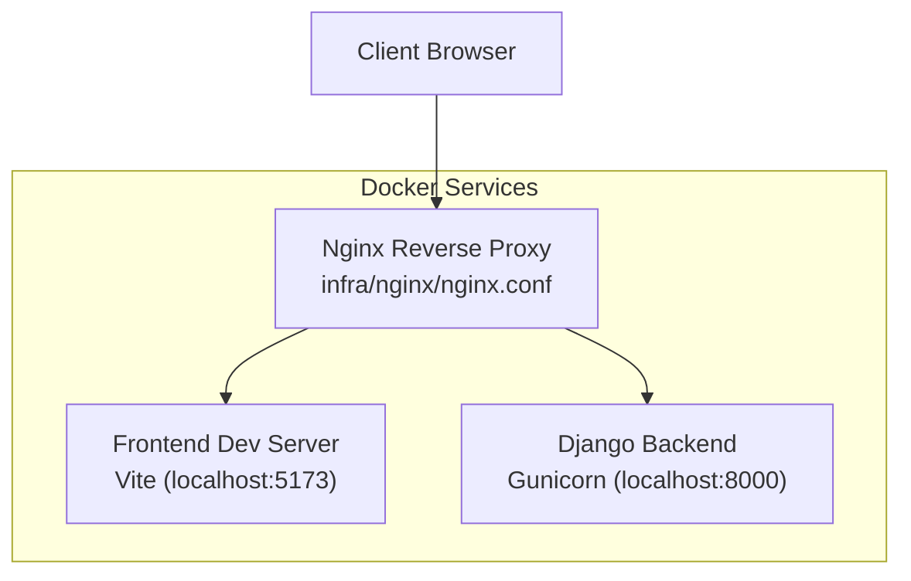
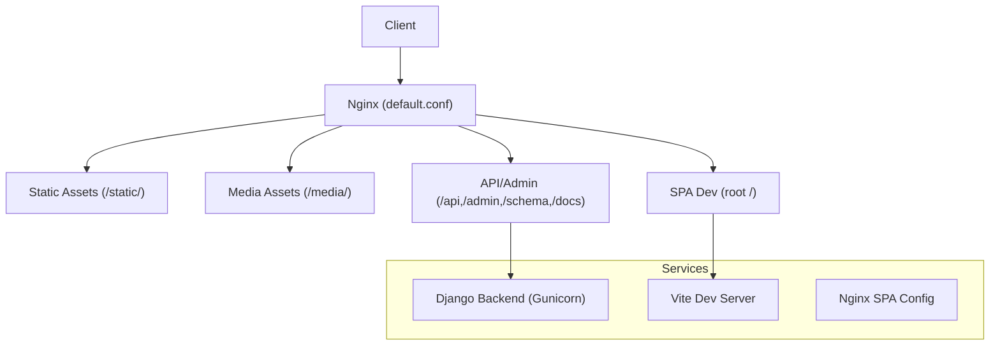
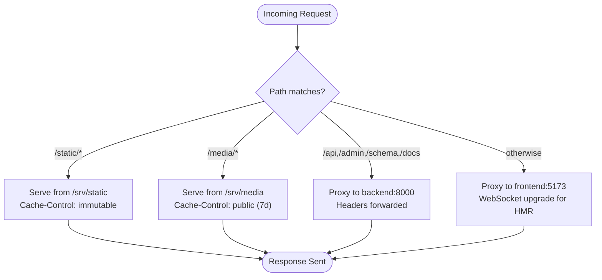
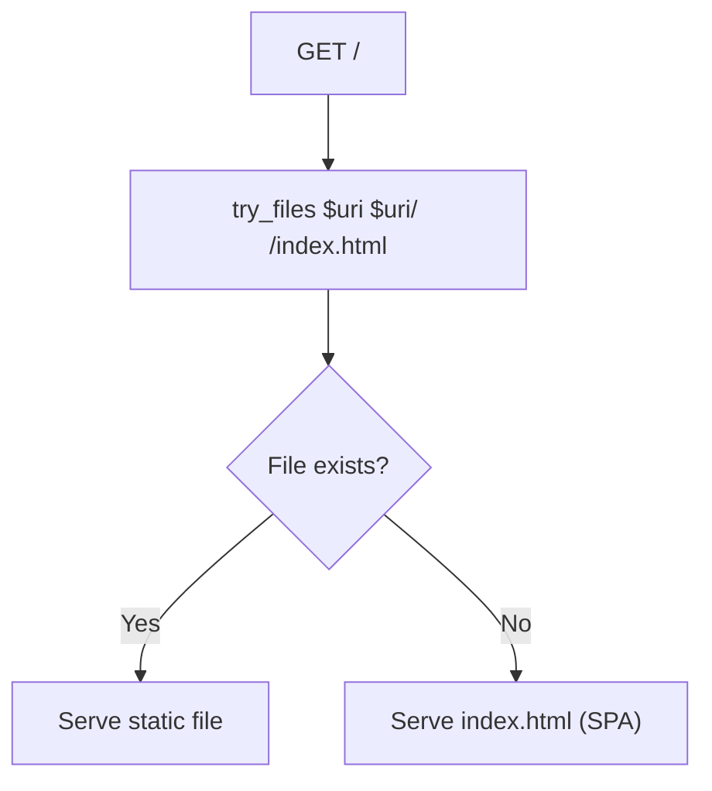
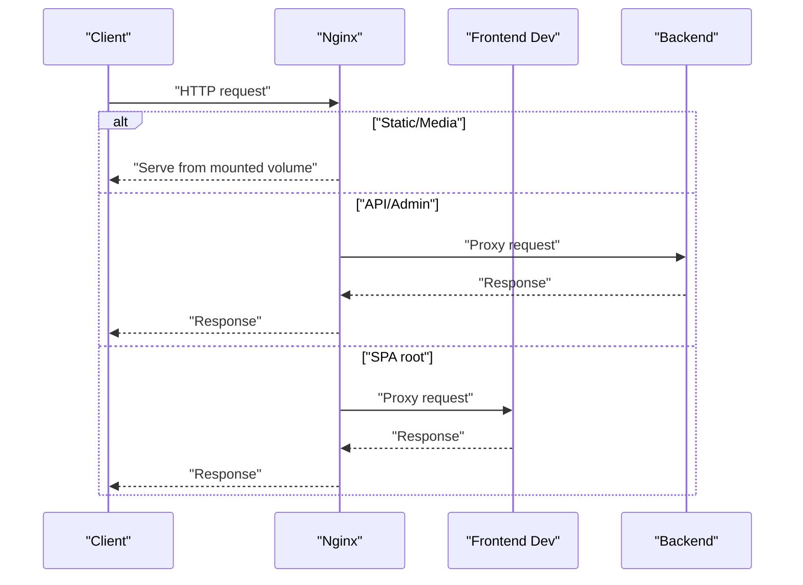
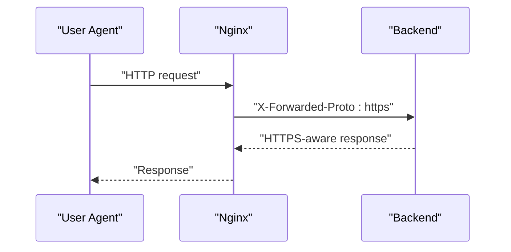
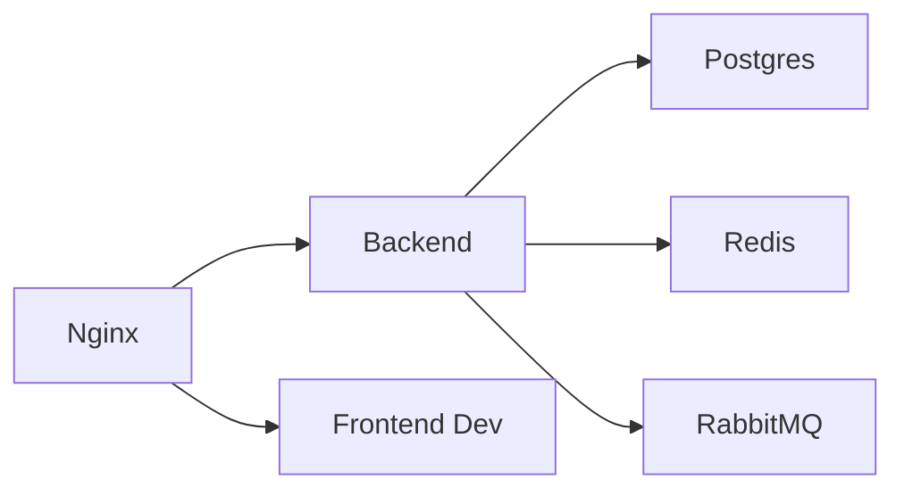

# Reverse Proxy & Load Balancing

<cite>
**Referenced Files in This Document**
- [nginx.conf](file://infra/nginx/nginx.conf)
- [frontend.conf](file://infra/nginx/frontend.conf)
- [docker-compose.yml](file://docker-compose.yml)
- [Dockerfile.backend](file://infra/docker/backend/Dockerfile)
- [Dockerfile.frontend](file://infra/docker/frontend/Dockerfile)
- [production.py](file://backend/config/settings/production.py)
- [urls.py](file://backend/config/urls.py)
- [vite.config.ts](file://frontend/vite.config.ts)
- [package.json](file://frontend/package.json)
</cite>

## Table of Contents
1. [Introduction](#introduction)
2. [Project Structure](#project-structure)
3. [Core Components](#core-components)
4. [Architecture Overview](#architecture-overview)
5. [Detailed Component Analysis](#detailed-component-analysis)
6. [Dependency Analysis](#dependency-analysis)
7. [Performance Considerations](#performance-considerations)
8. [Troubleshooting Guide](#troubleshooting-guide)
9. [Conclusion](#conclusion)
10. [Appendices](#appendices)

## Introduction
This document explains the reverse proxy and load balancing configuration implemented with Nginx in the project. It covers server blocks, upstream definitions, proxy pass directives, frontend static asset serving, SPA routing, API proxying, SSL/TLS termination, security headers, load balancing strategies, health checks, failover, graceful shutdown, caching, and security hardening. The configuration is orchestrated via Docker Compose and integrates with the Django backend and Vite-based frontend.

## Project Structure
The reverse proxy sits in front of the Django backend and the Vite development server during local development. In production, the frontend build artifacts are served by Nginx using a dedicated configuration.

**Diagram sources**
- [nginx.conf:1-54](file://infra/nginx/nginx.conf#L1-L54)
- [docker-compose.yml:187-202](file://docker-compose.yml#L187-L202)

**Section sources**
- [nginx.conf:1-54](file://infra/nginx/nginx.conf#L1-L54)
- [docker-compose.yml:187-202](file://docker-compose.yml#L187-L202)

## Core Components
- Nginx reverse proxy configuration defines:
  - Static asset serving with long-lived caching
  - Media asset serving with intermediate caching
  - API/Admin proxying to the Django backend
  - Frontend development proxy with WebSocket support
- Frontend Nginx configuration serves built SPA assets with SPA fallback routing
- Docker Compose orchestrates Nginx, backend, and frontend services, mounts static/media volumes, and exposes port 80
- Django production settings enable secure headers and HSTS
- Vite dev proxy forwards API requests to the backend

Key implementation references:
- [Nginx main config:1-54](file://infra/nginx/nginx.conf#L1-L54)
- [Frontend SPA config:1-18](file://infra/nginx/frontend.conf#L1-L18)
- [Docker orchestration:187-202](file://docker-compose.yml#L187-L202)
- [Django production settings:10-16](file://backend/config/settings/production.py#L10-L16)
- [Vite dev proxy:15-20](file://frontend/vite.config.ts#L15-L20)

**Section sources**
- [nginx.conf:1-54](file://infra/nginx/nginx.conf#L1-L54)
- [frontend.conf:1-18](file://infra/nginx/frontend.conf#L1-L18)
- [docker-compose.yml:187-202](file://docker-compose.yml#L187-L202)
- [production.py:10-16](file://backend/config/settings/production.py#L10-L16)
- [vite.config.ts:15-20](file://frontend/vite.config.ts#L15-L20)

## Architecture Overview
The system routes traffic through Nginx:
- Static and media assets are served directly from mounted volumes
- API/Admin endpoints are proxied to the Django backend
- Root path proxies to the Vite dev server for local development
- Built frontend is served by a separate Nginx container configured for SPA routing

**Diagram sources**
- [nginx.conf:10-35](file://infra/nginx/nginx.conf#L10-L35)
- [nginx.conf:40-52](file://infra/nginx/nginx.conf#L40-L52)
- [frontend.conf:8-10](file://infra/nginx/frontend.conf#L8-L10)

## Detailed Component Analysis

### Nginx Reverse Proxy Configuration
- Server block listens on port 80 with a local hostname
- Client body size capped to prevent large uploads
- Static assets under /static/ are served from a mounted volume with 1-year immutable caching
- Media assets under /media/ are served with 7-day caching
- API/Admin endpoints are proxied to the backend service on port 8000 with standard proxy headers and protocol forwarding
- Root path proxies to the frontend dev server on port 5173 with WebSocket upgrade support for HMR

**Diagram sources**
- [nginx.conf:10-14](file://infra/nginx/nginx.conf#L10-L14)
- [nginx.conf:19-23](file://infra/nginx/nginx.conf#L19-L23)
- [nginx.conf:28-35](file://infra/nginx/nginx.conf#L28-L35)
- [nginx.conf:40-52](file://infra/nginx/nginx.conf#L40-L52)

**Section sources**
- [nginx.conf:1-54](file://infra/nginx/nginx.conf#L1-L54)

### Frontend SPA Serving
- Dedicated Nginx configuration for production-like SPA serving
- Root path uses try_files to serve index.html for single-page navigation
- Static asset extensions cached with 1-year immutable policy

**Diagram sources**
- [frontend.conf:8-10](file://infra/nginx/frontend.conf#L8-L10)

**Section sources**
- [frontend.conf:1-18](file://infra/nginx/frontend.conf#L1-L18)

### Docker Orchestration and Volume Mounts
- Nginx service binds port 80 and mounts:
  - Main Nginx config
  - Backend static volume
  - Backend media volume
- Depends on backend and frontend services
- Networks are bridged for inter-service communication

**Diagram sources**
- [docker-compose.yml:193-196](file://docker-compose.yml#L193-L196)
- [docker-compose.yml:197-199](file://docker-compose.yml#L197-L199)
- [nginx.conf:10-14](file://infra/nginx/nginx.conf#L10-L14)
- [nginx.conf:28-35](file://infra/nginx/nginx.conf#L28-L35)
- [nginx.conf:40-52](file://infra/nginx/nginx.conf#L40-L52)

**Section sources**
- [docker-compose.yml:187-202](file://docker-compose.yml#L187-L202)

### SSL/TLS Termination and Security Headers
- Nginx terminates HTTP (port 80) and forwards to backend with X-Forwarded-Proto header
- Django production settings enforce:
  - Secure redirect to HTTPS
  - Strict Transport Security (HSTS) with preload and subdomains
  - Secure session and CSRF cookies
  - Proxy SSL header recognition

**Diagram sources**
- [nginx.conf:33-33](file://infra/nginx/nginx.conf#L33-L33)
- [production.py:10-16](file://backend/config/settings/production.py#L10-L16)

**Section sources**
- [nginx.conf:30-35](file://infra/nginx/nginx.conf#L30-L35)
- [production.py:10-16](file://backend/config/settings/production.py#L10-L16)

### Load Balancing Strategies
Current configuration:
- Single backend instance behind Nginx
- No explicit upstream block or load balancer directive

Recommended strategies (conceptual):
- Round-robin: default behavior when multiple backend servers are defined
- Least connections: select backend with fewer active connections
- Sticky sessions: route client to the same backend instance based on cookie/header

Note: The current deployment does not define multiple backend instances. To enable load balancing, add an upstream block and adjust proxy_pass to reference the upstream name.

[No sources needed since this section provides general guidance]

### Health Checks, Failover, and Graceful Shutdown
- Backend, Redis, RabbitMQ, and Postgres define health checks in Compose
- Nginx does not expose a dedicated health endpoint; rely on upstream backend health
- Graceful shutdown:
  - Nginx reload/restart triggers controlled draining
  - Backend uses Gunicorn managed via Compose commands

**Section sources**
- [docker-compose.yml:20-26](file://docker-compose.yml#L20-L26)
- [docker-compose.yml:39-45](file://docker-compose.yml#L39-L45)
- [docker-compose.yml:63-68](file://docker-compose.yml#L63-L68)
- [docker-compose.yml:71-104](file://docker-compose.yml#L71-L104)
- [Dockerfile.backend:64-65](file://infra/docker/backend/Dockerfile#L64-L65)

### Caching Strategies and CDN Integration
- Static assets: 1-year immutable caching
- Media assets: 7-day caching
- SPA static assets: 1-year immutable caching in frontend Nginx config
- CDN integration:
  - Serve static/media via CDN origin
  - Set cache-control headers at CDN edge
  - Configure origin shield and invalidation policies

**Section sources**
- [nginx.conf:12-13](file://infra/nginx/nginx.conf#L12-L13)
- [nginx.conf:21-22](file://infra/nginx/nginx.conf#L21-L22)
- [frontend.conf:13-16](file://infra/nginx/frontend.conf#L13-L16)

### Security Hardening
- Rate limiting: limit_req_zone and limit_req in Nginx
- IP whitelisting: allow/deny lists per location
- DDoS protection: connection limits, proxy timeouts, and request size limits
- Additional headers: add security headers at Nginx level

[No sources needed since this section provides general guidance]

## Dependency Analysis
- Nginx depends on backend and frontend services
- Backend depends on Postgres, Redis, and RabbitMQ
- Frontend depends on environment variables and Vite dev server
- Django production settings depend on environment variables for Sentry

**Diagram sources**
- [docker-compose.yml:187-202](file://docker-compose.yml#L187-L202)
- [docker-compose.yml:74-104](file://docker-compose.yml#L74-L104)
- [docker-compose.yml:28-46](file://docker-compose.yml#L28-L46)
- [docker-compose.yml:48-70](file://docker-compose.yml#L48-L70)

**Section sources**
- [docker-compose.yml:187-202](file://docker-compose.yml#L187-L202)

## Performance Considerations
- Connection reuse and keepalive between Nginx and backend
- Static asset caching reduces backend load
- Gunicorn workers and concurrency tuned in backend Dockerfile
- Client-side caching via long-lived immutable cache headers

[No sources needed since this section provides general guidance]

## Troubleshooting Guide
Common issues and resolutions:
- 502/504 gateway errors:
  - Verify backend health and readiness
  - Increase proxy timeouts if needed
- SPA routing returning 404:
  - Ensure try_files fallback to index.html is configured
- CORS errors:
  - Confirm Django CORS headers and Nginx proxy headers
- HMR not working:
  - Verify WebSocket upgrade headers and proxy_http_version

**Section sources**
- [nginx.conf:48-51](file://infra/nginx/nginx.conf#L48-L51)
- [frontend.conf:8-10](file://infra/nginx/frontend.conf#L8-L10)
- [production.py:10-16](file://backend/config/settings/production.py#L10-L16)

## Conclusion
The current Nginx configuration provides a robust reverse proxy for static assets, media, API/Admin endpoints, and SPA development. It terminates HTTP and forwards protocol information to the backend, which applies strict transport security in production. The Docker Compose setup orchestrates services and mounts shared volumes. For production, consider adding SSL/TLS certificates, upstream load balancing, health checks, rate limiting, and CDN integration to improve reliability, scalability, and security.

## Appendices

### API Endpoint Definitions
- Admin interface: /admin/
- API schema and docs: /api/schema/, /api/docs/, /api/redoc/
- Example API routes: /api/... (defined in URL patterns)

**Section sources**
- [urls.py:16-23](file://backend/config/urls.py#L16-L23)

### Frontend Development Proxy Configuration
- Vite dev server proxies API requests to backend
- Environment variable controls target base URL

**Section sources**
- [vite.config.ts:15-20](file://frontend/vite.config.ts#L15-L20)
- [Dockerfile.frontend:28-28](file://infra/docker/frontend/Dockerfile#L28-L28)