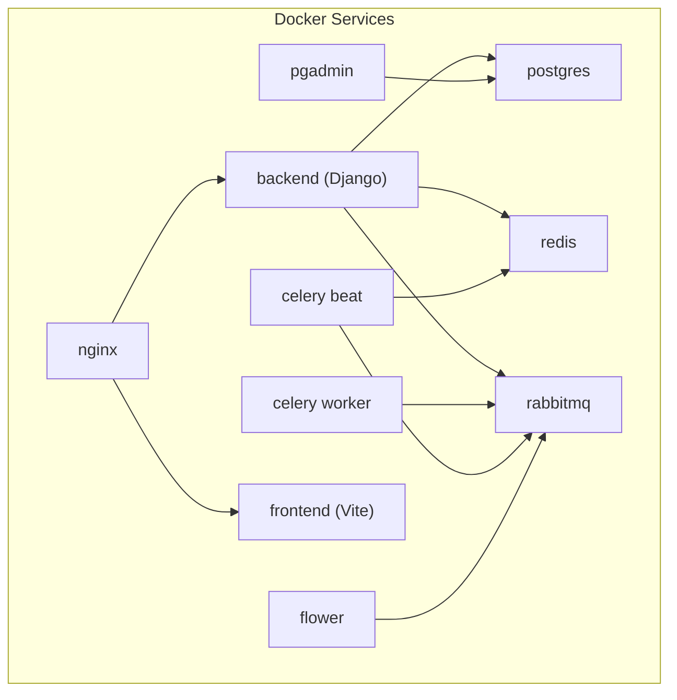
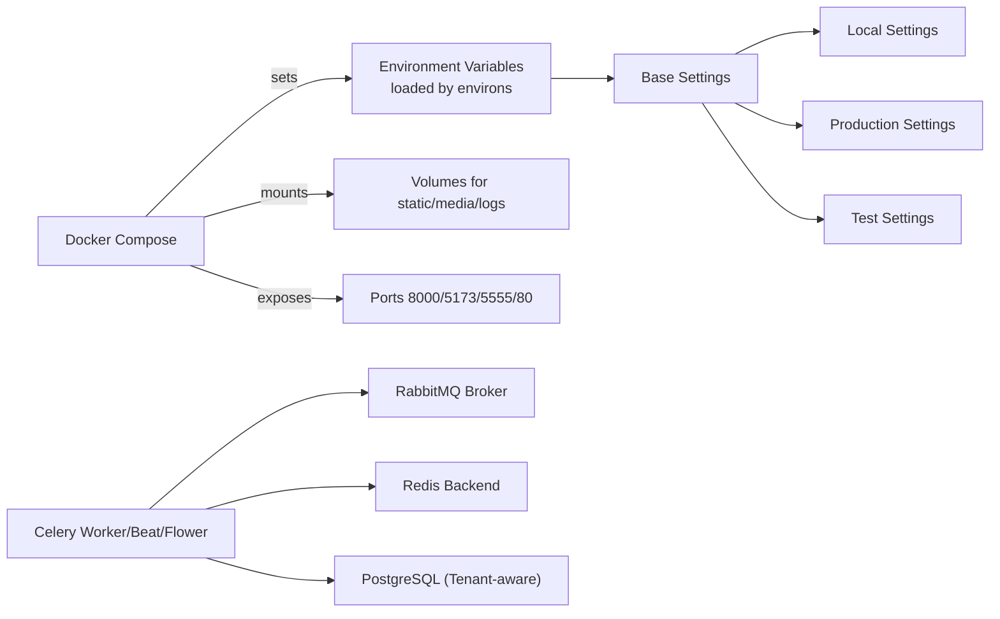
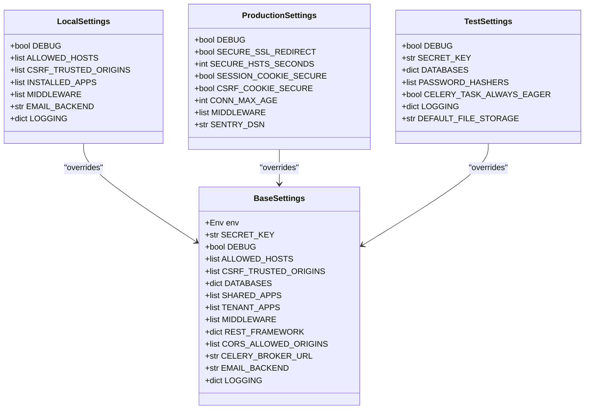
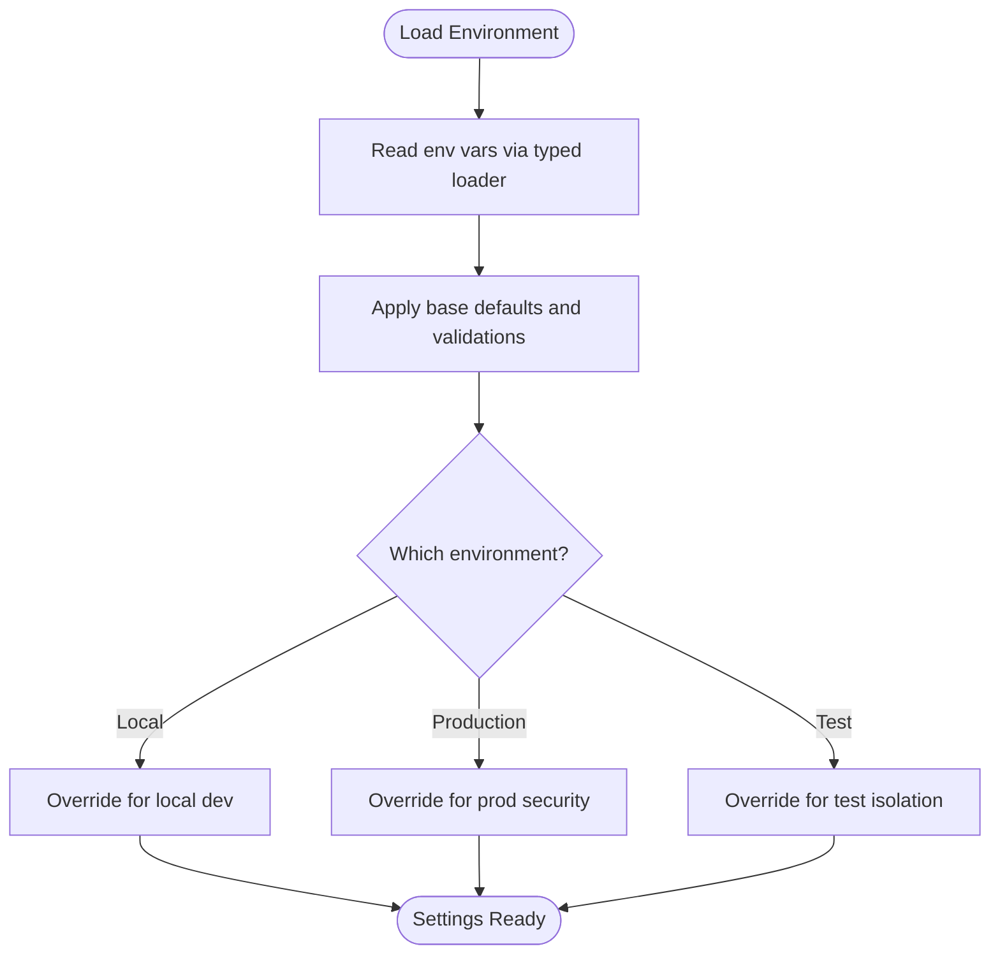
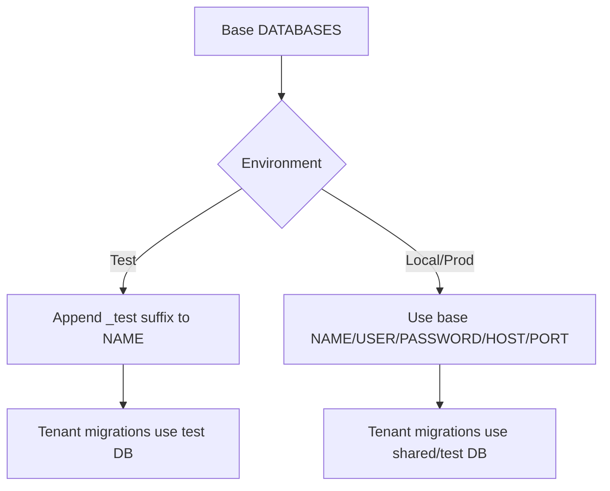
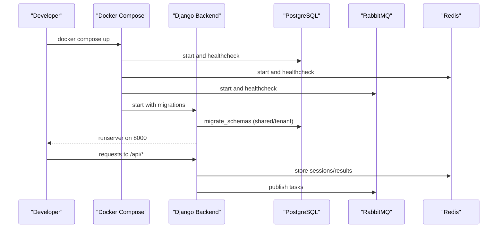
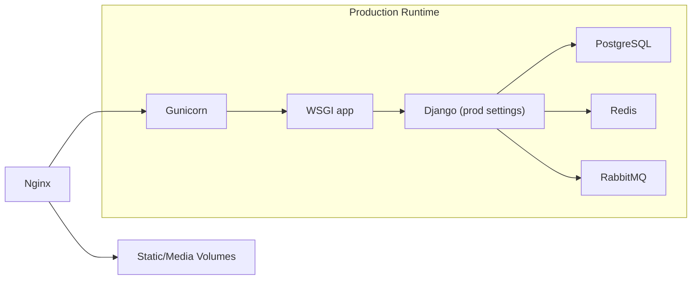
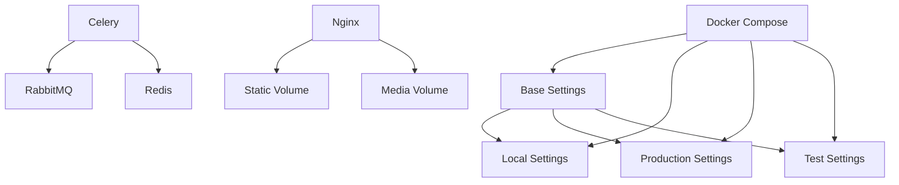

# Environment Configuration

<cite>
**Referenced Files in This Document**
- [base.py](file://backend/config/settings/base.py)
- [local.py](file://backend/config/settings/local.py)
- [production.py](file://backend/config/settings/production.py)
- [test.py](file://backend/config/settings/test.py)
- [docker-compose.yml](file://docker-compose.yml)
- [Dockerfile (backend)](file://infra/docker/backend/Dockerfile)
- [Dockerfile (frontend)](file://infra/docker/frontend/Dockerfile)
- [pyproject.toml](file://backend/pyproject.toml)
- [manage.py](file://backend/manage.py)
- [asgi.py](file://backend/config/asgi.py)
- [wsgi.py](file://backend/config/wsgi.py)
- [celery.py](file://backend/config/celery.py)
- [urls.py](file://backend/config/urls.py)
- [README.md](file://README.md)
</cite>

## Table of Contents
1. [Introduction](#introduction)
2. [Project Structure](#project-structure)
3. [Core Components](#core-components)
4. [Architecture Overview](#architecture-overview)
5. [Detailed Component Analysis](#detailed-component-analysis)
6. [Dependency Analysis](#dependency-analysis)
7. [Performance Considerations](#performance-considerations)
8. [Troubleshooting Guide](#troubleshooting-guide)
9. [Conclusion](#conclusion)
10. [Appendices](#appendices)

## Introduction
This document explains Flower’s environment configuration and multi-environment deployment strategy. It covers the Django settings architecture (base, local, production, test), environment variable management, secret key handling, database configuration per environment, Docker Compose setup for development, and production-ready optimizations. It also documents configuration validation, security hardening, CORS configuration, static asset handling, environment switching, configuration testing, and troubleshooting environment-specific issues.

## Project Structure
Flower is a multi-service Dockerized application with a Django backend, React/Vite frontend, and supporting infrastructure (PostgreSQL, Redis, RabbitMQ, Nginx). The backend uses a layered Django settings architecture with environment-specific overrides.

**Diagram sources**
- [docker-compose.yml:1-267](file://docker-compose.yml#L1-L267)

**Section sources**
- [docker-compose.yml:1-267](file://docker-compose.yml#L1-L267)
- [Dockerfile (backend):1-66](file://infra/docker/backend/Dockerfile#L1-L66)
- [Dockerfile (frontend):1-60](file://infra/docker/frontend/Dockerfile#L1-L60)

## Core Components
- Django settings architecture:
  - Base settings define shared defaults, environment loading, multi-tenancy, middleware, databases, static/media, REST framework, CORS, Celery, email, logging, and security defaults.
  - Local settings enable development features, debug toolbar, console email, and local CORS/hosts.
  - Production settings enforce HTTPS/HSTS, secure cookies, connection pooling, and optional error reporting.
  - Test settings isolate test database, disable hashing cost, disable Celery, and minimize logging.
- Environment variables are loaded via a typed environment loader and consumed across settings.
- Docker Compose orchestrates services and passes environment variables to containers.
- Optional production runtime uses Gunicorn behind Nginx.

**Section sources**
- [base.py:1-336](file://backend/config/settings/base.py#L1-L336)
- [local.py:1-42](file://backend/config/settings/local.py#L1-L42)
- [production.py:1-42](file://backend/config/settings/production.py#L1-L42)
- [test.py:1-59](file://backend/config/settings/test.py#L1-L59)
- [docker-compose.yml:1-267](file://docker-compose.yml#L1-L267)

## Architecture Overview
The environment configuration follows a layered approach:
- Base settings centralize shared configuration and environment variable consumption.
- Environment-specific modules override base settings for behavior differences.
- Docker Compose sets the Django settings module per service and mounts volumes for persistence.
- Celery workers and scheduler connect to message and cache backends configured in base settings.

**Diagram sources**
- [base.py:16-336](file://backend/config/settings/base.py#L16-L336)
- [local.py:3-42](file://backend/config/settings/local.py#L3-L42)
- [production.py:3-42](file://backend/config/settings/production.py#L3-L42)
- [test.py:3-59](file://backend/config/settings/test.py#L3-L59)
- [docker-compose.yml:74-247](file://docker-compose.yml#L74-L247)

## Detailed Component Analysis

### Django Settings Architecture
- Base settings:
  - Environment loading via a typed environment loader.
  - Multi-tenancy via a tenant model and domain model with a dedicated router.
  - Shared and tenant app lists for migrations and tenant isolation.
  - Security defaults (XSS filter, content type sniffing, frame options) with environment-specific enforcement deferred.
  - Database configured for tenant-aware PostgreSQL engine with credentials from environment variables.
  - Static and media roots for development and production collection.
  - REST Framework defaults and OpenAPI schema settings.
  - CORS configuration controlled by environment variables.
  - Celery broker and result backend defaults.
  - Email backend and sender defaults.
  - Logging configuration with console handlers and logger groups.
- Local settings:
  - Enables development mode and debug toolbar.
  - Defines development hosts and CSRF origins.
  - Configures console email and verbose database logging.
- Production settings:
  - Enforces HTTPS redirect, HSTS, secure cookies, and proxy SSL header.
  - Adds connection pooling and inserts security middleware early.
  - Optionally initializes error reporting SDK when a DSN is present.
- Test settings:
  - Disables debug and uses a fixed secret key.
  - Overrides database to append a test suffix and uses the same engine.
  - Uses a fast hasher and disables Celery.
  - Minimizes logging and stores media in memory.

**Diagram sources**
- [base.py:16-336](file://backend/config/settings/base.py#L16-L336)
- [local.py:3-42](file://backend/config/settings/local.py#L3-L42)
- [production.py:3-42](file://backend/config/settings/production.py#L3-L42)
- [test.py:3-59](file://backend/config/settings/test.py#L3-L59)

**Section sources**
- [base.py:16-336](file://backend/config/settings/base.py#L16-L336)
- [local.py:3-42](file://backend/config/settings/local.py#L3-L42)
- [production.py:3-42](file://backend/config/settings/production.py#L3-L42)
- [test.py:3-59](file://backend/config/settings/test.py#L3-L59)

### Environment Variable Management and Secret Key Handling
- Environment variables are loaded via a typed environment loader and consumed across settings.
- Base settings define defaults for sensitive values (e.g., secret key, database credentials) and rely on environment overrides.
- Production and test settings demonstrate environment-driven overrides for security and isolation.

**Diagram sources**
- [base.py:21-336](file://backend/config/settings/base.py#L21-L336)
- [local.py:3-42](file://backend/config/settings/local.py#L3-L42)
- [production.py:3-42](file://backend/config/settings/production.py#L3-L42)
- [test.py:3-59](file://backend/config/settings/test.py#L3-L59)

**Section sources**
- [base.py:21-336](file://backend/config/settings/base.py#L21-L336)
- [local.py:3-42](file://backend/config/settings/local.py#L3-L42)
- [production.py:3-42](file://backend/config/settings/production.py#L3-L42)
- [test.py:3-59](file://backend/config/settings/test.py#L3-L59)

### Database Configuration per Environment
- Base database configuration uses a tenant-aware PostgreSQL backend and reads credentials from environment variables.
- Test environment overrides the database name by appending a test suffix while keeping the same engine and credentials.
- Production and local environments rely on the base configuration; ensure environment variables are set accordingly.

**Diagram sources**
- [base.py:155-164](file://backend/config/settings/base.py#L155-L164)
- [test.py:14-23](file://backend/config/settings/test.py#L14-L23)

**Section sources**
- [base.py:155-164](file://backend/config/settings/base.py#L155-L164)
- [test.py:14-23](file://backend/config/settings/test.py#L14-L23)

### Docker Compose Setup for Development
- The Compose file defines services for backend, frontend, PostgreSQL, Redis, RabbitMQ, Nginx, PgAdmin, Celery worker, Celery beat, and Flower.
- Backend service runs the Django development server, mounts code and persistent volumes, and applies migrations on startup.
- Frontend service runs Vite dev server and exposes port 5173.
- Celery worker and beat connect to RabbitMQ and Redis; Flower connects to RabbitMQ for monitoring.
- Nginx serves static/media and proxies to the backend.

**Diagram sources**
- [docker-compose.yml:74-103](file://docker-compose.yml#L74-L103)
- [docker-compose.yml:108-160](file://docker-compose.yml#L108-L160)
- [docker-compose.yml:226-247](file://docker-compose.yml#L226-L247)

**Section sources**
- [docker-compose.yml:1-267](file://docker-compose.yml#L1-L267)

### Production Runtime and Static Assets
- The backend Dockerfile builds a production stage that:
  - Sets the Django settings module for production.
  - Creates a non-root user and collects static files.
  - Runs via Gunicorn on port 8000.
- Nginx serves static and media directories mounted from backend volumes and proxies to the backend.
- The frontend Dockerfile builds a production Nginx image serving the built SPA.

**Diagram sources**
- [Dockerfile (backend):42-66](file://infra/docker/backend/Dockerfile#L42-L66)
- [docker-compose.yml:187-201](file://docker-compose.yml#L187-L201)
- [Dockerfile (frontend):52-60](file://infra/docker/frontend/Dockerfile#L52-L60)

**Section sources**
- [Dockerfile (backend):42-66](file://infra/docker/backend/Dockerfile#L42-L66)
- [docker-compose.yml:187-201](file://docker-compose.yml#L187-L201)
- [Dockerfile (frontend):52-60](file://infra/docker/frontend/Dockerfile#L52-L60)

### Configuration Validation and Environment Switching
- Environment selection:
  - Docker Compose sets the Django settings module per service.
  - Standalone CLI uses the default local settings module unless overridden.
- Validation tips:
  - Confirm environment variables are set for the selected environment.
  - Verify database connectivity and migration status.
  - Ensure CORS and allowed hosts match the deployed origin(s).
- Example paths:
  - Local development module: [local.py:1-42](file://backend/config/settings/local.py#L1-L42)
  - Production module: [production.py:1-42](file://backend/config/settings/production.py#L1-L42)
  - Test module: [test.py:1-59](file://backend/config/settings/test.py#L1-L59)
  - CLI default module: [manage.py](file://backend/manage.py#L10)
  - ASGI default module: [asgi.py](file://backend/config/asgi.py#L11)
  - WSGI default module: [wsgi.py](file://backend/config/wsgi.py#L11)

**Section sources**
- [docker-compose.yml:84](file://docker-compose.yml#L84)
- [docker-compose.yml:118](file://docker-compose.yml#L118)
- [docker-compose.yml:146](file://docker-compose.yml#L146)
- [docker-compose.yml:236](file://docker-compose.yml#L236)
- [manage.py:10](file://backend/manage.py#L10)
- [asgi.py:11](file://backend/config/asgi.py#L11)
- [wsgi.py:11](file://backend/config/wsgi.py#L11)

### CORS Configuration
- Allowed origins are controlled by an environment variable and applied in base settings.
- Local settings provide development origins for frontend and API access.
- Production settings defer enforcement to environment variables; ensure origins are set appropriately.

**Section sources**
- [base.py:267-268](file://backend/config/settings/base.py#L267-L268)
- [local.py:10-14](file://backend/config/settings/local.py#L10-L14)

### Static Asset Handling
- Base settings define static and media roots and URLs.
- Development uses mounted volumes and Django’s development server.
- Production collects static files and serves them via Nginx.

**Section sources**
- [base.py:217-224](file://backend/config/settings/base.py#L217-L224)
- [Dockerfile (backend):55](file://infra/docker/backend/Dockerfile#L55)
- [docker-compose.yml:195](file://docker-compose.yml#L195)

### Deployment-Specific Settings
- Production settings enforce HTTPS/HSTS, secure cookies, and connection pooling.
- Optional error reporting initialization is supported when a DSN is provided.
- Celery settings are shared via base settings; worker/beat/flower connect to RabbitMQ and Redis.

**Section sources**
- [production.py:10-41](file://backend/config/settings/production.py#L10-L41)
- [base.py:273-279](file://backend/config/settings/base.py#L273-L279)
- [docker-compose.yml:108-160](file://docker-compose.yml#L108-L160)
- [docker-compose.yml:226-247](file://docker-compose.yml#L226-L247)

### Configuration Testing
- Pytest configuration targets the test settings module and runs tests across apps and backend tests.
- Test settings isolate the database, disable hashing cost, and suppress logging noise.

**Section sources**
- [pyproject.toml:160-175](file://backend/pyproject.toml#L160-L175)
- [test.py:14-59](file://backend/config/settings/test.py#L14-L59)

## Dependency Analysis
- Django settings modules depend on base settings and override selectively.
- Docker Compose depends on environment variables and volume mounts.
- Celery depends on RabbitMQ and Redis; Nginx depends on backend static/media volumes.

**Diagram sources**
- [base.py:16-336](file://backend/config/settings/base.py#L16-L336)
- [local.py:3-42](file://backend/config/settings/local.py#L3-L42)
- [production.py:3-42](file://backend/config/settings/production.py#L3-L42)
- [test.py:3-59](file://backend/config/settings/test.py#L3-L59)
- [docker-compose.yml:74-247](file://docker-compose.yml#L74-L247)

**Section sources**
- [base.py:16-336](file://backend/config/settings/base.py#L16-L336)
- [docker-compose.yml:74-247](file://docker-compose.yml#L74-L247)

## Performance Considerations
- Production settings enable connection pooling and insert security middleware early.
- Celery serialization and content types are optimized for JSON.
- Static files are collected in production and served by Nginx.

**Section sources**
- [production.py:21](file://backend/config/settings/production.py#L21)
- [base.py:273-279](file://backend/config/settings/base.py#L273-L279)
- [Dockerfile (backend):55](file://infra/docker/backend/Dockerfile#L55)

## Troubleshooting Guide
Common environment-specific issues and resolutions:
- Django settings module mismatch:
  - Ensure the correct module is set for the environment (local, production, test).
  - Paths: [manage.py](file://backend/manage.py#L10), [asgi.py](file://backend/config/asgi.py#L11), [wsgi.py](file://backend/config/wsgi.py#L11), [Dockerfile (backend)](file://infra/docker/backend/Dockerfile#L44).
- Database connectivity:
  - Verify environment variables for host, port, user, and password.
  - Confirm migrations are applied for shared and tenant schemas.
  - Paths: [base.py:155-164](file://backend/config/settings/base.py#L155-L164), [README.md:96-104](file://README.md#L96-L104).
- CORS and allowed hosts:
  - Set allowed origins and hosts for the environment.
  - Paths: [base.py:35-36](file://backend/config/settings/base.py#L35-L36), [base.py:267-268](file://backend/config/settings/base.py#L267-L268), [local.py:7-14](file://backend/config/settings/local.py#L7-L14).
- Static/media not served:
  - In production, ensure static files are collected and Nginx is configured to serve volumes.
  - Paths: [Dockerfile (backend)](file://infra/docker/backend/Dockerfile#L55), [docker-compose.yml:195-196](file://docker-compose.yml#L195-L196).
- Celery tasks not executing:
  - Confirm RabbitMQ and Redis are healthy and reachable.
  - Paths: [docker-compose.yml:108-160](file://docker-compose.yml#L108-L160), [base.py:273-274](file://backend/config/settings/base.py#L273-L274).
- Tests failing or slow:
  - Use the test settings module and in-memory storage for media.
  - Paths: [pyproject.toml:160-175](file://backend/pyproject.toml#L160-L175), [test.py:28-59](file://backend/config/settings/test.py#L28-L59).

**Section sources**
- [manage.py:10](file://backend/manage.py#L10)
- [asgi.py:11](file://backend/config/asgi.py#L11)
- [wsgi.py:11](file://backend/config/wsgi.py#L11)
- [Dockerfile (backend):55](file://infra/docker/backend/Dockerfile#L55)
- [docker-compose.yml:108-160](file://docker-compose.yml#L108-L160)
- [base.py:155-164](file://backend/config/settings/base.py#L155-L164)
- [README.md:96-104](file://README.md#L96-L104)
- [pyproject.toml:160-175](file://backend/pyproject.toml#L160-L175)
- [test.py:28-59](file://backend/config/settings/test.py#L28-L59)

## Conclusion
Flower’s environment configuration leverages a robust Django settings architecture with environment-specific overrides, typed environment variable loading, and a Docker-first deployment strategy. By following the documented environment switching, validation steps, and security hardening practices, teams can reliably operate development, staging, and production deployments with consistent behavior and strong isolation.

## Appendices
- Quick links to key configuration files:
  - Base settings: [base.py:1-336](file://backend/config/settings/base.py#L1-L336)
  - Local settings: [local.py:1-42](file://backend/config/settings/local.py#L1-L42)
  - Production settings: [production.py:1-42](file://backend/config/settings/production.py#L1-L42)
  - Test settings: [test.py:1-59](file://backend/config/settings/test.py#L1-L59)
  - Docker Compose: [docker-compose.yml:1-267](file://docker-compose.yml#L1-L267)
  - Backend Dockerfile: [Dockerfile (backend):1-66](file://infra/docker/backend/Dockerfile#L1-L66)
  - Frontend Dockerfile: [Dockerfile (frontend):1-60](file://infra/docker/frontend/Dockerfile#L1-L60)
  - Pyproject (testing): [pyproject.toml:160-175](file://backend/pyproject.toml#L160-L175)
  - Manage script: [manage.py:1-24](file://backend/manage.py#L1-L24)
  - ASGI: [asgi.py:1-14](file://backend/config/asgi.py#L1-L14)
  - WSGI: [wsgi.py:1-14](file://backend/config/wsgi.py#L1-L14)
  - Celery: [celery.py:1-28](file://backend/config/celery.py#L1-L28)
  - URLs: [urls.py:1-49](file://backend/config/urls.py#L1-L49)
  - README: [README.md:1-194](file://README.md#L1-L194)