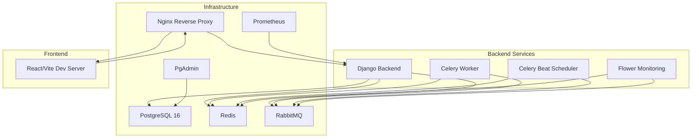
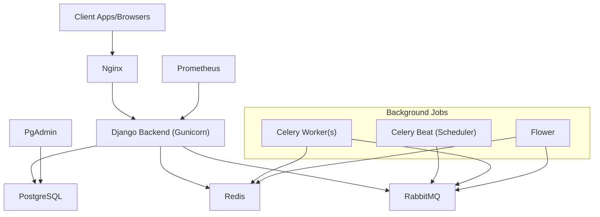
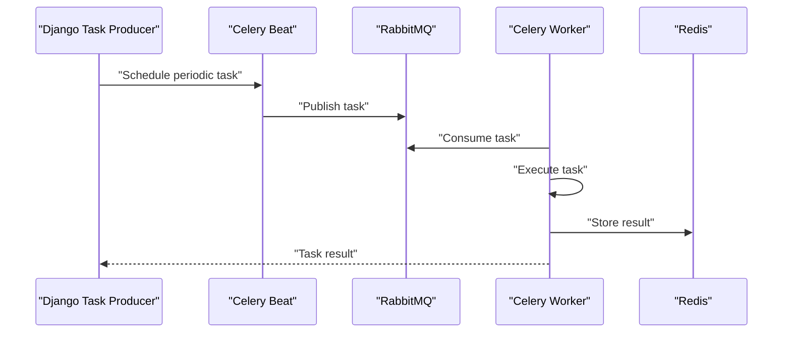
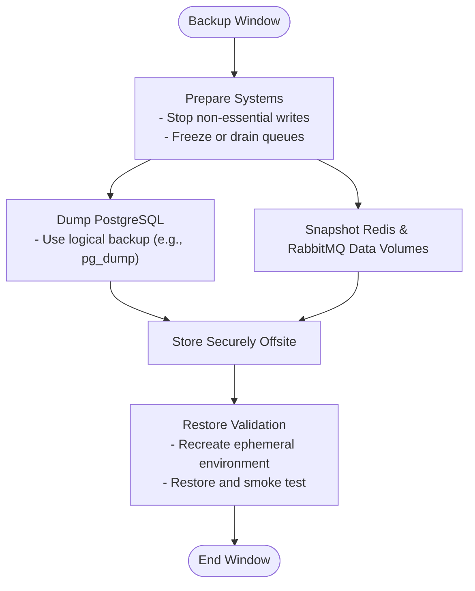
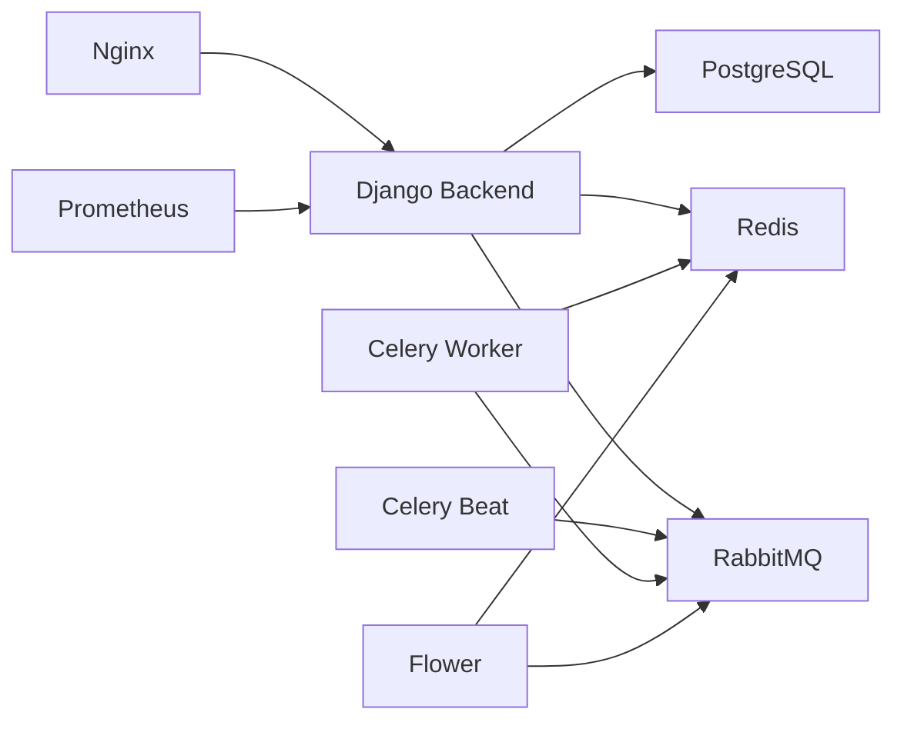

# Operations & Maintenance

<cite>
**Referenced Files in This Document**
- [README.md](file://README.md)
- [docker-compose.yml](file://docker-compose.yml)
- [backend/pyproject.toml](file://backend/pyproject.toml)
- [backend/config/settings/base.py](file://backend/config/settings/base.py)
- [backend/config/settings/local.py](file://backend/config/settings/local.py)
- [backend/config/settings/production.py](file://backend/config/settings/production.py)
- [backend/config/settings/test.py](file://backend/config/settings/test.py)
- [backend/config/celery.py](file://backend/config/celery.py)
- [backend/config/wsgi.py](file://backend/config/wsgi.py)
- [backend/config/asgi.py](file://backend/config/asgi.py)
- [backend/config/urls.py](file://backend/config/urls.py)
- [backend/manage.py](file://backend/manage.py)
- [infra/docker/backend/Dockerfile](file://infra/docker/backend/Dockerfile)
- [infra/nginx/nginx.conf](file://infra/nginx/nginx.conf)
- [infra/prometheus/prometheus.yml](file://infra/prometheus/prometheus.yml)
- [backend/apps/tenants/services.py](file://backend/apps/tenants/services.py)
</cite>

## Table of Contents
1. [Introduction](#introduction)
2. [Project Structure](#project-structure)
3. [Core Components](#core-components)
4. [Architecture Overview](#architecture-overview)
5. [Detailed Component Analysis](#detailed-component-analysis)
6. [Dependency Analysis](#dependency-analysis)
7. [Performance Considerations](#performance-considerations)
8. [Troubleshooting Guide](#troubleshooting-guide)
9. [Conclusion](#conclusion)
10. [Appendices](#appendices)

## Introduction
This document provides comprehensive operations and maintenance guidance for the PlantOps production system. It covers environment configuration strategies, Celery task processing and monitoring, logging and error tracking, backup and recovery, performance monitoring and scaling, security and compliance, and operational procedures for maintenance windows, updates, and rollbacks.

## Project Structure
The system is organized into:
- Backend: Django application with multi-tenant PostgreSQL schemas, Celery workers, and Django REST Framework.
- Frontend: React/Vite application served via Nginx reverse proxy.
- Infrastructure: Docker Compose orchestration for PostgreSQL, Redis, RabbitMQ, Nginx, Celery Flower, and optional PgAdmin.
- Observability: Prometheus scraping backend metrics endpoint.

**Diagram sources**
- [docker-compose.yml:1-267](file://docker-compose.yml#L1-L267)
- [infra/nginx/nginx.conf:1-54](file://infra/nginx/nginx.conf#L1-L54)
- [infra/prometheus/prometheus.yml:1-15](file://infra/prometheus/prometheus.yml#L1-L15)

**Section sources**
- [README.md:1-194](file://README.md#L1-L194)
- [docker-compose.yml:1-267](file://docker-compose.yml#L1-L267)

## Core Components
- Django settings modules define environment-specific configuration for development, staging, and production, including database, Celery, logging, security, and CORS.
- Celery configuration integrates with RabbitMQ and Redis for task processing and monitoring via Flower.
- Docker Compose defines service lifecycles, health checks, and inter-service dependencies.
- Nginx routes traffic to backend, static/media, and frontend.
- Prometheus scrapes backend metrics.

Key operational responsibilities:
- Environment configuration via environment variables and settings modules.
- Task scheduling and execution via Celery Beat and workers.
- Logging and error tracking via structlog and console handlers.
- Health monitoring via Docker healthchecks and Prometheus metrics.

**Section sources**
- [backend/config/settings/base.py:1-336](file://backend/config/settings/base.py#L1-L336)
- [backend/config/settings/local.py:1-42](file://backend/config/settings/local.py#L1-L42)
- [backend/config/settings/production.py:1-42](file://backend/config/settings/production.py#L1-L42)
- [backend/config/settings/test.py:1-59](file://backend/config/settings/test.py#L1-L59)
- [backend/config/celery.py:1-28](file://backend/config/celery.py#L1-L28)
- [docker-compose.yml:1-267](file://docker-compose.yml#L1-L267)
- [infra/nginx/nginx.conf:1-54](file://infra/nginx/nginx.conf#L1-L54)
- [infra/prometheus/prometheus.yml:1-15](file://infra/prometheus/prometheus.yml#L1-L15)

## Architecture Overview
The production runtime relies on:
- Django WSGI application behind Gunicorn in production.
- Celery workers and scheduler using RabbitMQ as broker and Redis as result backend.
- Nginx as reverse proxy for API, admin, static/media, and frontend.
- Prometheus scraping the backend metrics endpoint.
- Optional PgAdmin for database administration.

**Diagram sources**
- [infra/docker/backend/Dockerfile:42-66](file://infra/docker/backend/Dockerfile#L42-L66)
- [docker-compose.yml:108-161](file://docker-compose.yml#L108-L161)
- [infra/nginx/nginx.conf:28-35](file://infra/nginx/nginx.conf#L28-L35)
- [infra/prometheus/prometheus.yml:10-15](file://infra/prometheus/prometheus.yml#L10-L15)

## Detailed Component Analysis

### Environment Configuration Strategies
- Development (local.py): Enables Django Debug Toolbar, permissive CORS, console email backend, and verbose database query logs.
- Staging (test.py): Dedicated test database suffix, in-memory media storage, fast MD5 password hashing, disabled Celery for tests, minimal logging.
- Production (production.py): Strict HTTPS/HSTS, secure cookies, persistent database connections, optional Sentry SDK initialization, and whitenoise-ready middleware stack.

Operational guidance:
- Use environment variables to override defaults in base.py for hostnames, broker, and result backend.
- Ensure ALLOWED_HOSTS and CSRF_TRUSTED_ORIGINS match deployment domains.
- For production, set SECURE_SSL_REDIRECT, HSTS, and cookie security flags.
- Configure SENTRY_DSN for error tracking in production.

**Section sources**
- [backend/config/settings/base.py:32-336](file://backend/config/settings/base.py#L32-L336)
- [backend/config/settings/local.py:1-42](file://backend/config/settings/local.py#L1-L42)
- [backend/config/settings/test.py:1-59](file://backend/config/settings/test.py#L1-L59)
- [backend/config/settings/production.py:1-42](file://backend/config/settings/production.py#L1-L42)

### Celery Task Processing and Monitoring
- Broker: RabbitMQ (AMQP).
- Result backend: Redis (JSON serialization).
- Workers: Celery worker process configured with concurrency.
- Scheduler: Celery Beat using django_celery_beat DatabaseScheduler.
- Monitoring: Flower connects to RabbitMQ API and Redis.

Operational procedures:
- Start Celery Beat and worker containers in production.
- Use Flower to inspect queues, scheduled tasks, and worker performance.
- Verify broker and result backend connectivity via health checks.
- For debugging, use the debug_task helper.

**Diagram sources**
- [backend/config/celery.py:1-28](file://backend/config/celery.py#L1-L28)
- [docker-compose.yml:136-161](file://docker-compose.yml#L136-L161)

**Section sources**
- [backend/config/celery.py:1-28](file://backend/config/celery.py#L1-L28)
- [docker-compose.yml:108-161](file://docker-compose.yml#L108-L161)

### Log Management and Error Tracking
- Logging configuration includes console handlers with verbose and simple formatters.
- Django and app-specific loggers are configured; production can integrate Sentry SDK via SENTRY_DSN.
- Test settings disable logging noise by routing to a null handler.

Operational procedures:
- Review console logs for INFO/WARN/ERROR levels.
- In production, enable Sentry SDK to capture exceptions and traces.
- For development, enable database query logging selectively.

**Section sources**
- [backend/config/settings/base.py:288-325](file://backend/config/settings/base.py#L288-L325)
- [backend/config/settings/production.py:29-42](file://backend/config/settings/production.py#L29-L42)
- [backend/config/settings/test.py:41-59](file://backend/config/settings/test.py#L41-L59)

### Backup and Recovery Procedures
- PostgreSQL data is persisted via named volumes; initialize on first run with init scripts.
- Redis and RabbitMQ data are also persisted via volumes.
- Recommended steps:
  - Periodically back up postgres_data volume.
  - Snapshot redis_data and rabbitmq_data volumes.
  - Store backups offsite or in secure cloud storage.
  - Validate restore procedure by spinning up a temporary environment and restoring data.

**Diagram sources**
- [docker-compose.yml:252-267](file://docker-compose.yml#L252-L267)

**Section sources**
- [docker-compose.yml:252-267](file://docker-compose.yml#L252-L267)

### Disaster Recovery Planning
- Recovery objectives:
  - RPO aligned with backup frequency.
  - RTO aligned with container restart and migration times.
- Recovery steps:
  - Restore PostgreSQL from latest backup.
  - Restore Redis and RabbitMQ from snapshots.
  - Re-run tenant migrations for shared and tenant schemas.
  - Restart services and verify endpoints.

**Section sources**
- [README.md:94-104](file://README.md#L94-L104)
- [docker-compose.yml:252-267](file://docker-compose.yml#L252-L267)

### Performance Monitoring, Capacity Planning, and Scaling
- Prometheus scrapes the backend metrics endpoint.
- Gunicorn runs multiple workers in production; adjust worker count based on CPU and memory.
- Scale Celery workers horizontally to handle queue backlog.
- Monitor Redis and RabbitMQ resource utilization; scale vertically or shard as needed.
- Use Nginx to cache static/media and offload serving.

**Section sources**
- [infra/prometheus/prometheus.yml:10-15](file://infra/prometheus/prometheus.yml#L10-L15)
- [infra/docker/backend/Dockerfile:64-66](file://infra/docker/backend/Dockerfile#L64-L66)
- [docker-compose.yml:130-131](file://docker-compose.yml#L130-L131)

### Security Maintenance, Vulnerability Management, and Compliance
- Security settings enforced in production (HTTPS, HSTS, secure cookies).
- Secrets loaded from environment variables; avoid committing secrets.
- Restrict allowed hosts and trusted origins.
- Integrate Sentry for error tracking and privacy-conscious configuration.
- Keep dependencies updated; use pinned versions in pyproject.toml.

**Section sources**
- [backend/config/settings/production.py:10-16](file://backend/config/settings/production.py#L10-L16)
- [backend/config/settings/base.py:32-36](file://backend/config/settings/base.py#L32-L36)
- [backend/pyproject.toml:18-67](file://backend/pyproject.toml#L18-L67)

### Maintenance Windows, Updates, and Rollback
- Maintenance window:
  - Schedule downtime; notify stakeholders.
  - Drain traffic via Nginx and pause Celery Beat.
- Update procedure:
  - Build new images and deploy.
  - Run tenant migrations for shared and tenant schemas.
  - Restart services in order: backend, workers, beat, flower.
- Rollback:
  - Re-deploy previous images.
  - Re-run down migrations if necessary.
  - Restore backups if data integrity is compromised.

**Section sources**
- [README.md:94-104](file://README.md#L94-L104)
- [docker-compose.yml:100-103](file://docker-compose.yml#L100-L103)
- [infra/docker/backend/Dockerfile:64-66](file://infra/docker/backend/Dockerfile#L64-L66)

## Dependency Analysis
The backend depends on:
- PostgreSQL for multi-tenant schemas.
- Redis for caching and Celery results.
- RabbitMQ for task messaging.
- Celery Beat for scheduling.
- Nginx for reverse proxying.
- Prometheus for metrics scraping.

**Diagram sources**
- [backend/config/settings/base.py:155-164](file://backend/config/settings/base.py#L155-L164)
- [backend/config/celery.py:1-28](file://backend/config/celery.py#L1-L28)
- [docker-compose.yml:108-161](file://docker-compose.yml#L108-L161)
- [infra/nginx/nginx.conf:28-35](file://infra/nginx/nginx.conf#L28-L35)
- [infra/prometheus/prometheus.yml:10-15](file://infra/prometheus/prometheus.yml#L10-L15)

**Section sources**
- [backend/config/settings/base.py:155-164](file://backend/config/settings/base.py#L155-L164)
- [backend/config/celery.py:1-28](file://backend/config/celery.py#L1-L28)
- [docker-compose.yml:108-161](file://docker-compose.yml#L108-L161)
- [infra/nginx/nginx.conf:28-35](file://infra/nginx/nginx.conf#L28-L35)
- [infra/prometheus/prometheus.yml:10-15](file://infra/prometheus/prometheus.yml#L10-L15)

## Performance Considerations
- Use persistent database connections in production (CONN_MAX_AGE).
- Tune Gunicorn worker count and concurrency for Celery workers.
- Monitor queue length and worker throughput; add workers as needed.
- Optimize static/media delivery via Nginx caching.
- Use structured logging and metrics to identify hotspots.

**Section sources**
- [backend/config/settings/production.py:21-21](file://backend/config/settings/production.py#L21-L21)
- [infra/docker/backend/Dockerfile:64-66](file://infra/docker/backend/Dockerfile#L64-L66)
- [docker-compose.yml:130-131](file://docker-compose.yml#L130-L131)
- [infra/nginx/nginx.conf:10-23](file://infra/nginx/nginx.conf#L10-L23)

## Troubleshooting Guide
Common operational issues and resolutions:
- Service not reachable:
  - Verify Nginx proxy rules and backend port exposure.
  - Confirm backend health after migrations.
- Celery tasks not processed:
  - Check RabbitMQ and Redis health.
  - Validate broker and result backend URLs.
  - Inspect Celery worker logs and Flower dashboard.
- Database connection failures:
  - Confirm POSTGRES_* environment variables.
  - Ensure migrations have been applied to shared and tenant schemas.
- Slow performance:
  - Scale Gunicorn workers and Celery workers.
  - Review Prometheus metrics and Nginx logs.
- Logging and errors:
  - Adjust log levels and enable Sentry in production.
  - For development, enable database query logging selectively.

**Section sources**
- [infra/nginx/nginx.conf:28-35](file://infra/nginx/nginx.conf#L28-L35)
- [docker-compose.yml:100-103](file://docker-compose.yml#L100-L103)
- [backend/config/celery.py:1-28](file://backend/config/celery.py#L1-L28)
- [backend/config/settings/base.py:288-325](file://backend/config/settings/base.py#L288-L325)
- [backend/config/settings/local.py:35-41](file://backend/config/settings/local.py#L35-L41)

## Conclusion
This guide consolidates environment configuration, task processing, observability, backup/recovery, performance tuning, security, and operational procedures for PlantOps. Adhering to these practices ensures reliable, scalable, and maintainable operations across development, staging, and production environments.

## Appendices
- Tenant provisioning API surface is centralized in the tenants services module, enforcing write operations through a single interface.

**Section sources**
- [backend/apps/tenants/services.py:1-42](file://backend/apps/tenants/services.py#L1-L42)