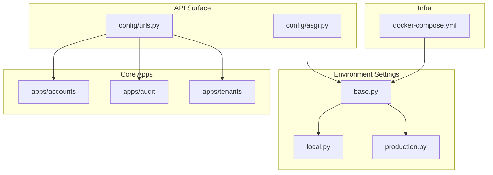
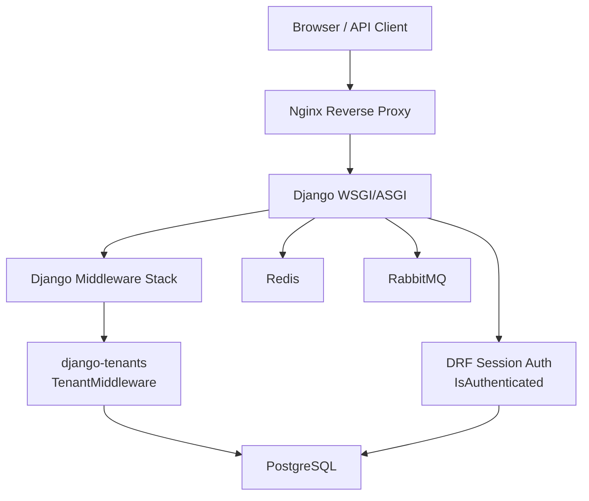
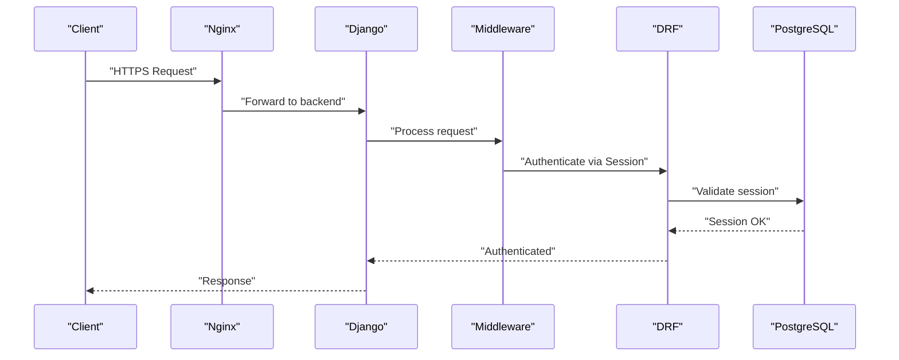
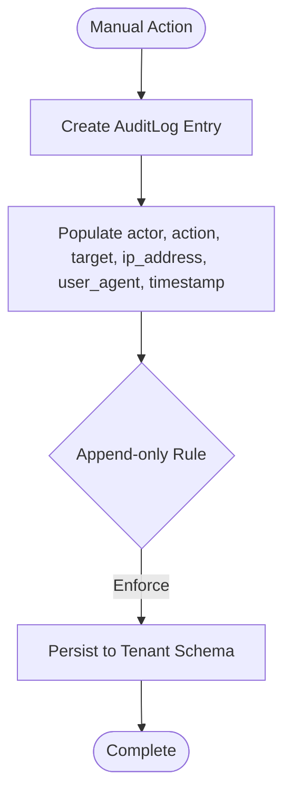
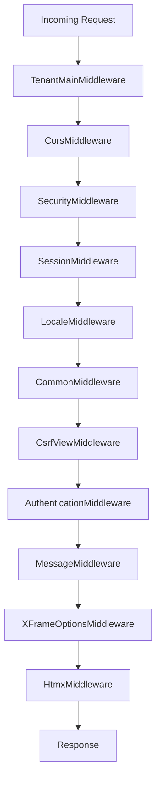
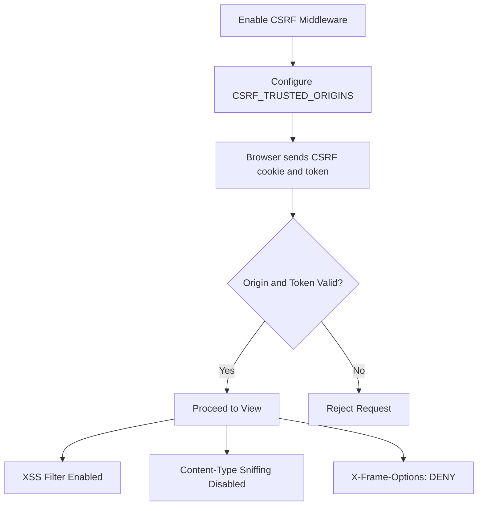
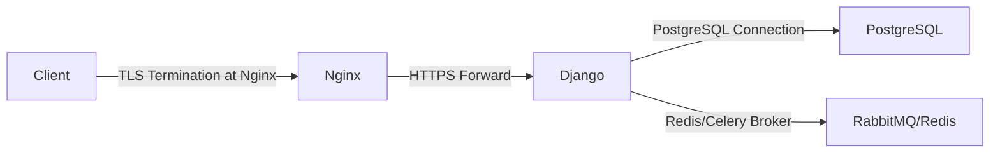
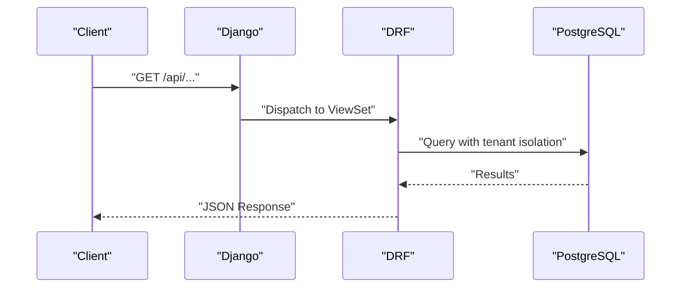
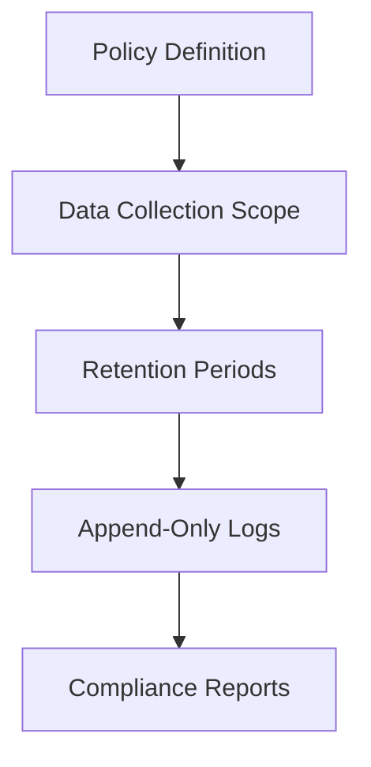
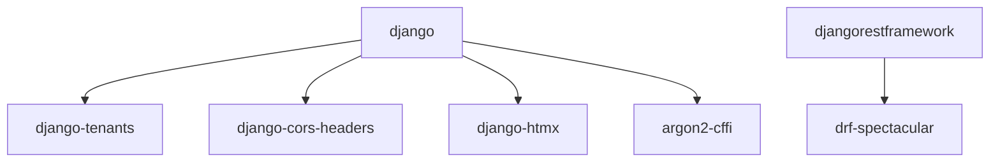

# Security & Compliance

<cite>
**Referenced Files in This Document**
- [base.py](file://backend/config/settings/base.py)
- [production.py](file://backend/config/settings/production.py)
- [local.py](file://backend/config/settings/local.py)
- [models.py](file://backend/apps/audit/models.py)
- [models.py](file://backend/apps/accounts/models.py)
- [models.py](file://backend/apps/tenants/models.py)
- [urls.py](file://backend/config/urls.py)
- [asgi.py](file://backend/config/asgi.py)
- [pyproject.toml](file://backend/pyproject.toml)
- [docker-compose.yml](file://docker-compose.yml)
</cite>

## Table of Contents
1. [Introduction](#introduction)
2. [Project Structure](#project-structure)
3. [Core Components](#core-components)
4. [Architecture Overview](#architecture-overview)
5. [Detailed Component Analysis](#detailed-component-analysis)
6. [Dependency Analysis](#dependency-analysis)
7. [Performance Considerations](#performance-considerations)
8. [Troubleshooting Guide](#troubleshooting-guide)
9. [Conclusion](#conclusion)
10. [Appendices](#appendices)

## Introduction
This document provides comprehensive security and compliance guidance for maintaining production system integrity in Flower. It covers authentication and authorization mechanisms, audit logging, compliance reporting foundations, data protection, middleware configuration, CSRF/XSS safeguards, encryption posture, secure API design, vulnerability assessment, compliance frameworks, data retention, privacy protections, penetration testing, security scanning, incident response, update and patch management, and threat mitigation strategies. The content is grounded in the repository’s Django-based configuration and infrastructure.

## Project Structure
Flower is a Django-based multi-tenant SaaS with a clear separation of concerns:
- Settings are environment-specific and layered (base, local, production).
- Applications are organized by bounded contexts (accounts, audit, tenants, devices, measurements, etc.).
- Infrastructure is containerized with Nginx reverse proxy, PostgreSQL, Redis, RabbitMQ, and Celery orchestration.
- OpenAPI documentation is exposed via DRF Spectacular.

**Diagram sources**
- [base.py:1-336](file://backend/config/settings/base.py#L1-L336)
- [local.py:1-42](file://backend/config/settings/local.py#L1-L42)
- [production.py:1-42](file://backend/config/settings/production.py#L1-L42)
- [urls.py:1-49](file://backend/config/urls.py#L1-L49)
- [asgi.py:1-14](file://backend/config/asgi.py#L1-L14)
- [docker-compose.yml:1-267](file://docker-compose.yml#L1-L267)

**Section sources**
- [base.py:1-336](file://backend/config/settings/base.py#L1-L336)
- [local.py:1-42](file://backend/config/settings/local.py#L1-L42)
- [production.py:1-42](file://backend/config/settings/production.py#L1-L42)
- [urls.py:1-49](file://backend/config/urls.py#L1-L49)
- [asgi.py:1-14](file://backend/config/asgi.py#L1-L14)
- [docker-compose.yml:1-267](file://docker-compose.yml#L1-L267)

## Core Components
- Authentication and Authorization
  - Django’s built-in authentication and session middleware are enabled.
  - REST Framework defaults enforce session-based authentication and per-view IsAuthenticated permission.
  - Multi-tenancy via django-tenants isolates schemas by tenant.
- Audit Logging
  - Audit app exists with a placeholder model indicating planned append-only audit trail fields.
- Security Middleware and Policies
  - X-Frame-Options set to DENY; browser XSS filter and content-type sniffing disabled.
  - Production hardens HSTS, SSL redirect, secure cookies, and proxy header handling.
  - CSRF trusted origins and allowed hosts configured per environment.
- CORS and Cross-Origin Controls
  - CORS allowed origins and credentials configurable per environment.
- Logging and Observability
  - Structured console logging configured; optional Sentry SDK initialization in production.
- Infrastructure and Transport Security
  - Reverse proxy (Nginx) routes traffic; containers expose services with health checks.
  - Celery uses Redis and RabbitMQ; broker URLs are environment-configurable.

**Section sources**
- [base.py:107-119](file://backend/config/settings/base.py#L107-L119)
- [base.py:234-250](file://backend/config/settings/base.py#L234-L250)
- [base.py:267-268](file://backend/config/settings/base.py#L267-L268)
- [base.py:328-336](file://backend/config/settings/base.py#L328-L336)
- [production.py:10-16](file://backend/config/settings/production.py#L10-L16)
- [local.py:7-14](file://backend/config/settings/local.py#L7-L14)
- [models.py:1-31](file://backend/apps/audit/models.py#L1-L31)
- [docker-compose.yml:187-201](file://docker-compose.yml#L187-L201)

## Architecture Overview
The runtime security architecture integrates Django middleware, REST Framework permissions, tenant isolation, and observability.

**Diagram sources**
- [base.py:107-119](file://backend/config/settings/base.py#L107-L119)
- [base.py:155-164](file://backend/config/settings/base.py#L155-L164)
- [production.py:10-16](file://backend/config/settings/production.py#L10-L16)
- [docker-compose.yml:7-26](file://docker-compose.yml#L7-L26)
- [docker-compose.yml:29-46](file://docker-compose.yml#L29-L46)
- [docker-compose.yml:48-70](file://docker-compose.yml#L48-L70)
- [docker-compose.yml:187-201](file://docker-compose.yml#L187-L201)

## Detailed Component Analysis

### Authentication and Authorization
- Built-in Django authentication and session middleware are present.
- REST Framework enforces session authentication and IsAuthenticated by default.
- Multi-tenancy via django-tenants ensures tenant isolation at the database level.
- Role-based access control (RBAC) is not yet implemented in the codebase; the accounts profile model is a placeholder for future roles and permissions.

**Diagram sources**
- [base.py:107-119](file://backend/config/settings/base.py#L107-L119)
- [base.py:234-250](file://backend/config/settings/base.py#L234-L250)
- [production.py:10-16](file://backend/config/settings/production.py#L10-L16)
- [docker-compose.yml:187-201](file://docker-compose.yml#L187-L201)

**Section sources**
- [base.py:107-119](file://backend/config/settings/base.py#L107-L119)
- [base.py:234-250](file://backend/config/settings/base.py#L234-L250)
- [models.py:1-30](file://backend/apps/accounts/models.py#L1-L30)
- [models.py:1-77](file://backend/apps/tenants/models.py#L1-L77)

### Audit Logging Implementation
- The audit app includes a placeholder model for audit log entries with planned fields for actor, action, target, IP address, user agent, and timestamp.
- The model comment explicitly states that audit logs must be append-only; updates or deletions are prohibited.

**Diagram sources**
- [models.py:14-31](file://backend/apps/audit/models.py#L14-L31)

**Section sources**
- [models.py:1-31](file://backend/apps/audit/models.py#L1-L31)

### Security Middleware Configuration
- Middleware stack includes tenant middleware, CORS, security, sessions, locale, common, CSRF, authentication, messages, X-Frame-Options, and HTMX.
- Production adds strict transport security, SSL redirect, secure cookies, and proxy header handling.
- Local development enables debug toolbar and relaxed CORS/hosts for convenience.

**Diagram sources**
- [base.py:107-119](file://backend/config/settings/base.py#L107-L119)
- [production.py:10-16](file://backend/config/settings/production.py#L10-L16)
- [local.py:23-25](file://backend/config/settings/local.py#L23-L25)

**Section sources**
- [base.py:107-119](file://backend/config/settings/base.py#L107-L119)
- [production.py:10-16](file://backend/config/settings/production.py#L10-L16)
- [local.py:7-14](file://backend/config/settings/local.py#L7-L14)

### CSRF Protection and XSS Prevention
- CSRF protection is enabled via Django’s CsrfViewMiddleware.
- CSRF trusted origins are environment-configurable.
- XSS prevention is strengthened by enabling browser XSS filter and content-type sniffing prevention.
- X-Frame-Options is set to DENY to mitigate clickjacking.

**Diagram sources**
- [base.py](file://backend/config/settings/base.py#L36)
- [base.py](file://backend/config/settings/base.py#L114)
- [base.py:330-332](file://backend/config/settings/base.py#L330-L332)

**Section sources**
- [base.py](file://backend/config/settings/base.py#L36)
- [base.py](file://backend/config/settings/base.py#L114)
- [base.py:330-332](file://backend/config/settings/base.py#L330-L332)

### Data Encryption at Rest and in Transit
- At-rest: PostgreSQL runs in a containerized environment; encryption at rest is typically managed by the storage layer and OS; configure TLS for connections if required.
- In-transit: Production enforces HTTPS via HSTS and SSL redirect; ensure Nginx terminates TLS and forwards to Django securely.

**Diagram sources**
- [production.py:10-16](file://backend/config/settings/production.py#L10-L16)
- [docker-compose.yml:187-201](file://docker-compose.yml#L187-L201)

**Section sources**
- [production.py:10-16](file://backend/config/settings/production.py#L10-L16)
- [docker-compose.yml:7-26](file://docker-compose.yml#L7-L26)
- [docker-compose.yml:29-46](file://docker-compose.yml#L29-L46)
- [docker-compose.yml:48-70](file://docker-compose.yml#L48-L70)

### Secure API Design Patterns
- Session-based authentication enforced by DRF.
- Centralized schema and documentation via DRF Spectacular.
- Pagination and renderer/parser defaults standardized.

**Diagram sources**
- [base.py:234-250](file://backend/config/settings/base.py#L234-L250)
- [urls.py:21-23](file://backend/config/urls.py#L21-L23)

**Section sources**
- [base.py:234-250](file://backend/config/settings/base.py#L234-L250)
- [urls.py:21-23](file://backend/config/urls.py#L21-L23)

### Compliance Reporting and Data Retention
- Audit logs are append-only by design, supporting integrity and compliance needs.
- Data retention and privacy policies should be documented separately and applied consistently across tenant schemas.

**Diagram sources**
- [models.py:7-8](file://backend/apps/audit/models.py#L7-L8)

**Section sources**
- [models.py:7-8](file://backend/apps/audit/models.py#L7-L8)

### Privacy Protection Measures
- Logging configuration supports structured console logging; avoid logging sensitive data.
- Optional Sentry SDK initialization is present; ensure PII handling aligns with privacy requirements.

**Section sources**
- [base.py:288-325](file://backend/config/settings/base.py#L288-L325)
- [production.py:30-41](file://backend/config/settings/production.py#L30-L41)

### Vulnerability Assessment Procedures
- Regular dependency audits using pinned versions and optional security-focused packages.
- Container health checks for core services (PostgreSQL, Redis, RabbitMQ).
- Consider integrating automated SCA and SAST during CI/CD pipelines.

**Section sources**
- [pyproject.toml:18-67](file://backend/pyproject.toml#L18-L67)
- [docker-compose.yml:20-26](file://docker-compose.yml#L20-L26)
- [docker-compose.yml:39-44](file://docker-compose.yml#L39-L44)
- [docker-compose.yml:63-68](file://docker-compose.yml#L63-L68)

### Penetration Testing and Security Scanning
- Conduct periodic assessments targeting the API surface, admin interface, and tenant isolation boundaries.
- Scan containers and dependencies regularly; leverage environment-specific settings for safe testing.

**Section sources**
- [urls.py:14-16](file://backend/config/urls.py#L14-L16)
- [docker-compose.yml:74-103](file://docker-compose.yml#L74-L103)

### Incident Response Protocols
- Enable structured logging and consider Sentry for error monitoring.
- Define escalation paths for authentication failures, audit tampering attempts, and tenant data exposure.

**Section sources**
- [base.py:288-325](file://backend/config/settings/base.py#L288-L325)
- [production.py:30-41](file://backend/config/settings/production.py#L30-L41)

### Security Update Procedures and Patch Management
- Pin dependencies and review updates periodically.
- Apply patches to Django, DRF, and third-party libraries; validate against test suite before production rollout.

**Section sources**
- [pyproject.toml:18-67](file://backend/pyproject.toml#L18-L67)

### Threat Mitigation Strategies
- Enforce tenant isolation via schemas and middleware.
- Harden production with HSTS, SSL redirect, secure cookies, and trusted origins.
- Restrict allowed hosts and CORS origins per environment.

**Section sources**
- [base.py](file://backend/config/settings/base.py#L35)
- [base.py:267-268](file://backend/config/settings/base.py#L267-L268)
- [production.py:10-16](file://backend/config/settings/production.py#L10-L16)
- [local.py:7-14](file://backend/config/settings/local.py#L7-L14)

## Dependency Analysis
Key security-related dependencies and their roles:
- argon2-cffi: Password hashing library.
- django-cors-headers: Cross-origin controls.
- django-htmx: HTMX support.
- djangorestframework: API framework with session authentication defaults.
- drf-spectacular: OpenAPI schema generation.
- django-tenants: Multi-tenant schema isolation.

**Diagram sources**
- [pyproject.toml:18-67](file://backend/pyproject.toml#L18-L67)

**Section sources**
- [pyproject.toml:18-67](file://backend/pyproject.toml#L18-L67)

## Performance Considerations
- Production sets connection pooling via CONN_MAX_AGE.
- Consider enabling whitenoise or CDN for static assets in production.

**Section sources**
- [production.py](file://backend/config/settings/production.py#L21)

## Troubleshooting Guide
- Authentication failures: Verify session middleware order and CSRF trusted origins.
- CORS errors: Confirm CORS_ALLOWED_ORIGINS and credentials settings per environment.
- Tenant isolation issues: Validate tenant routing and schema creation.
- Logging and Sentry: Ensure logging configuration and optional Sentry initialization are active in production.

**Section sources**
- [base.py:107-119](file://backend/config/settings/base.py#L107-L119)
- [base.py:267-268](file://backend/config/settings/base.py#L267-L268)
- [base.py:288-325](file://backend/config/settings/base.py#L288-L325)
- [production.py:30-41](file://backend/config/settings/production.py#L30-L41)

## Conclusion
Flower’s Django foundation provides strong defaults for authentication, middleware, and tenant isolation. Production hardening includes HSTS, SSL redirect, secure cookies, and CORS controls. The audit app establishes a foundation for append-only logging, essential for compliance. To achieve comprehensive security and compliance, implement RBAC, define privacy and retention policies, integrate continuous security scanning, and formalize incident response procedures aligned with organizational standards.

## Appendices
- API Documentation Endpoints: Schema and Swagger/ReDoc views are exposed under the API namespace.
- ASGI Settings Module: Ensure the correct settings module is selected for ASGI environments.

**Section sources**
- [urls.py:21-23](file://backend/config/urls.py#L21-L23)
- [asgi.py](file://backend/config/asgi.py#L11)