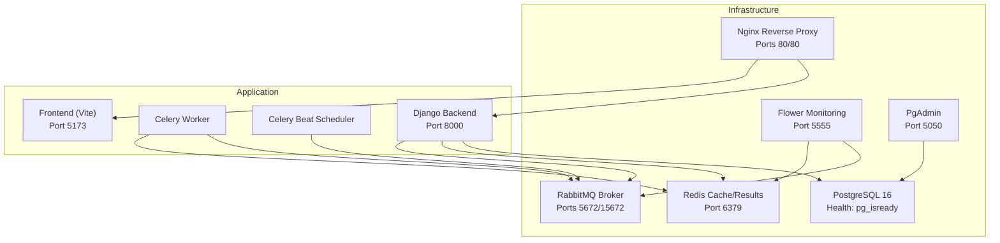
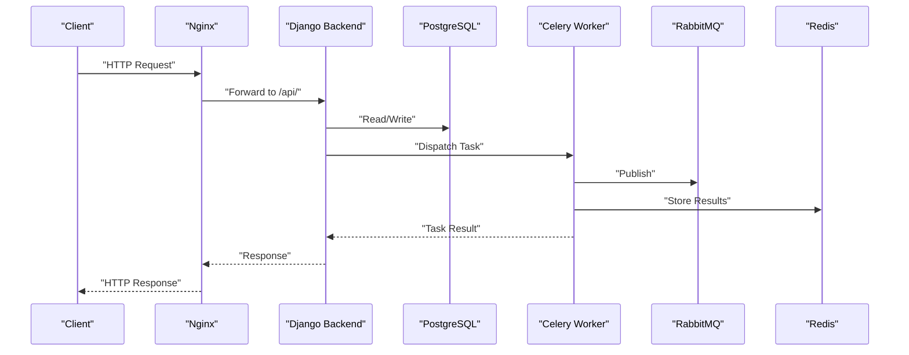
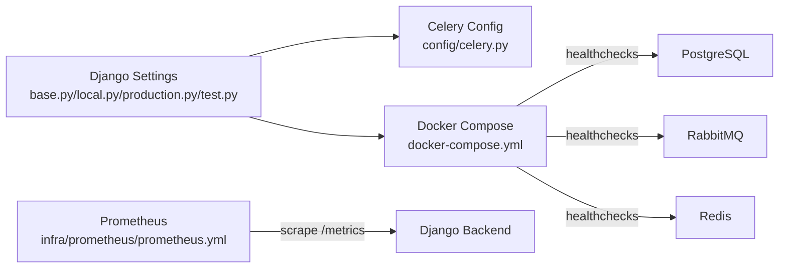

# Troubleshooting & Support

<cite>
**Referenced Files in This Document**
- [README.md](file://README.md)
- [docker-compose.yml](file://docker-compose.yml)
- [backend/pyproject.toml](file://backend/pyproject.toml)
- [backend/config/settings/base.py](file://backend/config/settings/base.py)
- [backend/config/settings/local.py](file://backend/config/settings/local.py)
- [backend/config/settings/production.py](file://backend/config/settings/production.py)
- [backend/config/settings/test.py](file://backend/config/settings/test.py)
- [backend/config/celery.py](file://backend/config/celery.py)
- [backend/config/urls.py](file://backend/config/urls.py)
- [backend/manage.py](file://backend/manage.py)
- [infra/prometheus/prometheus.yml](file://infra/prometheus/prometheus.yml)
</cite>

## Table of Contents
1. [Introduction](#introduction)
2. [Project Structure](#project-structure)
3. [Core Components](#core-components)
4. [Architecture Overview](#architecture-overview)
5. [Detailed Component Analysis](#detailed-component-analysis)
6. [Dependency Analysis](#dependency-analysis)
7. [Performance Considerations](#performance-considerations)
8. [Troubleshooting Guide](#troubleshooting-guide)
9. [Incident Response Playbooks](#incident-response-playbooks)
10. [Support Ticket Workflows](#support-ticket-workflows)
11. [Rollback Strategies and Emergency Procedures](#rollback-strategies-and-emergency-procedures)
12. [FAQ](#faq)
13. [Conclusion](#conclusion)

## Introduction
This document provides comprehensive troubleshooting and support guidance for operational issue resolution in Flower. It covers systematic debugging approaches for database connectivity, Celery task failures, and API endpoint issues. It also explains log analysis techniques, error correlation, performance bottleneck identification, health checks, monitoring, and incident response procedures. Guidance is grounded in the repository’s configuration and operational artifacts.

## Project Structure
Flower is a multi-service system composed of:
- Backend (Django + Django-Rest-Framework + Celery)
- Frontend (React/Vite)
- Infrastructure (PostgreSQL, Redis, RabbitMQ, Nginx, Flower, PgAdmin)
- Monitoring (Prometheus scraping backend metrics)

**Diagram sources**
- [docker-compose.yml:1-267](file://docker-compose.yml#L1-L267)

**Section sources**
- [README.md:1-194](file://README.md#L1-L194)
- [docker-compose.yml:1-267](file://docker-compose.yml#L1-L267)

## Core Components
- Django Backend: Multi-tenant SaaS with tenant isolation via django-tenants and PostgreSQL schemas. API exposed via DRF with OpenAPI schema endpoints.
- Celery: Task queue with RabbitMQ as broker and Redis as result backend; includes a worker and scheduler (Beat).
- Monitoring and Observability: Prometheus configured to scrape backend metrics at /metrics; Flower for Celery monitoring; Nginx as reverse proxy.
- Logging: Structured logging via Python logging; development settings enable DB SQL logging; production supports optional Sentry integration.

Key operational configuration highlights:
- Database: django-tenants backend configured in base settings; migrations split between shared and tenant schemas.
- Celery: Broker and result backend configured via environment variables; autodiscovery of tasks.
- API: Schema and docs endpoints provided by drf-spectacular; URL routing skeleton for bounded contexts.
- Health checks: Services expose healthchecks via docker-compose healthcheck entries.

**Section sources**
- [backend/config/settings/base.py:155-164](file://backend/config/settings/base.py#L155-L164)
- [backend/config/settings/base.py:271-280](file://backend/config/settings/base.py#L271-L280)
- [backend/config/urls.py:21-23](file://backend/config/urls.py#L21-L23)
- [backend/config/celery.py:1-28](file://backend/config/celery.py#L1-L28)
- [docker-compose.yml:20-24](file://docker-compose.yml#L20-L24)
- [docker-compose.yml:39-43](file://docker-compose.yml#L39-L43)
- [docker-compose.yml:63-67](file://docker-compose.yml#L63-L67)
- [docker-compose.yml:246-247](file://docker-compose.yml#L246-L247)

## Architecture Overview
Operational flows relevant to troubleshooting:
- API requests traverse Nginx to Django, which interacts with PostgreSQL and Redis/Celery depending on endpoint logic.
- Celery tasks are dispatched to RabbitMQ and executed by workers; results stored in Redis.
- Monitoring: Prometheus scrapes /metrics on backend; Flower connects to RabbitMQ API for task visibility.

**Diagram sources**
- [docker-compose.yml:74-131](file://docker-compose.yml#L74-L131)
- [backend/config/urls.py:21-23](file://backend/config/urls.py#L21-L23)

## Detailed Component Analysis

### Database Connectivity Troubleshooting
Common symptoms:
- 5xx responses from API endpoints interacting with tenant/shared schemas.
- Migration failures or connection refused errors.
- Slow queries or timeouts.

Systematic checks:
- Verify service health: PostgreSQL healthcheck uses pg_isready; ensure the service is healthy before starting Django.
- Confirm credentials and network: POSTGRES_* environment variables must match compose environment; container network connectivity.
- Multi-tenancy: django-tenants requires both shared and tenant migrations; run both sets after schema changes.
- Connection pooling/performance: Production enables CONN_MAX_AGE; adjust if connection exhaustion occurs.

Diagnostic steps:
- Connect to the database container and run basic connectivity checks.
- Review Django logs for database-related exceptions.
- Inspect tenant/domain records and schema creation if tenant isolation appears broken.

**Section sources**
- [docker-compose.yml:10-24](file://docker-compose.yml#L10-L24)
- [backend/config/settings/base.py:155-164](file://backend/config/settings/base.py#L155-L164)
- [backend/config/settings/production.py](file://backend/config/settings/production.py#L21)
- [README.md:96-104](file://README.md#L96-L104)

### Celery Task Failures Troubleshooting
Symptoms:
- Tasks stuck in “PENDING” or failing immediately.
- No tasks processed by worker.
- Flower shows empty queues or failed tasks.

Systematic checks:
- Broker connectivity: RabbitMQ healthcheck must pass; verify credentials and vhost.
- Result backend: Redis healthcheck must pass; ensure result backend URL matches environment.
- Worker/scheduler commands: Confirm Celery commands in compose align with broker/result backend configuration.
- Task discovery: Celery autodiscovers tasks from Django apps; ensure tasks are defined and imported.

Diagnostic steps:
- Tail backend logs for Celery startup and task execution logs.
- Use Flower web UI to inspect queues, scheduled tasks, and recent failures.
- Temporarily enable eager execution in tests to validate task logic without broker.

**Section sources**
- [docker-compose.yml:50-67](file://docker-compose.yml#L50-L67)
- [docker-compose.yml:108-131](file://docker-compose.yml#L108-L131)
- [docker-compose.yml:136-160](file://docker-compose.yml#L136-L160)
- [backend/config/celery.py:1-28](file://backend/config/celery.py#L1-L28)
- [backend/config/settings/base.py:271-280](file://backend/config/settings/base.py#L271-L280)
- [README.md](file://README.md#L33)

### API Endpoint Issues Troubleshooting
Symptoms:
- 403/401 authentication errors.
- 404 for documented endpoints.
- CORS errors in browser console.
- Schema/docs endpoints not loading.

Systematic checks:
- Authentication: DRF defaults require session authentication; ensure cookies/session are present.
- CORS: Allowed origins must include frontend origin; verify CSRF trusted origins.
- URL routing: Skeleton routes exist for bounded contexts; ensure apps register their URL namespaces.
- OpenAPI: Schema/docs endpoints are registered; confirm path prefixes and permissions.

Diagnostic steps:
- Use Swagger UI to validate schema and test endpoints.
- Check Django logs for permission/authentication exceptions.
- Validate ALLOWED_HOSTS and CSRF_TRUSTED_ORIGINS in environment.

**Section sources**
- [backend/config/settings/base.py:234-250](file://backend/config/settings/base.py#L234-L250)
- [backend/config/settings/local.py:10-14](file://backend/config/settings/local.py#L10-L14)
- [backend/config/urls.py:21-38](file://backend/config/urls.py#L21-L38)
- [backend/config/settings/base.py:255-262](file://backend/config/settings/base.py#L255-L262)

### Logging and Log Analysis
Logging configuration:
- Console handler with verbose/simple formatters.
- Root logger level set to INFO; app-specific loggers for “django” and “apps”.
- Local development adds SQL logging for the database backend.
- Production optionally integrates Sentry SDK.

Log analysis techniques:
- Filter by logger name (e.g., django, apps) to isolate subsystems.
- Correlate timestamps with external systems (RabbitMQ, Redis, PostgreSQL) to identify causality.
- Enable SQL logging in development to capture slow queries.

**Section sources**
- [backend/config/settings/base.py:288-325](file://backend/config/settings/base.py#L288-L325)
- [backend/config/settings/local.py:35-41](file://backend/config/settings/local.py#L35-L41)
- [backend/config/settings/production.py:30-41](file://backend/config/settings/production.py#L30-L41)

### Health Checks and Monitoring
Health checks:
- PostgreSQL: healthcheck using pg_isready.
- Redis: healthcheck using redis-cli ping.
- RabbitMQ: healthcheck using rabbitmq-diagnostics ping.

Monitoring:
- Prometheus configured to scrape backend /metrics endpoint.
- Flower exposes a web UI for Celery monitoring.

Operational checks:
- Ensure healthchecks pass before deploying.
- Validate Prometheus target status and metric availability.
- Use Flower to inspect task throughput and failure rates.

**Section sources**
- [docker-compose.yml:20-24](file://docker-compose.yml#L20-L24)
- [docker-compose.yml:39-43](file://docker-compose.yml#L39-L43)
- [docker-compose.yml:63-67](file://docker-compose.yml#L63-L67)
- [infra/prometheus/prometheus.yml:10-15](file://infra/prometheus/prometheus.yml#L10-L15)
- [docker-compose.yml:246-247](file://docker-compose.yml#L246-L247)

## Dependency Analysis
Internal and external dependencies relevant to operations:
- Django settings load environment variables for database, Celery, CORS, and logging.
- Celery configuration loads from Django settings namespace.
- Docker Compose orchestrates service dependencies and healthchecks.
- Prometheus scrapes backend metrics endpoint.

**Diagram sources**
- [backend/config/settings/base.py:155-164](file://backend/config/settings/base.py#L155-L164)
- [backend/config/celery.py:1-28](file://backend/config/celery.py#L1-L28)
- [docker-compose.yml:1-267](file://docker-compose.yml#L1-L267)
- [infra/prometheus/prometheus.yml:10-15](file://infra/prometheus/prometheus.yml#L10-L15)

**Section sources**
- [backend/config/settings/base.py:155-164](file://backend/config/settings/base.py#L155-L164)
- [backend/config/celery.py:1-28](file://backend/config/celery.py#L1-L28)
- [docker-compose.yml:1-267](file://docker-compose.yml#L1-L267)
- [infra/prometheus/prometheus.yml:10-15](file://infra/prometheus/prometheus.yml#L10-L15)

## Performance Considerations
- Connection pooling: Production enables CONN_MAX_AGE to reduce connection overhead.
- Celery concurrency: Adjust worker concurrency in compose command to balance throughput and resource usage.
- Logging overhead: Reduce log levels in production; avoid excessive SQL logging in high-throughput environments.
- Caching: Use Redis for caching frequently accessed data; monitor cache hit ratios.

[No sources needed since this section provides general guidance]

## Troubleshooting Guide

### Database Connectivity
- Symptoms: 500 errors, migration failures, tenant schema issues.
- Steps:
  - Confirm PostgreSQL healthcheck passes.
  - Validate POSTGRES_* environment variables and network reachability.
  - Run both shared and tenant migrations.
  - Check tenant/domain records and schema existence.
- Tools: pgAdmin for schema inspection; backend logs for exceptions.

**Section sources**
- [docker-compose.yml:10-24](file://docker-compose.yml#L10-L24)
- [README.md:96-104](file://README.md#L96-L104)
- [backend/config/settings/base.py:155-164](file://backend/config/settings/base.py#L155-L164)

### Celery Task Failures
- Symptoms: Tasks not picked up, failures in Flower, no results.
- Steps:
  - Verify RabbitMQ and Redis healthchecks.
  - Confirm Celery broker/result backend URLs.
  - Check worker/scheduler commands and logs.
  - Validate task registration and imports.
- Tools: Flower UI; backend logs; temporary eager execution in tests.

**Section sources**
- [docker-compose.yml:50-67](file://docker-compose.yml#L50-L67)
- [docker-compose.yml:108-131](file://docker-compose.yml#L108-L131)
- [docker-compose.yml:136-160](file://docker-compose.yml#L136-L160)
- [backend/config/celery.py:1-28](file://backend/config/celery.py#L1-L28)
- [README.md](file://README.md#L33)

### API Endpoint Issues
- Symptoms: 401/403, CORS errors, missing endpoints.
- Steps:
  - Verify CORS and CSRF trusted origins.
  - Ensure URL namespaces are wired for bounded contexts.
  - Test schema/docs endpoints via Swagger UI.
- Tools: Swagger UI; Django logs; browser dev tools.

**Section sources**
- [backend/config/settings/local.py:10-14](file://backend/config/settings/local.py#L10-L14)
- [backend/config/urls.py:21-38](file://backend/config/urls.py#L21-L38)
- [backend/config/settings/base.py:234-250](file://backend/config/settings/base.py#L234-L250)

### Log Analysis and Error Correlation
- Steps:
  - Filter logs by logger (django, apps).
  - Correlate timestamps with external service healthchecks.
  - Enable SQL logging in development to capture slow queries.
- Tools: Console logs; structured logging formatters.

**Section sources**
- [backend/config/settings/base.py:288-325](file://backend/config/settings/base.py#L288-L325)
- [backend/config/settings/local.py:35-41](file://backend/config/settings/local.py#L35-L41)

### Performance Bottlenecks
- Steps:
  - Monitor backend /metrics via Prometheus.
  - Inspect Celery task durations and failure rates in Flower.
  - Tune database connection pooling and Celery concurrency.
- Tools: Prometheus metrics; Flower; backend logs.

**Section sources**
- [infra/prometheus/prometheus.yml:10-15](file://infra/prometheus/prometheus.yml#L10-L15)
- [docker-compose.yml:246-247](file://docker-compose.yml#L246-L247)
- [backend/config/settings/production.py](file://backend/config/settings/production.py#L21)

## Incident Response Playbooks

### Database Outage
- Detection: Healthcheck failures; 5xx responses; migration errors.
- Actions:
  - Isolate tenant/shared schema issues.
  - Restore connections or fix credentials.
  - Re-run migrations if schema drift detected.
- Verification: Confirm service healthcheck passes; re-test API endpoints.

**Section sources**
- [docker-compose.yml:10-24](file://docker-compose.yml#L10-L24)
- [README.md:96-104](file://README.md#L96-L104)

### Celery Pipeline Failure
- Detection: Tasks stuck, Flower shows failures, no results.
- Actions:
  - Validate RabbitMQ and Redis health.
  - Restart worker/scheduler containers.
  - Inspect task logs and retry policies.
- Verification: Confirm task processing resumes; monitor Flower.

**Section sources**
- [docker-compose.yml:50-67](file://docker-compose.yml#L50-L67)
- [docker-compose.yml:108-131](file://docker-compose.yml#L108-L131)
- [docker-compose.yml:136-160](file://docker-compose.yml#L136-L160)

### API Availability Degradation
- Detection: High latency, 4xx/5xx, schema/docs not loading.
- Actions:
  - Check CORS and CSRF settings.
  - Validate URL routing and app registrations.
  - Inspect middleware order and authentication.
- Verification: Swagger UI and endpoint tests.

**Section sources**
- [backend/config/settings/local.py:10-14](file://backend/config/settings/local.py#L10-L14)
- [backend/config/urls.py:21-38](file://backend/config/urls.py#L21-L38)

### Post-Mortem Procedures
- Document root cause, impact, timeline, and remediation steps.
- Capture logs, metrics, and healthcheck snapshots.
- Update runbooks and alerting thresholds.

[No sources needed since this section provides general guidance]

## Support Ticket Workflows
- Tier 1: Validate environment variables, healthchecks, and basic connectivity.
- Tier 2: Inspect logs, correlate with external services, reproduce with minimal steps.
- Tier 3: Deep-dive into database/celery/task logic; coordinate with developers.

Escalation criteria:
- Persistent outages after Tier 2 actions.
- Security or compliance concerns.
- Customer data integrity risks.

Customer support integration:
- Provide reproducible steps and collected logs/metrics.
- Offer temporary workarounds (e.g., disable problematic tasks).

[No sources needed since this section provides general guidance]

## Rollback Strategies and Emergency Procedures
- Rollback database: Revert migrations to known-good versions; ensure tenant isolation remains intact.
- Rollback application: Tagged container images enable quick rollback; redeploy previous tag.
- Hotfix deployment: Build and push a minimal fix; validate via healthchecks and metrics.
- Emergency maintenance: Schedule maintenance windows; notify stakeholders; use blue/green or rolling updates.

[No sources needed since this section provides general guidance]

## FAQ
- How do I run migrations for shared and tenant schemas?
  - Use the documented commands for shared and tenant migrations.
- Why are my API endpoints returning 403/401?
  - Ensure session authentication is used and cookies are present; verify CSRF trusted origins.
- Why are Celery tasks not being processed?
  - Check RabbitMQ and Redis healthchecks; confirm broker/result backend URLs and worker commands.
- Where can I see task progress and failures?
  - Use the Flower web UI to inspect queues and recent task outcomes.
- How do I enable SQL logging for performance analysis?
  - Enable SQL logging in local development settings.

**Section sources**
- [README.md:96-104](file://README.md#L96-L104)
- [backend/config/settings/local.py:35-41](file://backend/config/settings/local.py#L35-L41)
- [docker-compose.yml:246-247](file://docker-compose.yml#L246-L247)

## Conclusion
This guide consolidates operational troubleshooting and support procedures for Flower, grounded in repository configuration and orchestration. By following the systematic approaches outlined—service health verification, log analysis, error correlation, and performance tuning—you can quickly diagnose and resolve common issues. Integrate monitoring (Prometheus, Flower) and maintain robust runbooks to sustain reliability and customer trust.