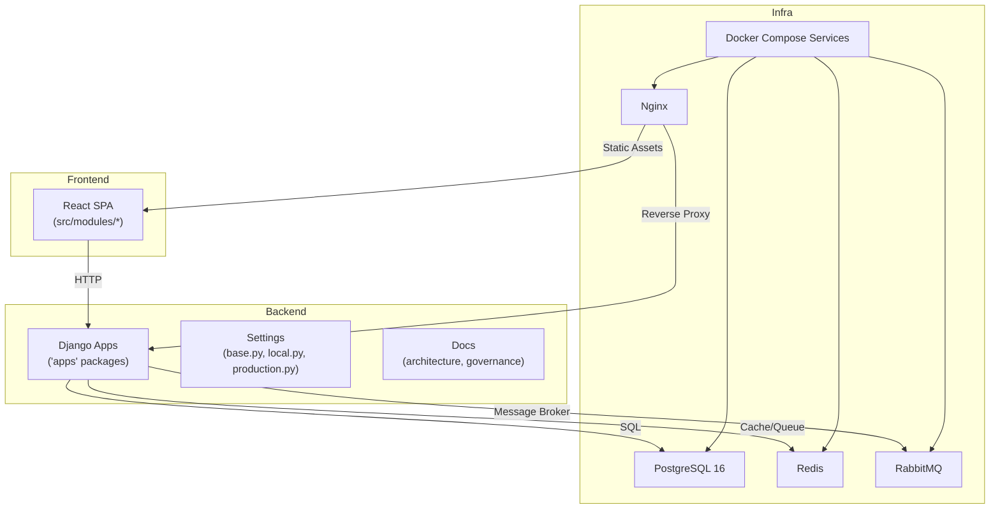
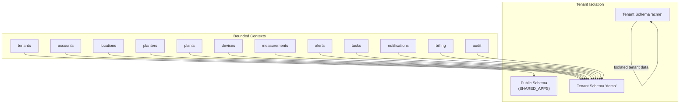
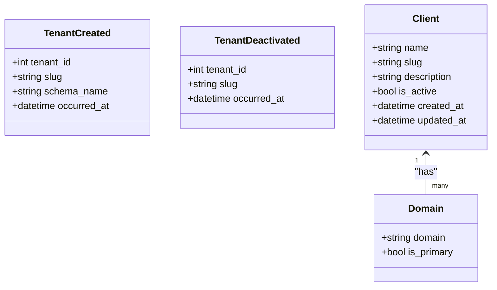
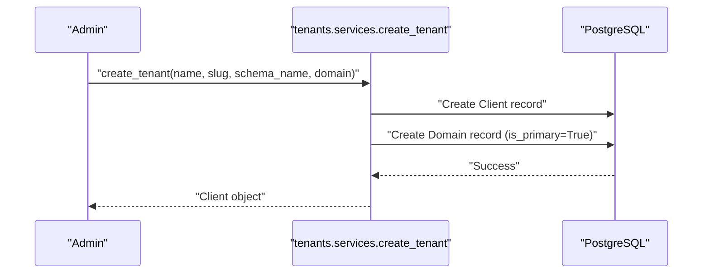
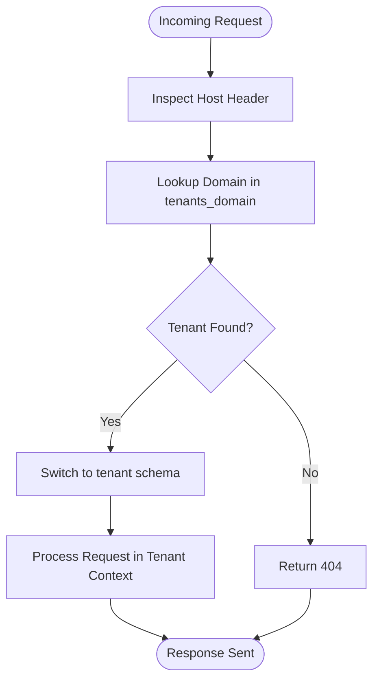
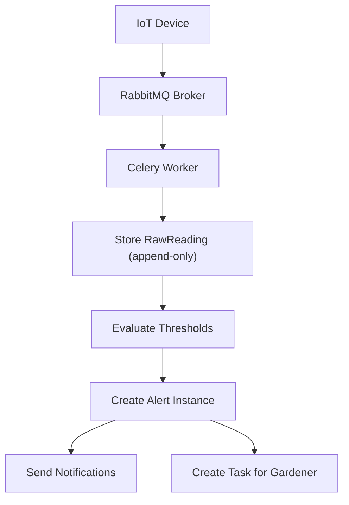
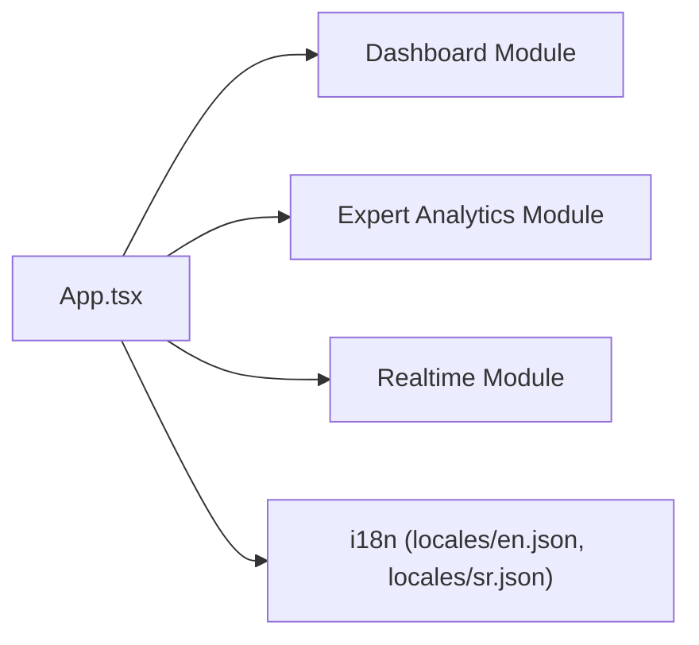
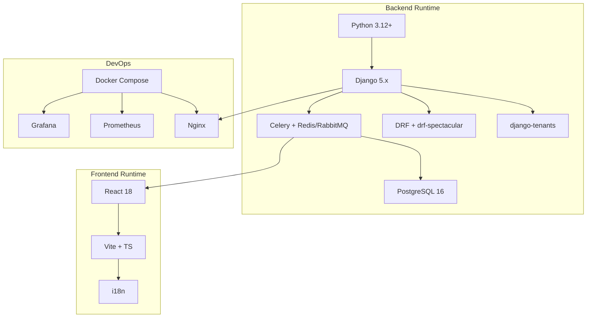

# Project Overview

<cite>
**Referenced Files in This Document**
- [README.md](file://README.md)
- [pyproject.toml](file://backend/pyproject.toml)
- [package.json](file://frontend/package.json)
- [base.py](file://backend/config/settings/base.py)
- [urls.py](file://backend/config/urls.py)
- [DDD_OVERVIEW.md](file://backend/docs/architecture/DDD_OVERVIEW.md)
- [MULTI_TENANCY.md](file://backend/docs/architecture/MULTI_TENANCY.md)
- [tenants/models.py](file://backend/apps/tenants/models.py)
- [tenants/services.py](file://backend/apps/tenants/services.py)
- [tenants/selectors.py](file://backend/apps/tenants/selectors.py)
- [tenants/events.py](file://backend/apps/tenants/events.py)
- [plants/models.py](file://backend/apps/plants/models.py)
- [devices/models.py](file://backend/apps/devices/models.py)
- [alerts/models.py](file://backend/apps/alerts/models.py)
- [measurements/models.py](file://backend/apps/measurements/models.py)
- [planters/models.py](file://backend/apps/planters/models.py)
- [App.tsx](file://frontend/src/App.tsx)
- [docker-compose.yml](file://docker-compose.yml)
</cite>

## Table of Contents
1. [Introduction](#introduction)
2. [Project Structure](#project-structure)
3. [Core Components](#core-components)
4. [Architecture Overview](#architecture-overview)
5. [Detailed Component Analysis](#detailed-component-analysis)
6. [Dependency Analysis](#dependency-analysis)
7. [Performance Considerations](#performance-considerations)
8. [Troubleshooting Guide](#troubleshooting-guide)
9. [Conclusion](#conclusion)

## Introduction
PlantOps/PlanterOps is a multi-tenant SaaS platform designed to manage IoT-enabled plants and planters at scale. Its purpose is to provide greenhouse operators, urban farms, and botanical gardens with a unified system for tenant provisioning, device registration, real-time monitoring, alerting, and operational task management. The platform emphasizes strong tenant isolation, domain-driven design (DDD), and scalable infrastructure built on modern DevOps practices.

Core value proposition:
- Multi-tenant isolation with dedicated PostgreSQL schemas per tenant
- Clear separation of concerns via bounded contexts and DDD
- Real-time ingestion and alerting for IoT sensors
- Operational visibility through dashboards and analytics
- Extensible architecture supporting future integrations (e.g., billing, notifications)

Target audience:
- Greenhouse operators managing climate-controlled environments
- Urban farming initiatives scaling indoor growing operations
- Botanical gardens maintaining curated collections with environmental monitoring

## Project Structure
The repository is organized into three main layers:
- Backend: Django 5.x monorepo with DDD apps (bounded contexts), settings, and architecture docs
- Frontend: React 18 SPA with TypeScript, Vite, and i18n
- Infra: Dockerized services (PostgreSQL, Redis, RabbitMQ, Nginx, monitoring)

**Diagram sources**
- [base.py:44-94](file://backend/config/settings/base.py#L44-L94)
- [urls.py:12-38](file://backend/config/urls.py#L12-L38)
- [docker-compose.yml:3-267](file://docker-compose.yml#L3-L267)

**Section sources**
- [README.md:131-168](file://README.md#L131-L168)
- [base.py:44-94](file://backend/config/settings/base.py#L44-L94)
- [docker-compose.yml:3-267](file://docker-compose.yml#L3-L267)

## Core Components
- Multi-tenant architecture powered by django-tenants with PostgreSQL schemas
- 12 bounded contexts implementing DDD: tenants, accounts, locations, planters, plants, devices, measurements, alerts, tasks, notifications, billing, audit
- Backend built on Django 5.x, DRF, Celery, Redis, and RabbitMQ
- Frontend built on React 18, Vite, TypeScript, and i18n
- DevOps stack including Docker, Docker Compose, Nginx, Prometheus, and Grafana

Key features:
- Tenant provisioning and deactivation
- IoT device registry and ingestion pipeline
- Alert definitions and alert instances
- Real-time monitoring dashboards
- Gardener task management
- Notifications via email/SMS/push
- Billing and audit trails

**Section sources**
- [README.md:5-11](file://README.md#L5-L11)
- [DDD_OVERVIEW.md:1-85](file://backend/docs/architecture/DDD_OVERVIEW.md#L1-L85)
- [MULTI_TENANCY.md:1-76](file://backend/docs/architecture/MULTI_TENANCY.md#L1-L76)

## Architecture Overview
The platform follows Domain-Driven Design with each Django app acting as a bounded context. Data ownership and invariants are scoped to each context, with cross-context communication achieved via domain events or explicit service calls. Tenant isolation is enforced at the database level using PostgreSQL schemas and django-tenants middleware.

**Diagram sources**
- [base.py:44-94](file://backend/config/settings/base.py#L44-L94)
- [MULTI_TENANCY.md:28-40](file://backend/docs/architecture/MULTI_TENANCY.md#L28-L40)
- [DDD_OVERVIEW.md:5-66](file://backend/docs/architecture/DDD_OVERVIEW.md#L5-L66)

## Detailed Component Analysis

### Bounded Contexts Overview
Each context adheres to a consistent DDD structure:
- models.py: Domain entities and value objects
- services.py: Write operations (mutations)
- selectors.py: Read/query operations
- events.py: Domain events (outbox pattern)

**Diagram sources**
- [tenants/events.py:19-36](file://backend/apps/tenants/events.py#L19-L36)
- [tenants/models.py:6-53](file://backend/apps/tenants/models.py#L6-L53)

**Section sources**
- [DDD_OVERVIEW.md:67-85](file://backend/docs/architecture/DDD_OVERVIEW.md#L67-L85)
- [tenants/models.py:6-53](file://backend/apps/tenants/models.py#L6-L53)
- [tenants/events.py:1-36](file://backend/apps/tenants/events.py#L1-L36)

### Tenant Provisioning Workflow
Tenant provisioning is centralized and secure, ensuring schema creation and domain mapping occur atomically.

**Diagram sources**
- [tenants/services.py:11-35](file://backend/apps/tenants/services.py#L11-L35)
- [tenants/models.py:6-53](file://backend/apps/tenants/models.py#L6-L53)

**Section sources**
- [tenants/services.py:1-42](file://backend/apps/tenants/services.py#L1-L42)
- [tenants/selectors.py:1-26](file://backend/apps/tenants/selectors.py#L1-L26)

### Multi-Tenant Routing and Isolation
Requests are routed to the correct tenant schema using Host-based routing and middleware. Fail-closed isolation prevents accidental cross-tenant access.

**Diagram sources**
- [MULTI_TENANCY.md:12-27](file://backend/docs/architecture/MULTI_TENANCY.md#L12-L27)
- [base.py:107-119](file://backend/config/settings/base.py#L107-L119)

**Section sources**
- [MULTI_TENANCY.md:1-76](file://backend/docs/architecture/MULTI_TENANCY.md#L1-L76)
- [base.py:99-119](file://backend/config/settings/base.py#L99-L119)

### IoT Data Ingestion and Alerting
IoT devices submit raw sensor readings that are stored append-only. Alerts are derived from thresholds and care profiles, and can spawn tasks for operators.

**Diagram sources**
- [devices/models.py:12-24](file://backend/apps/devices/models.py#L12-L24)
- [measurements/models.py:14-25](file://backend/apps/measurements/models.py#L14-L25)
- [alerts/models.py:13-24](file://backend/apps/alerts/models.py#L13-L24)
- [docker-compose.yml:48-132](file://docker-compose.yml#L48-L132)

**Section sources**
- [devices/models.py:1-29](file://backend/apps/devices/models.py#L1-L29)
- [measurements/models.py:1-30](file://backend/apps/measurements/models.py#L1-L30)
- [alerts/models.py:1-29](file://backend/apps/alerts/models.py#L1-L29)

### Frontend Modules and Localization
The frontend is structured into modules for dashboard, expert analytics, and real-time monitoring, with internationalization support.

**Diagram sources**
- [App.tsx:1-20](file://frontend/src/App.tsx#L1-L20)
- [package.json:12-19](file://frontend/package.json#L12-L19)

**Section sources**
- [README.md:170-176](file://README.md#L170-L176)
- [App.tsx:1-20](file://frontend/src/App.tsx#L1-L20)
- [package.json:1-33](file://frontend/package.json#L1-L33)

## Dependency Analysis
Technology stack and runtime dependencies:
- Backend: Python 3.12+, Django 5.x, django-tenants, DRF, Celery, Redis, RabbitMQ, PostgreSQL 16
- Frontend: React 18, Vite, TypeScript, i18n
- Operations: Docker, Docker Compose, Nginx, Prometheus, Grafana

**Diagram sources**
- [pyproject.toml:18-67](file://backend/pyproject.toml#L18-L67)
- [package.json:12-31](file://frontend/package.json#L12-L31)
- [docker-compose.yml:1-267](file://docker-compose.yml#L1-L267)

**Section sources**
- [README.md:5-11](file://README.md#L5-L11)
- [pyproject.toml:1-215](file://backend/pyproject.toml#L1-L215)
- [package.json:1-33](file://frontend/package.json#L1-L33)

## Performance Considerations
- Append-only design for measurements and alerts ensures immutable audit trails and simplifies analytics
- Use of Celery with Redis and RabbitMQ enables asynchronous processing and scalability
- PostgreSQL schemas isolate tenants and simplify backup/recovery strategies
- Frontend bundling with Vite reduces build times and improves developer experience
- Containerization with Docker Compose streamlines deployment and resource isolation

## Troubleshooting Guide
Common operational checks:
- Verify tenant schema creation and domain mapping via the tenants app
- Confirm Celery workers and beat scheduler are healthy and connected to RabbitMQ/Redis
- Ensure PostgreSQL migrations are applied to both shared and tenant schemas
- Validate Nginx reverse proxy configuration for static assets and API routing

Operational endpoints and services:
- Backend API: http://localhost:8000/api/
- API Docs (Swagger): http://localhost:8000/api/docs/
- API Schema: http://localhost:8000/api/schema/
- Django Admin: http://localhost:8000/admin/
- Frontend (Vite): http://localhost:5173/
- RabbitMQ Management: http://localhost:15672/
- Flower (Celery): http://localhost:5555/
- PgAdmin: http://localhost:5050/

**Section sources**
- [README.md:26-35](file://README.md#L26-L35)
- [docker-compose.yml:187-247](file://docker-compose.yml#L187-L247)

## Conclusion
PlantOps/PlanterOps delivers a robust, multi-tenant SaaS platform for IoT plant and planter management. Its DDD-driven bounded contexts, strict tenant isolation, and modern DevOps tooling enable scalable operations for greenhouses, urban farms, and botanical gardens. The architecture supports real-time monitoring, alerting, and task orchestration while maintaining strong data integrity and operational transparency.